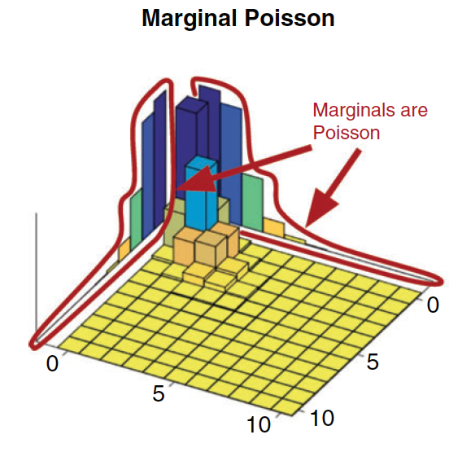
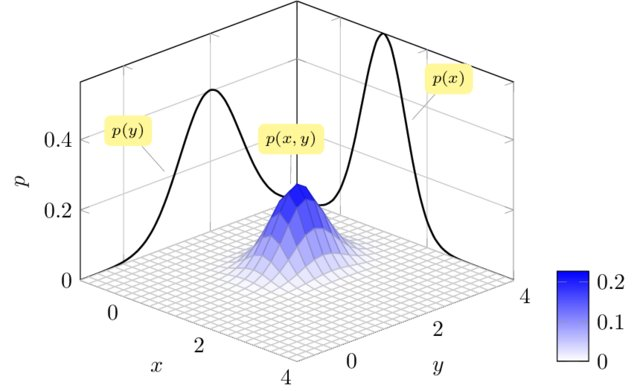
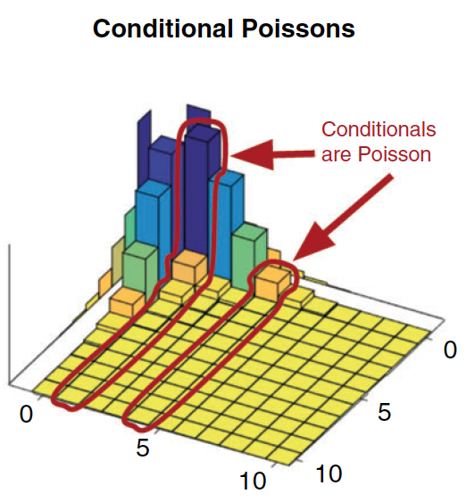
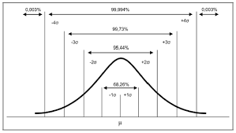
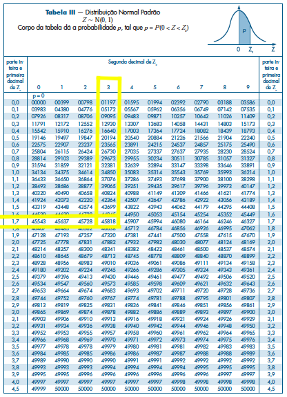
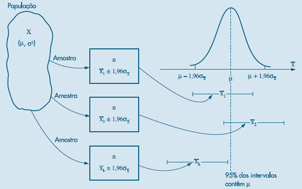

# Variáveis Aleatórias Bidimensionais

## Introdução

Até o momento nos interessou observar apenas uma característica de um experimento. Por exemplo, a altura média dos alunos do curso de estatística. Podemos também estar interessados em mais uma característica adicional, como o peso dos alunos do curso de estatística.

Portanto, queremos observar duas características de forma simultânea dos alunos: altura e peso. Ou seja, duas características simultaneamente do mesmo experimento $\epsilon$.

Considere o experimento de jogar dois dados não viciados de forma simultânea. Define-se duas variáveis aleatórias: $X$ o número que aparece no dado 1 e $Y$ o número que aparece no dado 2. Assim, temos o seguinte espaço amostral com 36 elementos (6x6):

$$\begin{array}{ccc}
\Omega = { \{(1,1),(1,2),(1,3),...,(6,6)\} }
\end{array}$$

Como o dado é não viciado cada evento (x,y) tem a mesma probabilidade de ocorrência de 1/36. Assim, a função de **probabilidade bivariada** é:

$$\begin{array}{ccc}
p(x_{i},y_{j})=P(X=x_{i},Y=y_{j})=1/36 
\end{array}$$

para i=1,...,6 e j=1,...6.

Assim como no caso unidimensional pode-se construir um histograma. Com base no exemplo acima, podemos fazer o seguinte histograma tridimensional para o par de dados $X$ e $Y$, ou seja, a distribuição conjunta de $(X,Y)$:

```{r}
#| echo: false
#| fig-cap: "Distribuição conjunta uniforme discreta"

library(plot3D)
prob_matrix <- matrix(1/36, nrow = 6, ncol = 6)
par(mar = c(0, 0, 0, 0))
hist3D(x = 1:6, y = 1:6, z = prob_matrix,
       space = 0,             
       border = "black",      
       col = "#89B6C7",
       alpha = 0.6,
       colvar = NULL,         
       colkey = FALSE,        
       ticktype = "simple",   
       xlab = "x", ylab = "y", zlab = "",
       bty = "b",             
       phi = 30, theta = 45,  
       zlim = c(0, 0.05))
```

Com base nessa ideia podemos fazer a seguinte definição:

::: {.definicao}
Seja $\epsilon$ um experimento, $\Omega$ um espaço amostral, $X = X(\omega)$ e $Y = Y(\omega)$, para $\omega \in \Omega$, $(X,Y)$ será uma variável aleatória bidimensional (ou vetor aleatório).
:::

Agora possuímos não mais um espaço unidimensaional $R_{x}$ como anteriormente visto, mas sim bidimensional, ou seja, o contradomínio da variável aleatória será $R_{xy}$ e cada resultado $X = X(\omega)$ e $Y = Y(\omega)$ pode ser representado como um ponto $(x,y)$ no plano euclidiano. Podemos dividir os resultado de um experimento em dois tipos, os discretos e os contínuos. Vejamos abaixo esses dois tipos de resultados.

## Variáveis Aleatórias Discretas

São variáveis que conseguimos colocar em lista, seja ela finita ou infinita. Assim, o vetor (X,Y) será uma variável aleatória discreta bidimensional ou vetor aleatório bidimensional se os valores possíveis puderem ser representados por $(x_{i},y_{i})$, $i=1,...,n,...$; e $j=1,2,...,m,...$

Como no caso unidimensional tem-se, podemos definir a distribuição de probabilidade conjunta de $(X,Y)$

::: {.definicao}
A cada valor possível da variável aleatória bidimensional $(X,Y)$, $(x_{i},y_{j})$, associamos uma probabilidade $p(x_{i},y_{j})$, $P (X=x_{i},Y=y_{i})$, e irá satisfazer:


i) $p(x_{i},y_{j}) \geq 0$ para todo $(x,y)$


ii) $\sum_{i} \sum_{j} p(x_{i},y_{j})=1$
:::

Com base na definição anterior podemos definir agora o que seria a função distribuição conjunto, ou seja:

::: {.definicao}
**Função de probabilidade conjunta de (X,Y)** (ou bivariada):


$p(x_{i},y_{j})= P(X=x_{i},Y=y_{j})$ para $-\infty < x_{i}< \infty$ e $-\infty < y_{j}< \infty$

---

**Distribuição de probabilidade conjunta de (X,Y)** (ou bivariada):
 
 
$[x_{i},y_{j},p(x_{i},y_{j})]$
:::

Para fixarmos as definições apresentadas acimas, e colocarmos os conceitos em prática, vamos realizar dois exemplos.

::: {.exemplo}
Considere o experimento de jogar dois dados simultaneamente. Considere a função de distribuição conjunta e calcule a probabilidade conjunta de $P(5\leq X \leq 6, 1 \leq Y \leq 2)$

---

**Resposta:**

$P(5\leq X \leq 6, 1 \leq Y \leq 2)= p(5,1)+p(5,2) + p(6,1)+p(6,2) = 4 * 1/6= 1/9$
:::

::: {.exemplo}
Um supermercado possui três caixas operando. Dois consumidores chegam aos caixas, que estão vazios, em momentos distintos do tempo. Cada consumidor escolhe um caixa de forma aleatória e independente do outro. Seja X o número de consumidores que escolhem o caixa 1 e Y os que escolhem o caixa 2. Qual a distribuição conjunta de X e Y?

---

**Resposta:**

O espaço amostral do experimento será dado pelo par ordenado $\{ i,j \}$, onde o primeiro consumidor escolhe o caixa i e o segundo escolhe $j$, tal que $i=1,2,3$ e $j=1,2,3$. Assim, cada ponto amostral tem a mesma probabilidade e o espaço amostral pode ser representado como :

$$\Omega = { \{(1,1),(1,2),(1,3),...,(3,3)\} } $$

A distribuição conjunta de X e Y será conforme descrito na tabela abaixo. Para construir essa tabela note que, por exemplo, $P(X=0,Y=0)=P(\{(3,3)\})=1/9$ e que $P(X=0,Y=1)=P(\{(2,3),(3,2)\})=2/9$
:::

| y (cx2) | x=0 (cx1) | x=1 (cx1) | x= 2 (cx1) |
|---------|-----------|-----------|------------|
| y=0     | 1/9       | 2/9       | 1/9        |
| y=1     | 2/9       | 2/9       | 0          |
| y=2     | 1/9       | 0         | 0          |

### Visualização gráfica

Vejamos agora alguns gráficos de variáveis aleaórias bidimensionais:

**BINOMIAL:**

Considere a variável aleatória $(X,Y)$ com distribuição binomial e a probabilidade de sucesso de $X$ é igual a 0.75 e de $Y$ igual a 0.25 com 10 rodadas:

```{r}
#| echo = FALSE,
#| fig.cap = "Distribuição conjunta Binomial"
library (intoo)
library (barsurf)
library (bivariate)
library (MASS)
set.bs.options (rendering.style="e")
f <- bnbvpmf (0.75, 0.25, 10)
plot (f, TRUE, zlim=c(0,0.05), zlab="p(x,y)" )
```

**POISSON**\
Considere a variável aleatória $(X,Y)$ com distribuição de poisson e o valor esperado de $X$ igual a 7, de $Y$ igual a 4 e a covariância é 3 (a frente veremos esse conceito):

```{r}
#| echo = FALSE,
#| fig.cap = "Distribuição conjunta de Poisson"
library (intoo)
library (barsurf)
library (bivariate)
library (MASS)
set.bs.options (rendering.style="e")
f <- pbvpmf.2 (7,4, 3)
plot (f, TRUE, zlim=c(0,0.02), zlab="p(x,y)" )
```

## Variáveis Aleatórias Contínuas

São variáveis que não conseguimos listar, pois existem infinitos valores entre dois pontos. Assim,o vetor $(X,Y)$ será uma variável aleatória contínua se puder tomar todos os valores em algum conjunto não enumerável no plano euclediano

::: {.definicao}
Sendo $(X,Y)$ variável aleatória contínua bidimensional. A função densidade de probabilidade conjunta, $f(x,y)$, irá satisfazer:

i) $f(x,y) \geq 0$

ii) $\int \int_{R} f(x,y)dxdy= 1$ se f(x,y)=0 para $(x,y)\notin R \rightarrow \int_{- \infty}^{\infty}\int_{- \infty}^{\infty} f(x,y)=1$
:::

Importante notar que $f(x,y)$ não representa a probabilidade. Assim para um evento B em $R_{xy}$:

$$\begin{array}{ccc}
P(B)=P\{ [X(\omega),Y(\omega)] \in B \}= P\{\omega | [X(\omega),Y(\omega)] \in B \}
\end{array}$$

Para o caso discreto: $$\begin{array}{ccc}
P(B)=\sum \sum_{B} p(x_{i},y_{j})
\end{array}$$

Para o caso contínuo: $$\begin{array}{ccc}
P(B)=\iint_{B} f(x,y)dxdy
\end{array}$$

Reinterpretando o exposto acima sobre o evento B, como no caso unidimensional, onde a área sobre a função densidade de probabilidade representa a probabilidade, no caso bidimensional o **volume sob a função densidade de probabilidade conjunta representa a probabilidade**.

Assim, uma probabilidade $P(a \leq X \leq b, c\leq Y \leq d)$ é calculada como:

$$\begin{array}{ccc}
 P(a \leq X \leq b, c\leq Y \leq d)  = \int_{c}^{d}\int_{a}^{b} f(x,y)dxdy
\end{array}$$

::: {.exemplo}
Suponha que uma partícula é aleatoriamente alocada em um quadrado com lados iguais a 1. Assim, se duas áreas de mesma dimensão forem consideradas a partícula tem a mesma probabilidade de estar em qualquer uma das duas áreas. Seja X e Y as coordenadas da localização da partícula. A função de densidade conjunta de X e Y será:

\begin{array}{ccc}
f(x,y)=\left\{\begin{matrix} 1,\ 0\ \leq x \leq 1, \ 0\ \leq y \leq 1 \\

0,\ caso\ contrário
\end{matrix}\right.
\end{array}

Assim: 

a. Esboce a função densidade de probabilidade conjunta 

b. Encontre $P(0 \leq X \leq 0.2, 0\leq Y \leq 0.4)$

---

**Resposta:**

Ver figura abaixo. 

\begin{array}{ccc}

P(0 \leq X  \leq 0.2,0 \leq Y  \leq 0.4)= \int_{0}^{0.4}\int_{0}^{0.2}f(x,y)dxdy \\

=\int_{0}^{0.4}\int_{0}^{0.2}1dxdy=\int_{0}^{0.4}(\int_{0}^{0.2}1dx)dy \\

=\int_{0}^{0.4}(x\Big|_{0}^{0.2})dy 


=(0.2-0)\int_{0}^{0.4}dy = (0.2-0).(y\Big|_{0}^{0.4}) \\

=(0.2-0)(0.4-0)=0.08 \\


P(0 \leq X  \leq 0.2,0 \leq Y \leq 0.4)=0.08
\end{array}
:::

<center>

{width="50%"}

</center>

### Visualização gráfica: Var. Contínuas

Vejamos agora alguns gráficos de variáveis aleaórias bidimensionais:

**NORMAL BIVARIADA:**

Considere a variável aleatória $(X,Y)$ com distribuição normal bivariada com a esperança de $X$ igual a 10, de $Y$ igual a 4, o desvio-padrões iguais a 3 e 2 respectivamente. Aqui consideremaos a correlação de 0.7 (veremos mais a frente esse conceito).

```{r}
#| echo = FALSE,
#| fig.cap = "Distribuição conjunta normal bivariada"
library (intoo)
library (barsurf)
library (bivariate)
library (MASS)
set.bs.options (rendering.style="e")
f <- nbvpdf (10, 4, 3, 2, 0.7)
plot (f, TRUE, zlim=c(0,0.03), zlab="p(x,y)" )
```

**NORMAL BIVARIADA PADRÃO:**

Considere a variável aleatória $(X,Y)$ com distribuição normal bivariada padrão, ou seja, a esperança de $X$ e $Y$ igual a a 1, o desvio-padrões iguais a 1 e sem covariancia.

```{r}
#| echo = FALSE,
#| fig.cap = "Distribuição conjunta normal padrão bivariada"
library (intoo)
library (barsurf)
library (bivariate)
library (MASS)
set.bs.options (rendering.style="e")
f <- nbvpdf (0, 0, 1, 1, 0)
plot (f, TRUE, zlim=c(0,0.1), zlab="p(x,y)" )
```

## Função Distribuição Acumulada

Como no caso univariado a distinção entre variável aleatória conjunta contínua e conjunta discreta pode ser feita em termos de sua função distribuição conjunta acumulada.

### Caso discreto

::: {.definicao}
A função distribuição conjunta acumulada, F, da variável aleatória bidimensional (X,Y) é definida por:
$$\begin{array}{ccc}
 F(x,y)= P(X \leq x, Y \leq y) \ para \ -\infty < x_{i} < \infty \ e \ -\infty < y_{i} < \infty
\end{array}$$
:::

Seja X e Y duas variáveis aleatórias discretas com função distribuição conjunta $F(x,y)$, a função distribuição conjunta acumulada de X e Y será:

$$\begin{array}{ccc}
 F(x,y)=\sum_{f1=- \infty }^{x} \sum_{f2=- \infty }^{y}p(t_{1},t_{2})
\end{array}$$

Retomando os exemplos anteriores temos as seguintes funcÕes de distribuição conjunta acumuladas discretas:

::: {.exemplo}
Para o caso dos dois dados apresentados anteriormente temos que:


$$F(2,3)=P(X\leq 2, Y \leq 3)=p(1,1)+p(1,2)+p(1,3)+p(2,1)+p(2,2)+p(2,3) $$


$$F(2,3)=P(X\leq 2, Y \leq 3)=6/36=1/6 $$

O gráfico segue abaixo.
:::

```{r}
#| echo: false
#| fig-cap: "Distribuição acumulada conjunta uniforme discreta"

library(plot3D)
cdf_matrix <- outer(1:6, 1:6, "*") / 36
par(mar = c(0, 0, 0, 0))
hist3D(x = 1:6, y = 1:6, z = cdf_matrix,
       space = 0,             
       border = "black",      
       col = "#89B6C7",       
       alpha = 0.6,           
       colvar = NULL,         
       colkey = FALSE,        
       ticktype = "simple",   
       xlab = "x", ylab = "y", zlab = "",
       bty = "b",             
       phi = 30, theta = -40,
       zlim = c(0, 1))
```

::: {.exemplo}
Para o exemplo anterior (caixa do supermercado) encontre F(-1,2) e F(1.5,2)

---

$$F(-1,2) = P(X \leq -1, Y \leq 2)= P(\emptyset)=0$$

*Note que é impossível no exemplo do caixa o valor assumir -1, portanto, temos a probabilidade de um conjunto vazio, que será zero.


\begin{aligned}
F(1.5,2) &= P(X \leq 1.5, Y \leq 2) \\
         &= p(0,0)+p(0,1)+p(0,2)+p(1,0)+p(1,1)+p(1,2)=8/9
\end{aligned}
:::

### Visualização gráfica

**BINOMIAL:**

Considere a variável aleatória $(X,Y)$ com distribuição binomial e a probabilidade de sucesso de $X$ é igual a 0.75 e de $Y$ igual a 0.25 com 10 rodadas, sua função distribuição acumulada será:

```{r}
#| echo: false
#| fig-cap: "Distribuição conjunta Binomial"
library(plot3D)
n <- 10
p1 <- 0.75
p2 <- 0.25
x_vals <- 0:n
y_vals <- 0:n
cdf_binom <- outer(pbinom(x_vals, size = n, prob = p1), 
                   pbinom(y_vals, size = n, prob = p2), "*")
par(mar = c(0, 0, 0, 0))
hist3D(x = x_vals, y = y_vals, z = cdf_binom,
       space = 0,             
       border = "black",      
       col = "#89B6C7",       
       alpha = 0.6,           
       colvar = NULL,         
       colkey = FALSE,        
       ticktype = "simple",   
       xlab = "x", ylab = "y", zlab = "",
       bty = "b",             
       phi = 30, theta = -40, 
       zlim = c(0, 1))
```

**POISSON**\
Considere a variável aleatória $(X,Y)$ com distribuição de poisson e o valor esperado de $X$ igual a 7, de $Y$ igual a 4 e a covariância é 3 (a frente veremos esse conceito). Assim a função distribuição acumulada será:

```{r}
#| echo: false
#| fig-cap: "Distribuição conjunta de Poisson"
library(plot3D)
l1 <- 7
l2 <- 4
l3 <- 3
max_val <- 16
x_vals <- 0:max_val
y_vals <- 0:max_val
pmf_matrix <- matrix(0, nrow = max_val + 1, ncol = max_val + 1)
for(x in 0:max_val) {
  for(y in 0:max_val) {
    val <- 0
    for(i in 0:min(x,y)) {
      val <- val + (l1^(x-i) * l2^(y-i) * l3^i) / (factorial(x-i) * factorial(y-i) * factorial(i))
    }
    pmf_matrix[x+1, y+1] <- exp(-(l1 + l2 + l3)) * val
  }
}
cdf_poisson <- matrix(0, nrow = max_val + 1, ncol = max_val + 1)
for(x in 1:(max_val + 1)) {
  for(y in 1:(max_val + 1)) {
    cdf_poisson[x, y] <- sum(pmf_matrix[1:x, 1:y])
  }
}
par(mar = c(0, 0, 0, 0))
hist3D(x = x_vals, y = y_vals, z = cdf_poisson,
       space = 0,             
       border = "black",      
       col = "#89B6C7",       
       alpha = 0.6,           
       colvar = NULL,         
       colkey = FALSE,        
       ticktype = "simple",   
       xlab = "x", ylab = "y", zlab = "",
       bty = "b",             
       phi = 30, theta = -40, 
       zlim = c(0, 1))
```

### Caso Contínuo

Seja X e Y duas variáveis aleatórias contínuas com função distribuição conjunta $F(x,y)$. Se existir uma função densidade de probabilidade conjunta $f(x,y)$ não negativa, assim a **função distribuição conjunta acumulada de X e Y** será:

$$\begin{array}{ccc}
 F(x,y) = \int_{-\infty}^{x}\int_{- \infty}^{y} f(t_{1},t_{2})dt_{1}dt_{2} \ para \ -\infty < x_{i} < \infty \ e \ -\infty < y_{i} < \infty 
\end{array}$$

::: {.exemplo}
Para o exemplo anterior da partícula, encontre F(0.4, 0.4):

---

**Resposta:**

Ver figura abaixo. 
$$\begin{array}{ccc}
P(X \leq 0.4 ,Y \leq 0.4)= \int_{0}^{0.4}\int_{0}^{0.4}f(x,y)dxdy
\\
=\int_{0}^{0.4}\int_{0}^{0.4}1dxdy=\int_{0}^{0.4}(\int_{0}^{0.4}1dx)dy=\int_{0}^{0.4}(x\Big|_{0}^{0.4})dy
\\
=(0.4-0)\int_{0}^{0.4}dy=(0.4-0).(y\Big|_{0}^{0.4})\\
=(0.4-0)(0.4-0)=0.016
\\
P(X  \leq 0.4,Y \leq 0.4)=0.016
\end{array}$$
:::

::: {.teorema}

Seja $X$ e $Y$ duas variáveis aleatórias contínuas com função distribuição conjunta $F(x,y)$ então:

$$\begin{array}{ccc}
a) \ F(- \infty, - \infty )=  F(- \infty, y )=  F(x, - \infty )=0 \\
\end{array}$$

$$\begin{array}{ccc}
b) \ F(\infty, \infty ) = 1
\end{array}$$

No caso univariado tem-se: 
$$\begin{array}{ccc}
 f(x,y) = \frac{\partial^{2}F(x,y) }{\partial x \partial y} 
\end{array}$$

:::

### Visualização gráfica

Vejamos agora alguns gráficos de variáveis aleaórias bidimensionais:

**NORMAL BIVARIADA:**

Considere a variável aleatória $(X,Y)$ com distribuição normal bivariada com a esperança de $X$ igual a 10, de $Y$ igual a 4, o desvio-padrões iguais a 3 e 2 respectivamente. Aqui consideremaos a correlação de 0.7 (veremos mais a frente esse conceito). Assim a função distribuição acumulada conjunta terá o seguinte formato:

```{r}
#| echo: false
#| fig-cap: "Distribuição acumulada conjunta normal"
library(plot3D)
library(pbivnorm)
x_vals <- seq(1, 19, length.out = 40)
y_vals <- seq(-2, 10, length.out = 40)
cdf_func_corr <- function(x, y) {
  zx <- (x - 10) / 3
  zy <- (y - 4) / 2
  pbivnorm(zx, zy, rho = 0.7)
}
z_matrix1 <- outer(x_vals, y_vals, cdf_func_corr)
par(mar = c(0, 0, 0, 0))
persp3D(x = x_vals, y = y_vals, z = z_matrix1,
        col = "#89B6C7", border = "black", facets = TRUE, alpha = 0.6,
        colvar = NULL, colkey = FALSE, ticktype = "simple",
        xlab = "x", ylab = "y", zlab = "",
        bty = "b", phi = 30, theta = -40, zlim = c(0, 1))
```


**NORMAL BIVARIADA PADRÃO:**
Considere a variável aleatória $(X,Y)$ com distribuição normal bivariada padrão, ou seja, a esperança de $X$ e $Y$ igual a a 1, o desvio-padrões iguais a 1 e sem covariância. Assim a função distribuição acumulada conjunta terá o seguinte formato:

```{r}
#| echo: false
#| fig-cap: "Distribuição acumulada conjunta normal padrão"
library(plot3D)
library(pbivnorm)
x_vals <- seq(-3, 3, length.out = 40)
y_vals <- seq(-3, 3, length.out = 40)
cdf_func_padrao <- function(x, y) {
  pbivnorm(x, y, rho = 0)
}
z_matrix2 <- outer(x_vals, y_vals, cdf_func_padrao)
par(mar = c(0, 0, 0, 0))
persp3D(x = x_vals, y = y_vals, z = z_matrix2,
        col = "#89B6C7", border = "black", facets = TRUE, alpha = 0.6,
        colvar = NULL, colkey = FALSE, ticktype = "simple",
        xlab = "x", ylab = "y", zlab = "",
        bty = "b", phi = 30, theta = -40, zlim = c(0, 1))
```

# Distribuição de Probabilidade Marginal e Condicional

## Distribuição de Probabilidade Marginal

Dada a variável bidimensional $(X,Y)$ podemos estar interessados em X ou Y individualmente. Agora não mais queremos entender como se distribui conjuntamente renda e consumo. Com base na distribuição conjunta, quero saber somente como a renda distribui, por exemplo.

### Para o caso discreto

Para o caso discreto, temos a seguinte **distribuição marginal de X**:

$$\begin{array}{ccc}
p(x_{i})=P(X=x_{i})=P(X=x_i, Y=y_i \ ou \ X=x_i,Y=y_2 ....) 
\\
p(x_i)=\sum_j p(x_i,y_j)
\end{array}$$

Onde p é a função distribuição marginal de $X$. Podemos pensar em $Y$ de forma análoga.

A intuição aqui é que se queremos a marginal de $X$ temos que empilhar na direção de $Y$, assim o eixo $y$ irá sumir. Vejamos graficamente.

#### Visualização gráfica

\
\

<center>Vejamos um exemplo extraído de Inouye,D.I. et al.(2017)[^1]:\
\
{width="50%"}</center>

[^1]: A review of multivariate distributions for count data derived from the Poisson distribution

Veja que se quisermos a distribuiçao marginal de $X$, apresentada a esquerda, temos que somar as barras ou empilha-las na direção de $Y$.

### Para o caso continuo

O caso contínuo é similar ao discreto. No contínuo, a **função densidade marginal de X** será:

$$\begin{array}{ccc}
g(x)=\int_{-\infty}^{\infty}f(x,y)dy
\end{array}$$

E a **função densidade marginal de y** será:

$$\begin{array}{ccc}
h(y)=\int_{-\infty}^{\infty}f(x,y)dx
\end{array}$$

Aqui temos que mostrar uma figura para ilustrar.

::: {.exemplo}
Suponha que $(X,Y)$ seja uma variável aleatória bidimensional. Não estamos interessados em $Y$, gostariamos de saber somente qual a probabilidade de encontrarmos valores de $x$ entre c e d. Assim:

---

$$P(c\leq x \leq d)=P[c\leq X \leq d, -\infty < Y < \infty] $$

$$P(c\leq x \leq d)=\int_{c}^{d}\int_{-\infty}^{\infty}f(x,y)dydx $$

$$P(c\leq x \leq d)=\int_{c}^{d}g(x)dx $$
:::

#### Visualização gráfica

\
\

<center>Vejamos um exemplo extraído de Selvan, R.(2015) [^2]:\
\
{width="65%"}</center>

[^2]: Selvan, R. 2015. Bayesian tracking of multiple point targets using Expectation Maximization

Veja que se quisermos a distribuiçao marginal de $X$, apresentada ao fundo, temos que somar as barras ou empilha-las na direção de $Y$.

## Distribuição de Probabilidade Condicional

Na distribuição maringao, tinhamos a distribuição conjunta entre renda e consumo e estavamos interessados somente na renda. Agora estamos querendo saber qual a distribuição da renda para certa faixa de consumo, ou o contrário, qual a distribuição do consumo para dada faixa de renda.

**Para o caso discreto:**

Para variáveis discretas temos o seguinte:

$$\begin{array}{ccc}
P(x_i|y_j)=P(X=x_i|Y=y_j)
\end{array}$$

$$\begin{array}{ccc}
P(x_i|y_j)= \frac{P(x_i,y_j)}{q(y_{j})}
\end{array}$$

Note que $P(x_i|y_j)\geq 0$ e $\sum_iP(x_i|y_j)=1$

#### Visualização gráfica

\
\

<center>Vejamos um exemplo extraído de Inouye,D.I. et al.(2017)[^3]:\
\
{width="50%"}</center>

[^3]: A review of multivariate distributions for count data derived from the Poisson distribution

Veja que se quisermos a distribuição condicional de $X$ dado um certo valor de $Y$, por exemplo, $Y=2$.Temos que considerar as barras marcadas e repondera-las pela chance de $Y=2$ acontecer. Ou seja, agora $Y=2$ será o total.

### Para o caso contínuo

Para o caso contínuo a f.d.p. de $X$ condicionada a um dado $Y=y$ é:

$$\begin{array}{ccc}
g(x|y)= \frac{f(x,y)}{h(y)}
\end{array}$$

De forma análoga para $Y$:

$$\begin{array}{ccc}
h(y|x)= \frac{f(x,y)}{g(x)}
\end{array}$$

Note que $g(x|y)\geq 0$ e

$$\int_{-\infty}^{\infty}g(x|y)dx=\int_{-\infty}^{\infty} \frac {f(x,y)}{h(y)}dx=\frac{h(y)}{h(y)}=1$$

Inserir um gráfico e falar da intuição.

#### Visualização gráfica

\
\

<center>Vejamos um exemplo extraído de Neuper,M. e Ehret,U. (2019)[^4]:\
\
{width="50%"}</center>

[^4]: Quantitative precipitation estimation with weather radar using a data- and information-based approach

Veja que se quisermos a distribuição condicional de $X$ dado um certo valor de $Y$, por exemplo, $Y=-2$.Temos que considerar a linha marcada e novamente reponder todos os elementos pela chance de $Y=-2$ acontecer. Ou seja, agora $Y=-2$ será o total.

## Variáveis Aleatórias Independentes

Independencia está ligado ao conceito de informação e quanto essa informação recebida muda sua opinião do que irá acontecer com o caso sobre estudo. Podemos dar uma informação sobre renda e perguntarmos sobre o consumo desse parte da população. Quando os resultados de $X$ influenciam o resultado de $Y$ dizemos que as variáveis são dependentes. Caso a informação sobre $X$ não afeta de meneira nenhuma os resultados de $Y$, dizemos que são independentes.

### Para o caso discreto

::: {.definicao}
Para a variábel bidimensional discreta $(X,Y)$, $X$ e $Y$ serão independentes se 
$$\begin{array}{ccc}
p(x_i,y_j)=p(x_i)p(y_j)
\end{array}$$

---

Ou, de outra maneira:
$$\begin{array}{ccc}
P(x_i|y_j)= \frac{P(x_i,y_j)}{q(y_i)}= \frac{P(x_i)q(y_j)}{q(y_i)}=P(x_i)
\end{array}$$
:::

### Para caso Contínuo

::: {.definicao}
Para a variábel bidimensional contínua $(X,Y)$, X e Y serão independentes se:
$$\begin{array}{ccc}
f(x,y)=g(x)h(y)
\end{array}$$

---

Ou, de outra maneira:
$$\begin{array}{ccc}
g(x|y)= \frac{f(x,y)}{h(y)}= \frac{g(x)h(y)}{h(y)}=g(x)
\end{array}$$
:::

Com base nessas definições podemos agora apresentar o seguinte teorema que conecta o que viram em probabilidade com variáveis aleatórias multidimesionais.

::: {.teorema}
Seja $(X,Y)$ uma variável aleatória bidimensional e A e B dois eventos que dependem de X e Y, respectivamente. Então, se $X$ e $Y$ forem independentes: 
\begin{array}{ccc}
P(A \cap B)= P(A) P(B)
\end{array}

---

**Prova:**

\begin{array}{ccc}
P(A \cap B)= {\int_{}^{}\int_{}^{}}_{P(A \cap B)}f(x,y)dxdy= {\int_{}^{}\int_{}^{}}_{P(A \cap B)}g(x)h(y)dxdy\\ 
P(A \cap B)={\int_{A}^{}g(x)dx\int_{B}^{}h(y)dy}=P(A)P(B)
\end{array}
:::

::: {.exemplo}
Suponha uma f.d.p. conjunta da variábel aleatória bidimensional $(X,Y)$:
$$\begin{array}{ccc}
f(x,y)=\left\{\begin{matrix} x^{2}+ \frac{xy}{3} \ para \ 0<x<1,0<y<2
\\ 0,\ caso\ contrário
\end{matrix}\right.
\end{array}$$

Calcule a $P(Y<X)$:

---

**Resposta:**

$$\begin{array}{ccc}
P(Y<X)=\int_{0}^{1}\int_{0}^{x} x^{2}+ \frac{xy}{3} dydx 
\end{array}$$

$$\begin{array}{ccc}
P(Y<X)=\int_{0}^{1} [x^{2}y+ \frac{xy^{2}}{6}]_0^{x} dy 
\end{array}$$

$$\begin{array}{ccc}
P(Y<X)=\int_{0}^{1} [x^{3}+ \frac{x^{3}}{3}] dy 
\end{array}$$

$$\begin{array}{ccc}
P(Y<X)= [\frac{x^{4}}{4}+ \frac{x^{4}}{24}]_0^{1} 
\end{array}$$

$$\begin{array}{ccc}
P(Y<X)= \frac{1}{4}+\frac{1}{24}=\frac{7}{24}
\end{array}$$
:::

# Coeficiente de Correlação

Até o momento medimos a $E(X)$ e a $Var(X)$, ou seja, uma medida de posição e de variabilidade em relação a $R_x$, Entretanto, quando temos um vetor bidimensional $(X,Y)$ uma outra medida surge, a qual tenta media o "grau de associação" linear entre X e Y.

::: {.definicao}
Seja $(X,Y)$ uma variábel aleatória bidimensional. O **Coeficiente de Correlação** $\rho_{X,Y}$ entre X e Y será:

$$\begin{array}{ccc}
\rho_{X,Y}=\frac{E[(X-E(X))(Y-E(Y))]}{\sqrt{Var(X)Var(Y)}}
\end{array}$$
:::

Um termo muito importante surge na expressão acima, a **Covariância**. Ela mede a variabilidade conjunta de uma variável aleátoria multidimensional. Como no caso da variância, ela sobre do efeito das escalas de medidas. Por isso que anteriormente dividimos pelos desvio-padrões. Lembre-se que já usamos esse artifício anteriormente para nos livrar da unidade de medida.

::: {.definicao}
A **Covariância** entre $X$ e $Y$, $Cov(X,Y)$, é dada por:
$$\begin{array}{ccc}
Cov(X,Y)=E[(X-E(X))(Y-E(Y))]
\end{array}$$
:::

Novamente, a correlação mede o **GRAU DE ASSOCIAÇÃO LINEAR**. Vejamos algumas Propriedades da Correlação:

::: {.teorema} 
O coeficiente de correlação $\rho_{X,Y}$ entre $X$ e $Y$ pode ser apresentado como:
$$\begin{array}{ccc}
\rho_{X,Y}=\frac{E(XY)-E(X)E(Y)}{\sqrt{Var(X)Var(Y)}}
\end{array}$$

---

\text{Prova:}
$$\begin{array}{ccc}
E[(X-E(X))(Y-E(Y))]=E[XY-XE(Y)-E(X)Y+E(X)E(Y)]
\\
= E(XY)-E(X)E(Y)-E(X)E(Y)+E(X)E(Y)= E(XY)-E(X)E(Y)
\end{array}$$
:::
::: {.teorema}
Se $X$ e $Y$ forem independentes então:
$$\begin{array}{ccc}
\rho_{X,Y}=0
\end{array}$$

---

**Prova:**
Da propriedade da independência, se $X$ e $Y$ forem independentes então:
$$\begin{array}{ccc}
E(X,Y)=E(X)E(Y)
\end{array}$$
:::

Considerando o teorema acima, e sabendo que as variáveis são independentes, então $\rho_{X,Y}=0$

[**IMPORTANTE**]{style="color:red"}: Note que Independência $\Rightarrow \rho_{X,Y}=0$ mas não é verdade que $\rho_{X,Y}=0 \Rightarrow Independência$

::: {.teorema}
O Coeficiente de Correlação possui valores entre -1 e 1, ou seja:
$$\begin{array}{ccc}
-1 \leq \rho \leq 1
\end{array}$$ 

---

**Prova:**

Considere a seguinte desigualdade verdadeira:
$$\begin{array}{ccc}
(\frac{x-\mu_x}{\sigma_x}\mp \frac{Y-\mu_y}{\sigma_y} )^{2}\geq 0
\end{array}$$

A expressão continua verdadeira se aplicarmos o operador esperança:
$$\begin{array}{ccc}
E(\frac{x-\mu_x}{\sigma_x}\mp \frac{Y-\mu_y}{\sigma_y} )^{2}\geq 0
\end{array}$$

Desenvolvendo temos que:
$$\begin{array}{ccc}
E[(\frac{x-\mu_x}{\sigma_x})^{2}+(\frac{Y-\mu_y}{\sigma_y})^{2} \mp 2 (\frac{x-\mu_x}{\sigma_x})(\frac{Y-\mu_y}{\sigma_y}) ]\geq 0
\end{array}$$

$$\begin{array}{ccc}
\frac{1}{\sigma_x^{2}}E({X-\mu_x})^{2}+\frac{1}{\sigma_y^{2}}E({Y-\mu_y})^{2}\mp 2 \frac{1}{\sigma_x \sigma_y}E((X-\mu_x)(Y-\mu_y) )\geq 0
\end{array}$$
 
$$\begin{array}{ccc}
\frac{\sigma_x^{2}}{\sigma_x^{2}}+\frac{\sigma_y^{2}}{\sigma_y^{2}}\mp 2\rho \geq 0
\end{array}$$
$$\begin{array}{ccc}
\mp 2\rho \geq -2
\end{array}$$
$$\begin{array}{ccc}
\therefore \rho \geq -1 \ e \ \rho \leq 1
\end{array}$$
:::

::: {.teorema}
Se X e Y forem duas variáveis aleatórias, onde $Y=AX+B$, onde A e B são constantes. Então $\rho^{2}=1$. Se $A>0$, $\rho=1$. Se $A<0$, $\rho=-1$

---

Prova:
$$\begin{array}{ccc}
Y= AX +B
\\
E(Y)=A E(X)+ B \ e \ VAR(Y)=A^{2}VAR(X)
\\
E(XY)=E(AX^{2}+BX) \ \rightarrow AE(X^{2})+BE(X)
\end{array}$$

Então: 
$$\begin{array}{ccc}
\rho^{2}=\frac{A^{2}{Var(X)}}{A^{2}{Var(X)}}=1
\end{array}$$
:::

Assim, com base no exposto, temos que o coeficiente de correlação é uma medida do grau de linearidade entre X e Y. Dessa forma, $\rho$ próximo a 1 e -1 indicam alto grau de linearidade e $\rho$ próximo a zero indica ausência de relação linear - mas não diz nada sobre relações não-lineares.

## Visualização gráfica

Aqui apresnsemtamos um correlograma com base em variáveis simuladas:\
\

```{r}
#| echo = FALSE,
#| fig.cap = "Gráfico de correlação para variáveis simuladas v1 a v5",
#| fig.height = 5,
#| fig.width = 5,
#| fig.align = "center"
library(psych)
data <- data.frame( var1 = 1:100 + rnorm(100,sd=20), v2 = 1:100 + rnorm(100,sd=27), v3 = rep(1, 100) + rnorm(100, sd = 1)) 
data$v4 = data$var1 ** 2 
data$v5 = -(data$var1 ** 2) 
pairs.panels(data)
```

Vamos começar pelas variáveis v5 e v4, elas tem um comportantamento conjunto totalmente linear, ou seja, saber de v4 te informa corretmente o que acontecerá com v5. Aqui quando v5 sobe, v4 desce. Vejamos agora as variáveis v3 e v2, observe como os dados estão disperso, sem nenhum padrão de comportamento linear. Nesse caso a correlação é próxima a zero (-0.0135). Perceba que a relação não-linear entre v1 e v4 e v1 e v5, faz com que a correlação seja menor que 1 e não perfeita. Já as variáveis v1 e v2 mostram comportamento conjunto positivo, mas não perfeito, reativamente disperso. Quando v1 sobe, v2 também sobe, entretanto não cosneguimos prever esse comportamento perfeitamente.

# O Modelo Normal

## A Distribuição Normal

Um dos principais modelos de probabilidade. É essencial para inferência estatística (distribuição Gaussiana).

::: {.definicao}
A variável aleatória $X$ tem distribuição normal com Média $\mu$  e Variância $\sigma^{2}$, onde $-\infty<\mu<+\infty$ e $0< \sigma^{2}< \infty$.
Sua densidade é dada por:

$$\begin{array}{ccc}
f(x;\mu, \sigma^{2})=\frac{1}{\sigma \sqrt{2 \pi }} e^{\frac{-(x-\mu)^{2}}{2 \sigma^{2}}} 
\end{array}$$

Onde $-\infty<x<+\infty$
:::

## Representação Gráfica:

Uma Distribuição Normal com parâmetros $\mu$ e $\sigma^{2}$ pode ser representada graficamente como:\

```{r}
#| echo = TRUE,
#| fig.cap = "Distribuição Normal",
#| fig.height = 3.5,
#| fig.width = 5
rm(list = ls(all.names = TRUE)) #will clear all objects includes hidden objects.
x<-seq(-3,3,0.1)
fdnorm<-dnorm(x = x, mean = 0, sd=1)  
fdanorm<-pnorm(q = x, mean = 0, sd=1)
curve(dnorm(x,0,1),xlim=c(-3,3),main='',xaxt="n",xlab="z", ylab="f(x)",
      col="darkblue",cex.axis=0.65, cex.lab=0.8) 
axis(1,at=c(-1, 0, 1),labels =
       c("-DP(X)","E(x)","DP(x)"),cex.axis=0.65, cex.lab=0.8) 
lines(x=c(0,0),y=c(0,fdnorm[x==0]),lty=2, col="black") 
lines(x=c(1,1),y=c(0,fdnorm[x==1]),lty=2, col="black")
lines(x=c(-1,-1),y=c(0,fdnorm[x==-1]),lty=2, col="black")

```

\
Para entender melhor a distribuição Normal e a relação entre a média e o desvio padrão $\sigma$ (- lembrando que $\sigma=\sqrt{variância}$) é interessante notar a proporção nos intervalos de desvio-padrão.

Ou seja, a fração da área abaixo da curva $f(x)$ quando temos as seguintes amplitudes,tabela 1, da variável x na distribuição:\
\

Tabela 1: Intervalos de desvios e probabilidade

<center>

|    Amplitude    | Proporção |
|:---------------:|:---------:|
| $\mu\pm\sigma$  | $68,3\%$  |
| $\mu\pm2\sigma$ | $95,5\%$  |
| $\mu\pm3\sigma$ | $99,7\%$  |

</center>

A figura 2 abaixo representa graficamente o que está colocado na tabela[^5]. Observa-se que a probabilidade de estra entre +1 e -1 desvio padrão é de 68,3%. Isso é válido para qualquer distribuição normal INDEPENDENTE da média e desvio padrão.

[^5]: http://www.portalaction.com.br/probabilidades/62-distribuicao-normal

Vejamos um exemplo de 3 distribuições normais, $X~N(10,9)$, $Y~N(200,100)$ e $Z~N(0,1)$. Dessa forma a chance de estar entre a esperança $\mu$ e um desvio padrão, $\sigma$, ou seja, entre 10 e 13 para X, entre 200 e 210 para Y e entre 0 e 1 para Z, é de 34,15%. Isso vale para qualquer intervalo de desvio (-1,+1); (-1.3,+1.3); (-3,+3) !!!!

<center>

{width="60%"}

</center>

\pagebreak

## Momentos:

Os primeiros dois momentos da distribuição normal são:

::: {.definicao}
Esperança:
$$E(X)=\mu$$

---

Variância:
$$Var(X)=\sigma^{2}$$
:::

Dessa forma para a distribuição normal as seguintes características são verdadeiras:

-   Se X é normalmente distribuída então $X \sim N(\mu ,\sigma ^{2})$

-   Como pode ser visto na figura 1, a densidade da distribuição é simétrica. Ou seja, para todo $x$ real é verdade que:

$$\begin{array}{ccc}
f(\mu + x; \mu, \sigma ^{2}) = f(\mu - x; \mu, \sigma ^{2})
\end{array}$$

## Normal Padronizada

### O Modelo

Um caso especial da distribuição normal é aquela que possui média 0 e desvio padrão igual a 1. Recebe até um nome diferenciado, distribuição normal padrão.

::: {.definicao}
Uma variável Z normal padrão (ou reduzida) é uma distribuição Normal com parâmetros $\mu=0$ e $\sigma=1$, tal que $Z \sim N(0 ,1)$. 

Assim, essa variável aleatória Z, possui a seguinte f.d.p.: 
\begin{array}{ccc}
\phi(Z)= \frac{1}{\sqrt{2\pi}} e^{\frac{-z^{2} }{2}}
\end{array}

$-\infty < Z < \infty$

:::

### Padronização

::: {.teorema}
Seja $X$ uma variável distribuída normalmente, tal que $X \sim N(\mu ,\sigma ^{2})$ então temos uma variável $Z$ padronizada a partir de $X$ tal que:

$$\begin{array}{ccc}
Z=\frac{X-\mu}{\sigma}
\end{array}$$

A variável $Z$ terá os seguintes momentos: $E(Z)=0$ e $Var(Z)=1$

---

**Prova:**

I.  Média:

$$\begin{array}{ccc}
E(Z)=E(\frac{X-\mu}{\sigma}) 
\end{array}$$
$$\begin{array}{ccc}
=\frac{1}{\sigma} E(X-\mu)
\end{array}$$
$$\begin{array}{ccc}
=\frac{1}{\sigma} [E(X)-E(\mu)]
\end{array}$$
$$\begin{array}{ccc}
=\frac{1}{\sigma} [E(\mu)-E(\mu)] =0
\end{array}$$

II. Variância:

$$\begin{array}{ccc}
Var(Z)=E(Z ^{2})-E(Z) ^{2}
\end{array}$$

Note que:

$$\begin{array}{ccc}
E(Z ^{2}) = \frac{1}{\sigma^{2}}[E(x-\mu)]^{2}
\end{array}$$
$$\begin{array}{ccc}
=\frac{\sigma^{2}}{\sigma^{2}}
\end{array}$$
$$\begin{array}{ccc}
=1
\end{array}$$

E encontramos acima que $E(Z)=0$. Portanto:

$$\begin{array}{ccc}
Var(Z)=E(Z ^{2})-E(Z) ^{2}
\end{array}$$
$$\begin{array}{ccc}
= 1 -0
\end{array}$$
$$\begin{array}{ccc}
= 1
\end{array}$$

:::

### Função Distribuição Acumulada

::: {.definicao}
A f.d.a. $F(y)$ de uma v.a. normalmente distribuída $X$ com média $\mu$ e variância $\sigma^{2}$ é:

$$\begin{array}{ccc}
F(y)=\int_{-\infty}^{y} f(x;\mu,\sigma^{2})dx\ \ \ \ \ y \in \mathbb{R}
\end{array}$$

Onde $f()$ é a função de densidade de probabilidade. 

Para a normal padrão temos a seguinte f.d.a:

$$\begin{array}{ccc}
\Phi(y)=\int_{-\infty}^{y} \phi(Z)= \frac{1}{\sqrt{2\pi}}\int_{-\infty}^{y} e^{\frac{-z^{2} }{2}}dz 
\end{array}$$

Onde $\phi(Z)$ é a função de densidade de probabilidade.
:::

As integrais acima correspondem à Área sob $f(x)$ ou $\phi(Z)$ no intervalo de $-\infty$ e $y$. A figura abaixo representa a área entre $-\infty$ e 1 (figura à esquerda) de uma normal padrão com função de densidade $\phi()$ . Já a figura à direita representa a distribuição acumulada $\Phi()$.\

```{r}
#| echo = TRUE,
#| fig.cap = "Função Distribuição de Probabilidade Normal e Função Distribuição Acumulada Normal",
#| fig.height = 3.5,
#| fig.width = 7
x<-seq(-3,3,0.1) 
fdnorm<-dnorm(x = x, mean = 0, sd=1)   
fdanorm<-pnorm(q = x, mean = 0, sd=1)
par(mfrow=c(1,2))
regiao=seq(-3,1.5,0.01)
cord.x <- c(min(regiao),regiao,max(regiao))
cord.y <- c(0,dnorm(regiao),0) 
curve(dnorm(x,0,1),xlim=c(-3,3),main='f.d.p',xlab="z",type="l",
      col="darkblue",lwd=2, ylab="f(z)",xaxt="n",cex.axis=0.65, cex.lab=0.8 ) 
axis(1,at=c(-3,-2,-1, 0, 1, 1.5,2, 3),labels =
       c(-3,-2,-1,0,1,"y",2, 3),cex.axis=0.65, cex.lab=0.8) 
polygon(cord.x,cord.y,col='lightgray')

regiao=seq(-3,1.5,0.01)
cord.x <- c(min(regiao),regiao,max(regiao))
cord.y <- c(0,pnorm(regiao),0) 
curve(pnorm(x,0,1),xlim=c(-3,3),main='f.d.a.',xlab="z",type="l",
      col="darkblue",lwd=2, ylab="F(z)",xaxt="n",cex.axis=0.65, cex.lab=0.8 ) 
axis(1,at=c(-3,-2,-1, 0, 1, 1.5,2, 3),labels =
       c(-3,-2,-1,0,1,"y",2, 3),cex.axis=0.65, cex.lab=0.8) 
polygon(cord.x,cord.y,col='lightgray')
```

\vspace{2cm}

Suponha que $X \sim N(\mu ,\sigma ^{2})$ e queremos calcular:

$$\begin{array}{ccc}
P(a<X<b)=\int_{a}^{b}f(x) dx
\end{array}$$

Tal que $f(x)$ é a f.d.p. da distribuição Normal. A Figura 5 contém a representação do que queremos calcular.

```{r}
#| echo = TRUE,
#| fig.cap = "Calculando a probabilidade para a Distribuição Normal",
#| fig.height = 3.5,
#| fig.width = 6
x<-seq(0,20,0.1) 
fdnorm<-dnorm(x = x, mean = 10, sd=3)   
regiao=seq(12,15,0.1)
cord.x <- c(min(regiao),regiao,max(regiao))
cord.y <- c(0,dnorm(regiao, mean=10, sd=3),0) 
curve(dnorm(x,10,3),xlim=c(0,20),xlab="x",type="l", 
      col="darkblue",lwd=2, ylab="f(x)",xaxt="n",main="P(a<X<b)",
      cex.axis=0.65, cex.lab=0.8, cex.main=0.7 ) 
axis(1,at=c(0,7, 10, 12,13, 15,20),labels =
       c(0, 7, 10, "a",13,"b",20),cex.axis=0.65, cex.lab=0.8) 
polygon(cord.x, cord.y, col='lightgray')
```

É importante ressaltar que o cálculo da área, entre a e b, só pode ser obtido por integração numérica. Para cada distribuição, com seu $\mu$ e $\sigma$ próprios, teríamos que (re)calcular qual a $P(a<X<b)$.

Então, para simplificar o problema, tentamos fazer a medida em termos de desvio padrão. Quanto que desvimos da média em desvio padrões. Para isso, padronizamos os valores, ouseja, achamos seus equivalentes na distribuição normal padrão. Essa já possui as probabilidades calculadas e disponibilizadas na tabela da Normal Padrão.

Assim, após a transformação em Normal padrão, passamos do cálculo da $P(a<X<b)$ para a $P(a*<Z<b*)$, onde $Z \sim N(0 , 1)$

Podemos consultar o valor da $P(a*<Z<b*)$ já calculado e reportado na tabela da Normal Padrão. A figura 6 abaixo mostra graficamente tal transformação:\

```{r}
#| echo = TRUE,
#| fig.cap = "Relação entre as Distribuições Normais e a Normal Padrão",
#| fig.height = 5.5,
#| fig.width = 4
par(mfrow=c(2,1))
x<-seq(0,20,0.1) 
fdnorm<-dnorm(x = x, mean = 10, sd=3)   
regiao=seq(12,15,0.1)
cord.x <- c(min(regiao),regiao,max(regiao))
cord.y <- c(0,dnorm(regiao, mean=10, sd=3),0) 
curve(dnorm(x,10,3),xlim=c(0,20),xlab="x",type="l", 
      col="darkblue",lwd=2, ylab="f(x)",xaxt="n",main="P(a<X<b)",
      cex.axis=0.65, cex.lab=0.8, cex.main=0.7 ) 
axis(1,at=c(0,7, 10, 12,13, 15,20),labels =
       c(0, 7, 10, "a",13,"b",20),cex.axis=0.65, cex.lab=0.8) 
polygon(cord.x, cord.y, col='lightgray')

z<-seq(-3,3,0.1) 
fdnorm<-dnorm(x = x, mean = 0, sd=1)   
regiao=seq(0.66,1.66,0.1)
cord.x <- c(min(regiao),regiao,max(regiao))
cord.y <- c(0,dnorm(regiao, mean=0, sd=1),0) 
curve(dnorm(x,0,1),xlim=c(-3,3),xlab="z",type="l", 
      col="darkblue",lwd=2, ylab="f(z)",xaxt="n",main="P(a'<Z<b')",
      cex.axis=0.65, cex.lab=0.8, cex.main=0.7 ) 
axis(1,at=c(-3,1, 0, 0.66 ,1, 1.66, 3),labels =
       c(-3, 1, 0, "a'",1,"b'",3),cex.axis=0.65, cex.lab=0.8) 
polygon(cord.x, cord.y, col='lightgray')
```

::: {.exemplo}

Calcule a $P(0\leq Z \leq Z_c)$ para $Z_c=1,73$

---

**Resposta:**

Consultando a tabela da Normal Padrão: 

$P(0\leq Z \leq 1,73)=0,45818$ 

A Figura abaixo mostra como consultamos tal valor na tabela Normal Padrão extraída do livro de Morettin e Bussab (2010).


:::

<center>

{width="70%"}

</center >

::: {.exemplo}

Depósitos no Banco Ribeirão em janeiro (x) são distribuídos normalmente com média 10000,00 e d.p. 1500,00

Seleciona-se um depósito ao acaso, qual a probabilidade de o depósito ser de:

a. 10 000 ou menos

b. Um valor entre 12 000 e 15 000

c. Maior que 20 000

---

**Resposta:**

a. 

$$\begin{array}{ccc}
P(X<10000)=P(Z \leq \frac{10000-10000}{15000})=P(Z\leq 0) = 0,5
\end{array}$$

Portanto, a probabilidade é de $50\%$

b. 

$$\begin{array}{ccc}
P(12000<X<15000)=P(\frac{12000-10000}{15000} < Z < \frac{10000-10000}{15000})
\end{array}$$
$$\begin{array}{ccc}
= P(\frac{4}{3} < Z < \frac{10}{3})
\end{array}$$
$$\begin{array}{ccc}
=P(1,33<Z<3,333) 
\end{array}$$
$$\begin{array}{ccc}
=0,49957 - 0,40824 = 0,09133
\end{array}$$

Portanto, a probabilidade é de $9,1\%$

c. 

$$\begin{array}{ccc}
P(X>20000)=P( Z > \frac{20000-10000}{15000})
\end{array}$$
$$\begin{array}{ccc}
= P(Z>6,67)
\end{array}$$
$$\begin{array}{ccc}
\cong 0
\end{array}$$

Portanto, a probabilidade é praticamente zero.
:::
\begin{tcolorbox}
O exemplo no R:
\end{tcolorbox}

```{r}
#| echo = TRUE,
#| fig.cap = "Distribuição de probabilidade exponecial e Distribuição exponencial acumulada",
#| fig.height = 3.5,
#| fig.width = 6
pnorm(10000,mean=10000,sd=1500)
pnorm(15000,mean=10000,sd=1500)-pnorm(12000,mean=10000,sd=1500)
1-pnorm(20000,mean=10000,sd=1500)
```

::: {.exemplo}
A altura de 10000 alunos tem distribuição normal com $\mu=170$ cm e $\sigma=5$ cm.

a) Qual o número esperado de alunos com altura superior a 165 cm?

b) Qual é o intervalo simétrico ao redor da média que contém 75\% dos alunos?


---

**Resposta:**

a)

$$\begin{array}{ccc}
P(X>165)= P(Z>\frac{165-170}{5})
\\
= P(Z>-1)
\\
=P(Z<1) = 0,34134 + 0,5 = 0,84134
\end{array}$$
Portanto, o número espero de alunos é de 8413 (84,13\% de 10000)


b) 

$$\begin{array}{ccc}
P(-a<Z<a)=0,75
\\
P(Z<a)=0,375
\\
a=1,15
\end{array}$$

Disto segue que:

$$\begin{array}{ccc}
1,15= \frac{X-170}{5}
\\
X_1= 175,75 \ e \ X_2=164,25
\end{array}$$

:::

# O Modelo Exponencial

Útil nas aplicações de contabilidade de sistemas.

## O Modelo Exponencial

::: {.definicao}
A v.a T tem distribuição exponencial com parâmetros $\beta>0$ se sua f.d.p. tem a seguinte forma

\begin{array}{ccc}
f(t,\beta)=\left\{\begin{matrix} \frac{1}{\beta}e^{\frac{-t}{\beta}}, \ se\ t\geq 0
\\ 0 , \ se\ t< 0

\end{matrix}\right.
\end{array}

Tal que $T \sim Exp(\beta )$
:::

## Momentos da Distribuição

A distribuição T possui os seguintes Momentos :

::: {.definicao}
Esperança:
$$E(T)=\beta$$

---

Variância:
$$Var(T)=\beta^{2}$$
:::

## Graficamente:

Considere a distribuição Exponencial para $\beta=1$ e $\beta=4$, ou seja, as esperanças.\

```{r}
#| echo = TRUE,
#| fig.cap = "Distribuição de probabilidade exponecial e Distribuição exponencial acumulada",
#| fig.height = 3.5,
#| fig.width = 6
par(mfrow=c(1,2))
curve(dexp(x,1),xlim=c(0,5),main="f.d.p para X~exponencial(1)",
      xlab="x",type="l", col="darkblue",lwd=2, ylab="f(x)",
      cex.axis=0.65, cex.lab=0.8, cex.main=0.7)
curve(dexp(x,4),xlim=c(0,5),main="f.d.p para X~exponencial(4)",
      xlab="x",type="l", col="darkblue",lwd=2, ylab="f(x)",
      cex.axis=0.65, cex.lab=0.8, cex.main=0.7)
```

## Função Distribuição Acumulada

::: {.definicao}
A Distribuição Exponencial possui a seguinte F.d.a.

\begin{array}{ccc}
F(t)=\left\{\begin{matrix} 1 - e^{\frac{-t}{\beta}} , \ se\ t\geq 0
\\ 0 , \ se\ t< 0

\end{matrix}\right.
\end{array}

:::
::: {.exemplo}
O tempo de vida de uma bactéria é uma v.a. com distribuição exponecial com parâmetro $\beta=500$, portanto, E(T)=500. Qual a probabilidade de que uma bactéria viva acima da média?

---

**Resposta:**

\begin{array}{ccc}
P(T>500)=\int_{500}^{\infty}f(t).dt
\\
\\
= \frac{1}{500}\int_{500}^{\infty} e^{\frac{-t}{500}}. dt
\\
\\
=\frac{1}{500}[-500e^{\frac{-t}{500}}]^{\infty}_{500}
\\
\\
= e^{-1}= 0,3678

\end{array}

Portanto, a probabilidade é de 36,7\%

:::
\begin{tcolorbox}
**Fazendo o exemplo no R:**
\end{tcolorbox}

```{r}
#| echo = TRUE,
#| fig.cap = "Distribuição de probabilidade exponecial e Distribuição exponencial acumulada",
#| fig.height = 3.5,
#| fig.width = 6
1-pexp(500,rate=1/500)
```

# Aproximação da Binomial pela Normal

## Relembrando a Binomial

::: {.exemplo}
Considere uma moeda honesta tal que sair cara indica sucesso e coroa indica fracasso. Lançando a moeda 3 vezes, qual a probabilidade de 2 sucessos?


---

**Resposta:**

Temos as seguintes possibilidades:

$$\begin{array}{ccc}
A =\{SSF, SFS, FSS\}
\end{array}$$

Então segue que:

$$\begin{array}{ccc}
P(SSF)= \frac{1}{2}. \frac{1}{2}. \frac{1}{2} = \frac{1}{8}
\\
= p p . q = p^{2}. q
\end{array}$$

Logo $P(A)=\frac{3}{8} = 3 p^{2}. q$

:::

A tabela abaixo contém o cálculo da probabilidade do problema acima:

<center>

| Sucessos | Prob      | p=1/2 |
|----------|-----------|-------|
| 0        | $q^{3}$   | 1/8   |
| 1        | $3pq^{2}$ | 3/8   |
| 2        | $3p^{2}q$ | 3/8   |
| 3        | $p^{3}$   | 1/8   |

</center>

### Momentos:

::: {.definicao}

A distribuição binomial possui os seguintes Momentos:

$E(x)=n. p$

$Var(x)=n.p.q$

E temos que:

$$\begin{array}{ccc}
P(x=k)=\begin{pmatrix} n
\\  k
\end{pmatrix} p ^{k} q ^{n-k}
\end{array}$$


:::

## Aproximação Normal à Binomial

Suponha uma variável Y distribuída pela binomial com parâmetros $n=10$ e $p=\frac{1}{2}$. Suponha que queremos calcular $P(Y \geq 7)$. Isso equivale a calcular:

<center>

| Sucessos | Prob                      | p=1/2   |
|----------|---------------------------|---------|
| 7        | $\binom{10}{7}p^{7}q^{3}$ | 0,11718 |
| 8        | $\binom{10}{8}p^{8}q^{2}$ |         |
| 9        | $\binom{10}{9}p^{9}q^{1}$ |         |
| 10       | $\binom{10}{7}p^{10}$     |         |

</center>

-   Note que :

$$\begin{array}{ccc}
\binom{10}{7}=\frac{10!}{7! 3!}= \frac{10.9.8}{6}=120
\\
\\
P(X=7)=120 . \frac{1}{2}^{7}\frac{1}{2}^{3}=0,117
\end{array}$$

-   Aproximando pela normal temos que:

$$\begin{array}{ccc}
 n=10
 \\
 \\
 \mu=n.p=10 . \frac{1}{2}=5
 \\
 \\
 \sigma^{2}=n.p (1-p)=10 \frac{1}{2} \frac{1}{2}=2,5
\end{array}$$

### Graficamente:

```{r}
#| echo = TRUE,
#| fig.cap = "Aproximação da Binomial pela Normal",
#| fig.height = 3.5,
#| fig.width = 6
barplot(height = dbinom(0:10,size=10,prob = 1/2),col = "white",ylim=c(0,0.3), 
        ylab="f(x), p(x)", cex.lab=0.8,cex.main=0.7)
par(new=T)
barplot(height = c(rep(0,7),dbinom(7:10,size=10,prob = 1/2)),ylim=c(0,0.3),
        border=c(rep(NA,7),rep("black",4)), col = c(rep(NA,7),rep("gray",4)))
par(new=T)
curve(dnorm(x,mean=5, sd=sqrt(2.5)),xlim=c(-0.8,10.8),ylim=c(0.0,0.3),
      xaxs="i",yaxs="i",ylab="") 

```

-   Sendo X uma v.a. com distribuição normal então:

$$\begin{array}{ccc}
P(Y \geq 7) \cong P(X \geq 6,5)= P(\frac{x-\mu}{\sigma}\geq \frac{6,5-\mu}{\sigma})
\\
\\
P(Z \geq \frac{6,5-\mu}{\sigma})= P(Z \geq 0,94) = 0,1714
\end{array}$$

onde $Z \sim N(0,1)$

-   A probabilidade encontrada pela Normal é de 0,1718 enquanto pela aproximação encontramos que é de 0,1714.

-   Formalmente, justifica-se tal aproximação pelo Teorema do Limite Central.

    \begin{tcolorbox}
    **Fazendo o exemplo no R:**
    \end{tcolorbox}

$P(Y \geq 7)$

```{r}
#| echo = TRUE
1-pbinom(6,size=10,prob=1/2)
```

$P(X \geq 6.5)$

```{r}
#| echo = TRUE
1-pnorm(6.5,mean=5,sd=sqrt(2.5))
```

::: {.exemplo}
De um lote de produtos manufaturados, sorteamos 100 itens ao acaso. Sabemos que 10\% dos itens produzidos possuem defeitos. Qual a chance que dos 100 sorteados 12 sejam defeituosos? Use a aproximação pela normal.

---

**Resposta:**

$X \sim b(100;0,)$

Considere p= número de defeituosos. Pela aproximação pela Normal temos que $E (x)=100.0,1=10$ e $Var(x)=100. 0,1 . 0,9 =9$. Disto segue que:

$$\begin{array}{ccc}
P(x-12)=\binom{100}{12}. (0,1)^{12} (0,9)^{88}
=\frac{100!}{12! 88!}(0,1)^{12} (0,9)^{88}= 0,0987
\end{array}$$

Portanto, aproximando pela Normal temos a distribuição:

$Y \sim N(10;9)$

$$\begin{array}{ccc}
P(Y=12)=P(11,5 \leq X \leq 12,5)
\\
=P(\frac{11,5-10}{9}\leq Z \leq \frac{12,5-10}{9})
\\
=P(0,5 \leq Z \leq 0,83) 
\\
=0,29673-0,19146=0,1052
\end{array}$$

Portanto, a probabilidade é de 10,5\%

:::

# Distribuição Gama

## O Modelo Gama

Uma variável aleatória contínua X que assume valores positivos tem distribuição Gama, com parâmetros $\alpha \geq 1$ e $\beta>0$, com f.d.p. dada por: 

::: {.definicao}
$$
f(x;\beta,\alpha) = \begin{cases} 
\frac{1}{\Gamma(\alpha)\beta^{\alpha}}x^{\alpha -1} e^{\frac{-x}{\beta}}, & x > 0 \\ 
0, & x \leq 0 
\end{cases}
$$

Sendo $\Gamma(\alpha)$ a Função Gama:

$$
\Gamma(\alpha) = \int_{0}^{\infty} e^{-x}x^{\alpha-1}dx \quad , \quad \alpha > 0
$$
:::

## Graficamente

O gráfico abaixo mostra como a distribuição muda com a alteração dos parâmetros $\alpha$ e para $\beta=1$:

```{r}
#| echo = TRUE,
#| fig.cap = "Distribuição Gamma, para Beta=1 e Alfa variando",
#| fig.height = 3.5,
#| fig.width = 6
col <- rainbow(3)
a <- c(1,2,5)
plot(0,0,xlab="x",ylab="Dist. de Prob. Gamma",
     xlim = c(0,8),ylim = c(0,1),
      cex.axis=0.65, cex.lab=0.8, cex.main=0.7)
for (i in 1:3)
{
  lines(seq(0,8,by=0.01),dgamma(seq(0,8,by=0.01),a[i],1),col = col[i])
}
legend(1, 1, legend=c("alfa=1", "alfa=2", "alfa=5"),
       col=c("red", "green", "blue"), lty=1:1, cex=0.8)
```

## Momentos

::: {.definicao}
Se $X \sim Gama(\alpha, \beta)$ então possui os seguintes momentos:

Esperança:
$$E(X)=\alpha \beta$$

---

Variância:
$$Var(X)=\alpha \beta^{2}$$
:::

# Distribuição Qui-Quadrado

## O Modelo Qui-Quadrado

::: {.definicao}
Uma variável aleatória contínua Y que assume valores positivos tem distribuição Qui-Quadrado com v graus de liberdade - $\chi^ {2}(v)$ - e possui a seguinte f.d.p.:  

\begin{array}{ccc}
f(x;\beta,alpha)=\left\{\begin{matrix} \frac{1}{\Gamma (v/2) 2^{v/2}}y^{(v/2) -1} e^{\frac{-y}{2}} \ , \ y>0
\\ 
\\
0 \  \ \ \ \ \ \ \ \ , \ y\leq 0
\end{matrix}\right.

\end{array}

:::

## Graficamente

Abaixo temos a representação gráfica da Qui-Quadrado com diversos graus de liberdade (d.f.):

```{r}
#| echo = TRUE,
#| fig.cap = "Distribuição Qui-Quadrado para diferentes graus de liberdade (gl)",
#| fig.height = 3.5,
#| fig.width = 7
par(mfrow=c(1,3))
curve(dchisq(x,df=1),xlim=c(0,20),xlab="x", ylab="Dist. Prob. Qui-Quadrado", 
      main="(a) df=2", col="darkblue",lwd=3,
      cex.axis=0.65, cex.lab=0.8, cex.main=0.7)
curve(dchisq(x,df=4),xlim=c(0,20),xlab="x", ylab="", 
      main="(a) df=4", col="darkblue",lwd=3,
      cex.axis=0.65, cex.lab=0.8, cex.main=0.7)
curve(dchisq(x,df=6),xlim=c(0,20),xlab="x", ylab="", 
      main="(a) df=6", col="darkblue",lwd=3,
      cex.axis=0.65, cex.lab=0.8, cex.main=0.7)


```

## Momentos

::: {.definicao}
A distribuição Qui-Quadrado com v graus de liberdade possui os seguintes momentos:
Esperança:
$E(Y)=v$

---

Variância:
$Var(Y)=2v$
:::

Existem tabelas para obter uma probabilidade $P(Y>y_0)$ quando Y é uma variável com distribuição Qui-Quadrado. Além disso, quando $v>30$ podemos utilizar a aproximação normal para a distribuição Qui-Quadrado.

## Resultados importantes

Temos dois resultados importantes:

::: {.definicao}
(1) O quadrado de uma v.a. com distribuição normal padrão é uma v.a. com distribuição $\chi^{2}(1)$

---

(2) Uma variável aleatória $\chi^{2}(V)$ é equivalente à soma de V normais padrões ao quadrado
:::

# Distribuição t-student

## O Modelo t-student

::: {.definicao}
Sejam as v.a. independentes $X \sim N(0,1)$ e $Y \sim \chi^{2}(v)$. Considere T:

$$\begin{array}{ccc}
T =\frac{X}{\sqrt{\frac{Y}{v}}}
\end{array}$$

Então T tem distribuição t-student com V graus de liberdade. Então, uma variável aleatória contínua com distribuição T tem a seguinte f.d.p.:

\begin{array}{ccc}
f(t,;v)= \frac{\Gamma((v+1)/2) }{\Gamma(v/2)\sqrt{\pi v}} (1+ t^{2}/v)^{\frac{-(v+1)}{2}}

\end{array}
$\infty < t < \infty$
:::

## Graficamente

Para $v$ suficientemente grande, a densidade de $t$ aproxima-se da $N(0,1)$. Vejamos:\

```{r}
#| echo = TRUE,
#| fig.cap = "Distribuição t-student para diferentes graus de liberdade (gl)",
#| fig.height = 3.5,
#| fig.width = 6
curve(dnorm(x),ylim=c(0,0.4),xlim=c(-3,3),xlab="x",col="darkred",
      ylab="Dist. Prob. t-student",lwd=3)
par(new=TRUE)
curve(dt(x,df=1),ylim=c(0,0.4),xlim=c(-3,3),xlab="",col="orange",
      lty=1,ylab="")
par(new=TRUE)
curve(dt(x,df=3),ylim=c(0,0.4),xlim=c(-3,3),xlab="",col="darkgreen",
      lty=1,ylab="")
par(new=TRUE)
curve(dt(x,df=15),ylim=c(0,0.4),xlim=c(-3,3),xlab="",col="blue",
      lty=1,ylab="") 
legend(-3,0.4,lty=c(1,1,1,1), col=c("darkred","orange","darkgreen","blue"),
       legend=c("normal padrão", "t-gl=1","t-gl=3", "t-gl=15"),
       bty="n",lwd=c(2,2,2,2),cex=0.75)
```

Observe que quanto maior o grau de liberdade, gl, mais próximo à normal padrão a distribuição de t-student se encontra.

## Momentos

::: {.definicao}
A distribuição t-student com $v$ graus de liberdade possui os seguintes momentos:
Esperança:
$E(t)=0$

---

Variância:
$Var(t)=\frac{v}{v-2}$
:::

# Distribuição F

## O Modelo F

::: {.definicao}
Sejam U e V duas v.a. independentes, cada uma com distribuição qui-quadrado com $v_1$ e $v_2$ graus de liberdade. Então a v.a.

$$\begin{array}{ccc}
W=\frac{U/v_1}{V/v_2}
\end{array}$$

possui distribuição F com $v_1$ e $v_2$  graus de liberdade, tal que $W \sim F(v_1,v_2)$. 
Dessa forma, uma variável aleatória contínua com distribuição F tem a seguinte f.d.p.:

$$\begin{array}{ccc}
f(t,;v)= \frac{\Gamma((v_1+v_2)/2) }{\Gamma(v_1/2)\Gamma(v_2/2) } {(\frac{v_1}{v_2})}^{v1/2}\frac{w^{(v_1-2)/2}}{(1+v_1w/v_2)^{(v_1+v_2)/2}} 
\end{array}$$
Para $w>0$

:::

## Momentos

::: {.definicao}
A distribuição F possui os seguites momentos:
Esperança:
\begin{array}{ccc}
E(W)=\frac{v_1}{v_1-v_2}
\end{array}

---

Variância:
\begin{array}{ccc}
Var(W)=\frac{2 v_2^{2}(v_1+v_2-2)}{v_1(v_2-2)^{2}(v_2-4)}
\end{array}
:::

## Graficamente

Gráficos da distribuição para diferentes combinações de $v_1$ e $v_2$.\

```{r}
#| echo = TRUE,
#| fig.cap = "Distribuição de Probabilidade F",
#| fig.height = 3.5,
#| fig.width = 6
x<-seq(0,10,0.1) 
curve(df(x,df1=2, df2=2),ylim=c(0,1),xlim=c(0,4),xlab="x",
      col="orange",lty=1,ylab="Distribuição de Prob. F")
par(new=TRUE)
curve(df(x,df1=5, df2=7),ylim=c(0,1),xlim=c(0,4),xlab="",
      col="darkblue",lty=1,ylab="")
par(new=TRUE)
curve(df(x,df1=20, df2=20),ylim=c(0,1),xlim=c(0,4),xlab="",
      col="darkgreen",lty=1,ylab="")
legend(2,1,lty=c(1,1,1,1), col=c("orange","darkblue","darkgreen"),
       legend=c("gl1=2; gl2=2", "gl1=5; gl2=7","gl1=20; gl2=20")
       ,bty="n",lwd=c(2,2,2,2),cex=0.75)
```

**Um exemplo**

Suponha que desejamos encontrar $P(F(v_1,v_2)> F_{\alpha})$. Isso é equivalente à encontrar a área $\alpha$ da figura abaixo, tal que $P(F(v_1,v_2)> F_{alpha})=\alpha$.

**Graficamente:**

```{r}
#| echo = TRUE,
#| fig.cap = "Encontrando a Probabilidade para Distribuição de Probabilidade F",
#| fig.height = 3.5,
#| fig.width = 6
x<-seq(0,10,0.1)
regiao=seq(2.5,4,0.01)
cord.x <- c(min(regiao),regiao,max(regiao))
cord.y <- c(0,df(regiao,df1=5, df2=7),0) 
curve(df(x,df1=5, df2=7),xlim=c(0,4),ylim=c(0,1),xaxt='n', xlab="x",
      ylab="Dist. Prob. F",xaxs="i",yaxs="i",col="darkblue",lwd=2,
      cex.axis=0.65, cex.lab=0.8) 
axis(1,at=c(0,1, 2, 2.5,3, 4),labels =
       c(0,1, 2, "a" ,3, 4),cex.axis=0.65, cex.lab=0.8) 
polygon(cord.x,cord.y,col='lightgray')
```

Para valores inferiores temos que:

$$\begin{array}{ccc}
F(v_1,v_2)=\frac{1}{F(v_2,v_1)}
\end{array}$$

::: {.exemplo}

Seja $W \sim F(5,7)$.Calcule o valor de $F_{\alpha}$ tal que: 


$P(F>F_{\alpha})=0,05$ e $P(F \leq F_{\alpha})=0,95$ 

---

**Resposta:**

Consultando a tabela para a distribuição F retirada de Morettin e Bussab (2010) e representada abaixo temos que: 


$P(F>F_{\alpha})=0,05$ e $P(F \leq F_{\alpha})=0,95$  para $F_{\alpha}=3,97$
:::

<center>

{width="80%"}

</center>

::: {.exemplo}

Seja $W \sim F(5,7)$. Calcule $P(F<F_{\alpha})=0,05$ 

---

**Resposta:**


$$\begin{array}{ccc}
P(F(5,7)<F_{\alpha})= P(\frac{1}{F(7,5)}<F_{\alpha})=P(F(7,5)>\frac{1}{F_{\alpha}})
\end{array}$$

Pela tabela:

$$\begin{array}{ccc}
\frac{1}{F_{\alpha}}=4,8 \rightarrow F_{\alpha}=0,205
\end{array}$$


:::

# Introdução: Inferência

## Objetivo:

Um processo de levantamento de informações é em geral caro e em muitas situações é destrutivo. Os processos destrutivos são em geral associadosa equipamento eletrônicos, para saber quanto uma lâmpada dura tenho que ligar e esperar queimar!! Em ciências sociais estamos interessados em características de pessoas, empresas, municípios, estados, países etc. Não é destrutivo mas é uma coleta cara. Por exemplo, o Censo demográfico de 2010 custou R\$ 1,3 bilhões, ou aproximadamente R\$ 2,2 bi em reais de 2020. O valor é de aproximadamente R\$ 35,00 por domicílio. Vejamos outro caso. A figura abaixo mostra a nota de pesquisa eleitoral realizada para eleição ao governo de São Paulo. Vejam que os questionários variam de R\$40 a R\$67 por questionário, uma média de R\$ 53 reais o questionário. Logo uma pesquisa eleitoral para saber as intenções de votos de 2500 pessoas custa aproximadamente R\$135 mil[^6].
\

[^6]: Fonte: TSE- http://www.tse.jus.br/eleicoes/pesquisa-eleitorais/consulta-as-pesquisas-registradas

{width="65%" fig_caption="TRUE"}

Espero que tenha ficado claro que olhar todo mundo, na grande maioria das vezes, é fisicamente, temporalmente e financeiramente impossível.

Dessa forma nosso objetivo aqui é:

\begin{tcolorbox}
**A partir de uma amostra da população realizar inferência sobre toda a população**.
\end{tcolorbox}

## Exemplos do príncipio no dia a dia

Pense nessas situações:

\begin{itemize}
\item Para medir a glicose muitos pacientes usam uma gota de sangue e um pequeno aparelho. A partir dele sabem quanto tem no corpo todo, basta uma gota para termos boa certeza de quanto é taxa de glicose!
\item Para saber se a quantidade de sal está adequada em uma grande panela de arroz, basta uma pequena colher de chá para termios uma boa certeza!
\item Abacaxis às vezes são vendidos em caminhões na rua. Quando paramos provamos e são doces. Compramos 4 por 10. Qual a certeza que esses que vc está levando estejam também doces? É diferente das situações anteriores? 
\end{itemize}

Com certeza vc deve ter pensado que sim é diferente. A certeza é muito menor na segunda. A diferença está em quão homogênea é a característica na população, o sal no arroz e a glicose no sangue devem ser muito bem distribuidas, ou seja, bem homogêneas. Já a doçura no abacaxi deve ter distribuição pior e provar apenas um abacaxi não nos dá uma ideia do todo.

Esse é um erro muito comum, a partir de uma ou poucas observações dizer que o todo se comporta da mesma maneira, esse erro se agrava quando maior é a heterogeneidade!!!

## Algumas definições importantes

### População e amostra

::: {.definicao}
**População**: Totalidade das observações sob Investigação

---

**Amostra**: Subconjunto da população observado
:::

A definição da população depende da pergunta de pesquisa ou análise. Se queremos saber qual o salário médio dos empregados do setor industrial no estado de São Paulo para determinado ano, nossa população são todos os funcionários das indústrias instaladas no estado de São Paulo para esse ano. Se queremos os determinantes do desempenho escolar dos alunos do ensino fundamental no Brasil em 2019, nossa população será esse grupo de aluno nesse ano. Se quisermos avaliar o gasto municipal no ano anterior as eleições no Brasil, temos nossa população formada pelos municípios para o ano de análise.

\begin{tcolorbox}
Quem define a população é o objetivo do seu trabalho
\end{tcolorbox}

### Amostragem Aleatória Simples

Existem várias maneiras de fazer uma análise aleatória, uma delas é a simples. Vejamos primeiro um processo de amostragem não aleatório e que possui tendenciosidade. A figura abaixo mostra esse processo[^7]:

[^7]: Fonte: https://www.statology.org/undercoverage-bias/

{width="30%" fig_caption="TRUE"}

Observa-se que existe uma supervalorização do verde e uma subvalorização do vermelho. Chegariamos a conclusão, caso isso fosse uma pesquisa eleitoral, que o candidato verde, segunda amostra teria mais chance de ganhar e o vermelho menor chance. O que não condiz com a população. Dizemos que temos uma amostra viesada ou tendenciosa.

Um processo de amostragem aleatório requer que as características presentes na população estejam presentes na amostras e estejam balanceadas, ou seja, que a sua leitura represente bem o todo. a figura abaixo mostra alguns tipos de amostragem, a simples, sistemática, estratificada e em cluster[^8].

[^8]: https://www.scribbr.com/methodology/sampling-methods/

{width="40%" fig_caption="TRUE"}

Aqui podemos pensar sempre na amostragem aleatória simples e que será explicada nesse curso. Outros porcessos de amostragem requerem estudos específicos na área! Vejamos então a definição de amostragem aleatória simples.\

::: {.definicao}
Considere uma amostra de tamanho n de uma população $f(X)$,tal que $i=1,...,n$ , onde $X_i$ é a i-ésima medição de $X$. 

---

Assim, chamamos de **Amostra Aleatória Simples** o conjunto de n variáveis aleatóridas independentes $X_i,...,X_n$, cada uma com a mesma distribuição de probabilidade de $X$, ou seja, $f(X)$. 

:::

Precisa-se garantir que cada medida $X_i$ seja feita da mesma maneira ou da mesma forma de mensuração. Dessa forma, garante-se que a Amostra Aleatória Simples $X_i,...,X_n$ é independemente e identicamente distribuída (iid). Portanto, $X_i$ são variáveis aleatórias e $(x_i, ..., x_n)$ os valores correspondentes.

**Graficamente:**

```{r}
#| echo = TRUE,
#| fig.cap = "Distribuição de probabilidade de X e da primeira medição de X, ou seja, Xi",
#| fig.height = 3.5,
#| fig.width = 6
# Mostrando que Xi tem a mesma distribuição de X
 # Simulamos a distribuição de alturas, X, E(X)=167 e DP(X)=5
 x_alt<-rnorm(100000,mean=167, sd= 5)

 # Vamos fazer a primeira medição de X, ou seja, sortear somente o 
 # primeiro elemento Xi. 
   # Iremos repetir a primeira medição 100.000, ou seja, repetimos o 
   # sorteio de Xi 100 mil vezes
   
# 1 - Criamos uma vetor numérico
xi<-numeric()

# 2 - Sorteamos de X os valores com reposição e criamos o vetor Xi
for ( i in 1:100000){
  xi[i]<-sample(x_alt,size = 1, replace=TRUE)
}  

# 3 - Agora plotamos X e Xi para ver se há diferença na distribuição
par(mfrow=c(1,2))
hist(x_alt, col="steelblue3", border="white",freq = FALSE, ylab="Densidade",
     xlab="x",main="", xlim=c(150, 190), breaks=20)
hist(xi, col="wheat4", border="white",freq = FALSE, ylab="Densidade",
     xlab="xi",main="", xlim=c(150, 190),breaks=20)
```

::: {.exemplo}

Seja X a altura média dos alunos da FEA. Temos uma amostra de tamanho n=30 que é representada por:

\

As medições são ($X_1, X_2, ..., X_{30}$) com as respectivas alturas observadas de ($x_1, x_2,..., x_{30}$)

\

Se a altura $X$ for uma v.a. com fdp $f(x)$ então cada mensuração $X_i$ terá a mesma distribuição $f(x)$ e a função de densidade conjunta de ($X_1, X_2, ..., X_{30}$) será:

$$\begin{array}{ccc}
g (x_1,...,x_{30})= f(x_1) f(x_2)...f(x_{30})
\end{array}$$

ou

$$\begin{array}{ccc}
q(x_1,...,x_{30})= p(x_1) p(x_2)...p(x_{30})
\end{array}$$

Pois são $iid$

:::

::: {.exemplo}

Temos uma amostra n=8 de baterias de notebooks, sendo a vida útil dessas representada por X. A primeira medição é $X_1$ e observa-se o valor $x_1$ entre todos os possíveis valores. Analogamente:
\

Tem-se os valores observados ($x_1, x_2,..., x_{8}$)  das medições ($X_1, X_2, ..., X_{8}$) 
\

Se a população de notebooks possuem baterias com vida útil normalmente distribuídas $(X)$, então as medições da vida útil ($X_1, X_2, ..., X_{30}$) também possuem a mesma distribuição da população original.
:::

## Estatística e Parâmetro

::: {.definicao}
**Parâmetro**: Medida que descreve uma característica da população.
:::

Os parâmetros definem as características de uma população. Qual a renda média da população, qual o desemprego médio da população, qual o desempenho médio educacional, qual a expectativa de vida média na população etc. São características que em geral não observamos.

Uma pergunta, qual a nota média da sua turma (aqueles que entraram com você na faculdade)? Perceba que mesmo características da sua população, são de difíceis conhecimento. Temos que nos valer de uma parte e tentar estimar o que seriam os valores dessas características.

::: {.definicao}
**Estatística** é uma característica de uma amostra, ou seja, é uma função de seus elementos $X_1, X_2, ..., X_{n}$).
:::
::: {.definicao}
Seja $X_1, X_2, ..., X_{n}$ uma A.A.S. de $X$. Sejam $x_1, x_2,..., x_{n}$ os valores medidos a cada para cada medição de $X$. Seja $H$ uma função real, cujo argumento é um vetor n-dimensional de números reais. Podemos definir uma estatística como: 

$$\begin{array}{ccc}
T= H (X_1, X_2, ..., X_{n})
\end{array}$$

Para a amostra e toma o valor particular:

$$\begin{array}{ccc}
t= H (x_1, x_2, ..., x_{n})
\end{array}$$

:::

Onde T é uma variável aleatória e, portanto, possuirá uma distribuição de probabilidade, chamada de distribuição amostral de T. Alguns exemplos de T:

$$\begin{array}{ccc}
Média: \ \overline{X}=\frac{\sum_{i=1}^{n} X_i}{n}
\end{array}$$

$$\begin{array}{ccc}
Variância: \ S^{2}= \frac{1}{n-1} \sum_{i=1}^{n} (X_i - \overline{X})^{2}
\end{array}$$

$$\begin{array}{ccc}
X_{(1)}: Min\{X_1, ..., X_n\}
\end{array}$$

Vejamos a tabela abaixo que já faz uma primeira associação entre estatística e parâmetro:

| Parâmetro      |                   | Estatística    |                    |
|----------------|-------------------|----------------|--------------------|
| Esperança      | $E(X)=\mu$        | $\bar{X}$      | Média              |
| Variância Pop. | $Var(X)=\sigma^2$ | $S^2;\sigma^2$ | Variância Amostral |
| Mediana Pop.   | Md                | md             | Mediana Amostral   |
| Proporção Pop. | p                 | $\hat{p}$      | Proporção Amostral |

[Tabela 1 - Parâmetros populacionais e as Estatísticas associadas]{caption="TRUE"}

Como regra geral, temos que parâmetros são representados por letras gregas e estatística como letra do nosso alfabeto (latino), ou se utilizamos nosso alfabeto para representar o parâmetro, utilizamos a mesma letra mas com chapéu para indicar que é uma estatística.

## Distribuições amostrais

Nosso objetivo agora é ser mais específico que o colocado anteriormente. Nosso objetivo específico é:

\begin{tcolorbox}
Fazer uma afirmativa sobre o parâmetro, característica da população, por meio de um estatística, característica da amostra. 
\end{tcolorbox}

Ou seja, utilizamos uma estatística amostral $T$ para inferir o parâmetro populacional $\Theta$.

Como $T$ é uma variável aleatória e possui distribuição de probabilidade, precisamos saber:

$\rightarrow$ Qual a distribuição de T?

$\rightarrow$ Quais as propriedades ou característica das distribuições amostrais?

## Distribuição Amostral da Média

Suponha uma variável aleatória X que possui distribuição de probabilidade f(x) e tem os seguintes parâmetros:

$$\begin{array}{ccc}
E(x)=\mu 
\\
\\
Var(x)=\sigma^{2}
\end{array}$$

Não sabemos qual a distribuição de X, mas sabemos que $\overline{X}$ é uma uma variável aleatória que é função da amostra e gostariamos de saber sobre algumas características da sua distribuição. Vejamos primeiro os seus momentos. A intuição é:

$\rightarrow$ Extraímos todas as possíveis amostras de tamanho n da população

$\rightarrow$ Então calculamos $\overline{X}$ para cada uma das amostras

Assim:

$$\begin{array}{ccc}
E(\overline{X})=X
\\
\\
Var(\overline{X})=S_{\overline{X}}^{2} = \frac{Var(X)}{n}
\end{array}$$

::: {.teorema}
Seja $X$ uma v.a. com parâmetros $\mu$ e $\sigma^{2}$. Seja $(X_1, X_2, ..., X_{n})$ uma A.A.S. de $X$. Então:

\begin{array}{ccc}
E(\overline{X})=\mu
\\
\\
Var(\overline{X})= \frac{\sigma^{2}}{n}
\end{array}

---

**Demonstração:**

Para $(X_1, X_2, ..., X_{n})$ independentes temos que:

$$\begin{array}{ccc}
E(\overline{X})=\frac{1}{n} \{ E(X_1)+ ...+ E(X_n) \} =\frac{ n \mu}{n}=\mu
\\
\\
Var(\overline{X})=\frac{1}{n^{2}} \{ Var(X_1)+ ...+ Var(X_n) \}= \frac{1}{n^{2}} n \sigma^{2}= \frac{\sigma^{2}}{n}
\end{array}$$

:::

\
\

Conforme veremos logo a frente pelo Teorema do Limite Central, que a distribuição de $\overline{X}$ ser uma $N(\mu;\frac{\sigma^{2}}{n})$. Dessa forma, quanto maior o $n$ da amostragem, menor será a $Var(\overline{X})$. Vejamos a figura abaixo adaptada de Bussab e Morettin:\
\

```{r}
#| echo = TRUE,
#| fig.cap = "Distribuição amostral da média para diferentes tamanos amostrais",
#| fig.height = 3.5,
#| fig.width = 6
#Exemplo extraído de Bussab e Morettin

# Simulando uma variável com distribuição normal. 
x_normal<-rnorm(10000,mean=167, sd= 5)

# Criando os vetores numéricos 
# Media e variancia para amostras de tam 15, 50 E 150
xbar15<-numeric()
var_amostral15<-numeric()
xbar50<-numeric()
var_amostral50<-numeric()
xbar150<-numeric()
var_amostral150<-numeric()

# Extraindo duas mil amostras de 15, 50 e 150 elementos e fazendo a média e 
  # variância para cada uma das amostras. Teremos 2000 médias e 2000 variâncias 
  #para cada tamanho de amostra (15, 50 3 150)
for ( i in 1:2000){
  smp<-sample(x_normal,size = 15)
  xbar15[i]<-mean(x_normal[smp])
  var_amostral15[i]<-var(x_normal[smp])
  
  smp<-sample(x_normal,size = 50)
  xbar50[i]<-mean(x_normal[smp])
  var_amostral50[i]<-var(x_normal[smp])
  
  smp<-sample(x_normal,size = 150)
  xbar150[i]<-mean(x_normal[smp])
  var_amostral150[i]<-var(x_normal[smp])
}

par(mfrow=c(2,3))
hist(xbar15, col="steelblue3",freq = FALSE, breaks = 25,main="",
     xlim=c(164, 170), ylab="Densidade", xlab="Média para n=15",
     border="steelblue3")
hist(xbar50, col="wheat4", freq = FALSE, breaks = 25, main="",
     xlim=c(164, 170), ylab="Densidade", xlab="Média para n=50",
     border="wheat4")
hist(xbar150, col="palegreen3",freq = FALSE, breaks = 25, main="",
     xlim=c(164, 170), ylab="Densidade", xlab="Média para n=150",
     border="palegreen3")
hist(var_amostral15, col="steelblue3", freq = FALSE, breaks = 25, main="",
     xlim=c(0, 50), ylab="Densidade", xlab="Variância para n=15",
     border="steelblue3")
hist(var_amostral50, col="wheat4", freq = FALSE, breaks = 25, main="",
     xlim=c(0, 50), ylab="Densidade", xlab="Variância para n=50", 
     border="wheat4")
hist(var_amostral150, col="palegreen3", freq = FALSE, breaks = 25, main="",
     xlim=c(0, 50), ylab="Densidade", xlab="Variância para n=150",
     border="palegreen3")


```

Vamos agora calcular as médias para cada uma das variáveis que criamos. Ou seja, vamos fazer a $E(\overline{X})$

```{r}
#| echo = TRUE
# Vamos fazer a media das medias calculadas para 15, 50 e 150 com 
  # 2 mil rodadas de amostragem
mean(xbar15)
mean(xbar50)
mean(xbar150)

```

Observe que todas ficaram muito próximas da verdadeira esperança da população, mostrando empiricamente o teorema apresentado. Pode-se verificar também a variância amostral $Var(\overline{X})=\frac{\sigma^{2}}{n}$. Vejamos:\

```{r}
#| echo = TRUE
# Vamos fazer a variância das médias calculadas para 15, 50 e 150 com 
  # 2 mil rodadas de amostragem
var(xbar15)
var(xbar50)
var(xbar150)

```

\
Percebemos que a partir que o tamanho amostral vai aumentando o resultado vai convergindo para $Var(\overline{X})=\frac{\sigma^{2}}{n}$, lembre-se que $\sigma^{2}=25$ para a simulação feita.

Importante ressaltar que esse resultado para a distribuição da média, ou seja $\overline{X}$ é valido para qualquer distribuição de $X$. Veja o caso abaixo onde temos $X$ que possui uma distribuiçõ $\chi^2$ com 3 graus de liberdade.

```{r}
#| echo = TRUE,
#| fig.cap = "Distribuição amostral da média para diferentes tamanos amostrais",
#| fig.height = 3.5,
#| fig.width = 7
# Distribuição amostral da média quando X tem dist Chi-Quadrado. 
# Simulando uma distribuição chiquadrado
x_chisq<-rchisq(100000,df=3)

#Inicializando as variaveis como vetores numericos
## Media e variancia para amostras de tam 15
x_chi4<-numeric()
## Media e variancia para amostras de tam 300
x_chi30<-numeric()
## Media e variancia para amostras de tam 1000
x_chi1000<-numeric()

for ( i in 1:2000){
  smp<-sample(x_chisq,size = 4)
  x_chi4[i]<-mean(x_chisq[smp])
  
  smp<-sample(x_chisq,size = 30)
  x_chi30[i]<-mean(x_chisq[smp])

  smp<-sample(x_chisq,size = 1000)
  x_chi1000[i]<-mean(x_chisq[smp])

}

##  Figura 
par(mfrow=c(1,4))
hist(x_chisq, col="gray", border="gray",freq = FALSE, main="",
     ylab="Densidade de X", xlab="x")
hist(x_chi4, col="steelblue3", freq = FALSE, breaks = 20, main="",
      ylab="Densidade Média", xlab="Média para n=4",
     border="steelblue3")
hist(x_chi30, col="wheat4", freq = FALSE, breaks = 20, main="",
      ylab="Densidade Média", xlab="Média para n=30", 
     border="wheat4")
hist(x_chi1000, col="palegreen3", freq = FALSE, breaks = 20, main="",
      ylab="Densidade Média", xlab="Média para n=300",
     border="palegreen3")


```

Podemos observar na figura acima que X é bastante assimétrico. Para o primeiro gráfico tiramos amostra de tamanho 4 e perceba que ainda é assimétrica, mas a partir do momento que vamos aumentando o tamanho da amostra, a distribuição de $\overline{X}$ vai ficando mais próxima de uma normal.

## Distribuição Amostral da Variância

A Variância Amostral também é uma variável aleatória. Os gráficos anteriores mostram a distribuição de $Var(X_i)$ para diferentes tamanhos amostrais. Importante notar que calculamos na seção anterior também $Var(\overline{X})$ com base nos valores de média obtidos na simulação. A $Var(X_i)$ é uma candidata a ser uma boa aproximação para $\sigma^2$, ou seja, variância populacional. Assim:\

::: {.definicao}
A variância amostral:

$$\begin{array}{ccc}
Variância: \ S^{2}= \frac{1}{n-1} \sum_{i=1}^{n} (X_i - \overline{X})^{2}
\end{array}$$


possui distribuição $\chi ^{2}$ se $X$ possui distribuição normal.

:::

Para $n$ grande podemos aproximar a $\chi ^{2}$ por uma distribuição normal. Olhe os gráficos de variância amostrais acima. Observe que para n=15 a distribuição de $Var(X_i)$ é assimétrica e parece uma $\chi ^{2}$, com o aumento da amostra vamos caminhando para uma distribuição normal.

## Distribuição amostral da proporção

Considere uma amostra $X_1, X_2, ..., X_{n}$ que assume os valores:

$x_i=1$: sucesso

$x_i=0$: fracasso

para $i=1,2...,n$.

Seja $p$ a probabilidade de sucesso. Então a proporção amostral pode ser calculada como:

$$\begin{array}{ccc}
 \hat{p}= \frac{\sum_{i=1}^{n} X_i}{n} 
\end{array}$$

Seja $Y=\sum_{i=1}^{n} X_i$. Então $Y$ possui distribuição Binomial com parâmetros $E(Y)=n.p$ e $Var(Y)=np(1-p)$.

Então, as caracteriticas da proporção, $\hat{p}$, será :

$$\begin{array}{ccc}
 E(\hat{p})= \frac{n p}{n} = p
 \\
 \\
 Var(\hat{p})= \frac{1}{n^{2}} n p (1-p)= \frac{p(1-p)}{n}
\end{array}$$

Para n grande a distribuição de $\hat{p}$ é aproximadamente Normal (pela aproximação da binomial pela Normal).

# Modos de Convergência

Gostariamos de saber se uma sequência de variáveis aleatórias $X_1,X_2,...,X_n$ caminha ou converge na direção de $X$. Assim, suponha que queiramos saber o valor de $X$, fazemos uma medida via $X_1$, podemos aumentar o número de medidas para $X_2$ e observamos se chega mais próximo de $X$, e constinuamos até $X_n$ e vemos se essa sequencia de medidas vai convergindo para $X$.Veremos aqui 3 tipos de convergência.

\begin{enumerate}
 \item Convergência em probabilidade
 \item Convergência em Média Quadratica
 \item Convergência em Distribuição
\end{enumerate}

## Convergência de uma sequência numérica

::: {.definicao}

**Convergência:**

Uma sequência de números reais $\{\alpha_i\}$ $i=1,2,..,n$ converge para um número real $\alpha$ se para qualquer $\varepsilon>0$ existe um inteiro N onde para todo $n>N$ tem-se:

$$\begin{array}{ccc}
|\alpha_n - \alpha |<\varepsilon
\end{array}$$

Assim: 

\

$\alpha_n \rightarrow \alpha$ quando $n \rightarrow \infty$ ou

\

$lim_{n \rightarrow \infty} \alpha_n = \alpha$


:::

No caso de variáveis aleatórias, como só podemos falar de probabilidade, a definição anterior de convergência não é válida.

## Convergência em Distribuição e o Teorema do Limite Central.

É forma mais fraca de convergência, dizemos que a fda de $X_n$ converge para a fda de $X$. Formalmente:

::: {.definicao}

**Convergência em Distribuição**

Uma sequência de v.a. $\{X_i\}$ $i=1,2,..,n$ converge para $X$ em distribuição se a função de distribuição acumulada $F_{X_n}$ de $X_i$ converge para a f.d.a. $F_X$ de $X$ em cada ponto da F. Em outras palavras:

\

$X_n \overset{d}{\rightarrow} X$  ou

\

$\lim_{n \rightarrow\infty}F_{X_n}(x)=F_{X}(x)$ é a distribuição limite de $X_n$.

:::

### Teorema do Limite Central (TLC): Aplicação da Convergência em Distribuição.

#### Teorema do Limite Central

Um dos resultados mais importantes em estatística e que afirma que a soma de um grande número de variáveis aleatórias possui distribuição normal. Suponha uma sequência $X_1, X_2, ...., X_n$ a qual possui a mesma distribuição de $X$. A média $\overline{X}$, que é uma soma de variáveis aleatórias, possui $E(\overline{X})=\mu$ e a variância $Var(\overline{X})=\frac{\sigma^2}{n}$. Podemos normalizar a variável aleatória $\overline{X}$, ou seja $Z_n$:

\

$$\begin{array}{ccc}
Z_n=\frac{\overline{X}_n- E(\overline{X}_n)}{\sqrt{Var(\overline{X}_n)}} 
\end{array}$$

Dessa forma podemos fazer a seguinte definição:

::: {.definicao}
**Teorema do Limite Central**

Seja $X_1, X_2,...,X_n$ uma sequência de variáveis aleatórias com $E(X_i)=\mu$ e $Var(X_i)=\sigma^2$. A variável $\overline{X}$ normalizada:
$$\begin{array}{ccc}
Z_n=\frac{\overline{X}_n- E(\overline{X}_n)}{\sqrt{Var(\overline{X}_n)}} =\frac{X_1+X_2+,...+X_n-n\mu}{\frac{\sigma}{\sqrt{n}}}
\end{array}$$
converge em distribuição para uma normal padrão quando $n$ vai para o infinito, assim:

$\lim_{n \rightarrow\infty}P(Z_n \leq x)=\Phi(x)$ para to $x \in \mathbb{R}$

Portanto, 
$$\begin{array}{ccc}
Z_n \overset{d}{\rightarrow} N(0,1)
\end{array}$$
:::

Assim, temos a distribuição assintótica de $Z_n$ (a qual se aproxima quando n é grande), será:

$$\begin{array}{ccc}
Z_n \overset{a}{\sim } N(0,1)
\end{array}$$

Isso implica que a distribuição assintótica da sequência $\overline{X}_n$ é:

$$\begin{array}{ccc}
\overline{X}_n\overset{a}{\sim }N(E(\overline{X_n}),Var(\overline{X_n}))
\end{array}$$

#### Aproximação Normal da Binomial

Recordando, uma variável com distribuição Binomial $X$ é a soma de v.a. Bernoulli iid $\{Y_i\}$ tal que $X= \sum Y_i$. Sendo que $Y_i=1$ com probabilidade $p$ e $Y_i=0$ com probabilidade $(1-p)$.

$\hat{p}=\frac{X}{n}$

Assim, se as condições do TLC são satisfeitas, com $E(Y_i)=p$, $Var(Y_i)=(1-p)p$ e $\hat{p}=\frac{X}{n}$ então:

$$\begin{array}{ccc}
\frac{\frac{X}{n}-p} {\sqrt{(1-p)p/n}}\overset{d}{\rightarrow} N(0,1)
\end{array}$$

\

Assim:

\
$$\begin{array}{ccc}
\frac{X}{n} \overset{a}{\sim } N(p, pq/n)
\end{array}$$\
Ou:

\
$$\begin{array}{ccc}
X \overset{a}{\sim } N(np, npq)
\end{array}$$

## Convergência em Probabilidade e a Lei dos Grandes Números

É um modo de convergência mais forte do que a convergência em distribuição, muitas vezes chamada de convergência estocástica. Vejamos a definição:

::: {.definicao}
**Convergência em Probabilidade:**

Uma sequência de v.a. $X_1,X_2,,...,X_n$  converge em probabilidade para uma v.a. $X$, ou seja,  
\

$X_n \overset{p}{\rightarrow} X$ quando $n \rightarrow \infty$, se: 
\

$lim_{n \rightarrow \infty} P(|X_n - X |\geq \varepsilon) = 0$ ou

\

$plim_{n \rightarrow \infty} X_n = X$

:::

### A Lei dos Grandes Números (LGN): Aplicação da Convergência em Probabilidade

#### Lei Fraca dos Grandes Números

A Lei dos Grandes Números é o Teorema que descreve o resultado de um experimento realizado um grande número de vezes. A Lei Fraca será nosso foco, pois é bem menos restritiva em termos de convergência, ou seja, exige uma convergência mais fraca e é suficiente para os problemas econométricos que veremos a frente.

::: {.definicao}

**Lei Fraca dos Grandes Números**

Dada uma sequência da v.a. $X_i$ e $\overline{X}_n=\frac{1}{n} \sum X_i$, a Lei Fraca Dos Grandes Números coloca que  $\overline{X}_n - E(\overline{X}_n)$ converge para 0 em probabilidade. Portanto: 

\

$\overline{X}_n - E(\overline{X}_n) \overset{p}{\rightarrow} 0$

ou

$\overline{X}_n \overset{p}{\rightarrow} E(\overline{X}_n)=\mu$

:::

Assim temos o seguinte teorema

::: {.teorema}
Seja uma sequência $X_1,X_2,...,X_n$ iid com $E(X_i)=\mu$ e $Var(X_i)=\sigma^2$. Então:

$\overline{X_n} \overset{p}{\rightarrow} \mu$ quando $n \rightarrow \infty $.

---

**Prova:**

Utilizando a desigualdade de Tchebycheff:


\begin{array}{ccc}
\\
P(|\overline{X} - \mu|< \varepsilon ) \geq 1-\frac{\sigma^{2}}{\varepsilon^{2} n}

\\
\\

lim_{n \rightarrow \infty} P(|\overline{X} - \mu|< \varepsilon ) = 1
\end{array}

ou 
\

$lim_{n \rightarrow \infty} P(|\overline{X} - \mu| \geq \varepsilon ) = 0$
\

Portanto:

\

$\overline{X} \overset{P}{\rightarrow} \mu$ 

ou 

$plim \overline{X}  = \mu$
:::

**Em palavras:**

O significado de $X_n$ convirgir para $\mu$, é que com uma amostra cada vez maior existe uma probabilidade muito alta de que a média ds observações esteja próxima do verdadeiro par6ametro populacional, ou seja, a esperança.

#### Lei Forte dos Grandes Números

Uma maneira mais forte de convergência é dada pela convergência "quase certa". Não veremos ela aqui e daremos uma ideia apenas da existência da Lei Forte dos Grande Números. Podemos representar essa convergência por:


$\overline{X_n}\overset{a.s.}{\rightarrow}\mu$ quando $n \rightarrow \infty$

Podemos definir a convergência quase certa da seguinte maneira:

::: {.definicao}
**Lei Forte dos Grandes Números**

\begin{array}{ccc}

P(lim_{n \rightarrow \infty} \overline{X_n}=\mu  ) = 1
\end{array}

:::

Ou seja, a Lei forte coloca que $X_n$ converge para $\mu$ com probabilidade igual a 1. Aqui é a probabilidade do limite e antes o limite da probabilidade! Assim, a média da amostra converge quase certamente para o valor esperado.

É um tipo de convergência pouco utilizado na Econometria. Vejamos em palavras a diferença entre as duas para um $n$ grande

\begin{enumerate}
  \item **Lei Fraca:** $\overline{X}_n$ está próximo de $\mu$ e portanto $|\overline{X}_n-\mu|>\varepsilon$ pode existir mas não é frequente
  \item **Lei Forte:** $|\overline{X}_n-\mu|<\varepsilon$ para todo $n$
\end{enumerate}

## Convergência em Média Quadrática

É um tipo de convergência mais forte que a de probabilidade e de distribuição.

::: {.definicao}
**Convergência em Média Quadrática**

Uma sequência de v.a. $X_1,X2,...,X_n$ converge para $X$ em média quadrática se:

$$\begin{array}{ccc}
lim_{n \rightarrow \infty} E(X_n - X)^{2} = 0
\end{array}$$

Tal que:

$X_n \overset{M}{\rightarrow} X$ 
:::

## Relação entre as convergências

Existe uma relação de implicação ou relacionamento entre os diversos tipos de convergência. Esse relacionamento é apresentado no teorema abaixo.

::: {.teorema}
$X_n \overset{M}{\rightarrow} X \Rightarrow X_n \overset{P}{\rightarrow} X$

$X_n \overset{p}{\rightarrow} X \Rightarrow X_n \overset{d}{\rightarrow} X$

O que implica: 

$X_n \overset{M}{\rightarrow} X \Rightarrow X_n \overset{p}{\rightarrow} X \Rightarrow X_n \overset{d}{\rightarrow} X$
:::

::: {.teorema}
Seja $X_n$ um vetor de v.a. com númerp finito de elementos. Seja $g$ uma função contínua e $\alpha$ um vetor constante. Então:

$X_n \overset{P}{\rightarrow} \alpha \Rightarrow g(X_n) \overset{P}{\rightarrow} g(\alpha)$
:::

# Determinação do tamanho da amostra

Iremos considerar aqui apenas a técnica de amostrage alatatória simples. Nosso objetivo é dar a intuição do processo de amostragem e não ensinar a fazer design de pesquisa de campo. Existem disciplinas específicas para isso.

Duas medidas importantes a serem consideradas.

\begin{enumerate}
  \item Distância Máxima tolerável entre a estimativa e o parâmetro real: $d$
   \item A probabilidade de que $d$ seja maior que o tolerável: $\alpha$
\end{enumerate}

## Tamanho da amostra com $\sigma$ conhecido

Considere a desigualdade de Tchebycheff:

$$\begin{array}{ccc}
P(|\overline{X} - \mu| \leq \varepsilon ) \geq 1-\frac{\sigma^{2}}{\varepsilon^{2} n}
\end{array}$$

\

Considerando $\varepsilon=d$, $\frac{\sigma^{2}}{\varepsilon^{2} n}=\alpha$ e trabalhando no limite inferior tolerável (na igualdade):

$$\begin{array}{ccc}
P(|\overline{X} - \mu|\leq d) = 1 - \alpha
\\
\\
P(-d \leq \overline{X} - \mu\leq d) = 1 - \alpha
\\
\\
P(-\frac{d}{\sigma/\sqrt{n} } \leq Z \leq \frac{d}{\sigma/\sqrt{n}}) = 1 - \alpha
\\
\\
P(-\frac{d\sqrt{n}}{\sigma } \leq Z \leq \frac{d\sqrt{n}}{\sigma}) = 1 - \alpha
\\
\\
P(-Z_c \leq Z \leq Z_c) = 1 - \alpha
\\
\\
\\
Z_c=\frac{\sqrt{n}d}{\sigma} \rightarrow n=\frac{\sigma^{2}Z_c^{2}}{d^{2}} 
\end{array}$$

onde n é o tamanho da amostra. Logo observa-se que o tamanho da amostra não tem relação com o tamanho da população. Se a população for altamente homogênea, a variância será pequena e o tamanho da amostra pequeno. Também depende do erro e da probabilidade de ficar acima do tolerável.

::: {.exemplo}
Uma pesquisa de satisfação foi feita com os funcionários de uma empresa. O índice vai de 0 a 100 e sabe-se que o desvio padrão é 30. 

Qual o tamanho da amostra de entrevistados, considerando um nível de tolerância $d=1,5$ unidades, com probabilidade $1-\alpha=92,81\%$?

---

**Resposta:**
Na tabela da distribuição normal padrão: 
$$\begin{array}{ccc}
1 -\alpha = 0,9281 \rightarrow Z_c=1,8
\end{array}$$

Como d=1,5 então:

$$\begin{array}{ccc}
n=(\frac{1,8 . 30}{1,5})^{2}\cong 1.296 
\end{array}$$

:::

## Tamanho da amostra com população finita

Se a população for finita a independência entre os elementos $X_i$ não é válida. Disto segue que:

$$\begin{array}{ccc}
Var(\overline{X}) = \frac{\sigma^{2}}{n}
\end{array}$$

é caso particular de:

$$\begin{array}{ccc}
Var(\overline{X}) = \sigma^{2}(\frac{1}{n}-\frac{1}{N})
\end{array}$$

Onde N é o tamanho populacional. Assim, para N finito e conhecido basta utilizar:

$$\begin{array}{ccc}
n' = \frac{n}{1+ n/N}
\end{array}$$

Note que se $n$ for muito menor que $N$ então $n' \rightarrow n$ e

$$\begin{array}{ccc}
Var(\overline{X}) = \sigma^{2}(\frac{1}{n}-\frac{1}{N}) \rightarrow \frac{\sigma^{2}}{n} 
\end{array}$$

Ou seja, converge para a amostragem anterior para população infinita.

## Tamanho da amostra com $\sigma$ desconhecido: média amostral

Como não temos $\sigma$ temos que fazer uma amostra piloto com $n_1$ elementos e estimar o desvio padrão da seguinte maneira:

$$\begin{array}{ccc}
S_1=\sqrt{\frac{\sum (X_i - \overline{X})^{2}}{n-1}}
\end{array}$$

Assim pode-se calcular:

$$\begin{array}{ccc}
n=\frac{S_1 ^{2} Zc^{2}}{d^{2}} 
\end{array}$$

Assim como temos já $n_1$ elementos agora podemos complementar até chegar a a $n$

## Proporção populacional

Agora queremos garantir que:

$$\begin{array}{ccc}
P(|\hat{p} - p|\leq d) = 1 - \alpha
\end{array}$$\

O tamanho da amostra será tal que:

$$\begin{array}{ccc}
n=\frac{ Z_{c}^{2}}{d^{2}} p (1-p)
\end{array}$$\
se não sabemos nada considerar $p=0,5$, esse irá gerar a maior amostra para dado $\alpha$ e $d$\

\begin{tcolorbox}
O exemplo no R:
\end{tcolorbox}

Vejamos como ficaria o tamanho amostral para uma pesquisa eleitoral onde consideramos que $p=0.4$, $1-p=0.6$, $1-\alpha=0,95$ e iremos considerar varios $d$, margem de erro. Ou seja, a primeira é dois pontos percentuais para mais ou menos, o segundo 1,5 pontos percentuais, o terceiro, 1 ponto e por fim 0,5 pontos percentuais. Vejamos o que essa mudança no que estamos ropensos a aceitar como margem de erro afeta o custo da pesquisa. Vimos que o valor por questionário era de R\$53,00.

```{r}
#| echo = TRUE
# Utilizando a tabela normal vimos que para alpha de 5% o 
  #valor de Zc é 1,96, sendo p=0.4 e q=0.6

# para uma margem de erro de 2 pontos para cima e para 
#baixo,tem-se 
1.96^2*0.4*0.6/(0.02^2)  # Tamanho amostral

(1.96^2*0.4*0.6/(0.02^2))*53 # Custo da pesquisa

# para uma margem de erro de 1.5 pontos para cima e para 
#baixo,tem-se 
1.96^2*0.4*0.6/(0.015^2)  # Tamanho amostral

(1.96^2*0.4*0.6/(0.015^2))*53 # Custo da pesquisa

# para uma margem de erro de 1 pontos para cima e para 
#baixo,tem-se 
1.96^2*0.4*0.6/(0.01^2)  # Tamanho amostral

(1.96^2*0.4*0.6/(0.01^2))*53 # Custo da pesquisa


# para uma margem de erro de 1 pontos para cima e para 
#baixo,tem-se 
1.96^2*0.4*0.6/(0.005^2)  # Tamanho amostral

(1.96^2*0.4*0.6/(0.005^2))*53 # Custo da pesquisa

```

Notamos que para sairmos de uma margem de erro de 2 pontos para uma margem de erro de 0.5 pontos percentuais o custo sai de R\$122 mil para quase R\$ 2 milhões. O custo cresce de forma exponencial com o aumento da precisão.

# Introdução: Estimação

Um dos esforços da estatística é propor técnicas para estimar caracaterísticas populacionais que auxiliem os tomadores de decisão a fazerem melhores escolhas. Se vamos fazer um programa para treinamento para mulheres desempregadas de baixa renda, precisamos saber qual a taxa de desemprego daquela população e assim propor um número de vagas adequado. Se queremos melhorar o sistema de logística de um entreposto, precisamos entender qual a intensidade de chegada de caminhões nesse entreposto. Se vamos fazer um programa de auxílio para pessoas em situaçao de extrema pobreza, precisamos saber quantas pessoas vivem nessa situação nessa localidade.

Notamos que para a maior parte das questões que temos sobre o mundo, raramente sabemos o que acontece na população. Temos que tentar construir um modelo que nos ajude nessa tarefa e nos de a segurança que as nossas estimativas da realidade sejam boas. Na inferência estatística existem dois objetivos principais.

\begin{itemize}
\item Estimação de parâmetros: valores populacionais
\item Testes de hipótese sobre os parâmetros
\end{itemize}

Nosso objetivo aqui é estudar técnicas que nos permita avaliar se uma proposta de estimativa de uma caractaristica da população é "boa" e aprender técnicas para encontrar "boas" estimativas. Assim temos duas questões básicas surgem:

\begin{itemize}
\item Quais as características que um "bom" estimador possui? 
\item Como decidiremos que uma boa estimativa é "melhor" que outras?
\end{itemize}

Para saber se uma estimativa é boa ou não vamos introduzir duas ideias aqui, exatidão e precisão.

\begin{tcolorbox}
**Dois conceitos importantes:**
\begin{itemize}
\item **Exatidão**: proximidade de cada observação do valor do centro do alvo (nosso caso: parâmetro)
\item **Precisão**: proximidade de cada observação em relação ao ponto médio de todas, variância. 
\end{itemize}
\end{tcolorbox}

A figura abaixo traz esses dois conceitos[^9]:

[^9]: https://portalfisica.wordpress.com/2018/08/24/acuracia-precisao-e-exatidao/

{width="60%" fig_caption="TRUE"}

Uma outra forma de vermos o mesmo conceito é pelo exmplo clássico dos alvos. Vejamos a figura abaixo:

{width="60%" fig_caption="TRUE"}

Cada x no alvo representa uma tentativa sua de estimar o parâmetro de uma população que é o centro do alvo. A ideia seria que uma boa "arma" (arma aqui é a sua equação matemática) é aquela que acerta ao redor do centro do alvo e menos espelhado possível. Vejamos cada um desses alvos:

\begin{tcolorbox}
\begin{itemize}
\item **A**: Exato (média das tentativas está no centro do alvo.) Pouco Preciso (observações muito dispersas)
\item **B**: Pouco Exato e Pouco Preciso
\item **C**: Exato e Preciso
\item **D**: Pouco Exato e Muito Preciso
\end{itemize}
\end{tcolorbox}

Portanto, notamos que a melhor arma, ou seja, a melhor forma de estimar é pela "arma" C.

# Estimadores e Estimação

Considere uma amostra $(X_1, ..., X_n)$ de uma variável aleatória $X$, sendo $X_i$ variáveis aleatíras com a mesma distribuição de $X$ e $x_i$ os valores observados. Considere $\Theta$ um parâmetro populacional, podendo ser por exemplo: $\mu$ ou $\sigma$.

::: {.definicao}
Um estimador $T$ do parâmetro $\Theta$ é qualquer função das observações da amostra, tal que:
\vspace{0.7cm}
\center{$T= h(X_1, ..., X_n)$.}
:::

Portanto, cada estimador é uma estatística a qual associamos a um parâmetro. Assim temos uma segunda definição:

::: {.definicao}
Uma Estimativa é o valor $t$ que somente depende da amostra observada $x_1, x_2, ..., x_n$. OU seja, é uma função somento do banco de dados coletado:
\vspace{0.7cm}
\center{**$t=h(x_1, x_2, . . . , x_n)$.**}
:::

Veja a situação apresentada abaixo. Sabe-se que temos o retorno de uma carteira dada por $X$ que é uma variável aleatória. Sabe-se que a esperança do rerotno dessa carteira ($\mathbb{E}(X)$) que chamaremos de $\Theta$ é de 0. Encontramos duas maneiras de estimar esse retorno. Abaixo temos a distribuição de dois estimadores $T_1$ e $T_2$ do parâmetro $\Theta$.

```{r}
#| echo = TRUE,
#| fig.cap = "Função Distribuição de Probabilidade Normal e Função Distribuição Acumulada Normal",
#| fig.height = 3.5,
#| fig.width = 7
#Distribuição de dois estimadores, T1 e T2,  para o parâmetro populacional
x<-seq(-5,7,0.1) 
T1<-dnorm(x = x, mean = 3, sd=1)   
T2<-dnorm(x = x, mean = 0, sd=1)

plot(x,T1,xlab="ti",type="l",main=NULL, col="steelblue3",lwd=2, ylab="f(ti)",
     xaxt="n",cex.axis=0.65, cex.lab=0.8 ) 
abline(v=0, col="black", lty=2)
par(new=TRUE)
plot(x,T2,xlab="", ylab="",type="l",col="wheat4",lwd=2,xaxt="n",
     cex.axis=0.65, cex.lab=0.8 ) 
axis(1,at=c(0),labels =c(expression(Theta)),cex.axis=0.65, cex.lab=0.8) 
legend("topleft", legend=c("T1", "T2"),col=c("steelblue3", "wheat4"), 
       lty=1:1, box.lty=0,cex=0.8)

```

**Questão**

Definir uma função $T_i= h(X_1, ..., X_n)$ que seja próxima de $\Theta$ segundo algum critério. Ou seja, que acerte em média o parâmetro e que não seja muito dispersa!

# Propriedades dos Estimadores

## Tendenciosidade ou Viés

Suponha que estamos querendo estudar o desempenho dos alunos na Prova do ENEM, $X$, que vamos assumir que tenha distribuição normal com $\mathbb{E}(X)=2000$ e $\sigma=400$. Vamos observar 50 alunos que fizeram a prova em 2019 e estimar a esperança da nota utilizando a fórmula $\bar{X}$. Iremos repetir o processo de amostragem 100.000 vezes. Assim, vamos coletar 50 pessoas e fazer a média para essa amostragem, $\bar{X}_{50}$ e repetimos esse processo 100 mil vezes. Teremos portanto 100 mil médias. Vejamos a distribuição dessas médias feitas no R:

```{r}
#| echo = TRUE,
#| fig.cap = "Distribuição do estimador da Esperança da Nota do ENEM",
#| fig.height = 3.5,
#| fig.width = 6
# Distribuição da nota dos alunos que fizeram ENEM, X. 
x_normal<-rnorm(10000,mean=2000, sd= 400)

#Amostragem:
# Criando os vetores numéricos 
xbar50<-numeric()
var_amostral50<-numeric()
# Extraindo 100 mil amostras de 50 alunos e fazendo a média para cada uma. 
# Teremos 100.000 médias  
for ( i in 1:100000){
  smp<-sample(x_normal,replace = TRUE,size = 50)
  xbar50[i]<-mean(x_normal[smp])
}

# Plotando as médias obtidas
hist(xbar50, col="steelblue3",freq = FALSE, breaks = 25,main="",
     xlim=c(1800, 2200), ylab="Dist. da média", xlab="médias para n=50",
     xaxt="n",border="steelblue3")
abline(v=2000, col="black", lty=2)
text(2000, 0.0003, expression(Theta))
axis(1,at=c(1800, mean(xbar50), 2200),labels =c(1800, round(mean(xbar50)),
    2200),cex.axis=0.65, cex.lab=0.8) 

```

Observa-se que neste caso o valor númerico central representa $\mathbb{E}(\bar{X})$ e a linha pontilhada mostra $\mathbb{E}(X)=2000=\Theta$. Ainda pode-se observar que encontramos diversos valores para $\bar{X}$, variando de 1800 a 2200, mas com grande concentração ao redor de 2000.

Com base na figura 3 que apresenta dois estimadores e na figura 4 que mostra o resultado para uma estimativa da Esperança, temos a seguinte definição:

::: {.definicao}
O estimador $T$ é chamado de estimador **não-viesado**, ou não-tendencioso, para o parâmetro $\Theta$ se:

**$\mathbb{E}(T)=\Theta$** para todo **$\Theta$**

Independente do valor de $\Theta$, sendo a diferença $\mathbb{E}(T)-\Theta$ chamada de viés de $T$. Se a diferença é diferente de 0, T é viesado.
:::

### Estimadores não viesados para Esperança e Variância populacional.

Considere uma população com N elementos e com a esperança populacional de uma população de tamanho N:

$$\begin{array}{ccc}
\mu =\frac{1}{N}\sum_{j=1}^{N}X_j
\end{array}$$

Um bom estimador para a Esperança populacional seria a média, "copiando" a formulação populacional e consierando $n$ o tamanho da amostra, ou seja:

$$\begin{array}{ccc}
\bar{X} =\frac{1}{n}\sum_{i=1}^{n}X_i
\end{array}$$

Observe que ele é um estimador não visesado pois

$$\begin{array}{ccc}
\mathbb{E}(\bar{X})=\frac{1}{n}\mathbb{E}[X_1+X_2+...+X_n]
\\
\\
\mathbb{E}(\bar{X})=\frac{1}{n}[\mathbb{E}(X_1)+\mathbb{E}(X_2)+...+\mathbb{E}(X_n)]
\\
\\
\mathbb{E}(\bar{X})=\frac{1}{n}[\mu+\mu+...+\mu]=\frac{1}{n}n\mu=\mu
\end{array}$$

Da mesma forma podemos utilizar o princípio de "copiar" para achar um estimador ($\hat{\sigma}^2$) para a variância populacional $\sigma^2$, assim:

$$\begin{array}{ccc}
\sigma^{2}=\frac{1}{N}\sum_{i=1}^{N}(X_i - \mu)^{2} 
\end{array}$$

E um possível estimador para $\sigma^{2}$ (observe que colocamos um chapéu sobre $sigma$) será:

$$\begin{array}{ccc}
\hat{\sigma}^{2}=\frac{1}{n}\sum_{i=1}^{n}(X_i - \overline{X})^{2} 
\end{array}$$

Entretanto, tal estimador é viesado pois:

$$\begin{array}{cc}
\sum_{i=1}^{N}(X_i - \overline{X})^{2} = \sum_{i=1}^{N}(X_i - \mu + \mu - \overline{X})^{2}=\sum_{i=1}^{N}((X_i - \mu)- (\overline{X}-\mu))^{2} 
\\ 
\\
= \sum_{i=1}^{N}(X_i - \mu)^{2}  - 2 \sum_{i=1}^{N}(X_i - \mu) (\overline{X} - \mu) + \sum_{i=1}^{N}(\overline{X}  - \mu)^{2} 
\end{array}$$

Note que $(\overline{X}  - \mu)$ é constante. Então dado que:

$$\begin{array}{c}
\sum_{i=1}^{N}(X_i - \mu)= \sum_{i=1}^{N}X_i - n\mu
\end{array}$$

$$\begin{array}{c}
\overline{X}=\frac{1}{n}\sum_{i=1}^{N}X_i 
\end{array}$$

Temos que:

$$\begin{array}{c}
n \overline{X}=\sum_{i=1}^{n}X_i \rightarrow \sum_{i=1}^{n}(X_i - \mu)=n(\overline{X}-\mu)
\end{array}$$

Logo:

\begin{equation}
      \begin{split}
\sum_{i=1}^{n}(X_i - \overline{X})^{2} & = \sum_{i=1}^{n}(X_i - \mu + \mu - \overline{X})^{2} \\ 
& = \sum_{i=1}^{N}(X_i - \mu)^{2}  - 2 n (\overline{X} - \mu)^{2} + n(\overline{X}  - \mu)^{2} \\
& =\sum_{i=1}^{N}(X_i - \mu)^{2}  - n (\overline{X} - \mu)^{2}
    \end{split}
\end{equation}

Assim:

$$\begin{array}{ccc}
\mathbb{E}(\hat{\sigma}^{2})&=E[\frac{1}{n}\{ \sum_{i=1}^{n}(X_i - \mu)^{2}  - n (\overline{X} - \mu)^{2} \}]
\\
\\
&=\frac{1}{n}\{ \sum_{i=1}^{n}E (X_i - \mu)^{2}  - n E (\overline{X} - \mu)^{2} \}
\\
\\
&=\frac{1}{n}\{ \sum_{i=1}^{n}Var(X_i)  - n Var(\overline{X}) \}
\end{array}$$

Como $Var(X_i)=\sigma^{2}$ e $Var(\overline{X})=\sigma^{2}/n$:

$$\begin{array}{ccc}
\mathbb{E}(\hat{\sigma}^{2})=\frac{1}{n}\{ \sum_{i=1}^{n} \sigma^{2} - n \frac{ \sigma^{2}}{n} \}
\\
\\
= \sigma^{2} - \frac{ \sigma^{2}}{n}
\\
\\
=\sigma^{2}\frac{n-1}{n}
\end{array}$$

Assim $\hat{\sigma^{2}}$ é um estimador viesado para o parâmetro $\sigma^{2}$ e o viés é dado por:

$$\begin{array}{ccc}
V = V(\hat{\sigma^{2}})= E(\hat{\sigma^{2}})-E(\sigma)=-\frac{\sigma^{2}}{n}
\end{array}$$

Como $V$ é negativo estamos subestimando o verdadeiro valor do parâmetro. Entretanto, o viés diminui com n:

Quando $n \rightarrow \infty$ temos que $V \rightarrow 0$

Para obter o melhor estimador não-viesado do parâmetro $\sigma^2$ basta considerar

$$\begin{array}{ccc}
S^2= \frac{n}{n-1} \hat{\sigma}^2
\\
\\
\therefore \mathbb{E}(\frac{n}{n-1} \hat{\sigma}^2)=\frac{n}{n-1} \mathbb{E}(\hat{\sigma}^2)=\frac{n}{n-1}\frac{n-1}{n} \sigma^2=\sigma^2
\end{array}$$

Definimos: $$\begin{array}{ccc}
S^2= \frac{n}{n-1} \hat{\sigma}^2 = \frac{n}{n-1}\frac{1}{n} \sum_{i=1}^{n}(X_i - \overline{X})^2
\\
\\
S^2=\frac{1}{n-1}\sum_{i=1}^{n}(X_i - \overline{X})^2
\end{array}$$

Onde:

$$\begin{array}{ccc}
E(S^2)=\sigma^2
\end{array}$$

$S^2$ é um estimador não-viesado

## Eficiência

Agora temos a seguinte situação, dado dois estimadores não viesados, como escolher qual dos dois seria melhor? Vejamos a situação abaixo:

```{r}
#| echo = TRUE,
#| fig.cap = "Distribuição de dois estimadores não viesádos para a Esperança da População , média e mediana",
#| fig.height = 3.5,
#| fig.width = 6
# Vamos estudar a nota do ENEM. 
x_normal<-rnorm(10000,mean=2000, sd= 400)

# Criando os vetores numéricos 
xbar50<-numeric()
med50<-numeric()
# Extraindo duas mil amostras de 15 e fazendo a média e 
# variância. Teremos 2000 médias e 2000 variâncias 
for ( i in 1:100000){
  smp<-sample(x_normal,replace = TRUE, size = 50)
  xbar50[i]<-mean(x_normal[smp])
  med50[i]<-median(x_normal[smp])
}
par(mfrow=c(1,2))
hist(xbar50, col="steelblue3",freq = FALSE, breaks = 25,main="",
     xlim=c(1800, 2200), ylab="Densidade", xlab="Média para n=50",xaxt="n",
     border="steelblue3")
abline(v=2000, col="black", lty=2)
axis(1,at=c(1800, mean(xbar50), 2200),labels =c(1800, round(mean(xbar50)),
    2200),cex.axis=0.65) 
text(2000, 0.0003, expression(Theta))
hist(med50, col="steelblue3",freq = FALSE, breaks = 25,main="",
     xlim=c(1800, 2200), ylab="Densidade", xlab="Médiana para n=50",xaxt="n",
     border="steelblue3")
abline(v=2000, col="black", lty=2)
axis(1,at=c(1800, mean(xbar50), 2200),labels =c(1800, round(mean(xbar50)),
    2200),cex.axis=0.65) 
text(2000, 0.0003, expression(Theta))
```

A figura 5 mostra a distribuição de dois estimadores da esperança populacional das notas do ENEN, a média e a mediana. Observa-se que elas não são viesadas. Qual das duas seria a melhor? Poderia utilizar as duas?

Visualmente notamos que a precisão do gráfico do estimador que utiliza a mediana amostral é maior do que a do gráfico do estimador que uriliza a méia amostral. Matematicamente temos o seguinte:

$$\begin{array}{ccc}
Var(\hat{md})=\pi \frac{\sigma^2}{n}>\frac{\sigma^2}{n}= Var(\bar{X}) 
\end{array}$$

$\bar{X}$ tem menor variância e é melhor a partir deste critério. Assim, a média acerta o alvo como a mediana, entretanto a dispersão é menor para média, ou seja, maior precisão. O estimador da esperança que utiliza a média é exato e mais preciso do que o estimador que utiliza a mediana e portanto é preferível!

Em termos práticos, estimadores mais precisos ou eficientes, geram estimativas que tem maior chance de estarem perto do verdadeiro parâmetro. Veja o gráfico que para a média a chance de obtermos valores ao redor de 2.200 é muito baixo e apresenta-se maior na mediana.

::: {.definicao}
Sejam $T_1$ e $T_2$ são dois estimadores não-viesados de um mesmo parâmetro $\Theta$. Dizemos que $T_1$ é mais eficiente do que o estimador $T_2$ se 
\vspace{0.7cm}
\center{$Var(T_1) < Var(T_2)$}
:::

## Erro quadrático médio

A performance de um estimador deve ser avaliada principalmente pela maneira que se dispersa ao redor do parâmetro $\Theta$ a ser estimado. Considere o erro amostral:

\center{$e=T-\Theta$}

Esse é o erro que cometemos ao estimar o parâmetro $\Theta$ da distribuição da v.a. $X$ pelo estimador $T$ baseado em uma amostra

::: {.definicao}

Sendo $T$ o estimador do parâmetro populacional $Theta$, então o Erro Quadrático Médio (EQM) do estimador $T$ será:

$$\begin{array}{ccc}
EQM(T;\Theta) = E(e^{2})= E(T-\Theta)^{2}
\end{array}$$

---

**Desenvolvendo:**

$$\begin{array}{ll}
EQM(T;\Theta) &= E(e^{2})=E(T-\Theta)^{2}
\\
\\
&= E(T-E(T))^{2}+ E(E(T)-\Theta)^{2}
\\
\\
&= Var (T) + V^{2}
\end{array}$$
:::

Sendo $Var (T)$ a variância do estimador e $V^{2}$ o viés ao quadrado. Dessa forma, se conseguirmos encontrar o estimador que possui o menor EQM, esse será o estimador que reduz viés e variância. Muitas vezes buscamos em uma família de estimadores consistentes aqueles que possuem o menor EQM.

O gráfico apresenta o EQM da média e da mediana ao estimar a esperança da nota do ENEM. Observe que o EQM da mediana é maior, distribuição com mais peso a direita, ou seja, a chance de erros maiores é maior ao utilizar a mediana como estimador. Por isso preferimos a média.

```{r}
#| echo = TRUE,
#| fig.cap = "Erro Quadrático Médio de dois estimadores não viesádos para a Esperança da População , média e
#| mediana",
#| fig.height = 3.5,
#| fig.width = 6
# Vamos estudar a nota do ENEM. 
x_normal<-rnorm(10000,mean=2000, sd= 400)

# Criando os vetores numéricos 
xbar50<-numeric()
med50<-numeric()
e50<-numeric()
e50md<-numeric()
# Extraindo duas mil amostras de 15 e fazendo a média e 
# variância. Teremos 2000 médias e 2000 variâncias 
for ( i in 1:100000){
  smp<-sample(x_normal,replace = TRUE,size = 50)
  xbar50[i]<-mean(x_normal[smp])
  e50[i]<-(xbar50[i]-2000)^2
  med50[i]<-median(x_normal[smp])
  e50md[i]<-(med50[i]-2000)^2
}

hist(e50md, col="wheat4",freq = FALSE, breaks = 120,main="",
     xlim=c(0, 15000), ylab="Densidade do EQM", xlab="EQM",
     border="wheat4")

par(new=TRUE)
hist(e50, col="steelblue3",freq = FALSE, breaks = 120,main="",xaxt="n",
     yaxt="n", xlim=c(0, 15000), ylab="Densidade do EQM", xlab="EQM",
     border="steelblue3")
legend("topright", legend=c("EQM- mediana", "EQM - média"),col=c("wheat4",
      "steelblue3"), lty=1:1, box.lty=0,cex=0.8)


```

## Consistência

A consistência é uma propriedade que surge quando o tamanho amostral cresce, ou seja, quando $n\rightarrow \infty$. Essa é uma propriedade importante para um estimador, pois deve convergir para o verdadeiro parâmetro quando a quantidade de informação aumenta, ou seja, maior tamanho amostral.

Podemos calcular $\overline{X}$ para diversos tamanho de amostra, obtemos uma sequência de estimadores $\overline{X}_n$ para n=1,2,.... Quando $n$ cresce e a distribuição de $\overline{X}_n$ torna-se mais concentrada ao redor da média real $\mu$. Dessa forma, $\overline{X}_n$ é uma sequência consistende de estimadores de $\mu$.

Veja o gráfico abaixo para amostra de tamanho 50, 500 e 1500.

```{r}
#| echo = TRUE,
#| fig.cap = "Consistência do estimador não viesados para a Esperança da População , média",
#| fig.height = 3.5,
#| fig.width = 6
# Voltamos a nota do ENEM. 
x_normal<-rnorm(10000,mean=2000, sd= 400)
# Criando os vetores numéricos 
xbar50<-numeric()
xbar500<-numeric()
xbar1500<-numeric()
# Extraindo duas mil amostras de 15 e fazendo a média e 
# variância. Teremos 2000 médias e 2000 variâncias 
for ( i in 1:50000){
  smp<-sample(x_normal,replace = TRUE, size = 50)
  xbar50[i]<-mean(x_normal[smp])
  smp1<-sample(x_normal,replace = TRUE,size = 500)
  xbar500[i]<-mean(x_normal[smp1])
  smp2<-sample(x_normal,replace = TRUE,size = 1500)
  xbar1500[i]<-mean(x_normal[smp2])
}
hist(xbar50, col="wheat4",freq = FALSE, breaks = 25,main="",
     xlim=c(1800, 2200), ylab="Densidade da Média", xlab="Média de X", 
     border="wheat4")
par(new=TRUE)
hist(xbar500, col="steelblue3",freq = FALSE, breaks = 25,main="",xaxt="n",
     yaxt="n", xlim=c(1800, 2200), ylab="", xlab="", border="steelblue3")
par(new=TRUE)
hist(xbar1500, col="gray",freq = FALSE, breaks = 25,main="",xaxt="n",
     yaxt="n", xlim=c(1800, 2200), ylab="", xlab="",border="gray")
text(2000, 0.0008, expression(mu))
legend("topright", legend=c("Amostra","n=50","n=500","n=1500"),col=c("white", 
      "wheat4","steelblue3","gray"), lty=1:1, box.lty=0,cex=0.8)
```

Observe que ao aumentar o tamanho amostral a distribuição vai se concentrando ao redor do parâmetro populacional. Ou seja, $\bar{X}$ é consistente. Assim tem-se a seguinte definição:

::: {.definicao}
Uma sequência $\{T_n \}$ de estimadores de um parâmetro $\Theta$ é consistente se para todo $\varepsilon >0$:

$$\begin{array}{ccc}
P\{ | T_n - \Theta | > \varepsilon \} \rightarrow 0 , n \rightarrow \infty
\end{array}$$

Para o caso específico da média $\bar{X}$, tem-se: 
$$\begin{array}{ccc}
P\{ | \bar{X} - \mu | > \varepsilon \} \rightarrow 0 , n \rightarrow \infty
\end{array}$$


:::

\

Dessa forma temos o seguinte Teorema:

::: {.teorema}
Considerando a desigualdade de Tchebycheff, tem-se:

$$\begin{array}{ccc}
P\{ | T_n - \Theta | < \varepsilon \} \geq 1-\frac{\sigma^2}{\varepsilon^2n}
\end{array}$$

Dessa forma sequência $\{T_n \}$ de estimadores de um parâmetro $\Theta$ é consistente se:


$$\begin{array}{ccc}
lim_{n \rightarrow \infty} P\{ | T_n - \Theta | < \varepsilon \} = 1
\end{array}$$

Podemos ainda escrever:

\center{plim$T_n=\Theta$}

\center{$T_n\overset{p}{\to}\Theta$}

:::

A prova desse teorema foi vista na seção anterior quando apresentamos a Lei dos Grandes Números. Uma maneira mais direta para testar a consistência do estimador pode-se utilizar o seguinte resultado:

**Proposição**

Uma sequência $\{T_n \}$ de estimadores de um parâmetro $\Theta$ é consistente se:

$$\begin{array}{ccc}
lim_{n \rightarrow \infty} E(T_n) = \Theta
\end{array}$$

$$\begin{array}{ccc}
lim_{n \rightarrow \infty} Var (T_n) = 0
\end{array}$$

::: {.exemplo}


 Seja $S^{2}$ um estimador não viesado, sendo, $E(S^{2})=\sigma^{2}$. Se X tiver uma distribuição Normal ~$N(\mu,\sigma^{2})$ e $X_1, ..., X_n$ as $n$ medições de $X$, então:

$$\begin{array}{ccc}
Var(S^{2})=\frac{2 \sigma^{4}}{n-1}
\end{array}$$
e
$$\begin{array}{ccc}
lim_{n \rightarrow \infty}Var(S^{2})=0
\end{array}$$

Portanto, $S^{2}$ é um estimador consistente pois:
:::
::: {.exemplo}
Para o caso do estimador incosistente $\hat{\sigma^2}$ da variância populacional onde $\mathbb{E}(\hat{\sigma^2})=\sigma^2-\frac{\sigma^2}{n}$, tem-se:

$$\begin{array}{ccc}
\mathbb{E}(\hat{\sigma^{2}})=\hat{\sigma^{2}}- \frac{\hat{\sigma^{2}}}{n} \Rightarrow lim_{n \rightarrow \infty} \mathbb{E}(\hat{\sigma^{2}})={\sigma^{2}}
\end{array}$$

$$\begin{array}{ccc}
Var(\hat{\sigma^{2}})= (\frac{n-1}{n})^{2}. Var(S^{2}) = \frac{(n-1)^2}{n^{2}} \frac{2\sigma^{4}}{n-1}=\frac{n-1}{n^{2}} 2 \sigma^{4} \Rightarrow lim_{n \rightarrow \infty} Var(\hat{\sigma^{2}})=0
\end{array}$$

Portanto, $\hat{\sigma^{2}}$ é um estimador **consistente**
:::

Esse resultado mostra o porque muitas vezes utilizamos os dois estimadores para estimar a variância populacional, pois para um $n$ grande ambos são consistentes. Além disso, a variância de $\hat{\sigma}^2$ é menor.

# Métodos de Estimação

Até agora "imitamos" o que acontece na população para a amostra com os estimadores $\overline{X}$ e $S^2$. Entretanto podemos ter modelos mais complexos e parâmetros populacionais que não conseguimos imitar o que acontece na população.

Vamos considerar que gostariamos de compreender os determinantes da renda de uma pessoa. Afinal, renda significa consumo e bem estar e gostariamos de saber porque tem pessoas que ganham mais e pessoas que ganham menos. Assim poderemos propor políticas públicas que sejam mais efetivas.

Com o passar do tempo e vários estudos os economistas perceberam que a educação é um fator importante para compreender a renda das pessoas.\

\begin{center}
\textit{Renda=h(Educação)}
\end{center}

Ou seja, o salário é uma função da educação que recebemos. Veja o gráfico 1 abaixo entre o ln do PIB per capita e os anos médios de educação em diversos países do mundo[^10].

[^10]: Extraídos de: Our World in Data

```{r}
#| echo = TRUE,
#| fig.cap = "Anos de estudos e ln do PIB pc de diversos países em 2010",
#| fig.height = 4,
#| fig.width = 6
#Pib per capita em ln e anos de estudos de diversos países em 2010
ln_salario<- c(9.16, 9.44, 9.67, 10.71, 10.61, 7.79, 9.55, 10.55, 8.87, 7.56,
               8.48, 9.51, 9.61, 7.75, 7.90, 10.60, 9.80, 9.14, 9.27, 9.40, 
               7.80, 10.24, 10.17, 6.45, 10.68, 9.35, 9.12, 9.12, 8.72, 8.84,                   10.56, 10.49, 7.89, 10.61, 8.28, 10.16, 8.76, 7.41, 8.24, 10.64, 
               9.93, 10.54, 8.38, 8.90, 9.76, 9.14, 10.78, 10.46, 8.81, 10.51,
               9.14, 7.82,  7.80, 6.67, 10.97, 6.88, 9.79, 7.54, 10.04, 9.63,
               9.58, 8.77, 6.88, 8.14, 7.60, 10.69, 10.34, 8.29, 6.74, 11.20,
               8.34, 9.62, 8.83, 9.13, 8.59, 9.95, 10.16, 9.73, 9.99, 7.92,
               9.43, 7.06, 9.34, 10.36, 10.36, 9.03, 8.19, 8.86, 10.61, 10.93,
               8.65, 10.52, 9.43, 7.11, 10.22, 9.27, 9.79, 7.45, 10.46, 10.81,
               9.67, 9.70, 8.42, 7.96, 7.30)

educa<- c(10.44, 7, 9.71, 11.69, 10.13, 6.22, 9.57, 11.29, 9.63, 4.57, 8.57,
          8.17, 11.07, 4.94, 6.41, 12.74, 10.35, 8.25, 9.35, 8.43, 4.93, 11.76,
          12.8, 3.79, 11.97, 8.12, 8.02, 7.44, 8.06, 10.35, 10.71, 11.34, 3.92,
          12.58, 7.66, 11.36, 5.21, 5.17, 6.6, 12.2, 11.98, 11.48, 6.59, 8.02,
          9.15, 7.43, 12.45, 10.71, 10.33, 12.44, 10, 6.47, 6.08, 4.35, 11.33,
          5.01, 10.89, 2.14, 11.06, 9.44, 9.18, 5.27, 2.03, 5.11, 4.44, 11.71,
          11.12, 6.82, 1.95, 11.65, 5.19, 9.72, 7.99, 9.28, 8.65, 11.62, 8.71,
          11.08, 12.02, 3.11, 11.52, 4.28, 9.89, 12.96, 10.75, 10.67, 3.49,
          5.33, 11.95, 12.92, 7.07, 11.96, 8.47, 6.09, 10.96, 8, 7.44, 5.87,
          12.46, 13.24, 8.61, 8.78, 3.84, 7.4, 7.86)  

bd = data.frame(ln_salario, educa)

plot(bd$educa, bd$ln_salario, xlab="Anos de Estudo", 
     ylab="ln PIB pc ", pch=20, col="wheat4",ylim=c(5,12))
abline(lm(bd$ln_salario~bd$educa), col="steelblue3", lwd = 2)


```

Observe que existe uma relação ascendente, ou seja, quanto maior a educação maior renda per capita. Entretanto, observa-se também uma imprecisão, ou algum componente aleatório que não nos permite determinar precisamente a renda dada a escolaridade. Para países com 10 anos de estudos as rendas variam mais ou menos entre 8,5 e 10,5. Dessa forma um possível modelo para tratarmos essa problema seria:

\begin{center}
\textit{Renda  = h(Educação) + flutuação aleatória}
\end{center}

A questão é qual a função que descreveria essa relação entre escolaridade de rend? O que podemos assumir é que h é uma função crescente e parece razoável que possamos assumir uma função linear como representada pela linha vermelha. Podemos dizer que existe uma correlação entre renda e educação, ou seja, uma dependência linear. Um possível e mais comum modelo seria uma função linear que relaciona renda e educação e que considere as flutuações, ou seja:

$$Renda=\alpha+\beta . Educação + u_i$$

Essa é a linha de regressão sendo que $\alpha$ e $\beta$ parâmetros populacionais. O parâmetro $\beta$ representa a influência de um ano a mais de educação sobre a renda per capita e sendo $\mathbb{E}(u_i)=0$ para $i=1,...n$

O que precisamos estimar é o parâmetro populacional $\beta$. Assim, deve existir uma estimador $\hat{\beta}=h(Y_i,X_j)$ que nos permitir estimar quanto que cada a ano a mais de educação poderia nos trazer a mais de renda. Diferentemente do que fizemos para Esperança, agora temos pouco ou nenhuma intuição do que seria a formulação de $h$.

Existem algumas maneiras para fazermos isso:

\begin{itemize}
 \item Estimadores de Momentos
 \item Estimadores de Máxima Verossimilhança  
 \item Mínimos Quadrados
\end{itemize}

Veremos duas delas Minimos Quadrados e Máxmia Verossimilhança.

## Estimadores de Mínimos Quadrados

Iremos continuar como nosso exemplo anterior onde gostariamos de saber como cada ano a mais de educação poderia afetar a renda per capita. Primeiramente vamos considerar o gráfico anterior mas de uma forma mais didática. Considere a figura 2[^11]:

[^11]: Dekking, F.M., et al. A Modern Introdution To Statistics

{width="60%" fig_caption="TRUE"}

Temos que observar dois pontos importantes, o primeiro é que os pontos representam valores do par ordenado $(x_i,y_i)$. A linha representa os valores estimados ou projetados de $Y$ para dado valor de $X$, ou seja, $\hat{y}_i=\alpha+\beta.x_i$. Um bom estimador, ou seja, um bom $\alpha$ e $\beta$, deveria ser aquele que torne o menor possível essa distância entre observado $y_i$ e estimado$\hat{y_i}$, ou seja, minimiza o erro que cometemos ao tentar estimar o valor observado. Nesse sentido, deve minimizar conjuntamente a distância dos pontos (observado) até a linha (estimado). Dessa forma, os erros podem ser assim descritos:

$$e=(y_i-\hat{y}_i)=(y_i-\alpha-\beta.x_i)$$

Como não é importante se os erros são positivos ou negativos, utilizamos aqui a minimização da soma dos erros ao quadrado. Para verem uma simulação sobre esse ajustamento ou minimização dos erros ao qudrado, acesse "https://phet.colorado.edu/en/simulation/least-squares-regression". Portanto devemos minimizar:

$$S(\alpha, \beta)=\sum_{i=1}^{n}(y_i-\hat{y}_i)^2=\sum_{i=1}^{n}(y_i-\alpha-\beta.x_i)^2$$

Podemos entender essa minimização como o procedimento para encontrar os estimadores $\hat{\alpha}$ e $\hat{\beta}$ que gerem o menor erro quadrático médio. Ou seja, encontraremos os estimadores lineares que reduzem viés e variância.

Minimizando os erros ao quadrado e utilizando a regra da cadeia (considere $z=y_i-\alpha-\beta.x_i$:

$$\begin{array}{clc}
S(\alpha, \beta)=&\sum_{i=1}^{n}(y_i-\alpha-\beta.x_i)^2
\\
\\
\frac{\partial S(\alpha, \beta)}{\partial \alpha} =& 2\sum (y_i -\hat{\alpha}- \hat{\beta} x_i)(-1)=0
\\
\\
0=& -\sum y_i+n\hat{\alpha}+\hat{\beta}\sum x_i
\\
\\
\hat{\alpha}=&\frac{\sum y_i-\hat{\beta}\sum x_i}{n}
\\
\\
\hat{\alpha}=&\bar{y}-\hat{\beta}\bar{x}
\end{array}$$

Agora derivando em relação a $\beta$:

$$\begin{array}{rlc}
\frac{\partial S(\alpha, \beta)}{\partial \beta} =& 2\sum (y_i -\hat{\alpha}- \hat{\beta} x_i)(-x_i)=0
\\
\\
0=& -2\sum y_i x_i + 2\sum (x_i \bar{y}-x_i\hat{\beta}\bar{x})+2\hat{\beta}\sum x_i^2
\\
\\
0=& -2\sum y_i x_i + 2\bar{y}\sum x_i -2\hat{\beta}\bar{x}\sum x_i+2\hat{\beta}\sum x_i^2
\\
\\
2\hat{\beta}(\sum x_i^2-\frac{\sum x_i}{n}\sum x_i) =& 2(\sum y_i x_i - \frac{\sum y_i}{n}\sum x_i) 
\\
\\
\hat{\beta}(\frac{n\sum x_i^2-(\sum x_i)^2}{n}) =& \frac{n\sum y_i x_i - \sum y_i\sum x_i}{n} 
\\
\\
\hat{\beta}=&\frac{n\sum y_i x_i - \sum y_i\sum x_i} {n\sum x_i^2-(\sum x_i)^2}
\end{array}$$

Podemos reescrever a equação acima como: $$\begin{array}{rlc}
\hat{\beta}=&\frac{n\sum y_i x_i - \sum y_i\sum x_i} {n\sum x_i^2-(\sum x_i)^2}= \frac{\sum (x_i - \bar{x})(\sum y_i-\bar{y})}{\sum (x_i-\bar{x})^2}=
\frac{\sum y_i x_i - n\bar{y}\bar{x}} {\sum x_i^2-n\bar{x}^2}
\end{array}$$

Dessa forma temos dois estimadores, do intercepto, $\hat{\alpha}$ e da inclinação $\hat{\beta}$ e eles representam os estimadores de mínimos qudrados para o modelo de regressão que estavamos discutindo!

Esse é o modelo padrão que iremos estudar em econometria. Entretanto, para fins didáticos podemos utilizar o modelo sem intercepto (ou em casos muito especiais em econometria), o princípio é o mesmo de minimização dos erros ao quadrado conforme derivação abaixo:

Resolvendo temos que:

$$\begin{array}{rlc}
S( \beta)=&\sum_{i=1}^{n}(y_i-\beta.x_i)^2
\\
\\
\frac{\partial S( \beta)}{\partial \beta} =& 2\sum (y_i - \hat{\beta} x_i)(-x_i)=0
\\
\\
0 =& 2(-\sum x_iy_i + \sum \hat{\beta} x_i^2)
\\
\\
\hat{\beta} \sum  x_i^2  =&  \sum x_iy_i
\\
\\
\hat{\beta}_{MQ}=&\frac{\sum x_iy_i}{\sum x_i^2 }
\end{array}$$

Vamos utilizar os nossos dados apresentados acima e calcular no R o resultado. Faremos na força bruta e utilizando a rotina do programa. Veja abaixo:

```{r}
#| echo = TRUE
# Fazendo na mão. Usando a equação que derivamos acima
B<-((sum(educa*ln_salario)-105*(mean(educa)*mean(ln_salario))))/
  ((sum(educa^2)-105*(mean(educa)^2)))
A<-mean(ln_salario-B*mean(educa))
B
A

# Usando a rotina do R para Mínimos Quadrados
reg<-lm(ln_salario~educa)
reg
```

Observe que cada ano a mais de educação que um pais consegue, aumenta em 0.357 o ln da renda per capita. Mostrando que renda e educaçao estão correlacionado! Dessa forma, nossa equação para achar $\hat{Y}$ será:

$$\hat{Y}=\hat{\alpha}+\hat{\beta}.x$$ ou seja,

$$\hat{Y}=6.092+0.357.x$$

Dessa forma um país que consiga atingir 10 anos de média de educação terá o ln da renda estimado em $9.66$. Isso pode ser visto no gráfico acima. Um outro ponto que será estudo em econometria e a interpretação do coeficiente. Aqui somente deixamos a interpretação desse coeficiente e não entramos no detalhe da sua explicação. Como é um modelo com $Y$ em ln e $x$ em nível, modelo log-linear, deveremos fazer $exp(0.35)=1,43$, isso implica que cada aumento de 1 ano de escolaridade média da população aumenta da renda do país em 43%. Importante que cada modelo, log-log, log-linear e linear-linear tem sua própria maneira de interpretar o coeficiente.

## Estimador de Máxima Verossimilhança

### Intuição:

Suponha que gostaríamos de saber qual seria uma boa estimativa da esperança da nota do IDEB nos município brasileiros para os primeiros anos do fundamental em 2017. Vamos coletar 500 municipios e vamos plotar o histograma conforme figura 3 abaixo.

```{r}
#| echo = TRUE,
#| fig.cap = "Distribuição da amostra das notas do IDEB 2017, para os primeiros anos do fundamental de 500
#| municípios",
#| fig.height = 3.5,
#| fig.width = 6
# Distribuição da nota dos alunos que fizeram ENEM, X. 
smp<-sample(rnorm(5500,mean=5.6, sd= 1.0139),replace = TRUE,size = 500)

# Plotando as médias obtidas
hist(smp, col="steelblue3",freq = FALSE, breaks = 25,main="",
     xlim=c(0, 10), ylab="Dist. das notas IDEB", xlab="notas IDEB ",
     border="steelblue3")

```

Esse são os dados que observamos, ou seja, uma amostra de 500 elementos onde temos $X_1, X_2,...,X_{500}$ as 500 medições sendo que todas elas tem a mesma distribuição de e igual a de $X$, $f(x;\mu)$. O gráfico acima apresenta os valores observados das medições, $x_1,x_2,...,x_{500}$. Dessa forma temos os valores observados mas não temos ideia de qual distribuição eles vieram, ou seja, de qual $f(x;\mu)$ esses dados foram extraídos.

Supondo que a distribuição populacional é uma normal e que temos os dados acima já observados, a questão é achar qual a fdp de $X$ entre todas as possíveis (alterando o valor do parâmetro) que é a mais provável de ter gerado os dados que observamos.

Vejamos a simulação abaixo, figura 4, que considera os dados coletados e diversas distribuições normais para diferentes valores do parâmetro $\mu$.

```{r}
#| echo = TRUE,
#| fig.cap = "Distribuição da amostra das notas do IDEB 2017, e diversas possibilidades fdp do ideb populacional",
#| fig.height = 3.5,
#| fig.width = 6
# Distribuição da nota dos alunos que fizeram ENEM, X. 
smp<-sample(rnorm(5500,mean=5.6, sd= 1.0139),replace = TRUE,size = 500)

#Desvio padrão e diversas possibilidades de esperança:
sd<-1.0139
e1<-2.5
e2<-3.5
e3<-5.6
e4<-7.5

# Valores de x que vão de 0 até 10

x <- seq(0, 10, length = 1000) 

# Distribuição de probabilidade
y1 <- dnorm(x, e1, sd)
y2 <- dnorm(x, e2, sd)
y3 <- dnorm(x, e3, sd)
y4 <- dnorm(x, e4, sd)

# Plotando as médias obtidas
hist(smp, col="steelblue3",freq = FALSE, breaks = 25,main="",
     xlim=c(0, 10), ylim=c(0, 0.39), ylab="Dist. das notas IDEB", 
     xlab="notas IDEB ",border="steelblue3")
par(new=TRUE)
plot(x, y1, type="n", xlab = "", ylab = "", axes = FALSE)
lines(x, y1, col="thistle4",lwd = 2)
abline(v=2.5, col="black", lty=2)
text(2.5, 0.03, expression(Theta[1]))
text(1.9, 0.39, expression(paste("f(x" , ";" ,Theta[1],")")))

par(new=TRUE)
plot(x, y2, type="n", xlab = "", ylab = "", axes = FALSE)
lines(x, y2, col="slategray4",lwd = 2)
abline(v=3.5, col="black", lty=2)
text(3.5, 0.03, expression(Theta[2]))
text(4.1, 0.39, expression(paste("f(x" , ";" ,Theta[2],")")))

par(new=TRUE)
plot(x, y3, type="n", xlab = "", ylab = "", axes = FALSE)
lines(x, y3, col="tomato4", lwd = 2)
abline(v=5.6, col="black", lty=2)
text(5.6, 0.03, expression(Theta[3]))
text(6.2, 0.39, expression(paste("f(x" , ";" ,Theta[3],")")))

par(new=TRUE)
plot(x, y4, type="n", xlab = "", ylab = "", axes = FALSE)
lines(x, y4, col="wheat4", lwd = 2)
abline(v=7.5, col="black", lty=2)
text(7.5, 0.03, expression(Theta[4]))
text(8.1, 0.39, expression(paste("f(x" , ";" ,Theta[4],")")))


```

Na figura acima observa-se em azul, o histograma das observações coletadas, ou seja, a amostra de 500 municípios. Foram simuladas diversas distribuições POPULACIONAIS normais cada uma com o mesmo valor de desvio padrão mas diversos valores para a esperança que chamamos de $\Theta$. A questão que temos é qual seria a distribuição que torna mais provável termos tirado essa amostra? De qual distribuição $f(x;\Theta_1)$, $f(x;\Theta_2)$, $f(x;\Theta_3)$ ou $f(x;\Theta_4)$ essa amostra pode ter vindo?

Para resolver esse problema utilizamos a função de verossimilhança que representa a verossimilhança de um parâmetro $\Theta$ condicional aos valores observados. Dessa forma é função do parâmetro.

### A Função de Verossimilhança

A **Função de Verossimilhança** $L$ será: $$\begin{array}{ccc}
L(\Theta|X_1,...,X_n)= f(x_1|\Theta)f(x_2|\Theta)...f(x_n|\Theta)
\end{array}$$

A função $L(\Theta|X_1,...,X_n)$ representa a verossimilhança do parâmetro $\Theta$ dado os valores observados $x_i$. Vamos fazer uma simulação para a função de verossimilhança para o problema anterior das nostas do IDEB. Consideraremos os 500 municipios amostrados$x_i$, vamos simular valores de $\Theta$ e considerar o $\sigma=1$ por facilidade.

Haviamos suposto que as notas do IDEB dos município era normalmente distribuída com esperança $\mu$ e variância $1$. Assim,

$$\begin{array}{ccc}
f(x)=\frac{1}{\sqrt{2 \pi}} e^{-1/2 (x-\mu)^2}
\end{array}$$

Dessa forma a Função de Verossimilhança será o produtório de normais:

$$\begin{array}{ccc}
L(\mu| x_1,...,x_n)= \frac{1}{2 \pi ^{n/2}} exp[-1/2 \sum_i^n (x_i - \mu)^2 ]
\end{array}$$

Agora vamos simular diversos valores para os parâmetros populacionais e encontrar a função de verossimilhança, veja figura 5.

```{r}
#| echo = TRUE,
#| fig.cap = "Simulação da Função de Verossimilhança",
#| fig.height = 3.5,
#| fig.width = 6
# amostra da nota dos alunos que fizeram ENEM, X. Valores da esperança 
set.seed(149)
xi<-sample(rnorm(5500,mean=5.6, sd= 1),replace = TRUE,size = 500)
mu <- seq(0, 10, length = 1000) 
L_mu<-numeric()

for ( i in 1:1000){
  for (j in 1:500 ){
  L_mu[i]<-(1/((2*pi)^(500/2)))*exp(-0.5*(sum((xi[j]-mu[i])^2)))
}}

plot(mu, L_mu, type="n", xlab = "Valores de Esperanças - E(X)" ,
     ylab = "Verossimilhança")
lines(mu, L_mu, col="wheat4", lwd = 3)
abline(v=5.6, col="black", lty=2)
text(5.5, 0.00, expression(mu))

```

O que fizemos? Condicional a amostra que obtivemos simulamos diversos valores de $\mathbb{E}(X)=\mu$ e calculamos a função para cada um dos 1000 valores simulados do parâmetro populacional. Ou seja, obtivemos 1000 valores da função de verossimilhança que está plotada acima. Assim, essa função nos fornece a probabilidade de encontrarmos certo valor de parâmetro condicional aos valores observados de $x_i$. Observe que o ponto de máximo da função de verossimilhança está localizado bem próximo do verdadeiro parâmetro populacional.

A maximização da função de verossimilhança nos indicará qual a formulação do estimador que nos levará próximo ao parâmetro populacional como podemos observar na figura acima. Portanto, buscamos o

$$\begin{array}{ccc}
max L(\hat{\Theta}|x_1,...,x_n)
\end{array}$$

Esse será o estimador $\hat{\Theta}$ preferido pois aumenta a probabilidade de obter valores amostrais como $x_1,...,x_n$. Agora estamos prontos para prosseguirmos de forma mais técnica.

::: {.definicao}
O estimador $MV$ Máxima de Verossimilhança de $\Theta$, isso é, $\hat{\Theta}$ baseado em uma amostra aleatória $x_1,...x_n$, é aquele que torna máxima 
$$L(\Theta|x_1,...,x_n)$$

$\rightarrow$ $\hat{\Theta}$ será uma estatística e portanto uma v.a.

$\rightarrow$ $\Theta$ pode ser um vetor quando possuímos mais de um parâmetro desconhecido. Por exemplo, $\Theta=(\mu,\sigma)$

:::

Por facilidade computacional e evitar cálculos mais complexos utilizamos a função log-verossimilhança. Essa diminui bastante as exigências computacionais e o ln é uma função crescente, sendo que o máximo na função ln e sem ln serão os mesmos para $\Theta$.

$$\begin{array}{ccc}
l(\Theta| x_1,...,x_n) = lnL(\Theta|x_1,...,x_n,)
\end{array}$$

Máximo:

$$\begin{array}{ccc}
\frac{\partial l(\Theta| x_1,...,x_n)}{\partial \Theta} = 0
\end{array}$$

Se temos $\Theta=(\mu,\sigma)$ teremos equações simultâneas:

$$\begin{array}{ccc}
\frac{\partial l(\mu,\sigma|x_1,...,x_n) }{\partial \mu} = 0
\\
\\
\frac{\partial l(\mu,\sigma|x_1,...,x_n) }{\partial \sigma} = 0
\end{array}$$

### Propriedades dos Estimadores de M.V.:

1.  Pode ser tendencioso mas pode ser corrigido pela multiplicação de uma constante apropriada

2.  Sob condições gerais as estimativas de M.V. são consistentes, ou seja, assintoticamente não viesados e de variância mínima

3.  Importante - **Propriedade de invariância**: Supoha que $\hat{\Theta}$ seja uma estimativa M.V. de $\Theta$. Pode-se mostrar que uma estimativa M.V. de $g(\Theta)$ seja $g(\hat{\Theta})$, onde $g(.)$ é uma função monótona contínua. Exemplo: $m^2=\hat{\Theta}$ ou $m=\sqrt{\hat{\Theta}}$

### Exemplos

Vejamos dois exemplos que pode nos ajudar a fixar o conceito.

::: {.exemplo}

Considere a distribuição de uma variável $T$ com parâmetro $\beta$:
$$\begin{array}{ccc}
f(t)=\beta e^{-\beta t}, t \geq 0
\end{array}$$

Suponha $n$ componentes tal que:

$$\begin{array}{ccc}
L(\beta|t_1,...,t_n) = f(t_1,\beta)f(t_2,\beta)...f(t_n,\beta)
\\
\\
= \beta e^{-\beta T_1}...\beta e^{-\beta T_n}
\\
\\
= \beta^n e^{-\beta \sum T_i}
\end{array}$$

Aplicando o log:
$$\begin{array}{ccc}
ln L(\beta|t_1,...,t_n) = l(\beta|t_1,...,t_n) = n .ln \beta - \beta \sum T_i
\end{array}$$
Temos o máximo:
$$\begin{array}{ccc}
\frac{\partial l(.)}{\partial \beta}=\frac{n}{\beta} -\sum T_i = 0
\\
\\
\frac{n}{\beta} = \sum T_i 
\\
\\
\overline{T}=\frac{1}{\beta}
\end{array}$$
:::
::: {.exemplo}
Suponha-se que a variável aleatória $X$ seja normalmente distribuída com esperança $\mu$ e variância $1$.

$$\begin{array}{ccc}
f(x)=\frac{1}{\sqrt{2 \pi}} e^{-1/2 (x-\mu)^2}
\end{array}$$

Encontrando o estimador do parâmetro $\mu$. Se $(X_1,...,X_n)$ uma amostra aleatórida da v.a. $X$ a FMV será:

$$\begin{array}{ccc}
L(\mu|x_1,...,x_n)= \frac{1}{2 \pi ^{n/2}} exp[-1/2 \sum_i^n (x_i - \mu)^2 ]
\end{array}$$
Aplicando o log:

$$\begin{array}{ccc}
l(\mu|x_1,...,x_n)= ln 1 - \frac{\mu}{2} ln 2 \pi - \frac{1}{2} \sum_i^n (X_i - \mu)^2 
\end{array}$$

O ponto de máximo será:


$$\begin{array}{ccc}
\frac{\partial l(.)}{\partial \mu} = \frac{\partial l(.)}{\partial z}\frac{\partial z}{\partial \mu}
\\
\\
= - \frac{2}{2}\sum_i^n (x_i - \mu)(-1) =0
\\
\\
\sum_i^n (x_i - \mu)=0 \Rightarrow \sum_i^n x_i - n\mu=0
\\
\\
\hat{\mu}=\overline{X}
\end{array}$$

:::

## Máxima Verossimilhança e Minimos Quadrados

Como já visto anteriormente supondo $X_1, ...X_n$ fixo e $Y_1,..., Y_n$ uma variável aleatória, no nosso exemplo $X$ seria educação e $Y$ o ln da renda per capita, por exemplo. Podemos escrever a relação entre renda e educação como:

$$Renda=\alpha+\beta . Educação + u_i$$ ou

$$Y=\alpha+\beta . X + u_i$$ Sendo que $u_i \sim N(0,\sigma^2)$. Considerando os estimadores dos parâmetro populacionais podemos reescrever os erros como sendo:

$$e_i=Y-\hat{\alpha}-\hat{\beta} . X$$ Dessa forma o erro nos indica a diferença entre o salário estimado e o salário observado. Considerando e equação dos residuos e sabendo que $e_i \sim N(0,\sigma^2)$ e assumindo que $X_1,..., X_n$ fixos. Podemos montar a função de verossimilhança:

$$\begin{array}{ccc}
L(\alpha, \beta,\sigma^2|Y_1,...,Y_n)= \frac{1}{(2 \pi) ^{n/2}\sigma^n} exp[ \frac{-1}{(2\sigma^2)} \sum_i^n (e_i - \mu_{e_i})^2]
\end{array}$$

Portanto, $$\begin{array}{ccc}
L(\alpha, \beta, \sigma^2|Y_1,...,Y_n)= \frac{1}{(2 \pi) ^{n/2}\sigma^n} exp[ \frac{-1}{(2\sigma^2)} \sum_i^n (Y_i-\hat{\alpha}-\hat{\beta}.X_i)^2]
\end{array}$$

Como temos o exponencial de um número negativo maximizar $L(\alpha, \beta, \sigma^2|Y_1,...,Y_n)$ é equivalente e minimizar a seguinte parte da função de verossimilhança:

$$S=\sum_i^n (Y_i-\hat{\alpha}-\hat{\beta}.X_i)^2$$ Que nada mais é do que minimizar os erros ao quadrados que vimos na seção de estimadores de mínimos quadrados. Portanto, podemos dizer que estimadores de mínimos quadrados são equivalentes aos estimadores de verossimilhança.Ou mais, que mínimos quadrados é um caso especial de máxima verossimilhançaa onde $Y$ e $X$ são linearmente relacionados e existe um erro $e_i \sim N(0,\sigma^2)$.

# Estimação de Intervalo

## Introdução

Até agora encontramos estatística ou estimadores que geram boas estatimativas de características da função de distribuição populacional, ou seja dos parâmetros. Dessa forma, encontramos estimadores $T$ de $\theta$ que são não viesados, eficiêntes e consistêntes.

Entretanto, nunca temos certeza que a estatística é igual ao parâmetro populacional, se precisamos de um valor esse é o que devemos escolher. Este é um valor sacado da distribuição do estimador. Nos exemplos anteriores observamos que ao mudar a amostra mudamos o valor da estimativa. Cada novo processo de amostragem, irá gerar um novo valor para nossa estimativa.

Dada essa incerteza de sabermos se nossa estimativa está próxima do verdadeiro parâmetro populacional, gostariamos de poder dizer que "temos uma grande confiança de que o parâmetro populacional está dentro de certo intervalo". Precisamos definir mais precisamente o que é uma grande confiança e definir a construição do intervalo.

## Intervalo de confiança: Procedimento Geral

De forma geral podemos definir um intervalo em termos de variabilidade ao redor da estimativa. Logo podemos utilizar o desvio padrão do nosso estimador para fazer isso. Assim o procedimento geral será:

$$IC(\theta)=(t-c.\sigma_T; t+c.\sigma_T)$$ Aqui temos nossa estimativa $t$ e somamos e subtraímos $c.\sigma_T$, sendo $c$ um número real podendo ser 2 ou 3, entre outros. A intuição desse princípio é similar ao que estudamos com relação a distribuição normal, que a quantidade de informação que está entre 1 desvio padrão abaixo e acima é de 68,26%, entre 2 desvios 95,44% e entre 3 desvios 99,73%.

Uma definição geral pode ser assim feita:

::: {.definicao}
Intervalo de Confiança:
Seja a amostra aleatória de tamanho $n$ e $X_1,...,X_n$ as $n$ medições da variável aleatóri $X$ e $x_1,..., x_n$ os valores observados. Sendo $\theta$ o parâmetro de interesse e $\gamma$ um número entre 0 e 1. Se existirem duas estatística amostrais $L_n=g(X_1,...,X_n)$ e $U_n=h(X_1,...,X_n)$, tal que:

$$P(L_n<\theta<U_n)=\gamma$$
Então, 
$$l_n=g(x_1,...,_n),u_n=h(x_1,...,x_n)$$
é chamado de intervalo de confiança para $\theta$ com $\gamma$\% de nível de confiança. 
:::

Podemos definir $l_n$ e $u_n$ de forma similar ao que fizemos no início da seção em termos de desvio padrão. Vamos ver o caso da média quando temos variância conhecida e desconhecida.

## Para dados com Distribuição Normal: a média

Partimos aqui da distribuição de $\bar{X}$ que como já vimos possui uma distribuição normal, $N(\mu,\sigma_{\bar{X}}^2)$ ou $N(\mu,\frac{\sigma^2}{n})$. Assumindo aqui que conhecemos $\sigma^2$ e que encontramos com facilidade os valores críticos da distribuição normal padrão, $z_c$. Temos que:

$$Z_{\bar{X}}=\frac{\bar{X}-\mu}{\sigma_{\bar{X}}}$$ Tem distribuição normal padrão $N(0,1)$. Dessa forma podemos definir:

$$P(-z_c<Z_{\bar{X}}<z_c)=\gamma$$ ou $$P(|Z_{\bar{X}}|<z_c)=\gamma$$ Se $\gamma$ for, por exemplo, 95% teremos a seguinte situação apresentada na figura 1, $P(|Z_{\bar{X}}|<1.96)=0.95$:

```{r}
#| echo = TRUE,
#| fig.cap = "Intervalo de confiança para Normal com nível de confiança de 0.95",
#| fig.height = 3.5,
#| fig.width = 7
x<-seq(-3,3,0.1) 
fdnorm<-dnorm(x = x, mean = 0, sd=1)   
fdanorm<-pnorm(q = x, mean = 0, sd=1)
regiao=seq(-3,-1.96,0.01)
cord.x <- c(-3,regiao,-1.96)
cord.y <- c(0,dnorm(regiao),0) 
regiao=seq(1.96,3,0.01)
cord.z <- c(1.96,regiao,3)
cord.w <- c(0,dnorm(regiao),0) 

curve(dnorm(x,0,1),xlim=c(-3,3),main='f.d.p',xlab="z",type="l",
      col="darkblue",lwd=2, ylab="f(z)",cex.axis=0.65, cex.lab=0.8 ) 
polygon(cord.x,cord.y,col='wheat4')
polygon(cord.z,cord.w,col='wheat4')
text(0, 0.2, expression(paste(gamma , "=" ,95, "%")))
text(2.5, 0.1, expression(paste("(1-", gamma , ")/2" , "=",
                                alpha, "/2", "=2.5", "%")))
text(-2.5, 0.1, expression(paste("(1-", gamma , ")/2" , "=",
                                 alpha, "/2", "=2.5", "%")))
```

Assim, temos no exemplo $\gamma=0.95$ e $\alpha=1-\gamma$. Como visto, data a simetria da distribuição dividimos $\alpha$ igualmente entre as duas caldas da distribuição, ou seja, $\frac{\alpha}{2}=0.025$. De uma maneira genérica podemos proceder da seguinte maneira:

$$\begin{array}{clc}
P(|Z_{\bar{X}}|<z_c)=\gamma
\\
\\
P(|\frac{\bar{X}-\mu}{\sigma_{\bar{X}}}|<z_c)=\gamma
\\
\\
P(|\bar{X}-\mu|<z_c\sigma_{\bar{X}})=\gamma
\\
\\
P(-z_c\sigma_{\bar{X}}<\bar{X}-\mu<z_c\sigma_{\bar{X}})=\gamma
\\
\\
P(\bar{X}-z_c\sigma_{\bar{X}} <\mu< \bar{X}+ z_c\sigma_{\bar{X}})=\gamma
\end{array}$$

Assim, a probabilidade da esperança populacional $\mu$ estar entre o intervalo $\bar{X} \pm z_c\sigma_{\bar{X}}$ é igual $\gamma$.

Sabendo que $\sigma_{\bar{X}}=\frac{\sigma}{\sqrt{n}}$, que dividiremos o nível de confiança nas duas caldas da distribuição, $z_{\frac{\alpha}{2}}$ podemos definir $L_n$ e $U_n$ para os diversos níveis de confiança como:

$$L_n=\bar{X}-z_{\frac{\alpha}{2}}\frac{\sigma}{\sqrt{n}} \quad \text{e} \quad U_n=\bar{X}+z_{\frac{\alpha}{2}}\frac{\sigma}{\sqrt{n}}$$

Dessa forma, pode-se achar a estimativa do intervalo de confiança para o parâmetro $\mu$ com nível de confiança de $\gamma$, ou $1-\alpha$, da seguinte maneira:

$$IC(\mu;\gamma)=\bigg( \bar{x}-z_{\frac{\alpha}{2}}\frac{\sigma}{\sqrt{n}};\bar{x}+z_{\frac{\alpha}{2}}\frac{\sigma}{\sqrt{n}}\bigg)$$ Para o exemplo com $\gamma=95$% e portanto, $\alpha=0.05$, tem-se que $z_{0.025}=1.96$ e o seguinte intervalo para 95% de confiança:

$$IC(\mu;0.95)=\bigg( \bar{x}-1.96\frac{\sigma}{\sqrt{n}};\bar{x}+1.96\frac{\sigma}{\sqrt{n}}\bigg)$$

A interpretação do intervalo de confiança é que se fizessemos 100 intervalos de confiança, 95% deles conteriam o verdadeiro parâmetro populacional. Ou seja, a propabilidade da esperança populacional estar no intervalo descrito acima é de 0.95 A figura abaixo retirada de Bussab e Morettin, representa o que estamos fazendo:

{width="60%" fig_caption="TRUE"}

Para construir a estimativa do intervalo utilizamos a estatística calculada e abrimos um intervalo a direita, que chamamos de $U_n=\bar{x}-z_{\frac{\alpha}{2}}\frac{\sigma}{\sqrt{n}}$ e outro a esquerda que chamamos $L_n=\bar{x}+z_{\frac{\alpha}{2}}\frac{\sigma}{\sqrt{n}}$. No exemplo, perceba que utilizamos praticamente dois desvios da média para cima e para baixo do valor calculado ($\alpha=0.05$). Com isso esperamos que a maior parte dos dados estejam dentro desse intervalo, e principalmente que a confiança nos indique quantos intervalos conterão o verdadeiro parâmetro populacional, o qual está no centro da distribuição da média.

Para solidificar essa ideia, simulamos abaixo a distribuição da estatística $f(\bar{X})$, que veio de um processo de amostragem aleatória de $X$, ou seja, $X_1,...,X_n$. Considerando Leis dos Grandes Números e Teorema do Limite Central sabemos que $\bar{X}\sim N(\mu,\frac{\sigma^2}{n})$ Especificamente sabemos aqui que $\bar{X}\sim N(50.000,1.000^2)$.

Foram feitas 50 repetições do processo de amostragem (foi retirado 50 valores de forma aleatória da distribuição da média) e calculado para cada um o intervalo de confiança, conforme visto acima, $U_n$ e $L_n$.A parte superior da figura apresenta a distribuição da média $f(\bar{X})$ e a parte inferior mostra os 50 intervalos de confiança. Vejamos a simulação abaixo feita no R e baseadas em Grosse, P.[^12].

[^12]: https://rpubs.com/pgrosse/545955

```{r}
#| echo = TRUE,
#| fig.cap = "50 Intervalos de confiança de 0.95",
#| fig.height = 8,
#| fig.width = 7
#Simulando um conjunto de 50 médias que vem de uma normal com 
#Esperança igual a 50.000. Logo distribuição da média será
# Assumimos 1000 como o desvio padrão da média
library(dplyr)
library(magrittr)
library(ggplot2)
library(ggpubr)
meanset <- rnorm(50,50000,1000)
meanset <- as.data.frame(meanset)
colnames(meanset) <- "Mean"

##Calculando as bandas superiorees e inferiores L e U - 
#zc*DP(média) = 1960

meanset95 <- meanset %>% mutate(u = Mean + 1960) %>% mutate(l = Mean - 1960)

Sample <- seq(1,50,1)
Sample <- as.data.frame(Sample)
ci95 <- cbind(Sample, meanset95)

# Determinando se um intervalo captura o verdadeiro valor
ci95 <- ci95 %>% mutate(Capture = ifelse(l < 50000,
                                         ifelse(u > 50000, 1, 0), 0))
ci95$Capture <- factor(ci95$Capture, levels = c(0,1))

# Gerando o Gráfico dos diversos Intervalos

# Distribuição da média
colorset = c('0'='red','1'='black')

ci_plot_95 <- ci95 %>% ggplot(aes(x = Sample, y = Mean)) + 
  geom_point(aes(color = Capture)) + 
  geom_errorbar(aes(ymin = l, ymax = u, color = Capture)) +
  scale_color_manual(values = colorset) + coord_flip() + 
  geom_hline(yintercept = 50000, linetype = "dashed", color = "blue")+
  geom_hline(yintercept = 51960, linetype = "dashed", color = "blue")+
  geom_hline(yintercept = 48040, linetype = "dashed", color = "blue")+ 
  labs(title = ) + theme(plot.title =
  element_text(hjust = 0.5)) + ylim(45000,55000)+ 
  theme(legend.position="bottom")+ labs(y = "Média", x= "Amostra") 

dist_med <- ggplot(data = data.frame(x = c(45000, 55000)), aes(x)) +
  stat_function(fun = dnorm, n = 101, args = list(mean = 50000, sd = 1000)) +
  ylab("") + scale_y_continuous(breaks = NULL)+
  geom_vline(xintercept = 51960, linetype = "dashed", color = "blue")+
  geom_vline(xintercept = 48040, linetype = "dashed", color = "blue")+
   labs(y = expression(paste("f(", "x"[média], ")")), x=element_blank())


ggarrange(dist_med, ci_plot_95, heights = c(2, 5),
          ncol = 1, nrow = 2, align = "v")
```

\
\

\vspace{0.5cm}

As linhas em azul representam o intervalo do nível de confiança, ou seja, $\gamma=0.95$ para a distribuição da média. As barras em preto são intervalos que contêm a verdadeira média e os intervalos em vermelho são aqueles que não contêm a verdadeira média. Perceba que em poucos casos isso ocorre, apenas para os casos onde a estimativa pontual da média sai fora da linha azul. Isso acontece em apenas 5% das vezes, afinal garantimos isso quanto escolhemos o $z_c$ para o nível de confiança desejado.

Dessa forma, observe que para níveis de confiança menores, a linha azul estará mais próximo a média e portanto mais valores de intervalos não conterão o parâmetro populacional, pois agora utilizamos um $z_c$ mais próximo da média, o qual produzirá intervalos de amplitudes menores. Com isso, encontraremos mais intervalos que não contêm o parâmetro populacional. Vejamos o gráfico abaixo:

```{r}
#| echo = FALSE,
#| fig.cap = "Comparando Intervalos de confiança de 0.90 e 0.95",
#| fig.height = 8,
#| fig.width = 7
#Simulando um conjunto de 50 médias que vem de uma normal com 
#Esperança igual a 50.000. Logo distribuição da média será
# Assumimos 1000 como o desvio padrão da média
library(dplyr)
library(magrittr)
library(ggplot2)
library(ggpubr)
meanset <- rnorm(50,50000,1000)
meanset <- as.data.frame(meanset)
colnames(meanset) <- "Mean"

##Calculando as bandas superiorees e inferiores L e U - 
#zc*DP(média) = 1960

meanset95 <- meanset %>% mutate(u = Mean + 1960) %>% mutate(l = Mean - 1960)
meanset90 <- meanset %>% mutate(u = Mean + 1650) %>% mutate(l = Mean - 1650)


Sample <- seq(1,50,1)
Sample <- as.data.frame(Sample)
ci95 <- cbind(Sample, meanset95)
ci90 <- cbind(Sample, meanset90)


# Determinando se um intervalo captura o verdadeiro valor
ci95 <- ci95 %>% mutate(Capture = ifelse(l < 50000, ifelse(u > 50000, 1, 0), 0))
ci95$Capture <- factor(ci95$Capture, levels = c(0,1))

ci90 <- ci90 %>% mutate(Capture = ifelse(l < 50000, ifelse(u > 50000, 1, 0), 0))
ci90$Capture <- factor(ci90$Capture, levels = c(0,1))


# Gerando o Gráfico dos diversos Intervalos

# Distribuição da média
colorset = c('0'='red','1'='black')

ci_plot_95 <- ci95 %>% ggplot(aes(x = Sample, y = Mean)) + 
  geom_point(aes(color = Capture)) + 
  geom_errorbar(aes(ymin = l, ymax = u, color = Capture)) +
  scale_color_manual(values = colorset) + coord_flip() + 
  geom_hline(yintercept = 50000, linetype = "dashed", color = "blue")+
  geom_hline(yintercept = 51960, linetype = "dashed", color = "blue")+
  geom_hline(yintercept = 48040, linetype = "dashed", color = "blue")+ 
  labs(title = ) + theme(plot.title =
  element_text(hjust = 0.5)) + ylim(45000,55000)+ 
  theme(legend.position="right")+ labs(y = "Média - 0.95", x= "Amostra") 

ci_plot_90 <- ci90 %>% ggplot(aes(x = Sample, y = Mean)) + 
  geom_point(aes(color = Capture)) + 
  geom_errorbar(aes(ymin = l, ymax = u, color = Capture)) +
  scale_color_manual(values = colorset) + coord_flip() + 
  geom_hline(yintercept = 50000, linetype = "dashed", color = "red")+
  geom_hline(yintercept = 51650, linetype = "dashed", color = "red")+
  geom_hline(yintercept = 48350, linetype = "dashed", color = "red")+ 
  labs(title = ) + theme(plot.title =
  element_text(hjust = 0.5)) + ylim(45000,55000)+ 
  theme(legend.position="right")+ labs(y = "Média - 0.90" , x= "Amostra") 


ggarrange(ci_plot_95, ci_plot_90, heights = c(5, 5),
          ncol = 1, nrow = 2, align = "v")
```

A linha azul representa o intervalo para 0.95 de confiança e a linha vermelha o intervalo para 0.90 de confiança, esses representam a amplitude do intervalo aplicados para $\bar{X}=\mu$ pra cada nível de confiança. Essa amplitude é replicadanas demais estimativas. Observe que temos barras de amplitude menores no gráfico inferior (0.90) e isso implica que temos uma quantidade maior de intervalos que não contêm o parâmetro populacional (em vermelho). Logo, a chance de você construir um intervalo e esse não conter o verdadeiro parâmetro é maior para níveis menores de confiança.

Vejamos agora uma aplicação desse resultado.

::: {.exemplo}
Temos uma máquina de empacotar café. Normalmente com $\mu=500$ e $\sigma^2=100$. A máquina desregulou e queremos saber qual a nova média $\mu$.

Temos uma amostra: $n=25$; $\overline{X}=485$ 

Queremos estimar $\mu$ com $\gamma=0,95$. Isso representa o seguinte intervalo de confiança:

$$\begin{array}{ccc}
IC(\mu;0,95)= 485 \pm 1,96 \sigma_{\overline{X}}
\\
\\
=485 \pm 1,96\sqrt{\frac{100}{25}}= 485 \pm 1,96*2
\\
\\
IC(\mu;0,95)=]481.08,489.96[
\end{array}$$

:::

### Quando a variância é desconhecida

Anteriomente tinhamos que:

$$Z_{\bar{X}}=\frac{\bar{X}-\mu}{\frac{\sigma}{\sqrt{n}}} \sim N(0,1)$$

Entretanto, não possuimos mais os valores de $\sigma$ e a formulação não nos ajuda mais. Uma alternativa é trocar $\sigma$ pelo seu estimador $S_n$. Assim teriamos a segiunte formulação:

$$T_{\bar{X}}=\frac{\bar{X}-\mu}{\frac{S_n}{\sqrt{n}}}$$

Essa nova estatística terá a seguinte definição:

::: {.definicao}
Para uma amostra aleatória $X_1,...,X_n$ de uma variável aleatória $X \sim N(\mu, \sigma^2)$ desconhecidos, tem-se que: 

$$T_{{\bar{X}}}=\frac{\bar{X}-\mu}{\frac{S_n}{\sqrt{n}}} \sim t(n-1)$$

tem distribuição t-student com $n-1$ graus de liberdade, $t(n-1)$, para qualquer valor de $\mu$ e $\sigma$.

:::

Dessa forma podemos definir o intervalo de confiança como:

$$P(\bar{X}-t_{n-1,\alpha/2}\frac{S_n}{\sqrt{n}} <\mu< \bar{X}+ t_{n-1,\alpha/2}\frac{S_n}{\sqrt{n}})=1-\alpha$$

Ou seja, o intervalo de confiança para a esperança populacional será:

$$IC(\mu;\gamma)=\bigg( \bar{x}-t_{n-1,\alpha/2}\frac{S_n}{\sqrt{n}};\bar{x}+t_{n-1,\alpha/2}\frac{S_n}{\sqrt{n}}\bigg)$$

Para um amostra suficientemente grande podemos aproximar a distribuição t-student por uma normal padrão e assim calculamos o intervalo de confiança com base na normal mesmo sendo utilizado o estimador da variância.

# Teste de Hipótese

## Introdução

Até o momento estimamos características da população, fizemos a estimativa pontual e a estimativa de intervalo de um parâmetro. Neste último associamos um grau de confiabilidade de que encontrariamos o verdadeiro parâmetro dentro desse intervalo. Entretanto algumas vezes temos teorias diferentes e gostariamos de testar se uma teoria é mais plausível do que outra com base na realidade. Dessa forma, gostariamos de testar se uma \textit{hipótese} sobre a população é mais plausível, ou seja, se os dados amostrais trazem evidências que apoiam ou não essa hipótese. Por exemplo:

\begin{itemize}
\item Verificar se um determinado medicamento não tem efeito sobre a mortalidade causada por um determinado virus ou se possui efeito. 
\item Verificar se a quantidade de gordura anunciado pelo fabricante de um produto realmente está correta ou é maior. 
\item Se a afirmativa de um canditado de que possui a maioria dos votos é verdadeira ou é menor. 
\item Verificar se as rendas entre duas comunidades são as mesmas para podermos lançar uma política de apoio
\item Verifcar se uma política do aumento do recurso as empresas não afeta falência ou se tem efeito.
\end{itemize}

Aqui faremos algo muito parecido com os tribunais, assumimos que a pessoa ou empresa é "inocente". Que o medicamento não tem efeito, que o teor de gordura está certo, que o candidato tem maioria, que as comunidades possuem a mesma renda e que o recurso não afeta o número de falências. Partimos da premissa de que a hipótese inicial é a correta e tentamos verificar com os fatos (dados amostrais) se essa hipótese colocada é verossímil.

## Construíndo a Hipótese Nula

Imaginemos o seguinte caso. Uma ONG que combate fome e pobreza afirma que uma determinada comunidade deveria receber um programa do governo pois possui renda per capita de R\$600,00, a qual a torna elegível ao programa. Entretanto, os gestores do programa acham que esse valor está subestimado e que na verdade a renda seria maior. A questão é como saber quem está correto, a ONG ou o Governo?

Dessa forma temos duas hipóteses distintas a que diz que a esperança da renda pc é de R\$600 e a outra proposição que diz que a renda dessa população é maior que R\$600. Vamos assumir que a ONG tem razão, que acreditamos na sua palavra até que se prove o contrário, e chamaremos essa afirmativa de \textit{hipótese nula} ou $H_0$. Ela afirma que a esperança da renda pc, $\mu$ é de R\$600. Podemos de forma condensada dizer:

$$H_0: \qquad \mu=600$$

Já o governo que está contextando chamaremos sua hipótese de alternativa, $H_1$. Ou seja, a teoria concorrente do governo é de que a renda é maior. Dessa forma: 

$$H_1: \qquad \mu>600$$

Nosso problema então é decidir quem tem razão nessa história, ou seja, devemos aceitar ou rejeitar a hipótese nula $H_0$ - de que a esperança da renda pc é de 600 - em detrimento a hipótese alternativa $H_1$ que afirma que a renda é maior do que 600. Juntas:

$$H_0: \qquad \mu=600$$ 

$$H_1: \qquad \mu>600$$

## O Teste Estatístico

Colocada as duas teorias concorrentes, temos que decidir como testar qual dessas duas hipóteses é mais plausível. Para isso devemos nos valer de um processo de amostragem, onde faremos $n$ medições da renda pc (que chamaremos de X), $X_1, X_2, ..., X_n$, e obteremos os valores de renda pc $x_1, x_2,...x_n$. Com base na amostra devemos ter algum tipo de cálculo que nos permite inferir se rejeitamos ou não $H_0$, se é plausível ou não a hipótese colocada. Isso é o que chamamos de teste estatístico:

::: {.definicao}
**Teste Estatístico:**

Suponha um processo de amostragem com $n$ medições de $X$, $X_1, X_2, ...,X_n$, com valores observados $x_1, x_2, ...,x_n$. Um teste estatístico é uma estatística:
 $$T = h(X_1,X_2, . . .,X_n)$$
a qual será utilizada para decidir se aceitamos ou rejeitamos $H_0$
:::

Decidindo qual o $T$ utilizar - a função $h$ que será aplicado aos valores da amostra - devemos compreender qual é a distribuição dessa estatística sob a condição de que a hipótese $H_0$ for a verdadeira. Queremos aqui saber se a amostra tivesse sido extraída de uma população com esperança da renda pc, $\mathbb{E(X)}$, de R\$ 600, quais seriam os valores típicos para a distribuição do estimador T? Dessa forma, podemos comparar esses valores típicos com o que obtivemos no processo de amostragem.

Vejamos no nosso exemplo, gostariamos de verificar a hipótese de que a esperança da renda pc, $\mu$ é de R\$600. Como já vimos uma boa alternativa de teste estatístico poderia ser a média, $\bar{X}$. Assim o teste estatístico seria: $$\bar{X} = \frac{\sum_i^n(X_i)}{n}$$ Com base na amostra observada $x_1, x_2, ..., x_3$ poderiamos obter a estimativa da renda pc, ou seja, $\bar{x}$. Como saber se essa média calculada nos traz mais evidência a favor de $H_0$ ou $H_1$? Veja a Figura abaixo para pensarmos no problema.

A figura considera o estimador $\bar{X}$. A esquerda temos os valores do estimador que atestam que a hipótese $H_0$ é a mais plausível, quando mais próxima a estimativa de R\$600 maior evidência que $H_0$ é verdadeira. Ao caminhar para a direita, os valores do estimador se distanciam de 600, e mais evidência de que $H_0$ não é plausível.

Dessa forma, precisamos de um ponto no qual (interrogação na figura) onde valores menores do estimador são favoráveis a hipótese nula e valores maiores são mais favoráveis a hipótese alternativa. Por exemplo, se no nosso processo de amostragem obtivemos a estimativa de $\bar{x}=700$, isso é mais favorável a $H_0$ ou $H_1$?

<center>

{width="70%"}

</center>

Para saber se esse valor é mais favorável a qual hipótese, precisamos descobrir quais seriam os valores típicos do estimador $\bar{X}$ se o processo de amostragem fosse feito em uma população onde $H_0$ é verdadeira. Isso está presente a esquerda da figura, quais os valores típicos para $\bar{X}$ que veio de uma população com $\mu=600$?

Para saber qual seriam os valores típicos do estimador $\bar{X}$ sob $H_0$ imagine que a população $X$ seja $N(600,100^2)$, ou seja, tem esperança 600 e desvio padrão populacional de 100. Essa é a afirmação da ONG, ou seja, nosso $H_0$.

Já sabemos que um processo de amostragem cada uma das $n$ medições $X_1, X_2, ...,X_n$ possuem a mesma distribuição de $X$. E também sabemos que o estimador $\bar{X}$ terá uma distribuição $N(600,\frac{100^2}{n})$. Supondo que retiramos uma amostra de 25 pessoas, logo os valores típicos do estimador sob $H_0$ são $N(600,\frac{100^2}{25})$. Vejamos abaixo a simulação do estimador $\bar{X}$, os valores típicos para esse caso, e onde se encontra o valor de 700.

```{r}
#| echo = TRUE,
#| fig.cap = "Valores típicos da distribuiçao da média sob H0",
#| fig.height = 3.5,
#| fig.width = 7
x<-seq(500,700,0.1) 
fdnorm<-dnorm(x = x, mean = 600, sd=20)   
regiao=seq(560,640,0.01)
cord.x <- c(min(regiao),regiao,max(regiao))
cord.y <- c(0,dnorm(regiao,mean=600, sd=20),0) 
curve(dnorm(x,600,20),xlim=c(500,700),xlab=expression(bar(x)),type="l",
      col="steelblue4",lwd=2, ylab=expression(paste("f(", bar(x),
      ")")),xaxt="n",cex.axis=0.65, cex.lab=0.8 ) 
axis(1,at=c(500,540,560,580, 600, 620, 640,660, 700),labels =
       c(500,540,560,580, 600, 620, 640,660, 700),cex.axis=0.7,
     cex.lab=0.8) 
polygon(cord.x,cord.y,col='lightgray')
abline(v=600, col="steelblue4", lty=2, lwd=2)
text(602, 0.001, expression(mu))

```

Observe a simulação da distribuição do teste estatístico, $\bar{X}$ a qual foi extraída de uma população que possui as características $H_0$. No centro temos a $E(\bar{X})=\mu=600$. Observamos que para o tamanho amostral que retiramos e sob $H_0$ os valores típicos oscilam mais ou menos entre 560 e 640 - dois desvios padrão para cima e para baixo (lembrem-se que nesse intervalo temos mais de 95% das observaçoes).

Quanto retiramos a amostra e calculamos o valor da média obtivemos $\bar{x}=700$. Observe no gráfico acima onde está o valor de 700, muita a frente e notamos claramente que a probabilidade de obtermos esse valor de média com uma amostra retirada da população $N(600,100^2)$, é praticamente 0.

Portanto, existem evidências de que essa amostra não veio de uma população conforme descrita pela ONG e sim de uma população com esperança maior do que R\$600. Portanto, dizemos que rejeitamos $H_0$

## Probabilidade da cauda e o p-valor

Uma outra maneira que podemos olhar o valor de 700 é por meio da probabilidade da cauda acima dele. Vamos considerar a figura acima que mostra a distribuição da média retirada de uma população sob $H_0$, ou seja, $N(600,100^2)$. Podemos estimar qual seria a probabilidade de acharmos valores iguais ou maiores do que 700 nessa distribuição. Essa é chamada probabilidade de cauda a direita $P(\bar{X}\geq 700|H_0)$ e mais conhecida como \textit{p-valor}. Podemos computar esse valor para a cauda inferior, para a superior ou para ambas, a depender da hipótese feita.
Esse valor nos mostra que quando mais a direita estiver o nosso valor calculado, menor será essa probabilidade e maior serão as evidências contra $H_0$. Para o nosso exemplo anterior temos: $$P(\bar{X}\geq 700|H_0 \Rightarrow \bar{X} \sim N(600,\frac{100^2}{25}))$$ $$P(Z_{\bar{X}}\geq \frac{700-600}{100/5}|H_0)$$ $$P(Z_{\bar{X}} \geq  \frac{100}{20})=P(Z_{\bar{X}} \geq 5)=0$$ Notamos que esse valor de $z_c$ é muito alto e nem aparece na tabela da normal padrão. Mostrando que essa probabilidade é de zero. Ou seja, o p-valor nesse caso é igual a 0, mostrando uma forte evidência de que a ONG está enganada com relação a sua medida da renda dessa população.

Esse foi um exemplo extremo para compreender a intuição do processo. Entretanto, precisamos decidir a partir de que ponto exatamente dizemos que pertence a população sob $H_0$ e a partir de que ponto não pertence. Para isso precisamos entender os erros que podemos cometer ao fazer esse julgamento.

## Erro Tipo I (EI) e Erro Tipo II (EII)

Aqui precisamos distinguir duas ideias, a primeiro é a existência da verdadeira população e a segunda é o que achamos ser a verdadeira população com base na análise que fizemos. Aqui surge o que chamamos de erro estatístico. Não temos como fugir dele, somente controlá-lo. Vejamos a tabela abaixo que resume as possibilidades:

\begin{table}[!htbp]
\centering
\caption{\label{tab:erro}Tipos de Erros em Estatística, EI e EII.}
\begin{tabular}{l|cc}
\hline 
A Decisão             & \multicolumn{2}{c}{Estatística }\\
                     & $H_0$ é verdadeiro & $H_1$ é verdadeiro \\
\hline
 Rejeitar $H_0$      &  Erro Tipo I (EI)  & Correto            \\
 Não Rejeitar $H_0$  & Correto            & Erro Tipo II (EII) \\ 
\hline
\end{tabular}
\end{table}

Observe que a nossa decisão pode incorrer em dois erros diversos. O Erro Tipo I (EI) o qual informa que erramos ao rejeitar que a população veio de $H_0$ e na realidade tinha vindo, e o segundo tipo (EII) que nos diz que aceitamos $H_0$ quando na verdade não veio de $H_0$. O primeiro erro é o chamado na literatura médica de falso negativo, ou seja, classifica a pessoa não portadora da doença (negativa) e na verdade ela possui. O segundo tipo é o falso positivo, onde classifica-se a pessoa com a doença quando na realidade ela não possui. Assim tem-se a seguinte definição:

::: {.definicao}
**Erro Tipo I e Erro Tipo II**

Erro Tipo I (EI) ocorre quando "indevidamente" rejeitamemos $H_0$. Nesse caso $H_0$ era verdadeira e rejeitamos.

Erro Tipo II (EII) ocorre quando "indevidamente" não rejeitamos $H_0$. Nesse caso não rejeitamos $H_0$ e na verdade $H_1$ é verdadeira.  
:::

Nosso desafio agora é estabelecer um critério de decisão, o ponto a partir do qual dizemos que $H_0$ não parece mais provável,ou seja, rejeitamos $H_0$. Essa chamaremos de região crítica ou de rejeição, que são os valores a partir dos quais entendemos que $H_0$ não é mais plausível. Conforme a Figura 1 - a interrogação. Vejamos o nosso problema em termos de erros:

\begin{itemize}
\item EI $(\alpha)$- Dizer que a renda é maior que 600, quando na realizadade ela é de 600.
\item EII $(\beta)$- Dizer que a renda é de 600 quando na realidade ela é maior do que 600. 
\end{itemize}

Nota-se que conseguimos calcular o Erro Tipo I $(\alpha)$ com base na distribuição sob $H_0$, entretanto, como não sabemos qual é a distribuição sob $H_1$, fica difícil calcular o EII $(\beta)$. Veremos isso com mais detalhe a frente.

Vamos retomar o nosso exemplo onde a ONG afirma que uma comunidade tem renda de R\$600 e portanto deveria estar inclusa no programa de governo. O governo contexta. Foi retirada uma amostra de $n=25$ e a distribuição de $\bar{X}$ sob $H_0$ será $N(600,\frac{100^2}{25})$ e a hipótese a ser testada será:

$$H_0: \qquad \mu=600$$ $$H_1: \qquad \mu>600$$

Uma maneira de acharmos o valor a partir do qual teremos a região crítica ou de rejeição, seria controlar o Erro Tipo I $(\alpha)$. Podemos dizer que gostariamos de cometer o Erro Tipo I em apenas 5% dos casos. Ou seja, a chance de retirarmos um amostra e o valor da estimativa ser maior que o valor de decisão é de 5% dos casos, os outros 95% sempre cairão na área de aceitação. Vejamos como podemos encontrar o critério de decisão para o nosso caso, unicaudal.

$$P(Z_{\bar{X}} \geq z_c|H_0)=0.05= \alpha$$ Olhando a tabela temos:

$$P(Z_{\bar{X}} \geq 1.65|H_0)=0.05= \alpha$$ $$z_c =\frac{\bar{X}+600}{100/5}$$ $$1.65 = \frac{\bar{X}+600}{20}$$ $$\bar{X}=600+1.65*20=633$$

Portanto,

$$P(\bar{X}\geq 633|H_0)=0.05= \alpha$$ Logo, temos agora uma regra de decisão que tenta controlar o Erro Tipo I. A nossa regra de decisão agora é rejeitar $H_0$ toda vez que o valor calculado da estimativa de $\bar{X}$ for maior do que 633 e aceitar quando for menor. Assim nossa região crítica será:

$$RC =\{\bar{x} \in \mathbb{R} | \bar{x} \geq 633\}$$

Isso implica que a probabilidade de rejeitarmos $H_0$ (de que a renda média não é de 600), e na verdade ela ser de 600 é de 5%. Vejamos o gráfico:

```{r}
#| echo = TRUE,
#| fig.cap = "Erro Tipo I e a Região Crítica",
#| fig.height = 3.5,
#| fig.width = 7
x<-seq(500,700,0.1) 
fdnorm<-dnorm(x = x, mean = 600, sd=20)  
fdnorm1<-dnorm(x = x, mean = 660, sd=20)
regiao=seq(633,700,0.01)
cord.x <- c(min(regiao),regiao,max(regiao))
cord.y <- c(0,dnorm(regiao,mean=600, sd=20),0) 
curve(dnorm(x,600,20),xlim=c(500,700),xlab=expression(bar(x)),type="l",
      col="steelblue4",lwd=2, ylab=expression(paste("f(", bar(x),
      ")")),xaxt="n",cex.axis=0.65, cex.lab=0.8 ) 
axis(1,at=c(500,540,560,580, 600, 620, 633,660, 700),labels =
       c(500,540,560,580, 600, 620, 633,660, 700),cex.axis=0.7, cex.lab=0.8) 
polygon(cord.x,cord.y,col='wheat4')
abline(v=633, col="steelblue4", lty=2, lwd=2)
text(600, 0.001, expression(mu))
text(660, 0.005, expression(paste("EI=", alpha, "=0.05")))

```

Vemos em cinza a região crítica descrita acima. Logo todos os valores calculados de $\bar{X}$ que cairem acima de 633, dizemos que rejeitamos $H_0$. Entretanto percebam que poderiam fazer parte desta distribuição, apesar da chance ser pequena, 5%.

Como não sabemos a distribuição sob $H_1$ não conseguimos calcular a probabilidade de não rejeitar $H_0$ e na verdade ela pertencer a distribuição de $H_1$.

Vamos supor que o governo diga que na verdade a renda é de R\$ 660 com a mesma variância que a ONG afirmou. Nesse caso temos as duas teorias concorrentes explicitadas. Agora sabemos $H_1$ e $H_0$. Dada a nossa regra de decisão, temos:

$$P(EI)=P (\overline{X} \in RC |  H_0 \quad \text {é verdadeira}\Rightarrow \overline{X} \sim N (600;100^{2}/25))=\alpha=0.05$$

Podemos calcular também o Erro Tipo II:

$$\begin{array}{ccc}
P(E II)=P(\overline{X} \notin R C |H_1 \quad \text { verdadeiro })=\beta
\\
\\
=P(\overline{X} < 633 )| \overline{X} \sim N (660;100^{2}/25)).
\\
\\
=P (z < \frac{633-660}{20})
\\
\\
=P(z<-1,35)=8.85\%=\beta
\end{array}$$

Esses dois tipos de erros estão no gráfico abaixo.

```{r}
#| echo = TRUE,
#| fig.cap = "Erro Tipo I e a Região Crítica",
#| fig.height = 3.5,
#| fig.width = 7
x<-seq(500,700,0.1) 
fdnorm<-dnorm(x = x, mean = 600, sd=20)  
fdnorm1<-dnorm(x = x, mean = 660, sd=20)
regiao=seq(633,700,0.01)
cord.x <- c(min(regiao),regiao,max(regiao))
cord.y <- c(0,dnorm(regiao,mean=600, sd=20),0) 
curve(dnorm(x,600,20),xlim=c(500,700),xlab=expression(bar(x)),type="l",
      col="steelblue4",lwd=2, ylab=expression(paste("f(", bar(x),
      ")")),xaxt="n",cex.axis=0.65, cex.lab=0.8 ) 
axis(1,at=c(500,540,560,580, 600, 620, 633,660, 700),labels =
       c(500,540,560,580, 600, 620, 633,660, 700),cex.axis=0.7, cex.lab=0.8) 
polygon(cord.x,cord.y,col='wheat4')
abline(v=633, col="steelblue4", lty=2, lwd=2)
text(600, 0.001, expression(mu))
text(660, 0.005, expression(paste("EI=", alpha, "=0.05")))
par(new=TRUE)
curve(dnorm(x,660,20),xlim=c(500,700),xlab=expression(bar(x)),type="l",
      col="steelblue4",lwd=2, ylab=expression(paste("f(", bar(x),
      ")")),xaxt="n",cex.axis=0.65, cex.lab=0.8 ) 
regiao=seq(500,633,0.01)
cord.x <- c(min(regiao),regiao,max(regiao))
cord.y <- c(0,dnorm(regiao,mean=660, sd=20),0)
polygon(cord.x,cord.y,col='steelblue4')
text(600, 0.005, expression(paste("EII=", beta, "=0.088")))

```

Importante notar que se mudamos o ponto de corte de 633 para 640, por exemplo, o valor do EI diminui e o valor do EII aumenta. Se mudarmos o ponto de corte de 633 para 620 aumentamos o EI e diminuimos o erro EII.

Importante notar que em geral não conhecemos qual a distribuição está sob $H_1$, lembre-se que o que tinhamos era apenas uma afirmativa que era maior, ou seja, que era diferente de 600. Isso é a prática mais comum e controlamos então o EI o qual conseguimos calcular e a partir desse controle encontramos os valores da nossa região crítica e montamos nosso teste de hipótese.

## Procedimento Geral do Teste de Hipótese

### Teste para um parâmetro populacional

Temos interesse em uma caracteristica da população. Como vimos por exemplo, na renda pc de uma população $X$, ou mais especificamente na sua esperança $E(X)=\mu$. Contruímos o teste sobre o parâmetro, podendo ser unicaudal ou bicaudal.


**Hipótese Unicaudal**


Ocorre quando temos algum conhecimento do processo. Como no caso anterior, observamos que a ONG tinha dito que a renda era 600 e o governo contextava e dizia que era maior. Logo temos a seguinte formulação geral para o teste unilateral:

$$H_0: \qquad \theta=\theta_0$$ $$H_1: \qquad \theta>\theta_0 \quad ou \quad \theta<\theta_0$$ 

**Hipótese Bicaudal**


Já para o teste bilateral ou bicaudal podemos observar valores maiores ou menores em relação a hipótese nula. Assim não temos nenhum conhecimento que nos permita dizer que podemos ter valores somente maiores ou somente menores. Temos a seguinte formulação geral: $$H_0: \qquad \theta=\theta_0$$ $$H_1: \qquad \theta \neq \theta_0$$

### Nível de significância

Retomando o nosso exemplo, ao rejeitarmos $H_0$ podemos cometer o erro de dizer que a renda pc é maior de 600, o que implicaria em não recebimento do benefício, mas na realidade a renda era efetivamente 600 e as pessoas mereciam ter recebido. Tentamos controlar esse tipo de erro que é o nosso Erro Tipo I (EI). Temos que definir qual seria o tamanho desse erro, 10%, 5%, 1% etc. Esse percentual é o que chamamos de nível de significância. Quem define esse tamanho é o pesquisador e em geral, em economia, utilizamos os níveis acima.

::: {.definicao}
**Nível de Significância:**

É a probabilidade máxima aceitável de cometer o erro tipo I e chamamos de $\alpha$, sendo um valor entre $0<\alpha<1$
:::

Dessa forma, faremos o teste de hipótese para o parâmetro $\theta$ ao nível de significância de $\alpha$. No nosso caso dizemos que iremos testar se a renda pc é de 600, $H_0: \mu=600$, ao nível de 5% de significância.

### Estabelencendo Valor Crítico e Região Crítica.

Com base no nível de significância conseguiremos estabelecer qual é o valor crítico e qual seria a região de rejeição. Para o nosso caso encontramos o valor crítico de 633 e a nossa região foi estabelecida como $RC =\{\bar{x} \in R | \bar{x} \geq 633\}$. Conforme calculamos anteiormente. A região crítica engloba os valores que julgamos não serem mais pertencentes a distribuição sob $H_0$. Em nosso caso todos os valores da estimativa calculada que ficarem acima de 633 dizemos que não vierem da distribuição sob $H_0$

::: {.definicao}
**Valor e região crítica:**

Ao relizar o teste de hipótese de $H_0$ contra $H_1$ utilizando o teste estatístico $T$ ao nível de significância de $\alpha$, o conjunto $C \subset \mathbb{R}$ o  qual corresponde a todos os valores de $T$ para os quais rejeitamos a hipótese nula $H_0$, é chamado de **Região Crítica**. O valor na fronteira é o chamado valor crítico
:::

Assim, de forma geral tem-se:

$$RC =\{T \in C| H_0\}$$ $$P(T \in C|H_0)\leq\alpha$$

Dessa forma, a região critica depende do teste estatístico escolhido e se a hipótese é unilateral, ou seja, apenas de um lado da distribuição ou bilateral, os dois lados da distribuição. No caso unilateral utilizamos o nível de siginifcância, $\alpha$, todo de um lado apenas. Se for o teste bilateral dividimos o nível de significância, ou seja, utilizamos $\alpha /2$, metade para cada lado.

Outro ponto que altera a região crítica é o nível de significância escolhido. Quando mais alto $\alpha$ maior a probabilidade de se obter uma amostra com estimativas pertencentes a região crítica. Assim, $\alpha$ maiores implicam em maiores regiões crítica.

### O Teste de Hipótese

Fazemos nosso processo de amostragem e obtemos o valor do teste estatístico. Se o valor do teste ficar fora da região crítica dizemos que não rejeitamos $H_0$. Para o nosso caso, que não existe evidências de que a renda é maior do 600 reais.   Caso o teste estatítico produza uma estimativa na região crítica, rejeitamos $H_0$, há evidências de que a renda pc é maior do que aquela postulada pela ONG. Isso conclui o nosso teste de hipótese.

### Relação entre a Probabilidade de cauda, p-valor, e região crítica

Considere o caso anterior onde tinhamos um teste estatístico realizado para a renda pc de uma comunidade $H_0: \mu=600$. Retomando o que fizemos anteriormente e no qual consideramos o nível de 5% de significância para o teste unilateral, obtivemos a seguinte Região Crítica:

$RC =\{\bar{x} \in \mathbb{R} | \bar{x} \geq 633\}$

Vamos supor agora que realizamos uma nova amostragem e a estimativa do nosso teste com base em uma amostragem de 25 elementos foi de 645. Com base no valor do teste e na nossa região crítica construída, rejeitariamos $H_0$. Podemos agora calcular a probbilidade de cauda, ou seja, o p-valor, o qual mostra a probabilidade de obtermos valores iguais ou maiores do que 645 sob a hipótese nula. Assim:

$$P(\bar{X}\geq 645|H_0 \Rightarrow \bar{X} \sim N(600,\frac{100^2}{25}))$$ $$P(Z_{\bar{X}}\geq \frac{645-600}{100/5}|H_0)$$ $$P(Z_{\bar{X}} \geq  \frac{45}{20})=P(Z_{\bar{X}} \geq 2.25)=0.0122$$ Logo a chance de termos valores iguais ou maiores de 645 para o teste estatístico considerando $H_0$ como verdadeiro é de 1.22%. Veja o gráfico abaixo que possui a região crítica e o p-valor.

```{r}
#| echo = TRUE,
#| fig.cap = "Nível de significância e p-valor",
#| fig.height = 3.5,
#| fig.width = 7
x<-seq(500,700,0.1) 
fdnorm<-dnorm(x = x, mean = 600, sd=20)  
fdnorm1<-dnorm(x = x, mean = 600, sd=20)
regiao=seq(633,700,0.01)
cord.x <- c(min(regiao),regiao,max(regiao))
cord.y <- c(0,dnorm(regiao,mean=600, sd=20),0) 
curve(dnorm(x,600,20),xlim=c(500,700),xlab=expression(bar(x)),type="l",
      col="steelblue4",lwd=2, ylab=expression(paste("f(", bar(x),
      ")")),xaxt="n",cex.axis=0.65, cex.lab=0.8 ) 
axis(1,at=c(500,540,560,580, 600, 620, 633,645,660, 700),labels =
       c(500,540,560,580, 600, 620, 633,645, 660, 700),cex.axis=0.7, cex.lab=0.8) 
polygon(cord.x,cord.y,col='wheat4')
abline(v=633, col="wheat4", lty=2, lwd=2)
text(600, 0.001, expression(mu))
text(670, 0.005, expression(paste("EI=", alpha, "=0.05=Região Crítica")))
par(new=TRUE)
curve(dnorm(x,600,20),xlim=c(500,700),xlab=expression(bar(x)),type="l",
      col="steelblue4",lwd=2, ylab=expression(paste("f(", bar(x),
      ")")),xaxt="n",cex.axis=0.65, cex.lab=0.8 ) 
regiao=seq(645,700,0.01)
cord.x <- c(min(regiao),regiao,max(regiao))
cord.y <- c(0,dnorm(regiao,mean=600, sd=20),0)
polygon(cord.x,cord.y,col='steelblue4')
abline(v=645, col="steelblue4", lty=2, lwd=2)
text(665, 0.002, expression(paste("p-value=0.0122")))
```

Em marrom, linha mais a esquerda, temos o limite da região crítica, ou seja, o valor a partir do qual rejeitariamos $H_0$. Note que podemos montar essa região sem efetivamente retiramos uma amostra, somente com base na teoria e no tamanho amostral que poderiamos coletar. Ela especifica todas os valores sob os quais rejeitamos $H_0$. O p-valor está indicado pela linha azul no gráfico e nos fornece a ideia de quão forte é essa rejeição, observa-se que quanto menor o p-valor (valores mais extremos) mais evidências temos de que a hipótese nula $H_0$ não é adequada, ou seja, mais forte são as evidências para a rejeição.

## Os Cinco passos para a contrução do teste de hipótese

\begin{enumerate}
\item Estabeleça as hipótese nula $H_0$ e a hipótese alternativa $H_1$
\item Defina qual estimador do parâmetro populacional $\theta$ que será usado para testar $H_0$: média, desvio padrão amostral, proporção amostral etc
\item Defina o nível de significância - $\alpha$ e estabeleça qual o valor e a região crítica.
\item Calcule a estimativa do teste estatístico.
\item Se não pertencer a Região Crítica não rejeitamos $H_0$, caso contrário rejeitamos a hipótese nula $H_0$.
\end{enumerate}

# Teste de Hipótese na prática

## Introdução

Vamos separar em dois grupos de testes. Os testes sobre os parâmetros locacionais e os testes sobre probabilidades. Apesar do procedimento ser sempre aquele apresentado acima, existe mudanças na estatística que iremos utilizar dado a situação em questão.

## Testes paramétricos para parâmetros locacional

### Testes sobre Esperança de uma população com variância conhecida

Esse é nosso primeiro teste sobre a esperança populacional, $\mu$ e ele parte do pressuposto que conhecemos a variância populacional, ou seja, $\sigma^2=\sigma_0^2$. Vamos seguir os passos que mostramos anteriormente e construir o que seria a forma geral de testar uma hipótese neste caso;

\vspace{0.5cm}

**1- Definindo a Hipótese**

Podemos definir de forma Bicaudal ou Unicaudal
$$H_0: \mu=\mu_0$$ $$H_1: \mu \neq \mu_0$$ ou

$$H_0:  \mu=\mu_0$$ $$H_1:  \mu >\mu_0 \quad ou \quad H_1: \mu<\mu_0$$

\vspace{0.5cm}

**2 - Definindo o Estimador** 

O estimador para a esperança já conhecemos, a média $(\bar{X})$. Para encontrar estimadores podemos utilizar uma das técnicas anteriores que vimos.
$$\bar{X}=\frac{\sum_i{X_i}}{n}$$ Sabemos que ao realizar um processo de amostragem aleatório, temos $n$ medições de $X$ ($X_i$) e cada uma dessas tem a mesma probabilidade de $X$. Observamos $x_i$. Dessa forma, considerando o TLC e a LGN tem-se: $$\bar{X}\sim N(\mu,\sigma^2/n)$$

Esse resultado é independente da distribuição de $X$. Somente precisamos assumir normalidade de $X$ para amostras pequenas, pois neste caso não conseguimos garantir as convergências em distribuição. Sob $H_0$ temos o seguinte: $$\bar{X}\overset{H_0}{\sim} N(\mu_0,\sigma_0^2/n)$$

Logo o nosso Teste Estatístico $T$, sob $H_0$ será:

$$T=\frac{\bar{X}-\mu_0}{\sigma_0/\sqrt{n}}\overset{H_0}{\sim} N(0,1)$$

\vspace{0.5cm}

**3 - Nivel de Significância e Região Crítica**

O controle do Erro Tipo I ou o nível de significância é uma escolha do pesquisador. Em economia utilizamos 10%, 5% e 1%. Com base na sua escolha podemos estabelecer as regiões críticas para o teste. Para: $$H_0: \mu=\mu_0$$ $$H_1: \mu \neq \mu_0$$

$$RC=\{t \in \mathbb{R} |t\leq - z_{c,\alpha/2} \quad \cup \quad t\geq  z_{c,\alpha/2}\}$$

$$H_0: \mu=\mu_0$$ $$H_1: \mu >\mu_0 \quad ou \quad H_1: \mu<\mu_0$$ $$RC_1=\{t \in \mathbb{R} | t\geq  z_{c,\alpha}\}$$ ou

$$RC_2=\{t \in \mathbb{R} |t\leq - z_{c,\alpha} \}$$

\vspace{0.5cm}

**4 - Cálculo do Teste Estatístico**

Calcular o valor do teste estatístico com base na amostra retirada da população sob estudo. Agora teremos uma realização da média amostral das diversas possibilidades fornecidas pela distribuição de $\bar{X}$. Tem-se: $$\bar{x}=\frac{\sum_i{x_i}}{n}$$ Logo o valor do nosso teste estatístico será:

$$t=\frac{\bar{x}-\mu_0}{\sigma_0/\sqrt{n}}$$ Agora podemos comparar esse valor obtido com os valores ditos mais prováveis de ocorrerem sob $H_0$. Basicamente faremos isso comparando o valor obtido, $t$ com a nossa região crítica.

\vspace{0.5cm}

**5 - Teste de hipótese**

Assim se a nossa estimativa $t$ pertencer a regiao crítica rejeitamos $H_0$, ou seja, há evidências de que a afirmativa esteja errada. Caso não esteja na RC não rejeitamos $H_0$ e portanto temos evidência de que esteja correto.

Vejamos agora um exemplo.

::: {.exemplo}
Suponha que temos uma máquina de empacotar que tem uma regulagem original com $\mu=500$ e $\sigma^{2}=400$. O gerente de qualidade da empresa mensalmente faz a aferição para verificar se a máquina está desregulada. Ele coleta aleatóriamente $n=16$ pacotes e obteve a média $\bar{x}=492$. O gerente deve parar a produção e chamar a equipe de manutenção ao nível de 1\% de significância? 

:::

**Resolvendo:**

\vspace{0.5cm}

**1 - Definindo a hipótese**

Vamos adotar como hipótese nula a afirmação de que a máquina não desregulou. A hipótese alternativa é que a máquina pode ter desregulado para cima ou para baixo.

$$H_0: \mu=500 g$$ $$H_{1}: \mu \neq 500 g$$ Nesse caso utilizamos a hipótese bilateral.

\vspace{0.5cm}

**2 - Definindo o Estimador**

O estimador de $\mu$ é a média $\bar{X}$:

$$\bar{X}=\frac{\sum_iX_i}{16}$$

Sendo a distribuição desse estimador:

$$\bar{X}\sim N(\mu,\sigma^2/16)$$

Sob $H_0$ temos a seguinte definição:

$$\bar{X}\overset{H_0}{\sim} N(500,400/16)$$

Logo o nosso Teste Estatístico $T$, que nesse caso é a normal padronizada, sob $H_0$ será :

$$T=\frac{\bar{X}-500}{20/\sqrt{16}}\overset{H_0}{\sim} N(0,1)$$

\vspace{0.5cm}

**3 - Nivel de Significância e Região Crítica**

Considerando o nível de 1% de significância temos a seguinte região crítica para T, com base na tabela:\

$$RC=\{t \in \mathbb{R} |t\leq - z_{c,0.025} \quad \cup \quad t\geq  z_{c,0.025}\}= \{ t \in \mathbb{R}| t\leq -2.58 \quad \cup \quad t\geq 2,58 \}$$

\vspace{0.5cm}

**4 - Cálculo do Teste Estatístico**

Com base nas 16 elementos amostrados de $X$, obtivemos: $$\bar{x}=\frac{\sum_i{x_i}}{16}=492$$ Logo o valor do nosso teste estatístico será:

$$t=\frac{492-500}{20/4}=\frac{-8}{5}=1.6$$ Agora podemos comparar esse valor obtido com os valores ditos mais prováveis de ocorrerem sob $H_0$. Basicamente faremos isso comparando o valor obtido, $t$ com a nossa região crítica.

\vspace{0.5cm}

**5 - Teste de Hipótese**

Com base no $t$ calculado procedemos o teste de hipótese. Sadendo que a RC é: $$RC= \{ t \in \mathbb{R}| t\leq -2.58 \quad \cup \quad t\geq 2,58 \}$$ Como $t=1.6$ ele não pertence a região, logo não rejeitamos $H_0$, não há evidências de que a máquina desregulou e o gerente não deveria parar a produção para fazer a manutenção.

Uma outra maneira de fazermos é ao invés de utilizarmos a normal padronizada, encontrarmos quais são os limites da região crítica na distribuição de $\bar{X}$. Assim poderemos fazer para o nível de significância, $\alpha$ de 1%:

$$z_{c_1}=-2,58=(\overline{x}_{c1}-500)/5=487,1$$

$$Z_{c_2}=2,58=(\overline{x}_{c2}-500)/5=512,9$$ Logo a região crítica análoga na distribuição de $\bar{X}$ será:

$$RC=\{\overline{x} \in R | \overline{x} \leq 487,1 \ \text{ou} \  \overline{x}\geq512,9  \}$$

Como a amostra tem média $\overline{x}=492$ ela não pertence à região críitica então não rejeitamos $H_0$.

Vejamos a simulação e os valores críticos e o $\bar{x}$ calculado.

\vspace{0.5cm}

```{r}
#| echo = TRUE,
#| fig.cap = "Nível de significância e p-valor",
#| fig.height = 3.5,
#| fig.width = 7
x<-seq(480,520,0.1) 
fdnorm<-dnorm(x = x, mean = 500, sd=5)  
fdnorm1<-dnorm(x = x, mean = 500, sd=5)
regiao=seq(512.9,520,0.01)
cord.x <- c(min(regiao),regiao,max(regiao))
cord.y <- c(0,dnorm(regiao,mean=500, sd=5),0) 
curve(dnorm(x,500,5),xlim=c(480,520),xlab=expression(bar(x)),type="l",
      col="steelblue4",lwd=2, ylab=expression(paste("f(", bar(x),
      ")")),xaxt="n",cex.axis=0.65, cex.lab=0.8 ) 
axis(1,at=c(487.1, 492, 495, 500, 505, 510, 512.9, 515),labels =
       c(487.1, 492, 495, 500, 505, 510, 512.9, 515),cex.axis=0.7, cex.lab=0.8) 
polygon(cord.x,cord.y,col='steelblue4')
abline(v=512.9, col="steelblue4", lty=2, lwd=2)
abline(v=492, col="wheat4", lty=2, lwd=2)
text(500, 0.001, expression(mu))
text(517, 0.01, expression(paste(alpha,"/2", "=0.025")))
text(517, 0.04, expression("RC"))
text(494, 0.01, expression(paste(bar(x),"=492")))

par(new=TRUE)
curve(dnorm(x,500,5),xlim=c(480,520),xlab=expression(bar(x)),type="l",
      col="steelblue4",lwd=2, ylab=expression(paste("f(", bar(x),
      ")")),xaxt="n",cex.axis=0.65, cex.lab=0.8 ) 
axis(1,at=c(487.1, 492, 495, 500, 505, 510, 512.9, 515),labels =
       c(487.1, 492, 495, 500, 505, 510, 512.9, 515),cex.axis=0.7, cex.lab=0.8) 
regiao=seq(480,487.1,0.01)
cord.x <- c(min(regiao),regiao,max(regiao))
cord.y <- c(0,dnorm(regiao,mean=500, sd=5),0)
polygon(cord.x,cord.y,col='steelblue4')
abline(v=487.1, col="steelblue4", lty=2, lwd=2)
text(483, 0.01, expression(paste(alpha,"/2", "=0.025")))
text(483, 0.04, expression("RC"))
```

\vspace{0.5cm}

Observamos na distribuição de $\bar{X}$, a qual foi construída considerando $H_0$ verdadeira, os valores críticos 487.1 e 512.9, bem como as regiões críticas. Nota-se que o valor de $\bar{x}$ não está dentro da RC e portanto, não rejeitamos $H_0$.

### Utilizando a Probabilidade de Cauda ou Probilidade de Significância ou p-valor

Para fixarmos a ideia de p-valor, vamos fazer agora um teste de hipótese considerando apenas a probabilidade de cauda, ou probabilidade de significância ou o p-valor. O nome mais comum é p-valor. Agora não construiremos mais a região crítica e iremos calcular com base na estatística:

$$P(T\geq t_0|H_0)=p-valor=\hat{\alpha}$$

\vspace{0.5cm}

Vejamos um exemplo:

::: {.exemplo}
Uma empresa de transporte intermunicipal que ganhou uma concessão do Estado afirma que o tempo de viagem, $X$, entre duas cidades de acordo com seus estudos preliminares pode ser assim descrito:
$$\begin{array}{ccc}
X \sim N (300,30^{2})
\end{array}$$
Inclusive esse tempo foi um dos critérios utilizados no processo de cessão. O Ministério Público desconfia e acredita que esse valor é maior. O MP faz um estudo considerando 10 viagens aleatórias e encontra que  $\overline{x}=314$. O MP deve se reunir com a empresa e pedir um ajustamento de conduta?
:::

**Resolvendo:**

\vspace{0.5cm}

**1 - Definindo a hipótese**

$$H_0: \mu=300$$

$$H_1: \mu\geq 300$$

\vspace{0.5cm}

**2 - Definindo o Estimador**

Sabemos que $\bar{X}$ será:

$$\begin{array}{ccc}
\overline{X} \sim N (\mu; \sigma^{2}/10 )
\end{array}$$

e considerando que a empresa está correta, ou seja, sob $H_0$:

$$\begin{array}{ccc}
\overline{X} \sim N (300; 900/10)
\end{array}$$

\vspace{0.5cm}

**3 - Nivel de Significância e Região Crítica**

Não precisamos mais calcular!!

\vspace{0.5cm}

**4 - Cálculo do Teste Estatístico**

Com $\bar{x}_0=314$ e sob $H_0$, calculamos a probabilidade de ocorrência de amostras com o valor iguais ou superiores a $\overline{x}=314$: $$\begin{array}{ccc}
P(\bar{x}>314)=P(z>\frac{314-300}{9.49})=P(z>1,48)=0,07
\end{array}$$

$$\begin{array}{ccc}
\hat{\alpha}=p-valor=7\%
\end{array}$$

Caso fosse bicaudal e sabendo que a distribuição é simétrica poderiamos considerar: $\hat{\alpha}=14\%$

\vspace{0.5cm}

**5 - Teste de Hipótese**

Considerando o teste unilateral, temos agora a força da rejeição. A chance de retirarmos 314 ou mais é de 7%. Apesar de baixo poderia ocorrer. Não parece muito improvável, tanto que se considerarmos $\alpha=1\%$ ou $\alpha=5\%$ não rejeitamos. Só rejeitariamos $H_0$ se $\alpha=10\%$. Podemos concluir que as evidências não nos revelam que a empresa está tendo um tempo maior de viagem, apesar dessa conclusão não ser tão forte.\

### Teste sobre a Esperança de uma população normal com variância desconhecida

O procedimento aqui é análogo ao que fizemos anteriormente para testar a média quando conheciamos o desvio populacional $\sigma$. Entretanto o nosso teste estatístico que era:

$$T=\frac{\bar{X}-\mu_0}{\sigma_0/\sqrt{n}}$$

Não pode ser calculado pois não conhecemos mais $\sigma_0$. Temos que substituir esse parâmetro pela sua estimativa.

$$S_X^2=\frac{1}{n-1}\sum_i (X-\bar{X})^2$$

Dessa forma, nosso novo teste estatístico será:

$$T=\frac{\bar{X}-\mu_0}{S_X/\sqrt{n}}$$

Nossa questão agora é qual a distruibuição desse teste? Agora tanto $\bar{X}$ como $S_X$ são variáveis aleatórias e possuem distriuição. Para verificar, vamos dividir o numerador e o denominador por uma constante - desvio, $\sigma$

$$\frac{\bar{X}-\mu}{S_X / \sqrt{n}} = \frac{\sqrt{n}(\bar{X}-\mu)}{S_X} \div \sigma \rightarrow \frac{\sqrt{n}(\overline{X}-\mu) / \sigma}{s / \sigma}$$ Analisando o numerador:

$$z=\frac{(\bar{x}-\mu)}{\sigma / \sqrt{n}} \sim N(0,1)$$ Analisando o denominador e assumindo que X tem uma distribuição normal: $$(s/ \sigma)^{2} \Rightarrow \frac{(n-1) S^{2}}{\sigma^{2}} /(n-1) \sim \chi^{2}_{(n-1)}$$ Temos a divisão de uma normal $N(0,1)$ por $\sqrt{\chi^2_{n-1}}$ dividido pelo número de graus de liberdade $$\begin{array}{ccc}
\left[\frac{N(0,1)}{\sqrt{\chi^{2}_{n-1}}/ n-1}\right] 
\end{array}$$

Portanto nosso teste estatístico será:

$$T=\frac{\sqrt{n}(\bar{X}-\mu)}{S_X} \sim t(n-1)$$

E terá uma distribuição t-student com n-1 graus de liberdade. Agora nossa região crítica tem que ser construída com base na tabela da distribuição t.Para o caso bicaudal:

$$RC=\{t \in \mathbb{R} |t\leq - t_{c,\alpha/2} \quad ou \quad t\geq  t_{c,\alpha/2}\}$$ Para o caso unicaudal:

$$RC_1=\{t \in \mathbb{R} | t\geq  t_{c,\alpha}\} \quad ou \quad RC_2=\{t \in \mathbb{R} |t\leq -t_{c,\alpha} \}$$

Agora vejamos um exemplo:

::: {.exemplo}
Um fabricante afirma que seus cigarros não contém mais do que 30mg de nicotina. O Ministério da Saúde está desconfiado dessa afirmativa e acredita que o conteúdo de nicotina é maior do que o anunciado (teste unilateral). Foi realizada uma amostra de 25 cigarros e o teor médio de nicotina nos mesmos foi $\overline{x_0}=31,5mg$ e o desvio padrão amostral $S_X=3mg$. Com $\alpha=5\%$ os dados confirmam a informação?

:::

\vspace{0.5cm}

**1 - Definindo a hipótese**

$$H_0: \mu=30$$

$$H_1: \mu\geq30$$

\vspace{0.5cm}

**2 - Definindo o Estimador**

O estimador de $\mu$ é a média $\bar{X}$:

$$\bar{X}=\frac{\sum_iX_i}{25}$$

Logo o nosso Teste Estatístico $T$, que nesse caso é a padronização de $\bar{X}$ e considerando o estimador da variância será, sob $H_0$:

$$T=\frac{\bar{X}-30}{3/\sqrt{25}}\overset{H_0}{\sim} t(24)$$

\vspace{0.5cm}

**3 - Nivel de Significância e Região Crítica**

Considerando o nível de 5% de significância e teste unilateral temos a seguinte região crítica para T, com base na tabela t-student:\

$$RC=\{t \in \mathbb{R} |t\geq t_{24,0.05} \}= \{t \in \mathbb{R} |t\geq 1,711 \}$$

Todos os valores da estatística acima de 1,711 fazem parte da nossa região crítica.

\vspace{0.5cm}

**4 - Cálculo do Teste Estatístico**

Foram amostrado 25 elementos de $X$, obtivemos: $$\bar{x}=\frac{\sum_i{x_i}}{25}=31.5$$ Logo o valor do nosso teste estatístico será:

$$t=\frac{31.5-30}{3/5}=\frac{1.5}{0.6}=2.5$$ Agora podemos comparar o valor obtido, $t$ com a nossa região crítica.

\vspace{0.5cm}

**5 - Teste de Hipótese**

Nosso teste foi $T=2.5$ e nossa região crítica $RC=\{t\geq 1,711 \}$. Logo pertence à região crítica. Dessa forma, rejeitamos $H_0$ mostrando que há evidências de que o teor de nicotina é maior do que o anunciado pela firma.

\vspace{0.5cm}

**6 - Extra 1: Probabilidade de cauda ou p-valor**

Vamos ver qual a probabilidade de encontrarmos os valores $T=2.5$ ou maiores em uma amostra que veio de uma população sob $H_0$ ou seja, $\mu=30g$.

$$\hat{\alpha}=P\left(T>t_{0}| H_{0}\right)=P\left(T>2,5 | H_{0}\right)=0,01$$

O que também leva à rejeição de $H_0$ ao nível de 5% de confiança.

\vspace{0.5cm}

**7 - Extra 2: O Intervalo e Confiança**

Como rejeitamos, poderiamos estar interessados em descobrir onde estaria a verdadeira média populacional ao nível de 5% de confiança. Vamos calcular o intervalo de confiança para 5% ( $t_\gamma=2,064$):

$$\begin{array}{ccc}
I C(\mu ; 0.95)=31,5 \pm(2.064) 3/\sqrt{25}
\\
\\
I C(\mu ; 0.95)=\{30.26 ; 32.74\}
\\
\\
\end{array}$$

Logo o verdadeiro parâmetro populacional $\mu$ estaria entre $30.26$ e $32.74$.

\vspace{0.5cm}

**8 - Extra 3: Simulando o nosso problema**

Vamos agora simular a distribuição t-student sob $H_0$ e verificar o valor obitido, a RC e o p-valor

\vspace{0.5cm}

```{r}
#| echo = TRUE,
#| fig.cap = "Nível de significância e p-valor para distribuição t-student",
#| fig.height = 3.5,
#| fig.width = 7
x<-seq(-4,4,0.1) 
fdt<-dt(x = x, df = 24)  
fdt1<-dt(x = x, df = 24)
regiao=seq(1.711,4,0.01)
cord.x <- c(min(regiao),regiao,max(regiao))
cord.y <- c(0,dt(regiao,df=24),0) 
curve(dt(x,df = 24),xlim=c(-4,4),xlab=expression(t),type="l",
      col="steelblue4",lwd=2, ylab=expression(paste("f(", bar(t),
      ")")),xaxt="n",cex.axis=0.65, cex.lab=0.8 ) 
axis(1,at=c(-4,-3,-2,-1, 0, 1, 1.71,2.5,3, 4),labels =
       c(-4,-3,-2,-1, 0, 1, 1.71,2.5,3, 4),cex.axis=0.7, cex.lab=0.8) 
polygon(cord.x,cord.y,col='wheat4')
abline(v=1.711, col="wheat4", lty=2, lwd=2)
text(0, 0.001, expression(mu))
text(2.2, 0.15, expression(paste(alpha, "=0.05")))
text(3, 0.25, expression("Região Crítica"))

par(new=TRUE)
curve(dt(x,df = 24),xlim=c(-4,4),xlab=expression(t),type="l",
      col="steelblue4",lwd=2, ylab=expression(paste("f(", bar(t),
      ")")),xaxt="n",cex.axis=0.65, cex.lab=0.8 )  
regiao=seq(2.5,4,0.01)
cord.x <- c(min(regiao),regiao,max(regiao))
cord.y <- c(0,dt(regiao,df=24),0)
polygon(cord.x,cord.y,col='steelblue4')
abline(v=2.5, col="steelblue4", lty=2, lwd=2)
text(3.3, 0.05, expression(paste("p-value=0.01")))
```

### Comparação de duas populações normais: amostra independente

Nesse caso não quero mais saber se a esperança de uma população é igual a um determinado valor $H_0:\mu=k$ agora queremos saber se uma população possui o mesmo valor de esperança que a outra população. Por exemplo se a renda per capita é da cidade é igual a renda per capita no campo. Agora comparamos duas médias $H_0:\mu_1=\mu_2$. Aqui assumimos que elas são normais e as amostras são independentes:

$$P_1 \sim N(\mu_1,\sigma^2_1)$$

$$P_2 \sim N(\mu_2,\sigma^2_2)$$

\vspace{0.5cm}

**1 - Definindo a hipótese**

$H_0: \mu_1=\mu_2$

$H_1: \mu_1\neq\mu_2$

\vspace{0.5cm}

**2 - Definindo o Estimador**

Supondo que retiramos uma amostra de $n$ elementos da população 1 $X$ e de $m$ elementos da população 2, $Y$. Sob $H_0$ temos: $$\begin{array}{ccc}
\mathbb{E}(\overline{X}-\overline{Y})=\mathbb{E}(\overline{X})-\mathbb{E}(\overline{Y})=\mu_X-\mu_Y=0
\\
Var(\overline{X}-\overline{Y})=Var(\overline{X})+Var(\overline{Y})=\frac{\sigma^2_X}{n}+\frac{\sigma^2_Y}{m}
\end{array}$$

\vspace{0.5cm}

**2.1 - Caso 1: Para variâncias conhecidas**

Sob a hipótese de que $H_0$ é verdadeira:

$$\begin{array}{ccc}
T=\frac{(\overline{X}-\overline{Y})-(\mu_X-\mu_Y)}{\sqrt{\frac{\sigma^2_X}{n}+\frac{\sigma^2_Y}{m}}}
\\
\\
T=\frac{(\overline{X}-\overline{Y})}{\sqrt{\frac{\sigma^2_X}{n}+\frac{\sigma^2_Y}{m}}}\sim N(0,1)
\\
\end{array}$$

Dessa forma construímos nossa região crítica com base nos valores críticos determinados pelo nosso nível de significância ($\alpha$) na normal padrão $(\phi)$, ou seja, $z_{c,\alpha}$

O intervalo de confiança nesse casos seria:

$$\begin{array}{ccc}
IC(\theta;\gamma)=(\overline{x_0}-\overline{y_0})\pm z_{\gamma}\sqrt{\frac{\sigma^2_X}{n}+\frac{\sigma^2_Y}{m}}
\end{array}$$

\vspace{0.5cm}

**2.2 - Caso 2:  Para variância desconhecida e iguais**

No teste de igualdade de variância essa não foi rejeitada. Temos que $S_1^2$ e $S_2^2$ são dois estimadores não viesados de $\sigma^2$. Novamente retiramos uma amostra de $n$ elementos da população 1 $X$ e de $m$ elementos da população 2, $Y$. Assim:

$$S_p^2=\frac{(n-1)S_X^2+(m-1)S_Y^2}{n+m-2}$$

Para testar a hipótese nula utiliza-se:

$$T=\frac{\overline{X}-\overline{Y}}{S_p\sqrt{\frac{1}{n}+\frac{1}{m}}}\sim t_{(n+m-2)}$$

Dessa forma construímos nossa região crítica com base nos valores críticos determinados pelo nosso nível de significância ($\alpha$) na t-student $t(n+m-2))$, ou seja, $t_{\alpha,(n+m-2)}$

Construímos o seguinte Intervalo de confiança:

$$\begin{array}{ccc}
IC(\theta;\gamma)=(\overline{x_0}-\overline{y_0})\pm t_{\gamma,(n+m-2)}S_p\sqrt{\frac{1}{n}+\frac{1}{m}}
\end{array}$$

\vspace{0.5cm}

**2.3 - Caso 3:  Para variância desconhecida e desiguais**

Agora a hipótese de igualdade de variância for rejeitada, as duas populações possuem variâncias distintas, logo:

$$T=\frac{\overline{X}-\overline{Y}}{\sqrt{S_X^2/n+S_Y^2/m}}\sim t_{(v)}$$

Para encontrar o grau de liberdade $v$:

$$v=\frac{(A+B)^2}{\frac{A^2}{(n-1)}+\frac{B^2}{(m-1)}}$$ onde:

$$A=\frac{S_X^2}{n} \qquad B=\frac{S_Y^2}{m}$$

Novamente, nossa região crítica é elaborada com base nos valores críticos determinados pelo nosso nível de significância ($\alpha$) na t-student $t(v)$, ou seja, $t_{\alpha,(v)}$

Construímos o seguinte Intervalo de confiança:

$$\begin{array}{ccc}
IC(\theta;\gamma)=(\overline{x_0}-\overline{y_0})\pm t_{\gamma,(v)}\sqrt{S_1^2/n+S_2^2/m}
\end{array}$$

Vejamos agora dois exemplos. O primeiro é para as variâncias conhecidas e o segundo para variâncias desconhecidas mas iguais!

::: {.exemplo}
**Teste de diferença de médias com variância conhecidas**

Uma empresa propos um novo sistema de monitoramento de processo e quer verificar se esse faz com que os funcionarios tenham melhor performance. Foi feito um ensaio com 8 funcionários sob o monitoramento atual $(X)$ e a performance média registrada foi de 80.5 pontos. Sabe-se que o desvio padrão populacional, $\sigma_X=1.5$. Foi feito outro ensaio com 10 funcionários sob o novo monitoramento $(Y)$ e a performance foi de 81.3 pontos. Aqui também conhecemos o desvio padrão populacional, $\sigma_X=3.8$   
:::

\vspace{0.5cm}

**1 - Definindo a hipótese**

Vamos adotar o teste unilateral pois sabemos que o novo processo pode performar igual ou melhor e não pior.

$$H_0: \mu_X=\mu_Y$$

$$H_1: \mu_X\leq\mu_Y$$

\vspace{0.5cm}

**2 - Defindo o Estimador**

Para variância conhecida e considerando a a hipótese nula utiliza-se o seguinte estimador:

$$T=\frac{(\overline{X}-\overline{Y})}{\sqrt{\frac{\sigma^2_X}{n}+\frac{\sigma^2_Y}{m}}}\sim N(0,1)$$

\vspace{0.5cm}

**3 - Nivel de Significância e Região Crítica**

Considerando o nível de 5% de significância e teste unilateral temos a seguinte região crítica para T, com base na tabela normal padrão, $z_{c,0.05}$:\

$$RC=\{t \in \mathbb{R} |t\leq z_{c,0.05} \} = \{t \in \mathbb{R} |t\leq -1.645 \}$$ \vspace{0.5cm}

**4 - Cálculo do Teste Estatístico**

Calculando a variância ponderada:

$$T=\frac{(\overline{X}-\overline{Y})}{\sqrt{\frac{\sigma^2_X}{n}+\frac{\sigma^2_Y}{m}}}= \frac{(80.5-81.3)}{\sqrt{\frac{1.5^2}{8}+\frac{3.8^2}{10}}}= -0.61\sim N(0,1)$$

\vspace{0.5cm}

**5 - Teste de Hipótese**

\vspace{0.5cm}

Como -0.61 não está na região crítica, não rejeitamos a hipótese nula de que os dois processos de monitoramento produzem o mesmo resultado. Isso indica que se houver algum custo adicional na implementação do monitoramento 2, esse será um prejuízo para a empresa.

\vspace{0.5cm}

**6 - Simulando as duas distribuições**

\vspace{0.5cm}

Veja nas simulações como as duas distribuições estão próxima uma da outra indicando que não conseguimos diferenciar. Isso é a explicação visual do porque não houve diferença entre as médias dos dois monitoramentos.

\vspace{0.5cm}

```{r}
#| echo = TRUE,
#| fig.cap = "Simulando as duas distribuições do monitoramento, supondo normalidade",
#| fig.height = 3.5,
#| fig.width = 7
x<-seq(77,85,0.1) 
curve(dnorm(x,80.5,0.53),xlim=c(77,85),xlab=expression(bar(x)),type="l",
      col="steelblue4",lwd=2, ylab=expression(paste("f(", bar(x),
      ")")),xaxt="n",cex.axis=0.65, cex.lab=0.8 ) 
axis(1,at=c(77,80.5,81.3, 85),labels =
       c(77,80.5,81.3, 85),cex.axis=0.7, cex.lab=0.8) 
abline(v=80.5, col="steelblue4", lty=2, lwd=2)
par(new=TRUE)
curve(dnorm(x,81.3,1.2),xlim=c(77,85),xlab=expression(bar(x)),type="l",
      col="wheat4",lwd=2, ylab=expression(paste("f(", bar(x),
      ")")),xaxt="n",yaxt="n",cex.axis=0.65, cex.lab=0.8 ) 
abline(v=81.3, col="wheat4", lty=2, lwd=2)

```

\vspace {0.5cm}

::: {.exemplo}
**Teste de diferença de médias com variância desconhecidas e iguais**

Uma empresa está testando duas misturas de concretos os quais são feitos com cimento de diferentes minas. A mistura 1 é a mistura padrão feita com o cimento já conhecido. A mistura 2 usa a mesma receita mas utiliza um cimento vindo de uma nova mina. A empresa quer saber se as duas misturas produzem a mesma qualidade de produto, ou seja, que a carga de ruptura do concreto após 28 dias é a mesma em $kg/cm^2$. A tabela abaixo traz os testes laboratoriais e gostariamos de saber se ao nível de 5\% de confiança as duas misturas possuem a mesma esperança?  
:::
\begin{table}[!htbp]
\centering
\caption{\label{tab:exdif}Resistência de diversas amostras de concreto}
\begin{tabular}{l||cccccccccccc}
\hline  
          & \multicolumn{12}{c}{Carga de Ruptura $kg/cm^2$}\\
\hline          
Mistura 1 & 15,4   &   15,7   &   14,8   &   15,7   &   14,8   &   15,6   &   15,4  &   14,6  &  15,8   &  15,3   &  15,5   &  15,2\\
\hline \hline
 Mistura 2 & 14,7  &  14,3    &  14,5   &  14,2     & 15,0     &   14,8    &  15,2   &    15,3  &  14,9   &  15,4  &          &      \\
\hline
\end{tabular}
\end{table}

**Resolvendo:**

Considerando que $X$ é a carga de ruptura da mistura 1 $(x_1, x_2, ...., x_{12})$ e que $Y$ é a carga de ruptura da mistura 2 $(y_1, y_2, ...,y_{10})$. Vamos calcular as médias e desvio padrões amostrais:

$$\begin{array}{ccc}
n=12 \ \qquad \sum_iX_i=183.8 \ \qquad \sum_iX_i^2=2816.92
\\
\\
m=10 \ \qquad \sum_iY_i=148.3 \ \qquad \sum_iY_i^2=2200.81
\\
\\
\overline{X}=\frac{\sum_iX_i}{n}=15.316
\\
\\
\overline{Y}=\frac{\sum_iY_i}{n}=14.83
\\
\\
S_X^2=\frac{\sum_iX_i^2-2\overline{X}\sum_iX_i+n\overline{X}^2}{n-1}=0.1561 \Rightarrow S_X=0.395
\\
\\
S_Y^2=0,1690 \Rightarrow  S_Y=0.411
\end{array}$$

\vspace{0.5cm}

**1 - Definindo a hipótese**

$$H_0: \mu_X=\mu_Y$$

$$H_1: \mu_X\neq\mu_Y$$

\vspace{0.5cm}

**2 - Defindo o Estimador**

Para variância desconhecida e iguais e assumindo que ambas as populações possuem distribuição normal. Sob a hipótese nula utiliza-se utiliza-se o seguinte estimador:

$$T=\frac{\overline{X}-\overline{Y}}{S_p\sqrt{\frac{1}{n}+\frac{1}{m}}}\sim t_{(n+m-2)}$$ Sendo:

$$S_p^2=\frac{(n-1)S_X^2+(m-1)S_Y^2}{n+m-2}$$

\vspace{0.5cm}

**3 - Nivel de Significância e Região Crítica**

Considerando o nível de 5% de significância e teste bilateral temos a seguinte região crítica para T, com base na tabela t-student, $t_{(12+10-2)}=t_{(20)}$

$$RC=\{t \in \mathbb{R} |t\leq t_{(20),0.025} \quad \cup \quad t\leq t_{(20),0.025} \} = \{t \in \mathbb{R} |t\leq -2.086 \quad \cup \quad t\geq 2.086 \}$$

\vspace{0.5cm}

**4 - Cálculo do Teste Estatístico**

Calculando a variância ponderada:

$$S_p^2=\frac{(n-1)S_X^2+(m-1)S_Y^2}{n+m-2}=\frac{(11)0.1561+(9)0.169}{12+10-2}= 0.1619$$ Portanto o teste estatístico será:

$$T=\frac{\overline{X}-\overline{Y}}{S_p\sqrt{\frac{1}{n}+\frac{1}{m}}}=\frac{15.316-14.83}{0.1619\sqrt{\frac{1}{12}+\frac{1}{10}}}= 2.84\sim t_{(12+10-2)}$$

\vspace{0.5cm}

**5 - Teste de Hipótese**

Como 2.84 está na região crítica rejeitamos a hipótese de que as duas misturas produzem concretos com a mesma carga de ruptura, indicando que há evidências de que a carga de ruptura da nova mistura 2 é menor do que a mistura original.

\vspace{0.5cm}

**6 - Extra: Simulando as duas distribuições**

Podemos observar as duas distribuições da média para a mistura 1 e para a mistura 2. Observa-se que elas estão distantes uma da outra indicando visualmente que elas vem de populações distintas.

\vspace{0.5cm}

```{r}
#| echo = TRUE,
#| fig.cap = "Simulando as duas distribuições do monitoramento, supondo normalidade.",
#| fig.height = 3.5,
#| fig.width = 7
x<-seq(14.3,15.8,0.1) 
curve(dnorm(x,15.316,0.1140),xlim=c(14.3,15.8),xlab=expression(bar(x)),type="l",
      col="steelblue4",lwd=2, ylab=expression(paste("f(", bar(x),
      ")")),xaxt="n",cex.axis=0.65, cex.lab=0.8 ) 
axis(1,at=c( 14.5, 14.83, 15, 15.31,15.5),labels =
       c( 14.5, 14.83, 15, 15.31,15.5),cex.axis=0.7, cex.lab=0.8) 
abline(v=15.316, col="steelblue4", lty=2, lwd=2)
text(14.83, 1.5, expression(paste("Mistura 1")))
par(new=TRUE)
curve(dnorm(x,14.83,0.13),xlim=c(14.3,15.8),xlab=expression(bar(x)),type="l",
      col="wheat4",lwd=2, ylab=expression(paste("f(", bar(x),
      ")")),xaxt="n",yaxt="n",cex.axis=0.65, cex.lab=0.8 ) 
abline(v=14.83, col="wheat4", lty=2, lwd=2)
text(15.31, 1.5, expression(paste("Mistura 2")))
```

## Testes Paramétricos sobre Probabilidades

### Teste para proporção

Aqui estamos interessados em eventos que podem ocorrer (1) e que não podem ocorrer (0), tratados em geral por uma distribuição Binomial. Aqui podemos citar exemplos de pesquisas eleitorais, pessoas favoráveis a uma política, empresas que entraram em recuperação judicial, indiívuos que possuem dívida em atraso etc. Vamos trabalhar aqui com a estratégia de aproximação da binomial pela normal.

\vspace{0.5cm}

**1- Definindo a Hipótese**

Podemos definir de forma Bicaudal ou Unicaudal

$$H_0: p=p_0$$ $$H_1: p \neq p_0$$ ou

$$H_0: p=p_0$$ $$H_1: p >p_0 \quad ou \quad H_1: p<p_0$$

\vspace{0.5cm}

**2 - Definindo o Estimador**

O estimador para a proporção seria $\hat{p}=\frac{\sum_i{X_i}}{n}$. Para encontrar o teste estatístico utilizaremos a ideia de aproximação da binomial pela normal.\
Sabemos pelo que vimos anteriormente que ao realizar um processo de amostragem aleatório, temos $n$ medições de $X$ ($X_i$) e cada uma com a mesma distribuição de $X$ - binomial. Observamos $x_i$. Dessa forma, considerando o TLC e a LGN tem-se:

$\mu=np$ e que $\sigma^2=np(1-p)$. Para um $n$ suficientemente grande,$X \sim b(n,p)$ pode ser aproximado por $N(np,np(1-p))$.

Como, $\hat{p}=\frac{\sum_i{X_i}}{n}$, a distribuição da proporção amostral será $\hat{p} \sim N(p,p(1-p)/n)$

Portanto Sob $H_0$ o nosso Teste Estatístico $T$, será:

$$T=\frac{\hat{p}-p_0}{\sqrt{p_0(1-p_0)}}\sqrt{n}\overset{H_0}{\sim} N(0,1)$$

\vspace{0.5cm}

**3 - Nivel de Significância e Região Crítica**

Novamente em economia utilizamos 10%, 5% e 1%. Com base na sua escolha podemos estabelecer as regiões críticas para o teste. Para: $$H_0:  p=p_0$$ $$H_1:  p \neq p_0$$

$$RC=\{t \in \mathbb{R} |t\leq - z_{c,\alpha/2} \quad \cup \quad t\geq  z_{c,\alpha/2}\}$$

$$H_0:  p=p_0$$ $$H_1:  p >p_0 \quad ou \quad H_1: p<p_0$$ $$RC_1=\{t \in \mathbb{R} | t\geq  z_{c,\alpha}\}$$ ou

$$RC_2=\{t \in \mathbb{R} |t\leq - z_{c,\alpha} \}$$

\vspace{0.5cm}

**4 - Cálculo do Teste Estatístico**

Calcular o valor do teste estatístico com base na amostra retirada da população sob estudo. Agora teremos uma realização da proporção amostral das diversas possibilidades fornecidas pela distribuição de $\hat{p}$. Tem-se: $$\hat{p}=\frac{\sum_i{x_i}}{n}$$ Logo o valor do nosso teste estatístico será:

$$t=\frac{\hat{p}-p_0}{\sqrt{p_0(1-p_0)}/\sqrt{n}}$$ Comparamos o valor obtido, $t$ com a nossa região crítica.

\vspace{0.5cm}

**5 - Teste de hipótese**

Assim se a nossa estimativa $t$ pertencer a região crítica rejeitamos $H_0$. Caso não esteja na RC não rejeitamos $H_0$.

Vejamos agora um exemplo extraído de Bussab e Moretim:

::: {.exemplo}
Temos uma estação de TV que afirma que $60\%$ das Tv's estavam sintonizadas no seu programa as 20h. Uma emissora concorrente contesta essa afirmação dizendo que na verdade esse percentual é bem menor. Ela contrata uma empresa para verificar quem está com a razão, pois isso tem impactos diretos sobre a quantidade de propaganda que conseguem negociar. Essa empresa contratou você para realizar o teste. Já antecipando fez um processo de amostragem com  200 famílias e ao nível de significância de 5\% quem teria razão? (teste unilateral) 

:::

**Resolvendo:**

\vspace{0.5cm}

**1- Definindo a Hipótese**

Definindo de forma Unicaudal

$H_0: p=0,60$

$H_1: p<0,60$

\vspace{0.5cm}

**2 - Definindo o Estimador**

Sob $H_0$ temos o seguinte Teste Estatístico.

$$T=\frac{\hat{p}-p_0}{\sqrt{p_0(1-p_0)}/\sqrt{n}}=\frac{\hat{p}-0.6}{\sqrt{0.6(0.4)}}\sqrt{200} \sim N(0;1)$$

\vspace{0.5cm}

**3 - Nivel de Significância e Região Crítica**

Supondo $H_0$ verdadeira, $\alpha=0,05$ e utilizando a tabela da Normal Padrão:

$$RC=\{t \in \mathbb{R} | t \leq -1.645 \}$$

\vspace{0.5cm}

**4 - Cálculo do Teste Estatístico**
A mostra de 200 elementos mostrou que 104 lares estavam ligado no programa, ou seja, 52%. Dessa forma podemos calcular nosso Teste Estatístico:

$$t=\frac{0.52-0.6}{\sqrt{0.6(0.4)}}\sqrt{200} = -2.309$$

o qual pertence a região crítica.

Uma outra maneira de proceder seria utilizar a distribuição de $\hat{p} \sim N(0.6; 0.24/200)$ sob $H_0$ para encontrarmos o valor crítico e a região crítica na distribuição de $\hat{p}$. Procedemos da seguinte maneira:

$$\begin{array}{ccc}
\frac{p_{c}-0,6}{\sqrt{\frac{0,24}{200}}}=\frac{p_c-0,6}{0,03464}=-1,65\Rightarrow p_c-0,6=0,057157 \Rightarrow p_c=0,5428
\\
RC=\{\hat{p} \subset R | \hat{p}\leq0,5428\}\}
\end{array}$$

Como $\hat{p}=0.52$ esse pertence a região crítica. Os resultados são análogos.

\vspace{0.5cm}

**5 - Teste de hipótese**
Assim, como -2.309 (ou 0.52) está na região crítica rejeitamos $H_0$. Há evidências de que a emissora não teve $60\%$ da audiência e sim menos.
