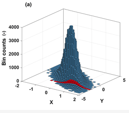

# Variáveis Aleatórias Bidimensionais
## Introdução
### Introdução
- Até o momento:  observar apenas uma característica de um experimento -renda, altura, peso, consumo.

- Podemos observar varias caracteristicas ao mesmo tempo: renda e consumo, peso e altura.

- Nesta aula, vamos observar duas características de forma simultânea do mesmo experimento $\epsilon$.

### Um exemplo
- O experimento:  jogar dois dados não viciados de forma simultânea. Define-se duas variáveis aleatórias: $X$ o número que aparece no dado 1 e $Y$ o número que aparece no dado 2. Assim, temos o seguinte espaço amostral com 36 elementos (6x6):

$$\begin{array}{ccc}
\Omega = { \{(1,1),(1,2),(1,3),...,(6,6)\} }
\end{array}$$

### Um exemplo

Como o dado é não viciado cada evento (x,y) tem a mesma probabilidade de ocorrência de 1/36. Assim, a função de **probabilidade bivariada** é:

$$\begin{array}{ccc}
p(x_{i},y_{j})=P(X=x_{i},Y=y_{j})=1/36 
\end{array}$$
para i=1,...,6 e j=1,...6.


### Um exemplo

Assim como no caso unidimensional pode-se construir um histograma. Com base no exemplo acima, podemos fazer o seguinte histograma tridimensional para o par de dados $X$ e $Y$, ou seja, a distribuição conjunta de $(X,Y)$:


```{r}
#| echo: false
#| fig-cap: "Distribuição conjunta uniforme discreta"

library(plot3D)
prob_matrix <- matrix(1/36, nrow = 6, ncol = 6)
par(mar = c(0, 0, 0, 0))
hist3D(x = 1:6, y = 1:6, z = prob_matrix,
       space = 0,             
       border = "black",      
       col = "#89B6C7",
       alpha = 0.6,
       colvar = NULL,         
       colkey = FALSE,        
       ticktype = "simple",   
       xlab = "x", ylab = "y", zlab = "",
       bty = "b",             
       phi = 30, theta = 45,  
       zlim = c(0, 0.05))
```

### Definindo

Com base nessa ideia podemos fazer a seguinte definição: 

::: {.callout-note icon="false" title="DEFINIÇÃO"}  
Seja $\epsilon$ um experimento, $\Omega$ um espaço amostral, $X = X(\omega)$ e $Y = Y(\omega)$, para $\omega \in \Omega$, $(X,Y)$ será uma variável aleatória bidimensional (ou vetor aleatório).
:::


### Definindo

- Agora possuímos não mais um espaço unidimensaional $R_{x}$ como anteriormente visto, mas sim **bidimensional**;

- Ou seja, o contradomínio da variável aleatória será $R_{xy}$ e cada resultado $X = X(\omega)$ e $Y = Y(\omega)$ pode ser representado como um ponto $(x,y)$ no plano euclidiano;

- Podemos dividir os resultado de um experimento em dois tipos, os discretos e os contínuos. Vejamos a seguir esses dois tipos resultados.  


## Variáveis Aleatórias Discretas
### Introdução
- São variáveis que conseguimos colocar em lista, seja ela finita ou infinita. 

- Assim, o vetor (X,Y) será uma variável aleatória discreta bidimensional ou vetor aleatório bidimensional se os valores possíveis puderem ser representados por $(x_{i},y_{i})$, $i=1,...,n,...$; e $j=1,2,...,m,...$

- Como no caso unidimensional, podemos definir a distribuição de probabilidade conjunta de $(X,Y)$

### Var. Discreta: Definindo

::: {.callout-note icon="false" title="DEFINIÇÃO"}
A cada valor possível da variável aleatória bidimensional $(X,Y)$, $(x_{i},y_{j})$, associamos uma probabilidade $p(x_{i},y_{j})$, $P (X=x_{i},Y=y_{i})$, e irá satisfazer:


i) $p(x_{i},y_{j}) \geq 0$ para todo $(x,y)$


ii) $\sum_{i} \sum_{j} p(x_{i},y_{j})=1$
:::


### Var. Discretas: Definindo
  
- Podemos definir agora a função distribuição conjunto, ou seja: 

::: {.callout-note icon="false" title="DEFINIÇÃO"}
**Função de probabilidade conjunta de (X,Y)** (ou bivariada):


$p(x_{i},y_{j})= P(X=x_{i},Y=y_{j})$ para $-\infty < x_{i}< \infty$ e $-\infty < y_{j}< \infty$

---

**Distribuição de probabilidade conjunta de (X,Y)** (ou bivariada):
$[x_{i},y_{j},p(x_{i},y_{j})]$
:::

- Para fixarmos as definições apresentadas acimas, e colocarmos os conceitos em prática, vamos realizar dois exemplos.


### Var. Discretas: Exemplo

::: {.callout-tip icon="false" title="EXEMPLO"}
Considere o experimento de jogar dois dados simultaneamente. 

Considere a função de distribuição conjunta e calcule a probabilidade conjunta de $P(5\leq X \leq 6, 1 \leq Y \leq 2)$
:::

::: {.callout-caution .fragment icon="false" title="RESPOSTA"}
$$
\begin{aligned}
P(5\leq X \leq 6, 1 \leq Y \leq 2) &= p(5,1)+p(5,2) + p(6,1)+p(6,2) \\
&= 4 \cdot \frac{1}{36} = \frac{1}{9}
\end{aligned}
$$
:::

### Var. Discretas: Exemplo

::: {.callout-tip icon="false" title="EXEMPLO"}
Um supermercado possui três caixas operando. Dois consumidores chegam aos caixas, que estão vazios, em momentos distintos do tempo. Cada consumidor escolhe um caixa de forma aleatória e independente do outro. Seja X o número de consumidores que escolhem o caixa 1 e Y os que escolhem o caixa 2. Qual a distribuição conjunta de X e Y?
:::


::: {.callout-caution .fragment icon="false" title="RESPOSTA"}
O espaço amostral do experimento será dado pelo par ordenado $\{ i,j \}$, onde o primeiro consumidor escolhe o caixa $i$ e o segundo escolhe $j$, tal que $i=1,2,3$ e $j=1,2,3$. Assim, cada ponto amostral tem a mesma probabilidade e o espaço amostral pode ser representado como :
:::


### Var. Discretas: Exemplo

::: {.callout-tip icon="false" title="EXEMPLO"}
**Continuação Resposta:**

$$\Omega = { \{(1,1),(1,2),(1,3),...,(3,3)\} } $$

A distribuição conjunta de X e Y será conforme descrito na tabela abaixo. Para construir essa tabela note que, por exemplo, $P(X=0,Y=0)=P(\{(3,3)\})=1/9$ e que $P(X=0,Y=1)=P(\{(2,3),(3,2)\})=2/9$
:::
<center>
|  y (cx2)    | x=0 (cx1) | x=1 (cx1) |  x= 2  (cx1) |
|-------------|-----------|-----------|--------------|
|y=0          |1/9        |      2/9  |   1/9        |
|y=1          |2/9        |     2/9   |    0         |
|y=2          |1/9        |     0     |    0         |
<center>

### Var. Discreta: Visualização gráfica
**BINOMIAL:**

- Considere a variável aleatória $(X,Y)$ com distribuição binomial e a probabilidade de sucesso de $X$ é igual a 0.75 e de $Y$ igual a 0.25 com 10 rodadas:

```{r}
#| echo = FALSE,
#| fig.cap = "Distribuição conjunta Binomial"
library (intoo)
library (barsurf)
library (bivariate)
library (MASS)
set.bs.options (rendering.style="e")
f <- bnbvpmf (0.75, 0.25, 10)
plot (f, TRUE, zlim=c(0,0.05), zlab="p(x,y)" )
```

### Var. Discreta: Visualização gráfica

**POISSON**

- Considere a variável aleatória $(X,Y)$ com distribuição de poisson e o valor esperado de $X$ iual a 7, de $Y$ igual a 4 e a covariância é 3 (a frente veremos esse conceito): 


```{r}
#| echo = FALSE,
#| fig.cap = "Distribuição conjunta de Poisson"
library (intoo)
library (barsurf)
library (bivariate)
library (MASS)
set.bs.options (rendering.style="e")
f <- pbvpmf.2 (7,4, 3)
plot (f, TRUE, zlim=c(0,0.02), zlab="p(x,y)" )
```

## Variáveis Aleatórias Contínuas
### Introdução

- São variáveis que não conseguimos listar, pois existem infinitos valores entre dois pontos. 

- Assim,o vetor $(X,Y)$ será uma variável aleatória contínua se puder tomar todos os valores em algum conjunto não enumerável no plano euclediano

### Definindo

::: {.callout-note icon="false" title="DEFINIÇÃO"}
Sendo $(X,Y)$ variável aleatória contínua bidimensional. A função densidade de probabilidade conjunta, $f(x,y)$, irá satisfazer:


i) $f(x,y) \geq 0$


ii) $\iint_{R} f(x,y)dxdy= 1$ se f(x,y)=0 para $(x,y)\notin R \rightarrow \int_{- \infty}^{\infty}\int_{- \infty}^{\infty} f(x,y)=1$

:::

Importante notar que $f(x,y)$ não representa a probabilidade.

### Para um evento qualquer...

 Assim para um evento B em $R_{xy}$:

$$\begin{array}{ccc}
P(B)=P\{ [X(\omega),Y(\omega)] \in B \}= P\{\omega | [X(\omega),Y(\omega)] \in B \}
\end{array}$$

Para o caso discreto:
$$\begin{array}{ccc}
P(B)=\sum \sum_{B} p(x_{i},y_{j})
\end{array}$$

Para o caso contínuo:
$$\begin{array}{ccc}
P(B)=\iint_{B}f(x,y)dxdy
\end{array}$$


### Para um evento qualquer...

- Reinterpretando o evento B, análogo ao caso unidimensional, o caso bidimensional o **volume sob a função densidade de probabilidade conjunta representa a probabilidade**. 

- Assim, uma probabilidade $P(a \leq X \leq b, c\leq Y \leq d)$ é calculada como:

$$\begin{array}{ccc}
 P(a \leq X \leq b, c\leq Y \leq d)  = \int_{c}^{d}\int_{a}^{b} f(x,y)dxdy
\end{array}$$

### Var. Contínuas: Exemplo
  
::: {.callout-tip icon="false" title="EXEMPLO"}
Suponha que uma partícula é aleatoriamente alocada em um quadrado com lados iguais a 1. Assim, se duas áreas de mesma dimensão forem consideradas a partícula tem a mesma probabilidade de estar em qualquer uma das duas áreas. Seja $X$ e $Y$ as coordenadas da localização da partícula. A função de densidade conjunta de $X$ e $Y$ será:

$$\begin{array}{ccc}
f(x,y)=\left\{\begin{matrix} 1,\ 0\ \leq x \leq 1, \ 0\ \leq y \leq 1
\\
0,\ caso\ contrário
\end{matrix}\right.
\end{array}$$
:::

### Var. Contínuas: Exemplo
  
::: {.callout-tip icon="false" title="EXEMPLO"}
a. Esboce a função densidade de probabilidade conjunta 
b. Encontre $P(0 \leq X \leq 0.2, 0\leq Y \leq 0.4)$
:::

::: {.callout-caution .fragment icon="false" title="RESPOSTA"}
Ver figura abaixo. 
$$\begin{array}{ccc}
P(0 \leq X  \leq 0.2,0 \leq Y  \leq 0.4)= \int_{0}^{0.4}\int_{0}^{0.2}f(x,y)dxdy
\\
=\int_{0}^{0.4}\int_{0}^{0.2}1dxdy=\int_{0}^{0.4}(\int_{0}^{0.2}1dx)dy=\int_{0}^{0.4}(x\Big|_{0}^{0.2})dy
\\
=(0.2-0)\int_{0}^{0.4}dy=(0.2-0).(y\Big|_{0}^{0.4})=(0.2-0)(0.4-0)=0.08
\\
P(0 \leq X  \leq 0.2,0 \leq Y  \leq 0.4)=0.08
\end{array}$$
:::

### Var. Contínuas: Exemplo
  
::: {.callout-tip icon="false" title="EXEMPLO"}
{fig-align="center" width="40%"}
:::

### Var. Contínuas: Visualização gráfica

**NORMAL BIVARIADA:**

Considere a variável aleatória $(X,Y)$ com distribuição normal bivariada com a esperança de $X$ igual a 10, de $Y$ igual a 4, o desvio-padrões iguais a 3 e 2 respectivamente. Aqui consideremaos a correlação de 0.7 (veremos mais a frente esse conceito).

```{r}
#| echo = FALSE,
#| fig.cap = "Distribuição conjunta normal bivariada"
library (intoo)
library (barsurf)
library (bivariate)
library (MASS)
set.bs.options (rendering.style="e")
f <- nbvpdf (10, 4, 3, 2, 0.7)
plot (f, TRUE, zlim=c(0,0.03), zlab="p(x,y)" )
```

### Var. Contínuas: Visualização gráfica

**NORMAL BIVARIADA PADRÃO:**

Considere a variável aleatória $(X,Y)$ com distribuição normal bivariada padrão, ou seja, a esperança de $X$ e $Y$ igual a a 1, o desvio-padrões iguais a 1 e sem covariância.

```{r}
#| echo = FALSE,
#| fig.cap = "Distribuição conjunta normal padrão bivariada"
library (intoo)
library (barsurf)
library (bivariate)
library (MASS)
set.bs.options (rendering.style="e")
f <- nbvpdf (0, 0, 1, 1, 0)
plot (f, TRUE, zlim=c(0,0.1), zlab="p(x,y)" )
```

## Função Distribuição Acumulada
### Caso discreto: Definindo 
- A distinção entre variável aleatória conjunta contínua e discreta pode ser feita em termos de sua função distribuição conjunta acumulada. 

::: {.callout-note icon="false" title="DEFINIÇÃO"}
A função distribuição conjunta acumulada, $F$, da variável aleatória bidimensional $(X,Y)$ é definida por:
$$\begin{array}{ccc}
 F(x,y)= P(X \leq x, Y \leq y) \ para \ -\infty < x_{i} < \infty \ e \ -\infty < y_{i} < \infty
\end{array}$$
:::

### Caso discreto: Definindo 

Sejam $X$ e $Y$ duas variáveis aleatórias discretas com função distribuição conjunta $F(x,y)$, a função distribuição conjunta acumulada de $X$ e $Y$ será:

$$\begin{array}{ccc}
 F(x,y)=\sum_{f1=- \infty }^{x} \sum_{f2=- \infty }^{y}p(t_{1},t_{2})
\end{array}$$


Retomando os exemplos anteriores temos as seguintes funções de distribuição conjunta acumuladas discretas: 


### Caso discreto: Exemplo 1 
  
::: {.callout-tip icon="false" title="EXEMPLO"}

Para o caso dos dois dados apresentados anteriormente temos que:

$$\begin{array}{ccc}
F(2,3)=P(X \leq 2, Y \leq 3)=p(1,1)+p(1,2)+p(1,3)+ \\
p(2,1)+p(2,2)+p(2,3)
\end{array}$$

$$F(2,3)=P(X\leq 2, Y \leq 3)=6/36=1/6 $$
:::

### Caso discreto: Exemplo 1 
- O Gráfico da função probabilidade acumulada conjunta do exemplo dos dados será:

```{r}
#| echo: false
#| fig-cap: "Distribuição acumulada conjunta uniforme discreta"

library(plot3D)
cdf_matrix <- outer(1:6, 1:6, "*") / 36
par(mar = c(0, 0, 0, 0))
hist3D(x = 1:6, y = 1:6, z = cdf_matrix,
       space = 0,             
       border = "black",      
       col = "#89B6C7",       
       alpha = 0.6,           
       colvar = NULL,         
       colkey = FALSE,        
       ticktype = "simple",   
       xlab = "x", ylab = "y", zlab = "",
       bty = "b",             
       phi = 30, theta = -40,
       zlim = c(0, 1))
```


### Caso discreto: Exemplo 2

::: {.callout-tip icon="false" title="EXEMPLO"}
Para o exemplo anterior (caixa do supermercado) encontre F(-1,2) e F(1.5,2)

---

$$F(-1,2) = P(X \leq -1, Y \leq 2)= P(\emptyset)=0$$

*Note que é impossível no exemplo do caixa o valor assumir -1, portanto, temos a probabilidade de um conjunto vazio, que será zero.

$$\begin{array}{ccc}
F(1.5,2) = P(X \leq 1.5, Y \leq 2)= p(0,0)+p(0,1)+p(0,2)+p(1,0) 
\\
+p(1,1)+p(1,2)=8/9
\end{array}$$

:::

### Caso discreto: Visualização gráfica
**BINOMIAL:**

Considere a variável aleatória $(X,Y)$ com distribuição binomial e a probabilidade de sucesso de $X$ é igual a 0.75 e de $Y$ igual a 0.25 com 10 rodadas, sua função distribuição acumulada será:

```{r}
#| echo: false
#| fig-cap: "Distribuição conjunta Binomial"
library(plot3D)
n <- 10
p1 <- 0.75
p2 <- 0.25
x_vals <- 0:n
y_vals <- 0:n
cdf_binom <- outer(pbinom(x_vals, size = n, prob = p1), 
                   pbinom(y_vals, size = n, prob = p2), "*")
par(mar = c(0, 0, 0, 0))
hist3D(x = x_vals, y = y_vals, z = cdf_binom,
       space = 0,             
       border = "black",      
       col = "#89B6C7",       
       alpha = 0.6,           
       colvar = NULL,         
       colkey = FALSE,        
       ticktype = "simple",   
       xlab = "x", ylab = "y", zlab = "",
       bty = "b",             
       phi = 30, theta = -40, 
       zlim = c(0, 1))
```

### Caso discreto: Visualização gráfica
**POISSON**
\
Considere a variável aleatória $(X,Y)$ com distribuição de poisson e o valor esperado de $X$ iual a 7, de $Y$ igual a 4 e a covariância é 3 (a frente veremos esse conceito). Assim a função distribuição acumulada será: 


```{r}
#| echo: false
#| fig-cap: "Distribuição conjunta de Poisson"
library(plot3D)
l1 <- 7
l2 <- 4
l3 <- 3
max_val <- 16
x_vals <- 0:max_val
y_vals <- 0:max_val
pmf_matrix <- matrix(0, nrow = max_val + 1, ncol = max_val + 1)
for(x in 0:max_val) {
  for(y in 0:max_val) {
    val <- 0
    for(i in 0:min(x,y)) {
      val <- val + (l1^(x-i) * l2^(y-i) * l3^i) / (factorial(x-i) * factorial(y-i) * factorial(i))
    }
    pmf_matrix[x+1, y+1] <- exp(-(l1 + l2 + l3)) * val
  }
}
cdf_poisson <- matrix(0, nrow = max_val + 1, ncol = max_val + 1)
for(x in 1:(max_val + 1)) {
  for(y in 1:(max_val + 1)) {
    cdf_poisson[x, y] <- sum(pmf_matrix[1:x, 1:y])
  }
}
par(mar = c(0, 0, 0, 0))
hist3D(x = x_vals, y = y_vals, z = cdf_poisson,
       space = 0,             
       border = "black",      
       col = "#89B6C7",       
       alpha = 0.6,           
       colvar = NULL,         
       colkey = FALSE,        
       ticktype = "simple",   
       xlab = "x", ylab = "y", zlab = "",
       bty = "b",             
       phi = 30, theta = -40, 
       zlim = c(0, 1))
```

### Caso Contínuo: Definindo

- Sejam X e Y duas variáveis aleatórias contínuas com função distribuição conjunta $F(x,y)$. 

- Se existir uma função densidade de probabilidade conjunta $f(x,y)$ não negativa, assim a **função distribuição acumulada conjunta de X e Y** será:

$$\begin{array}{ccc}
 F(x,y) = \int_{-\infty}^{x}\int_{- \infty}^{y} f(t_{1},t_{2})dt_{1}dt_{2} \\
\end{array}$$
 para $-\infty < x_{i} < \infty$ e $-\infty < y_{i} < \infty$

### Caso Contínuo: Exemplo

::: {.callout-tip icon="false" title="EXEMPLO"}
Para o exemplo anterior da partícula, encontre F(0.4, 0.4):
:::


::: {.callout-caution .fragment icon="false" title="RESPOSTA"}
Ver figura abaixo. 
$$\begin{array}{ccc}
P(X \leq 0.4 ,Y \leq 0.4)= \int_{0}^{0.4}\int_{0}^{0.4}f(x,y)dxdy
\\
=\int_{0}^{0.4}\int_{0}^{0.4}1dxdy=\int_{0}^{0.4}(\int_{0}^{0.4}1dx)dy=\int_{0}^{0.4}(x\Big|_{0}^{0.4})dy
\\
=(0.4-0)\int_{0}^{0.4}dy=(0.4-0).(y\Big|_{0}^{0.4})=(0.4-0)(0.4-0)=0.016
\\
P(X  \leq 0.4,Y \leq 0.4)=0.016
\end{array}$$
:::

### Caso Contínuo: Definindo, mais um pouco

::: {.callout-note icon="false" title="TEOREMA"}

Seja $X$ e $Y$ duas variáveis aleatórias contínuas com função distribuição conjunta $F(x,y)$ então:

$$\begin{array}{ccc}
a) \ F(- \infty, - \infty )=  F(- \infty, y )=  F(x, - \infty )=0 \\
\end{array}$$

$$\begin{array}{ccc}
b) \ F(\infty, \infty ) = 1
\end{array}$$

No caso bivariado tem-se: 
$$\begin{array}{ccc}
 f(x,y) = \frac{\partial^{2}F(x,y) }{\partial x \partial y} 
\end{array}$$

:::

### Caso Contínuo:Visualização gráfica
**NORMAL BIVARIADA:**

Considere a variável aleatória $(X,Y)$ com distribuição normal bivariada com a esperança de $X$ igual a 10, de $Y$ igual a 4, o desvio-padrões iguais a 3 e 2 respectivamente. Aqui consideremaos a correlação de 0.7 (veremos mais a frente esse conceito). Assim a função distribuição acumulada conjunta terá o seguinte formato:

```{r}
#| echo: false
#| fig-cap: "Distribuição acumulada conjunta normal"
library(plot3D)
library(pbivnorm)
x_vals <- seq(1, 19, length.out = 40)
y_vals <- seq(-2, 10, length.out = 40)
cdf_func_corr <- function(x, y) {
  zx <- (x - 10) / 3
  zy <- (y - 4) / 2
  pbivnorm(zx, zy, rho = 0.7)
}
z_matrix1 <- outer(x_vals, y_vals, cdf_func_corr)
par(mar = c(0, 0, 0, 0))
persp3D(x = x_vals, y = y_vals, z = z_matrix1,
        col = "#89B6C7", border = "black", facets = TRUE, alpha = 0.6,
        colvar = NULL, colkey = FALSE, ticktype = "simple",
        xlab = "x", ylab = "y", zlab = "",
        bty = "b", phi = 30, theta = -40, zlim = c(0, 1))
```

### Caso Contínuo:Visualização gráfica
**NORMAL BIVARIADA PADRÃO:**

Considere a variável aleatória $(X,Y)$ com distribuição normal bivariada padrão, ou seja, a esperança de $X$ e $Y$ igual a a 1, o desvio-padrões iguais a 1 e sem covariância. Assim a função distribuição acumulada conjunta terá o seguinte formato:

```{r}
#| echo: false
#| fig-cap: "Distribuição acumulada conjunta normal padrão"
library(plot3D)
library(pbivnorm)
x_vals <- seq(-3, 3, length.out = 40)
y_vals <- seq(-3, 3, length.out = 40)
cdf_func_padrao <- function(x, y) {
  pbivnorm(x, y, rho = 0)
}
z_matrix2 <- outer(x_vals, y_vals, cdf_func_padrao)
par(mar = c(0, 0, 0, 0))
persp3D(x = x_vals, y = y_vals, z = z_matrix2,
        col = "#89B6C7", border = "black", facets = TRUE, alpha = 0.6,
        colvar = NULL, colkey = FALSE, ticktype = "simple",
        xlab = "x", ylab = "y", zlab = "",
        bty = "b", phi = 30, theta = -40, zlim = c(0, 1))
```


# Distribuição de Probabilidade Marginal 
## Introdução

- Dada a variável aleatória bidimensional $(X,Y)$ podemos estar interessados em $X$ ou $Y$ individualmente. 
- Com base na distribuição conjunta da renda e consumo, por exemplo, quero saber somente como a renda se distribui. 

## Caso discreto
### Definindo

Para o caso discreto, temos a seguinte **distribuição marginal de X**:

$$\begin{array}{ccc}
p(x_{i})=P(X=x_{i})=P(X=x_i, Y=y_i \ ou \ X=x_i,Y=y_2 ....) 
\\
p(x_i)=\sum_j p(x_i,y_j)
\end{array}$$

Onde $p$ é a função distribuição marginal de $X$. Podemos pensar em $Y$ de forma análoga. 

A intuição aqui é que se queremos a marginal de $X$ temos que empilhar (ou somar) na direção de $Y$, assim o eixo $y$ irá sumir. Vejamos graficamente.


### Caso discreto: Visualização gráfica

Vejamos um exemplo extraído de Inouye,D.I. et al.(2017): 

{fig-align="center" width="25%"}

Veja que se quisermos a distribuiçao marginal de $X$, apresentada a esquerda, temos que somar as barras ou empilha-las na direção de $Y$. 

## Caso Contínuo
### Caso contínuo: Definindo
O caso contínuo é similar ao discreto. No contínuo, a **função densidade marginal de X** será:

$$\begin{array}{ccc}
g(x)=\int_{-\infty}^{\infty}f(x,y)dy
\end{array}$$


E a **função densidade marginal de y** será:

$$\begin{array}{ccc}
h(y)=\int_{-\infty}^{\infty}f(x,y)dx
\end{array}$$

### Caso Contínuo: Exemplo

::: {.callout-tip icon="false" title="EXEMPLO"}
Suponha que $(X,Y)$ seja uma variável aleatória bidimensional. Gostariamos de saber somente qual a probabilidade de encontrarmos valores de $x$ entre c e d. Assim:

---

$$P(c\leq x \leq d)=P[c\leq X \leq d, -\infty < Y < \infty] $$

$$P(c\leq x \leq d)=\int_{c}^{d}\int_{-\infty}^{\infty}f(x,y)dydx $$

$$P(c\leq x \leq d)=\int_{c}^{d}g(x)dx $$
:::


### Caso contínuo: Visualização gráfica
Vejamos um exemplo extraído de Selvan, R.(2015):

{fig-align="center" width="65%"}

### Caso contínuo: Visualização gráfica

Veja que se quisermos a distribuiçao marginal de $X$, apresentada ao fundo, temos que somar as barras ou empilha-las na direção de $Y$. 

# Distribuição de Probabilidade Condicional
## Introdução
### Introdução

Na distribuição marginal, tinhamos a distribuição conjunta entre renda e consumo e estavamos interessados somente na renda. Agora querendo saber qual a distribuição da renda para certa faixa de consumo, ou o contrário, qual a distribuição do consumo para dada faixa de renda. 

## Caso discreto:
### Caso discreto: Definindo

Para variáveis discretas temos o seguinte: 

$$\begin{array}{ccc}
P(x_i|y_j)=P(X=x_i|Y=y_j)
\end{array}$$

$$\begin{array}{ccc}
P(x_i|y_j)= \frac{P(x_i,y_j)}{q(y_{j})}
\end{array}$$

Note que $P(x_i|y_j)\geq 0$ e $\sum_iP(x_i|y_j)=1$ 


### Caso discreto: Visualização gráfica
Vejamos um exemplo extraído de Inouye,D.I. et al.(2017): 

{fig-align="center" width="50%"}

### Caso discreto: Visualização gráfica
  - Veja que se quisermos a distribuição condicional de $X$ dado um certo valor de $Y$, por exemplo, $Y=2$ temos que considerar as barras marcadas e repondera-las pela chance de $Y=2$ acontecer. 

  - Ou seja, agora $Y=2$ será o total. 
 
  
## Caso contínuo
### Caso contínuo: Definindo
Para o caso contínuo a f.d.p. de $X$ condicionada a um dado $Y=y$ é:

$$\begin{array}{ccc}
g(x|y)= \frac{f(x,y)}{h(y)}
\end{array}$$

De forma análoga para $Y$:


$$\begin{array}{ccc}
h(y|x)= \frac{f(x,y)}{g(x)}
\end{array}$$

### Caso contínuo: Definindo

Note que $g(x|y)\geq 0$ e 

$$\int_{-\infty}^{\infty}g(x|y)dx=\int_{-\infty}^{\infty} \frac {f(x,y)}{h(y)}dx=\frac{h(y)}{h(y)}=1$$ 


### Caso contínuo: Visualização gráfica

Vejamos um exemplo extraído de Neuper,M. e Ehret,U. (2019): 

{fig-align="center" width="50%"}

### Caso contínuo: Visualização gráfica

Veja que se quisermos a distribuição condicional de $X$ dado um certo valor de $Y$, por exemplo, $Y=-2$.Temos que considerar a linha marcada e novamente reponderar todos os elementos pela chance de $Y=-2$ acontecer. Ou seja, agora $Y=-2$ será o total. 


# Variáveis Aleatórias Independentes
## Introdução
### Introdução
- Independência se conecta ao conceito de informação e quanto essa informação recebida muda sua opinião do que irá acontecer com o caso em estudo.

- Podemos dar uma informação sobre renda e perguntarmos sobre o consumo desse parte da população. Quando os resultados de $X$ influenciam o resultado de $Y$ dizemos que as variáveis são dependentes. Caso a informação sobre $X$ não afeta de meneira nenhuma os resultados de $Y$, dizemos que são independentes. 


## Caso discreto
### Caso discreto: Definindo

::: {.callout-note icon="false" title="DEFINIÇÃO"}
Para a variábel bidimensional discreta $(X,Y)$, $X$ e $Y$ serão independentes se 
$$\begin{array}{ccc}
p(x_i,y_j)=p(x_i)p(y_j)
\end{array}$$

---

Ou, de outra maneira:
$$\begin{array}{ccc}
P(x_i|y_j)= \frac{P(x_i,y_j)}{q(y_i)}= \frac{P(x_i)q(y_j)}{q(y_i)}=P(x_i)
\end{array}$$
:::

## Caso Contínuo
### Caso Contínuo: Definindo

::: {.callout-note icon="false" title="DEFINIÇÃO"}
Para a variábel bidimensional contínua $(X,Y)$, $X$ e $Y$ serão independentes se:
$$\begin{array}{ccc}
f(x,y)=g(x)h(y)
\end{array}$$

---

Ou, de outra maneira:
$$\begin{array}{ccc}
g(x|y)= \frac{f(x,y)}{h(y)}= \frac{g(x)h(y)}{h(y)}=g(x)
\end{array}$$
:::


## Um pouco mais sobre Independência
### Definindo
  
- Com base nessas definições podemos agora apresentar o seguinte teorema que conecta o que viram em probabilidade com variáveis aleatórias multidimesionais. 

::: {.callout-note icon="false" title="TEOREMA"}
Se $(X,Y)$ uma variável aleatória bidimensional e A e B dois eventos que dependem de $X$ e $Y$, respectivamente. Então, se $X$ e $Y$ forem independentes: 
$$\begin{array}{ccc}
P(A \cap B)= P(A) P(B)
\end{array}$$
:::

### Definindo
  
::: {.callout-note icon="false" title="TEOREMA"}

**Prova:**
$$\begin{array}{ccc}
P(A \cap B)= {\int_{}^{}\int_{}^{}}_{P(A \cap B)}f(x,y)dxdy\\
\\
= {\int_{}^{}\int_{}^{}}_{P(A \cap B)}g(x)h(y)dxdy\\ 
\\
={\int_{A}^{}g(x)dx\int_{B}^{}h(y)dy}\\
\\
=P(A)P(B)
\end{array}$$
:::

### Exemplo

::: {.callout-tip icon="false" title="EXEMPLO"}
Suponha uma f.d.p. conjunta da variábel aleatória bidimensional $(X,Y)$:
$$\begin{array}{ccc}
f(x,y)=\left\{\begin{matrix} x^{2}+ \frac{xy}{3} \ para \ 0<x<1,0<y<2
\\ 0,\ caso\ contrário
\end{matrix}\right.
\end{array}$$

Calcule a $P(Y<X)$:
:::

### Exemplo

::: {.callout-tip icon="false" title="EXEMPLO"}
**Resposta:**

$$\begin{array}{ccc}
P(Y<X)=\int_{0}^{1}\int_{0}^{x} x^{2}+ \frac{xy}{3} dydx 
\end{array}$$

$$\begin{array}{ccc}
P(Y<X)=\int_{0}^{1} [x^{2}y+ \frac{xy^{2}}{6}]_0^{x} dy 
\end{array}$$

$$\begin{array}{ccc}
P(Y<X)=\int_{0}^{1} [x^{3}+ \frac{x^{3}}{3}] dy 
\end{array}$$

$$\begin{array}{ccc}
P(Y<X)= [\frac{x^{4}}{4}+ \frac{x^{4}}{24}]_0^{1} 
\end{array}$$

$$\begin{array}{ccc}
P(Y<X)= \frac{1}{4}+\frac{1}{24}=\frac{7}{24}
\end{array}$$
:::


# Coeficiente de Correlação
## Introdução
### Definindo

- Até o momento medimos a $E(X)$ e a $Var(X)$, ou seja, uma medida de posição e de variabilidade em relação a $R_x$, Entretanto, quando temos um vetor bidimensional $(X,Y)$ uma outra medida surge, a qual tenta media o "grau de associação" linear entre $X$ e $Y$.


::: {.callout-note icon="false" title="DEFINIÇÃO"}
Seja $(X,Y)$ uma variábel aleatória bidimensional. O **Coeficiente de Correlação** $\rho_{X,Y}$ entre $X$ e $Y$ será:

$$\begin{array}{ccc}
\rho_{X,Y}=\frac{E[(X-E(X))(Y-E(Y))]}{\sqrt{Var(X)Var(Y)}}
\end{array}$$
:::

## A Covariância
### Covariância: Definindo

- Um termo muito importante surge na expressão acima, a **Covariância**. 

- Ela mede a variabilidade conjunta de uma variável aleátoria multidimensional.


::: {.callout-note icon="false" title="DEFINIÇÃO"}
A **Covariância** entre $X$ e $Y$, $Cov(X,Y)$, é dada por:
$$\begin{array}{ccc}
Cov(X,Y)=E[(X-E(X))(Y-E(Y))]
\end{array}$$
:::

- Para tirar o efeito das escalas de medidas, dividimos pelos desvio-padrões. 


## Propriedades do Coef. de Correlação
### Definindo

- Novamente, a correlação mede o **GRAU DE ASSOCIAÇÃO LINEAR**. 

- Vejamos algumas Propriedades da Correlação:

::: {.callout-note icon="false" title="TEOREMA"} 
O coeficiente de correlação $\rho_{X,Y}$ entre $X$ e $Y$ pode ser apresentado como:
$$\begin{array}{ccc}
\rho_{X,Y}=\frac{E(XY)-E(X)E(Y)}{\sqrt{Var(X)Var(Y)}}
\end{array}$$

:::

### Definindo

::: {.callout-note icon="false" title="TEOREMA"} 

**Prova:**
$$\begin{array}{ccc}
E[(X-E(X))(Y-E(Y))]\\
\\
=E[XY-XE(Y)-E(X)Y+E(X)E(Y)] \\
\\
= E(XY)-E(X)E(Y)-E(X)E(Y)+E(X)E(Y)\\
\\
= E(XY)-E(X)E(Y)
\end{array}$$
:::

### Independência e a Correlação
  
::: {.callout-note icon="false" title="TEOREMA"}
Se $X$ e $Y$ forem independentes então:
$$\begin{array}{ccc}
\rho_{X,Y}=0
\end{array}$$

---

**Prova:**


Da propriedade da independência, se $X$ e $Y$ forem independentes então:
$$\begin{array}{ccc}
E(X,Y)=E(X)E(Y)
\end{array}$$
:::

Considerando o teorema acima, e sabendo que as variáveis são independentes, então $\rho_{X,Y}=0$


### Importante: 

- Note que Independência $\Rightarrow \rho_{X,Y}=0$ 

- Mas **não** é verdade que $\rho_{X,Y}=0 \Rightarrow Independência$


### O Intervalo da Correlação

::: {.callout-note icon="false" title="TEOREMA"}
O Coeficiente de Correlação possui valores entre -1 e 1, ou seja:
$$\begin{array}{ccc}
-1 \leq \rho \leq 1
\end{array}$$ 

---

**Prova:**

Considere a seguinte desigualdade verdadeira:
$$\begin{array}{ccc}
(\frac{x-\mu_x}{\sigma_x}\mp \frac{Y-\mu_y}{\sigma_y} )^{2}\geq 0
\end{array}$$

A expressão continua verdadeira se aplicarmos o operador esperança:
$$\begin{array}{ccc}
E(\frac{x-\mu_x}{\sigma_x}\mp \frac{Y-\mu_y}{\sigma_y} )^{2}\geq 0
\end{array}$$

:::

### O Intervalo da Correlação

::: {.callout-note icon="false" title="TEOREMA"}

**Continuação Prova:**

Desenvolvendo, temos que:
$$\begin{array}{ccc}
E[(\frac{x-\mu_x}{\sigma_x})^{2}+(\frac{Y-\mu_y}{\sigma_y})^{2} \mp 2 (\frac{x-\mu_x}{\sigma_x})(\frac{Y-\mu_y}{\sigma_y}) ]\geq 0
\end{array}$$
$$\begin{array}{ccc}
\frac{1}{\sigma_x^{2}}E({X-\mu_x})^{2}+\frac{1}{\sigma_y^{2}}E({Y-\mu_y})^{2}\mp 2 \frac{1}{\sigma_x \sigma_y}E((X-\mu_x)(Y-\mu_y) )\geq 0
\end{array}$$
 
$$\begin{array}{ccc}
\frac{\sigma_x^{2}}{\sigma_x^{2}}+\frac{\sigma_y^{2}}{\sigma_y^{2}}\mp 2\rho \geq 0
\end{array}$$
$$\begin{array}{ccc}
\mp 2\rho \geq -2
\end{array}$$
$$\begin{array}{ccc}
\therefore \rho \geq -1 \ e \ \rho \leq 1
\end{array}$$
:::


### Correlação: Associação linear

::: {.callout-note icon="false" title="TEOREMA"}
Se X e Y forem duas variáveis aleatórias, onde $Y=AX+B$, onde A e B são constantes. Então $\rho^{2}=1$. Se $A>0$, $\rho=1$. Se $A<0$, $\rho=-1$

---

**Prova:**

$$\begin{array}{ccc}
Y= AX +B
\\
E(Y)=A E(X)+ B \ e \ VAR(Y)=A^{2}VAR(X)
\\
E(XY)=E(AX^{2}+BX) \ \rightarrow AE(X^{2})+BE(X)
\end{array}$$

Então: 
$$\begin{array}{ccc}
\rho^{2}=\frac{A^{2}{Var(X)}}{A^{2}{Var(X)}}=1
\end{array}$$
:::

### O Coeficiente de Correlação

- Assim, com base no exposto, temos que o coeficiente de correlação é uma medida do grau de linearidade entre X e Y. 

- Dessa forma, $\rho$ próximo a 1 e -1 indicam alto grau de linearidade e $\rho$ próximo a zero indica ausência de relação linear - mas não diz nada sobre relações não-lineares. 

### Correlação: Visualização gráfica

```{r echo = FALSE, fig.cap= "Gráfico de correlação para variáveis simuladas v1 a v5",fig.height = 5, fig.width = 5, fig.align = "center"}
library(psych)
data <- data.frame( var1 = 1:100 + rnorm(100,sd=20), v2 = 1:100 + rnorm(100,sd=27), v3 = rep(1, 100) + rnorm(100, sd = 1)) 
data$v4 = data$var1 ** 2 
data$v5 = -(data$var1 ** 2) 
pairs.panels(data)
```

### Correlação: Visualização gráfica
- Vamos começar pelas variáveis v5 e v4, elas tem um comportantamento conjunto totalmente linear, ou seja, saber de v4 te informa corretmente o que acontecerá com v5. Aqui quando v5 sobe, v4 desce.

- Vejamos agora as variáveis v3 e v2, observe como os dados estão disperso, sem nenhum padrão de comportamento linear. Nesse caso a correlação é próxima a zero (-0.0135). 

### Correlação: Visualização gráfica

- Perceba que a relação não-linear entre v1 e v4 e v1 e v5, faz com que a correlação seja menor que 1 e não perfeita. 

- Já as variáveis v1 e v2 mostram comportamento conjunto positivo, mas não perfeito, reativamente disperso. Quando v1 sobe, v2 também sobe, entretanto não cosneguimos prever esse comportamento perfeitamente. 

