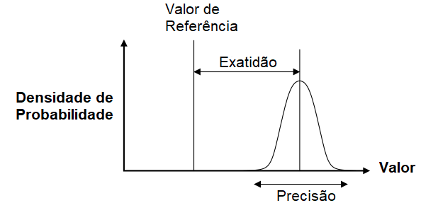
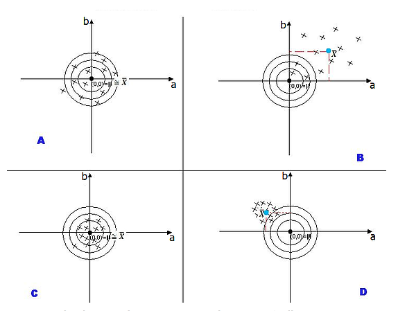
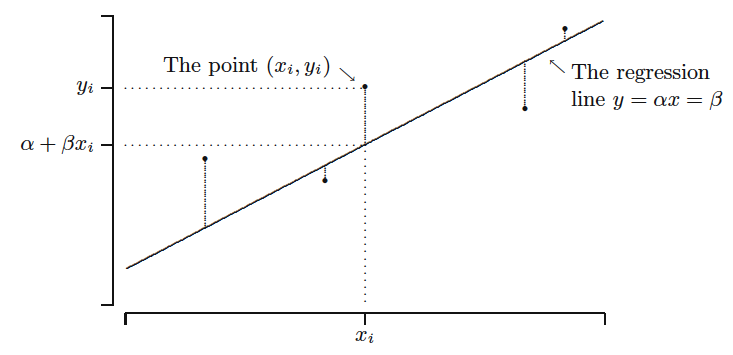

## Introdução

Um dos esforços da estatística é propor técnicas para estimar caracaterísticas populacionais que auxiliem os tomadores de decisão a fazerem melhores escolhas. Se vamos fazer um programa para treinamento para mulheres desempregadas de baixa renda, precisamos saber qual a taxa de desemprego daquela população e assim propor um número de vagas adequado. Se queremos melhorar o sistema de logística de um entreposto, precisamos entender qual a intensidade de chegada de caminhões nesse entreposto. Se vamos fazer um programa de auxílio para pessoas em situaçao de extrema pobreza, precisamos saber quantas pessoas vivem nessa situação nessa localidade.

Notamos que para a maior parte das questões que temos sobre o mundo, raramente sabemos o que acontece na população. Temos que tentar construir um modelo que nos ajude nessa tarefa e nos de a segurança que as nossas estimativas da realidade sejam boas. Na inferência estatística existem dois objetivos principais.


1. Estimação de parâmetros: valores populacionais

2. Testes de hipótese sobre os parâmetros


Nosso objetivo aqui é estudar técnicas que nos permita avaliar se uma proposta de estimativa de uma caractaristica da população é "boa" e aprender técnicas para encontrar "boas" estimativas. Assim temos duas questões básicas surgem:


1. Quais as características que um "bom" estimador possui? 

2. Como decidiremos que uma boa estimativa é "melhor" que outras?


Para saber se uma estimativa é boa ou não vamos introduzir duas ideias aqui, exatidão e precisão.


**Dois conceitos importantes:**


1. **Exatidão**: proximidade de cada observação do valor do centro do alvo (nosso caso: parâmetro)

2. **Precisão**: proximidade de cada observação em relação ao ponto médio de todas, variância. 


A figura abaixo traz esses dois conceitos[^9]:

[^9]: https://portalfisica.wordpress.com/2018/08/24/acuracia-precisao-e-exatidao/

{#fig-particula fig-align="center" width="60%"}

Uma outra forma de vermos o mesmo conceito é pelo exmplo clássico dos alvos. Vejamos a figura abaixo:

{#fig-particula fig-align="center" width="60%"}

Cada x no alvo representa uma tentativa sua de estimar o parâmetro de uma população que é o centro do alvo. A ideia seria que uma boa "arma" (arma aqui é a sua equação matemática) é aquela que acerta ao redor do centro do alvo e menos espelhado possível. Vejamos cada um desses alvos:


1. **A**: Exato (média das tentativas está no centro do alvo.) Pouco Preciso (observações muito dispersas)

2. **B**: Pouco Exato e Pouco Preciso

3. **C**: Exato e Preciso

4. **D**: Pouco Exato e Muito Preciso


Portanto, notamos que a melhor arma, ou seja, a melhor forma de estimar é pela "arma" C.

## Estimadores e Estimação

Considere uma amostra $(X_1, ..., X_n)$ de uma variável aleatória $X$, sendo $X_i$ variáveis aleatíras com a mesma distribuição de $X$ e $x_i$ os valores observados. Considere $\Theta$ um parâmetro populacional, podendo ser por exemplo: $\mu$ ou $\sigma$.

::: {.callout-note  icon="false" title="DEFINIÇÃO"}

Um estimador $T$ do parâmetro $\Theta$ é qualquer função das observações da amostra, tal que:

\center{$T= h(X_1, ..., X_n)$.}

:::

Portanto, cada estimador é uma estatística a qual associamos a um parâmetro. Assim temos uma segunda definição:

::: {.callout-note  icon="false" title="DEFINIÇÃO"}

Uma Estimativa é o valor $t$ que somente depende da amostra observada $x_1, x_2, ..., x_n$. Ou seja, é uma função somento do banco de dados coletado:

\center{**$t=h(x_1, x_2, . . . , x_n)$.**}

:::

Veja a situação apresentada abaixo. Sabe-se que temos o retorno de uma carteira dada por $X$ que é uma variável aleatória. Sabe-se que a esperança do rerotno dessa carteira ($\mathbb{E}(X)$) que chamaremos de $\Theta$ é de 0. Encontramos duas maneiras de estimar esse retorno. Abaixo temos a distribuição de dois estimadores $T_1$ e $T_2$ do parâmetro $\Theta$.

```{r}
#| echo = TRUE,
#| fig.cap = "Função Distribuição de Probabilidade Normal e Função Distribuição Acumulada Normal",
#| fig.height = 3.5,
#| fig.width = 7
#Distribuição de dois estimadores, T1 e T2,  para o parâmetro populacional
x<-seq(-5,7,0.1) 
T1<-dnorm(x = x, mean = 3, sd=1)   
T2<-dnorm(x = x, mean = 0, sd=1)

plot(x,T1,xlab="ti",type="l",main=NULL, col="steelblue3",lwd=2, ylab="f(ti)",
     xaxt="n",cex.axis=0.65, cex.lab=0.8 ) 
abline(v=0, col="black", lty=2)
par(new=TRUE)
plot(x,T2,xlab="", ylab="",type="l",col="wheat4",lwd=2,xaxt="n",
     cex.axis=0.65, cex.lab=0.8 ) 
axis(1,at=c(0),labels =c(expression(Theta)),cex.axis=0.65, cex.lab=0.8) 
legend("topleft", legend=c("T1", "T2"),col=c("steelblue3", "wheat4"), 
       lty=1:1, box.lty=0,cex=0.8)

```

**Questão**

Definir uma função $T_i= h(X_1, ..., X_n)$ que seja próxima de $\Theta$ segundo algum critério. Ou seja, que acerte em média o parâmetro e que não seja muito dispersa!

## Propriedades dos Estimadores

### Tendenciosidade ou Viés

Suponha que estamos querendo estudar o desempenho dos alunos na Prova do ENEM, $X$, que vamos assumir que tenha distribuição normal com $\mathbb{E}(X)=2000$ e $\sigma=400$. Vamos observar 50 alunos que fizeram a prova em 2019 e estimar a esperança da nota utilizando a fórmula $\bar{X}$. Iremos repetir o processo de amostragem 100.000 vezes. Assim, vamos coletar 50 pessoas e fazer a média para essa amostragem, $\bar{X}_{50}$ e repetimos esse processo 100 mil vezes. Teremos portanto 100 mil médias. Vejamos a distribuição dessas médias feitas no R:

```{r}
#| echo = TRUE,
#| fig.cap = "Distribuição do estimador da Esperança da Nota do ENEM",
#| fig.height = 3.5,
#| fig.width = 6
# Distribuição da nota dos alunos que fizeram ENEM, X. 
x_normal<-rnorm(10000,mean=2000, sd= 400)

#Amostragem:
# Criando os vetores numéricos 
xbar50<-numeric()
var_amostral50<-numeric()
# Extraindo 100 mil amostras de 50 alunos e fazendo a média para cada uma.  
# Teremos 100.000 médias  
for ( i in 1:100000){
  smp<-sample(x_normal,replace = TRUE,size = 50)
  xbar50[i]<-mean(smp)
}

# Plotando as médias obtidas
hist(xbar50, col="steelblue3",freq = FALSE, breaks = 25,main="",
     xlim=c(1800, 2200), ylab="Dist. da média", xlab="médias para n=50",
     xaxt="n",border="steelblue3")
abline(v=2000, col="black", lty=2)
text(2000, 0.0003, expression(Theta))
axis(1,at=c(1800, mean(xbar50), 2200),labels =c(1800, round(mean(xbar50)),
    2200),cex.axis=0.65, cex.lab=0.8) 

```

Observa-se que neste caso o valor númerico central representa $\mathbb{E}(\bar{X})$ e a linha pontilhada mostra $\mathbb{E}(X)=2000=\Theta$. Ainda pode-se observar que encontramos diversos valores para $\bar{X}$, variando de 1800 a 2200, mas com grande concentração ao redor de 2000.

Com base na figura 3 que apresenta dois estimadores e na figura 4 que mostra o resultado para uma estimativa da Esperança, temos a seguinte definição:

::: {.callout-note  icon="false" title="DEFINIÇÃO"}

O estimador $T$ é chamado de estimador **não-viesado**, ou não-tendencioso, para o parâmetro $\Theta$ se:

**$\mathbb{E}(T)=\Theta$** para todo **$\Theta$**

Independente do valor de $\Theta$, sendo a diferença $\mathbb{E}(T)-\Theta$ chamada de viés de $T$. Se a diferença é diferente de 0, T é viesado.

:::

#### Estimadores não viesados para Esperança e Variância populacional.

Considere uma população com N elementos e com a esperança populacional de uma população de tamanho N:

$$\mu =\frac{1}{N}\sum_{j=1}^{N}X_j$$

Um bom estimador para a Esperança populacional seria a média, "copiando" a formulação populacional e consierando $n$ o tamanho da amostra, ou seja:

$$\bar{X} =\frac{1}{n}\sum_{i=1}^{n}X_i$$

Observe que ele é um estimador não visesado pois

$$\mathbb{E}(\bar{X})=\frac{1}{n}\mathbb{E}[X_1+X_2+...+X_n]$$

$$\mathbb{E}(\bar{X})=\frac{1}{n}[\mathbb{E}(X_1)+\mathbb{E}(X_2)+...+\mathbb{E}(X_n)]$$

$$\mathbb{E}(\bar{X})=\frac{1}{n}[\mu+\mu+...+\mu]=\frac{1}{n}n\mu=\mu$$

Da mesma forma podemos utilizar o princípio de "copiar" para achar um estimador ($\hat{\sigma}^2$) para a variância populacional $\sigma^2$, assim:

$$\sigma^{2}=\frac{1}{N}\sum_{i=1}^{N}(X_i - \mu)^{2} $$

E um possível estimador para $\sigma^{2}$ (observe que colocamos um chapéu sobre $sigma$) será:

$$\hat{\sigma}^{2}=\frac{1}{n}\sum_{i=1}^{n}(X_i - \overline{X})^{2} $$

Entretanto, tal estimador é viesado pois:

$$\sum_{i=1}^{N}(X_i - \overline{X})^{2} = \sum_{i=1}^{N}(X_i - \mu + \mu - \overline{X})^{2}=\sum_{i=1}^{N}((X_i - \mu)- (\overline{X}-\mu))^{2}$$ 

$$= \sum_{i=1}^{N}(X_i - \mu)^{2}  - 2 \sum_{i=1}^{N}(X_i - \mu) (\overline{X} - \mu) + \sum_{i=1}^{N}(\overline{X}  - \mu)^{2}$$

Note que $(\overline{X} - \mu)$ é constante. Então dado que:

$$\sum_{i=1}^{N}(X_i - \mu)= \sum_{i=1}^{N}X_i - n\mu$$

$$\overline{X}=\frac{1}{n}\sum_{i=1}^{N}X_i $$

Temos que:

$$n \overline{X}=\sum_{i=1}^{n}X_i \rightarrow \sum_{i=1}^{n}(X_i - \mu)=n(\overline{X}-\mu)$$

Logo:

\begin{equation}
      \begin{split}
\sum_{i=1}^{n}(X_i - \overline{X})^{2} & = \sum_{i=1}^{n}(X_i - \mu + \mu - \overline{X})^{2} \\ 
& = \sum_{i=1}^{N}(X_i - \mu)^{2}  - 2 n (\overline{X} - \mu)^{2} + n(\overline{X}  - \mu)^{2} \\
& =\sum_{i=1}^{N}(X_i - \mu)^{2}  - n (\overline{X} - \mu)^{2}
    \end{split}
\end{equation}

Assim:

$$\begin{array}{ccc}
\mathbb{E}(\hat{\sigma}^{2})&=E[\frac{1}{n}\{ \sum_{i=1}^{n}(X_i - \mu)^{2}  - n (\overline{X} - \mu)^{2} \}]
\\
\\
&=\frac{1}{n}\{ \sum_{i=1}^{n}E (X_i - \mu)^{2}  - n E (\overline{X} - \mu)^{2} \}
\\
\\
&=\frac{1}{n}\{ \sum_{i=1}^{n}Var(X_i)  - n Var(\overline{X}) \}
\end{array}$$

Como $Var(X_i)=\sigma^{2}$ e $Var(\overline{X})=\sigma^{2}/n$:

$$\begin{array}{ccc}
\mathbb{E}(\hat{\sigma}^{2})=\frac{1}{n}\{ \sum_{i=1}^{n} \sigma^{2} - n \frac{ \sigma^{2}}{n} \}
\\
\\
= \sigma^{2} - \frac{ \sigma^{2}}{n}
\\
\\
=\sigma^{2}\frac{n-1}{n}
\end{array}$$

Assim $\hat{\sigma^{2}}$ é um estimador viesado para o parâmetro $\sigma^{2}$ e o viés é dado por:

$$V = V(\hat{\sigma^{2}})= E(\hat{\sigma^{2}})-E(\sigma)=-\frac{\sigma^{2}}{n}$$

Como $V$ é negativo estamos subestimando o verdadeiro valor do parâmetro. Entretanto, o viés diminui com n:

Quando $n \rightarrow \infty$ temos que $V \rightarrow 0$

Para obter o melhor estimador não-viesado do parâmetro $\sigma^2$ basta considerar

$$\begin{array}{ccc}
S^2= \frac{n}{n-1} \hat{\sigma}^2
\\
\\
\therefore \mathbb{E}(\frac{n}{n-1} \hat{\sigma}^2)=\frac{n}{n-1} \mathbb{E}(\hat{\sigma}^2)=\frac{n}{n-1}\frac{n-1}{n} \sigma^2=\sigma^2
\end{array}$$

Definimos: $$\begin{array}{ccc}
S^2= \frac{n}{n-1} \hat{\sigma}^2 = \frac{n}{n-1}\frac{1}{n} \sum_{i=1}^{n}(X_i - \overline{X})^2
\\
\\
S^2=\frac{1}{n-1}\sum_{i=1}^{n}(X_i - \overline{X})^2
\end{array}$$

Onde:

$$E(S^2)=\sigma^2$$

$S^2$ é um estimador não-viesado

### Eficiência

Agora temos a seguinte situação, dado dois estimadores não viesados, como escolher qual dos dois seria melhor? Vejamos a situação abaixo:

```{r}
#| echo = TRUE,
#| fig.cap = "Distribuição de dois estimadores não viesádos para a Esperança da População , média e mediana",
#| fig.height = 3.5,
#| fig.width = 6
# Vamos estudar a nota do ENEM. 
x_normal<-rnorm(10000,mean=2000, sd= 400)

# Criando os vetores numéricos 
xbar50<-numeric()
med50<-numeric()
# Extraindo duas mil amostras de 15 e fazendo a média e 
# variância. Teremos 2000 médias e 2000 variâncias 
for ( i in 1:100000){
  smp<-sample(x_normal,replace = TRUE, size = 50)
  xbar50[i]<-mean(smp)
  med50[i]<-median(smp)
}
par(mfrow=c(1,2))
hist(xbar50, col="steelblue3",freq = FALSE, breaks = 25,main="",
     xlim=c(1800, 2200), ylab="Densidade", xlab="Média para n=50",xaxt="n",
     border="steelblue3")
abline(v=2000, col="black", lty=2)
axis(1,at=c(1800, mean(xbar50), 2200),labels =c(1800, round(mean(xbar50)),
    2200),cex.axis=0.65) 
text(2000, 0.0003, expression(Theta))
hist(med50, col="steelblue3",freq = FALSE, breaks = 25,main="",
     xlim=c(1800, 2200), ylab="Densidade", xlab="Médiana para n=50",xaxt="n",
     border="steelblue3")
abline(v=2000, col="black", lty=2)
axis(1,at=c(1800, mean(xbar50), 2200),labels =c(1800, round(mean(xbar50)),
    2200),cex.axis=0.65) 
text(2000, 0.0003, expression(Theta))
```

A figura 5 mostra a distribuição de dois estimadores da esperança populacional das notas do ENEN, a média e a mediana. Observa-se que elas não são viesadas. Qual das duas seria a melhor? Poderia utilizar as duas?

Visualmente notamos que a precisão do gráfico do estimador que utiliza a mediana amostral é maior do que a do gráfico do estimador que uriliza a méia amostral. Matematicamente temos o seguinte:

$$Var(\hat{md})=\pi \frac{\sigma^2}{n}>\frac{\sigma^2}{n}= Var(\bar{X})$$

$\bar{X}$ tem menor variância e é melhor a partir deste critério. Assim, a média acerta o alvo como a mediana, entretanto a dispersão é menor para média, ou seja, maior precisão. O estimador da esperança que utiliza a média é exato e mais preciso do que o estimador que utiliza a mediana e portanto é preferível!

Em termos práticos, estimadores mais precisos ou eficientes, geram estimativas que tem maior chance de estarem perto do verdadeiro parâmetro. Veja o gráfico que para a média a chance de obtermos valores ao redor de 2.200 é muito baixo e apresenta-se maior na mediana.

::: {.callout-note  icon="false" title="DEFINIÇÃO"}

Sejam $T_1$ e $T_2$ são dois estimadores não-viesados de um mesmo parâmetro $\Theta$. Dizemos que $T_1$ é mais eficiente do que o estimador $T_2$ se 


\center{$Var(T_1) < Var(T_2)$}

:::

### Erro quadrático médio

A performance de um estimador deve ser avaliada principalmente pela maneira que se dispersa ao redor do parâmetro $\Theta$ a ser estimado. Considere o erro amostral:

\center{$e=T-\Theta$}

Esse é o erro que cometemos ao estimar o parâmetro $\Theta$ da distribuição da v.a. $X$ pelo estimador $T$ baseado em uma amostra

::: {.callout-note  icon="false" title="DEFINIÇÃO"}

Sendo $T$ o estimador do parâmetro populacional $\Theta$, então o Erro Quadrático Médio (EQM) do estimador $T$ será:

$$EQM(T;\Theta) = E(e^{2})= E(T-\Theta)^{2}$$

---

**Desenvolvendo:**

$$\begin{array}{ll}
EQM(T;\Theta) &= E(e^{2})=E(T-\Theta)^{2}
\\
\\
&= E(T-E(T))^{2}+ E(E(T)-\Theta)^{2}
\\
\\
&= Var (T) + V^{2}
\end{array}$$

:::

Sendo $Var (T)$ a variância do estimador e $V^{2}$ o viés ao quadrado. Dessa forma, se conseguirmos encontrar o estimador que possui o menor EQM, esse será o estimador que reduz viés e variância. Muitas vezes buscamos em uma família de estimadores consistentes aqueles que possuem o menor EQM.

O gráfico apresenta o EQM da média e da mediana ao estimar a esperança da nota do ENEM. Observe que o EQM da mediana é maior, distribuição com mais peso a direita, ou seja, a chance de erros maiores é maior ao utilizar a mediana como estimador. Por isso preferimos a média.

```{r}
#| echo = TRUE,
#| fig.cap = "Erro Quadrático Médio de dois estimadores não viesádos para a Esperança da População , média e
#| mediana",
#| fig.height = 3.5,
#| fig.width = 6
# Vamos estudar a nota do ENEM. 
x_normal<-rnorm(10000,mean=2000, sd= 400)

# Criando os vetores numéricos 
xbar50<-numeric()
med50<-numeric()
e50<-numeric()
e50md<-numeric()
# Extraindo duas mil amostras de 15 e fazendo a média e 
# variância. Teremos 2000 médias e 2000 variâncias 
for ( i in 1:100000){
  smp<-sample(x_normal,replace = TRUE,size = 50)
  xbar50[i]<-mean(smp)
  e50[i]<-(xbar50[i]-2000)^2
  med50[i]<-median(smp)
  e50md[i]<-(med50[i]-2000)^2
}

hist(e50md, col="wheat4",freq = FALSE, breaks = 120,main="",
     xlim=c(0, 15000), ylab="Densidade do EQM", xlab="EQM",
     border="wheat4")

par(new=TRUE)
hist(e50, col="steelblue3",freq = FALSE, breaks = 120,main="",xaxt="n",
     yaxt="n", xlim=c(0, 15000), ylab="Densidade do EQM", xlab="EQM",
     border="steelblue3")
legend("topright", legend=c("EQM- mediana", "EQM - média"),col=c("wheat4",
      "steelblue3"), lty=1:1, box.lty=0,cex=0.8)


```

### Consistência

A consistência é uma propriedade que surge quando o tamanho amostral cresce, ou seja, quando $n\rightarrow \infty$. Essa é uma propriedade importante para um estimador, pois deve convergir para o verdadeiro parâmetro quando a quantidade de informação aumenta, ou seja, maior tamanho amostral.

Podemos calcular $\overline{X}$ para diversos tamanho de amostra, obtemos uma sequência de estimadores $\overline{X}_n$ para n=1,2,.... Quando $n$ cresce e a distribuição de $\overline{X}_n$ torna-se mais concentrada ao redor da média real $\mu$. Dessa forma, $\overline{X}_n$ é uma sequência consistende de estimadores de $\mu$.

Veja o gráfico abaixo para amostra de tamanho 50, 500 e 1500.

```{r}
#| echo = TRUE,
#| fig.cap = "Consistência do estimador não viesados para a Esperança da População , média",
#| fig.height = 3.5,
#| fig.width = 6
# Voltamos a nota do ENEM. 
x_normal<-rnorm(10000,mean=2000, sd= 400)
# Criando os vetores numéricos 
xbar50<-numeric()
xbar500<-numeric()
xbar1500<-numeric()
# Extraindo duas mil amostras de 15 e fazendo a média e 
# variância. Teremos 2000 médias e 2000 variâncias 
for ( i in 1:50000){
  smp<-sample(x_normal,replace = TRUE, size = 50)
  xbar50[i]<-mean(smp)
  smp1<-sample(x_normal,replace = TRUE,size = 500)
  xbar500[i]<-mean(smp1)
  smp2<-sample(x_normal,replace = TRUE,size = 1500)
  xbar1500[i]<-mean(smp2)
}
hist(xbar50, col="wheat4",freq = FALSE, breaks = 25,main="",
     xlim=c(1800, 2200), ylab="Densidade da Média", xlab="Média de X", 
     border="wheat4")
par(new=TRUE)
hist(xbar500, col="steelblue3",freq = FALSE, breaks = 25,main="",xaxt="n",
     yaxt="n", xlim=c(1800, 2200), ylab="", xlab="", border="steelblue3")
par(new=TRUE)
hist(xbar1500, col="gray",freq = FALSE, breaks = 25,main="",xaxt="n",
     yaxt="n", xlim=c(1800, 2200), ylab="", xlab="",border="gray")
text(2000, 0.0008, expression(mu))
legend("topright", legend=c("Amostra","n=50","n=500","n=1500"),col=c("white", 
      "wheat4","steelblue3","gray"), lty=1:1, box.lty=0,cex=0.8)
```

Observe que ao aumentar o tamanho amostral a distribuição vai se concentrando ao redor do parâmetro populacional. Ou seja, $\bar{X}$ é consistente. Assim tem-se a seguinte definição:

::: {.callout-note  icon="false" title="DEFINIÇÃO"}

Uma sequência $\{T_n \}$ de estimadores de um parâmetro $\Theta$ é consistente se para todo $\varepsilon >0$:

$$P\{ | T_n - \Theta | > \varepsilon \} \rightarrow 0 , n \rightarrow \infty$$

Para o caso específico da média $\bar{X}$, tem-se: 

$$P\{ | \bar{X} - \mu | > \varepsilon \} \rightarrow 0 , n \rightarrow \infty$$
:::


Dessa forma temos o seguinte Teorema:

::: {.callout-note  icon="false" title="TEOREMA"}

Considerando a desigualdade de Tchebycheff, tem-se:

$$P\{ | T_n - \Theta | < \varepsilon \} \geq 1-\frac{\sigma^2}{\varepsilon^2n}$$

Dessa forma sequência $\{T_n \}$ de estimadores de um parâmetro $\Theta$ é consistente se:


$$lim_{n \rightarrow \infty} P\{ | T_n - \Theta | < \varepsilon \} = 1$$

Podemos ainda escrever:

\center{plim$T_n=\Theta$}

\center{$T_n\overset{p}{\to}\Theta$}

:::

A prova desse teorema foi vista na seção anterior quando apresentamos a Lei dos Grandes Números. Uma maneira mais direta para testar a consistência do estimador pode-se utilizar o seguinte resultado:

**Proposição**

Uma sequência $\{T_n \}$ de estimadores de um parâmetro $\Theta$ é consistente se:

$$lim_{n \rightarrow \infty} E(T_n) = \Theta$$

$$lim_{n \rightarrow \infty} Var (T_n) = 0$$


::: {.callout-tip  icon="false" title="EXEMPLO"}

Seja $S^{2}$ um estimador não viesado, sendo, $E(S^{2})=\sigma^{2}$. Se X tiver uma distribuição Normal ~$N(\mu,\sigma^{2})$ e $X_1, ..., X_n$ as $n$ medições de $X$, então:

$$Var(S^{2})=\frac{2 \sigma^{4}}{n-1}$$

e

$$lim_{n \rightarrow \infty}Var(S^{2})=0$$

Portanto, $S^{2}$ é um estimador consistente pois:
:::

::: {.callout-tip  icon="false" title="EXEMPLO"}

Para o caso do estimador incosistente $\hat{\sigma^2}$ da variância populacional onde $\mathbb{E}(\hat{\sigma^2})=\sigma^2-\frac{\sigma^2}{n}$, tem-se:

$$\begin{array}{ccc}
\mathbb{E}(\hat{\sigma^{2}})=\hat{\sigma^{2}}- \frac{\hat{\sigma^{2}}}{n} \Rightarrow lim_{n \rightarrow \infty} \mathbb{E}(\hat{\sigma^{2}})={\sigma^{2}}
\end{array}$$


$$\begin{array}{ccc}
Var(\hat{\sigma^{2}})= (\frac{n-1}{n})^{2} Var(S^{2}) = \frac{(n-1)^2}{n^{2}} \frac{2\sigma^{4}}{n-1}=\frac{n-1}{n^{2}} 2 \sigma^{4} \Rightarrow lim_{n \rightarrow \infty} Var(\hat{\sigma^{2}})=0
\end{array}$$

Portanto, $\hat{\sigma^{2}}$ é um estimador **consistente**
:::

Esse resultado mostra o porque muitas vezes utilizamos os dois estimadores para estimar a variância populacional, pois para um $n$ grande ambos são consistentes. Além disso, a variância de $\hat{\sigma}^2$ é menor.

## Exercícios

### Exercício 1 (ANPEC 2006)

**Tema:** Não-viesado, consistência e eficiência.

Julgue as afirmativas:

a) Um estimador não tendencioso pode não ser consistente.

b) Um estimador consistente pode não ser eficiente.

**Interpretação econômica pedida:** explique por que um estimador "correto em média" pode ser pouco útil se sua dispersão não diminuir com o tamanho da amostra.

::: {.callout-caution icon="false" collapse="true" title="RESPOSTA"}
O exercício pede para julgar duas afirmações conceituais sobre estimadores.

**(a) "Um estimador pode ser não-viesado e ainda assim não ser consistente."**

A afirmação é **verdadeira**.

**Passo 1: lembrar as definições.**

Um estimador $T_n$ de $\theta$ é:

* **não-viesado** se $E(T_n)=\theta$;
* **consistente** se $T_n\xrightarrow{p}\theta$ quando $n\to\infty$.

Ou seja, ser não-viesado significa "acertar em média", enquanto ser consistente significa "concentrar-se no valor verdadeiro quando a amostra cresce".

**Passo 2: dar um contraexemplo.**

Considere uma amostra i.i.d. $X_1,X_2,\dots,X_n$ tal que
$$E(X_i)=\theta \qquad\text{e}\qquad \mathrm{Var}(X_i)=\sigma^2<\infty.$$
Defina o estimador
$$T_n=X_1.$$

Esse estimador usa apenas a primeira observação da amostra.

**Passo 3: verificar se ele é não-viesado.**

Temos
$$E(T_n)=E(X_1)=\theta.$$
Logo, $T_n$ é **não-viesado**.

**Passo 4: verificar se ele é consistente.**

Como
$$\mathrm{Var}(T_n)=\mathrm{Var}(X_1)=\sigma^2,$$
a variância de $T_n$ **não diminui** com o aumento de $n$. Em outras palavras, mesmo com amostras cada vez maiores, o estimador continua tendo a mesma dispersão, porque ignora todas as observações além da primeira.

Assim, $T_n$ não se aproxima cada vez mais de $\theta$. Portanto, ele **não é consistente**.

**Conclusão:**
$$\boxed{\text{A afirmação (a) é verdadeira.}}$$

**(b) "Um estimador pode ser consistente, mas não eficiente."**

A afirmação também é **verdadeira**.

**Passo 1: ideia central.**

Um estimador pode convergir para o parâmetro verdadeiro quando $n$ cresce, mas, ainda assim, usar a informação disponível de forma pior do que outro estimador concorrente. Nesse caso, ele é consistente, porém menos eficiente.

**Passo 2: construir um exemplo.**

Considere novamente $X_1,\dots,X_n$ i.i.d. com média $\theta$ e variância $\sigma^2$. Defina
$$\widetilde T_n = \frac{1}{\lfloor n/2\rfloor}\sum_{i=1}^{\lfloor n/2\rfloor}X_i.$$

Ou seja, $\widetilde T_n$ é a média apenas da **metade inicial** da amostra.

**Passo 3: verificar consistência.**

Como $\lfloor n/2\rfloor\to\infty$ quando $n\to\infty$, pela Lei dos Grandes Números,
$$\widetilde T_n \xrightarrow{p} \theta.$$
Logo, $\widetilde T_n$ é **consistente**.

**Passo 4: comparar a variância com a da média amostral usual.**

A média amostral completa é
$$\overline X_n = \frac{1}{n}\sum_{i=1}^n X_i,$$
com variância
$$\mathrm{Var}(\overline X_n)=\frac{\sigma^2}{n}.$$

Já o estimador $\widetilde T_n$ usa aproximadamente $n/2$ observações, então sua variância é aproximadamente
$$\mathrm{Var}(\widetilde T_n)\approx \frac{\sigma^2}{n/2}=\frac{2\sigma^2}{n}.$$

Portanto,
$$\mathrm{Var}(\widetilde T_n) > \mathrm{Var}(\overline X_n).$$

Assim, embora ambos sejam consistentes, $\widetilde T_n$ é **menos eficiente** do que a média amostral completa.

**Conclusão:**
$$\boxed{\text{A afirmação (b) é verdadeira.}}$$

**Interpretação econômica:** em aplicações empíricas, não basta um estimador acertar o alvo em média; também importa quão rapidamente ele ganha precisão conforme a amostra aumenta.
:::

### Exercício 2 (Morettin & Bussab, cap. 11)

**Tema:** Distribuição, esperança e variância de $\hat p$.

Obtenha a distribuição de $\hat p$ quando
$$p=0{,}2 \qquad \text{e} \qquad n=5.$$
Depois, calcule
$$E(\hat p) \qquad \text{e} \qquad \operatorname{Var}(\hat p).$$

**Interpretação econômica pedida:** interprete $\hat p$ como a proporção amostral de um evento econômico binário.

::: {.callout-caution icon="false" collapse="true" title="RESPOSTA"}
Seja $\widehat p$ a proporção amostral de sucessos em $n=5$ observações Bernoulli com
$$p=0{,}2.$$

**Passo 1: escrever a proporção amostral em função de uma binomial.**

Se $X$ é o número de sucessos em 5 tentativas, então
$$X\sim\mathrm{Bin}(5,0{,}2) \qquad\text{e}\qquad \widehat p=\frac{X}{5}.$$

Como $X$ pode assumir os valores $0,1,2,3,4,5$, os valores possíveis de $\widehat p$ são
$$0,\;0{,}2,\;0{,}4,\;0{,}6,\;0{,}8,\;1.$$

**Passo 2: calcular a distribuição de $\widehat p$.**

Usamos a fórmula da binomial:
$$P(X=k)=\binom{5}{k}(0{,}2)^k(0{,}8)^{5-k}.$$

Como $\widehat p = k/5$, obtemos a seguinte distribuição:

| $\widehat p$ | $P(\widehat p)$ |
|:---:|:---|
| $0$ | $P(X=0)=\binom{5}{0}(0{,}2)^0(0{,}8)^5=0{,}32768$ |
| $0{,}2$ | $P(X=1)=\binom{5}{1}(0{,}2)^1(0{,}8)^4=0{,}40960$ |
| $0{,}4$ | $P(X=2)=\binom{5}{2}(0{,}2)^2(0{,}8)^3=0{,}20480$ |
| $0{,}6$ | $P(X=3)=\binom{5}{3}(0{,}2)^3(0{,}8)^2=0{,}05120$ |
| $0{,}8$ | $P(X=4)=\binom{5}{4}(0{,}2)^4(0{,}8)^1=0{,}00640$ |
| $1$ | $P(X=5)=\binom{5}{5}(0{,}2)^5(0{,}8)^0=0{,}00032$ |

**Checagem rápida:** a soma dessas probabilidades é igual a 1, como deve ocorrer em qualquer distribuição de probabilidade.

**Passo 3: calcular a esperança de $\widehat p$.**

Sabemos que, para uma proporção amostral baseada em Bernoulli,
$$E(\widehat p)=p.$$
Logo,
$$\boxed{E(\widehat p)=0{,}2.}$$

Se quisermos mostrar isso diretamente:
$$E(\widehat p)=E\left(\frac{X}{5}\right)=\frac{1}{5}E(X).$$
Como $X\sim\mathrm{Bin}(5,0{,}2)$,
$$E(X)=np=5\cdot 0{,}2=1.$$
Portanto,
$$E(\widehat p)=\frac{1}{5}\cdot 1=0{,}2.$$

**Passo 4: calcular a variância de $\widehat p$.**

Usamos que
$$\mathrm{Var}(\widehat p)=\mathrm{Var}\left(\frac{X}{5}\right)=\frac{1}{25}\mathrm{Var}(X).$$

Como $X\sim\mathrm{Bin}(5,0{,}2)$,
$$\mathrm{Var}(X)=np(1-p)=5\cdot 0{,}2\cdot 0{,}8=0{,}8.$$
Então,
$$\mathrm{Var}(\widehat p)=\frac{0{,}8}{25}=0{,}032.$$

Equivalentemente,
$$\mathrm{Var}(\widehat p)=\frac{p(1-p)}{n}=\frac{0{,}2\cdot 0{,}8}{5}=0{,}032.$$

Logo,
$$\boxed{\mathrm{Var}(\widehat p)=0{,}032.}$$

**Conclusão final:**
$$\boxed{E(\widehat p)=0{,}2 \quad\text{e}\quad \mathrm{Var}(\widehat p)=0{,}032.}$$

**Interpretação econômica:** a proporção amostral é um estimador natural para frequências de eventos binários, como inadimplência, desemprego, default ou aprovação de crédito. A expressão $p(1-p)/n$ mostra que sua precisão melhora quando o tamanho da amostra cresce.
:::

### Exercício 3 (Morettin & Bussab, cap. 11)

**Tema:** Limite superior da variância de $\hat p$.

Encontre um limite superior para
$$\operatorname{Var}(\hat p)$$
quando
$$n=10,\ 25,\ 100,\ 400.$$
Faça o gráfico da função $\operatorname{Var}(\hat p)$ em função de $p$, para cada um desses valores de $n$.

**Interpretação econômica pedida:** discuta como o aumento do tamanho amostral afeta a precisão do estimador da proporção.

::: {.callout-caution icon="false" collapse="true" title="RESPOSTA"}
Para uma amostra Bernoulli de tamanho $n$, a variância da proporção amostral é
$$\mathrm{Var}(\widehat p)=\frac{p(1-p)}{n}.$$

O exercício pede o **limite superior** dessa variância para diferentes valores de $n$.

**Passo 1: descobrir qual é o maior valor possível de $p(1-p)$.**

Considere a função
$$f(p)=p(1-p)=p-p^2, \qquad 0\leq p\leq 1.$$

Essa é uma parábola côncava. Podemos achar seu máximo de duas maneiras.

**Maneira 1: por derivada.**
$$f'(p)=1-2p.$$
Igualando a zero:
$$1-2p=0 \quad\Longrightarrow\quad p=\frac12.$$
Como a parábola é côncava, esse ponto é de máximo.

**Maneira 2: completando quadrado.**
$$p(1-p)=p-p^2 = \frac14 - \left(p-\frac12\right)^2.$$
Daí vemos imediatamente que o maior valor possível é
$$\frac14,$$
atingido quando
$$p=\frac12.$$

Portanto,
$$p(1-p)\leq \frac14.$$

**Passo 2: obter o limite superior de $\mathrm{Var}(\widehat p)$.**

Substituindo esse máximo na fórmula da variância:
$$\mathrm{Var}(\widehat p)=\frac{p(1-p)}{n} \leq \frac{1}{4n}.$$

Esse é o pior caso possível para a variância da proporção amostral.

**Passo 3: calcular para os valores pedidos de $n$.**

| $n$ | Limite superior de $\mathrm{Var}(\widehat p)$ |
|:---:|:---|
| $10$  | $\dfrac{1}{40}=0{,}025$ |
| $25$  | $\dfrac{1}{100}=0{,}01$ |
| $100$ | $\dfrac{1}{400}=0{,}0025$ |
| $400$ | $\dfrac{1}{1600}=0{,}000625$ |

**Passo 4: interpretar os gráficos pedidos.**

Para cada valor de $n$, o gráfico é a curva
$$y=\frac{p(1-p)}{n}, \qquad 0\leq p\leq 1.$$

Essas curvas têm as seguintes características:

* são parábolas côncavas;
* são simétricas em torno de $p=0{,}5$;
* atingem o valor máximo em $p=0{,}5$;
* ficam mais "achatadas" à medida que $n$ aumenta, porque a variância diminui.

**Conclusão:**
$$\boxed{\mathrm{Var}(\widehat p)\leq \frac{1}{4n}.}$$

**Interpretação econômica:** o caso mais difícil para estimar uma proporção ocorre quando o evento é mais incerto, isto é, quando sua probabilidade está perto de 50%. Nessa situação, a variabilidade amostral é máxima.
:::

### Exercício 4 (Morettin & Bussab, cap. 11, ex. 49)

**Tema:** Viés, variância, consistência e plausibilidade de um estimador.

Considere a v.a. discreta $X$ com função de probabilidade dada por:
$$p(x)=P(X=x)=\frac{1}{\theta}, \qquad x=1,2,\ldots,\theta,$$
onde $\theta>0$ é um número inteiro desconhecido. Uma AAS $X_1,\ldots,X_n$ de tamanho $n$ é selecionada e considera-se o seguinte estimador de $\theta$:
$$T=2\bar X-1, \qquad \text{onde } \bar X=\frac{1}{n}\sum_{i=1}^n X_i.$$

a) Mostre que $T$ é um estimador não-viesado de $\theta$ e obtenha sua variância. $T$ é um estimador consistente de $\theta$? Por quê?

b) Se $n=6$ e a amostra observada for
$$x_1=x_2=x_3=x_4=x_5=1 \quad \text{e} \quad x_6=2,$$
qual é a estimativa de $\theta$? Esta estimativa é um valor plausível para $\theta$? Sugira outro estimador para $\theta$ que somente conduza a valores plausíveis de $\theta$.

**Observação útil.**
$$\sum_{i=1}^{k} i = \frac{k(k+1)}{2}, \qquad \sum_{i=1}^{k} i^2 = \frac{k(k+1)(2k+1)}{6}.$$

**Interpretação econômica pedida:** comente por que um estimador matematicamente bem comportado pode, em certas amostras, gerar valores economicamente ou logicamente implausíveis.

::: {.callout-caution icon="false" collapse="true" title="RESPOSTA"}
A variável aleatória $X$ tem distribuição uniforme discreta em
$$\{1,2,\dots,\theta\},$$
com
$$P(X=x)=\frac{1}{\theta}, \qquad x=1,2,\dots,\theta.$$

O estimador proposto é
$$T=2\overline X-1.$$

**(a) Mostrar que $T$ é não-viesado, calcular sua variância e verificar consistência.**

**Passo 1: calcular $E(X)$.**

Pela definição de esperança para variável discreta,
$$E(X)=\sum_{x=1}^{\theta} x\,P(X=x)=\sum_{x=1}^{\theta}x\cdot \frac{1}{\theta} =\frac{1}{\theta}\sum_{x=1}^{\theta}x.$$

Usando a soma dos primeiros inteiros positivos,
$$\sum_{x=1}^{\theta}x = \frac{\theta(\theta+1)}{2},$$
obtemos
$$E(X)=\frac{1}{\theta}\cdot \frac{\theta(\theta+1)}{2}=\frac{\theta+1}{2}.$$

**Passo 2: calcular $E(X^2)$.**

Temos
$$E(X^2)=\sum_{x=1}^{\theta}x^2P(X=x)=\frac{1}{\theta}\sum_{x=1}^{\theta}x^2.$$

Como
$$\sum_{x=1}^{\theta}x^2=\frac{\theta(\theta+1)(2\theta+1)}{6},$$
segue que
$$E(X^2)=\frac{1}{\theta}\cdot \frac{\theta(\theta+1)(2\theta+1)}{6} =\frac{(\theta+1)(2\theta+1)}{6}.$$

**Passo 3: calcular $\mathrm{Var}(X)$.**

Usamos
$$\mathrm{Var}(X)=E(X^2)-[E(X)]^2.$$
Substituindo:
$$\mathrm{Var}(X)=\frac{(\theta+1)(2\theta+1)}{6} - \left(\frac{\theta+1}{2}\right)^2.$$

Colocando em denominador comum e simplificando,
$$\mathrm{Var}(X)=\frac{\theta^2-1}{12}.$$

**Passo 4: calcular $E(T)$.**

Como $T=2\overline X-1$,
$$E(T)=2E(\overline X)-1.$$
Mas $E(\overline X)=E(X)$, então
$$E(T)=2\cdot \frac{\theta+1}{2}-1=\theta+1-1=\theta.$$

Logo,
$$\boxed{E(T)=\theta,}$$
ou seja, $T$ é **não-viesado**.

**Passo 5: calcular $\mathrm{Var}(T)$.**

Usamos a propriedade da variância de combinação linear:
$$\mathrm{Var}(aY+b)=a^2\mathrm{Var}(Y).$$

Assim,
$$\mathrm{Var}(T)=\mathrm{Var}(2\overline X-1)=4\,\mathrm{Var}(\overline X).$$

Como
$$\mathrm{Var}(\overline X)=\frac{\mathrm{Var}(X)}{n}=\frac{\theta^2-1}{12n},$$
segue que
$$\mathrm{Var}(T)=4\cdot \frac{\theta^2-1}{12n}=\frac{\theta^2-1}{3n}.$$

Portanto,
$$\boxed{\mathrm{Var}(T)=\frac{\theta^2-1}{3n}.}$$

**Passo 6: verificar consistência.**

Como $T$ é não-viesado, seu EQM coincide com sua variância:
$$\mathrm{EQM}(T)=\mathrm{Var}(T)=\frac{\theta^2-1}{3n}.$$

Quando $n\to\infty$,
$$\frac{\theta^2-1}{3n}\to 0.$$

Logo, o EQM vai a zero e, portanto, $T$ é **consistente**.

**Conclusão do item (a):**
$$\boxed{T=2\overline X-1 \text{ é não-viesado, tem variância } \frac{\theta^2-1}{3n} \text{ e é consistente.}}$$

**(b) Calcular $T$ para a amostra observada e discutir plausibilidade.**

A amostra observada é
$$x_1=x_2=x_3=x_4=x_5=1, \qquad x_6=2.$$

**Passo 1: calcular a média amostral.**

Somando os valores:
$$1+1+1+1+1+2=7.$$
Como $n=6$,
$$\overline x=\frac{7}{6}.$$

**Passo 2: substituir na fórmula do estimador.**

Temos
$$T=2\overline x -1 = 2\cdot \frac{7}{6}-1 = \frac{14}{6}-1 = \frac{14}{6}-\frac{6}{6}=\frac{8}{6}=\frac{4}{3}.$$

Logo,
$$\boxed{T=\frac43.}$$

**Passo 3: discutir se esse valor é plausível para $\theta$.**

O parâmetro $\theta$ representa o maior valor possível da uniforme discreta em
$$\{1,2,\dots,\theta\}.$$

Portanto, $\theta$ deve ser um **inteiro positivo**. O valor
$$\frac43$$
não é inteiro, logo não é plausível como estimativa pontual literal do parâmetro.

Além disso, como o valor 2 apareceu na amostra, necessariamente temos
$$\theta\geq 2.$$
Então a estimativa $4/3$ também é incompatível com essa informação básica.

**Passo 4: sugerir um estimador alternativo plausível.**

Uma alternativa natural é o **máximo amostral**:
$$\widetilde\theta = X_{(n)} = \max\{X_1,\dots,X_n\}.$$

Com a amostra observada,
$$\widetilde\theta = 2.$$

Esse valor é plausível porque respeita a natureza inteira do parâmetro e a restrição $\theta\geq 2$ imposta pela amostra.

**Observação:** o fato de $T$ ter boas propriedades assintóticas não impede que, em amostras pequenas, ele produza valores pouco interpretáveis para o parâmetro.

**Interpretação econômica:** isso ilustra que um estimador pode ser teoricamente bom em média e no longo prazo, mas ainda gerar estimativas estranhas em pequenas amostras, o que exige cautela na interpretação aplicada.
:::

### Exercício 5 (Morettin & Bussab)

**Tema:** Escolha entre estimadores.

Tem-se duas fórmulas distintas para estimar um parâmetro populacional $\theta$. Para ajudar a escolher a melhor, simulou-se uma situação em que
$$\theta=100.$$
Dessa população retiraram-se 1.000 amostras de 10 unidades cada, e aplicaram-se ambas as fórmulas às dez unidades de cada amostra. Desse modo, obtiveram-se 1.000 valores para a primeira fórmula, $t_1$, e outros 1.000 valores para a segunda fórmula, $t_2$, cujos estudos descritivos estão resumidos abaixo.

| | Fórmula 1 | Fórmula 2 |
|:---|:---:|:---:|
| **Média** | 102 | 100 |
| **Variância** | 5 | 10 |
| **Mediana** | 100 | 100 |
| **Moda** | 98 | 100 |

Qual das duas fórmulas você considera mais conveniente para estimar $\theta$? Justifique com base nas propriedades dos estimadores.

**Interpretação econômica pedida:** explique o trade-off entre viés e variância na escolha entre estimadores.

::: {.callout-caution icon="false" collapse="true" title="RESPOSTA"}
O exercício apresenta duas fórmulas para estimar $\theta=100$ e fornece o seguinte resumo:

| | Fórmula 1 | Fórmula 2 |
|:---|:---:|:---:|
| **Média** | 102 | 100 |
| **Variância** | 5 | 10 |
| **Mediana** | 100 | 100 |
| **Moda** | 98 | 100 |

A pergunta é qual fórmula é mais conveniente.

**Observação importante sobre a conferência do gabarito atual.** O raciocínio do gabarito está bom, mas há uma observação conceitual relevante: **sem um critério explícito, a expressão "mais conveniente" não determina uma única resposta obrigatória**. O que o gabarito faz é adotar implicitamente o **EQM** como critério de comparação, o que é plenamente razoável. Então o ajuste aqui é mais de **interpretação do critério** do que de conta.

**Passo 1: analisar o viés de cada fórmula.**

O viés é dado por
$$\mathrm{Bias}(T)=E(T)-\theta.$$

Como $\theta=100$:

**Fórmula 1:**
$$E(t_1)\approx 102.$$
Logo,
$$\mathrm{Bias}(t_1)=102-100=2.$$

**Fórmula 2:**
$$E(t_2)\approx 100.$$
Logo,
$$\mathrm{Bias}(t_2)=100-100=0.$$

Portanto, a Fórmula 2 parece **não-viesada**, enquanto a Fórmula 1 apresenta **viés positivo** de 2 unidades.

**Passo 2: analisar a dispersão.**

As variâncias dadas são:
$$\mathrm{Var}(t_1)=5, \qquad \mathrm{Var}(t_2)=10.$$

Assim, a Fórmula 1 é **mais precisa** em termos de variabilidade, pois suas estimativas oscilam menos em torno da média.

**Passo 3: comparar pelo erro quadrático médio (EQM).**

Se adotarmos o critério global mais comum,
$$\mathrm{EQM}(T)=\mathrm{Var}(T)+\bigl(\mathrm{Bias}(T)\bigr)^2,$$
então temos:

**Fórmula 1:**
$$\mathrm{EQM}(t_1)=5+2^2=5+4=9.$$

**Fórmula 2:**
$$\mathrm{EQM}(t_2)=10+0^2=10.$$

Logo,
$$\mathrm{EQM}(t_1)=9 < 10 = \mathrm{EQM}(t_2).$$

Pelo critério de EQM, a Fórmula 1 é **ligeiramente melhor**.

**Passo 4: interpretar mediana e moda.**

A mediana de ambas as fórmulas é 100, o que sugere que ambas estão centradas de forma razoável no parâmetro. Já a moda da Fórmula 2 coincide com 100, enquanto a da Fórmula 1 é 98. Esses indicadores sugerem que a Fórmula 2 é mais alinhada ao valor verdadeiro em termos de localização central. Ainda assim, eles não substituem critérios como viés, variância ou EQM.

**Conclusão criteriosa.**

* Se o critério principal for **ausência de viés**, a Fórmula 2 é preferível.
* Se o critério principal for **desempenho global medido por EQM**, a Fórmula 1 é preferível.

Como o enunciado não fixa o critério e o EQM é um critério bastante padrão para comparação de estimadores, a melhor resposta operacional é:
$$\boxed{\text{Pelo critério de EQM, a Fórmula 1 é a mais conveniente.}}$$

Mas é importante registrar que essa escolha depende do critério adotado.

**Interpretação econômica:** em problemas aplicados, muitas vezes vale a pena aceitar um pequeno viés se isso vier acompanhado de um ganho suficiente de precisão. Em outras palavras, pode ser melhor errar um pouco na média e errar menos no conjunto das amostras.
:::


## Métodos de Estimação

Até agora "imitamos" o que acontece na população para a amostra com os estimadores $\overline{X}$ e $S^2$. Entretanto podemos ter modelos mais complexos e parâmetros populacionais que não conseguimos imitar o que acontece na população.

Vamos considerar que gostariamos de compreender os determinantes da renda de uma pessoa. Afinal, renda significa consumo e bem estar e gostariamos de saber porque tem pessoas que ganham mais e pessoas que ganham menos. Assim poderemos propor políticas públicas que sejam mais efetivas.

Com o passar do tempo e vários estudos os economistas perceberam que a educação é um fator importante para compreender a renda das pessoas.

\begin{center}
\textit{Renda=h(Educação)}
\end{center}

Ou seja, o salário é uma função da educação que recebemos. Veja o gráfico 1 abaixo entre o ln do PIB per capita e os anos médios de educação em diversos países do mundo[^10].

[^10]: Extraídos de: Our World in Data

```{r}
#| echo = TRUE,
#| fig.cap = "Anos de estudos e ln do PIB pc de diversos países em 2010",
#| fig.height = 4,
#| fig.width = 6
#Pib per capita em ln e anos de estudos de diversos países em 2010
ln_salario<- c(9.16, 9.44, 9.67, 10.71, 10.61, 7.79, 9.55, 10.55, 8.87, 7.56,
               8.48, 9.51, 9.61, 7.75, 7.90, 10.60, 9.80, 9.14, 9.27, 9.40, 
               7.80, 10.24, 10.17, 6.45, 10.68, 9.35, 9.12, 9.12, 8.72, 8.84, 
               10.56, 10.49, 7.89, 10.61, 8.28, 10.16, 8.76, 7.41, 8.24, 10.64, 
               9.93, 10.54, 8.38, 8.90, 9.76, 9.14, 10.78, 10.46, 8.81, 10.51,
               9.14, 7.82,  7.80, 6.67, 10.97, 6.88, 9.79, 7.54, 10.04, 9.63,
               9.58, 8.77, 6.88, 8.14, 7.60, 10.69, 10.34, 8.29, 6.74, 11.20,
               8.34, 9.62, 8.83, 9.13, 8.59, 9.95, 10.16, 9.73, 9.99, 7.92,
               9.43, 7.06, 9.34, 10.36, 10.36, 9.03, 8.19, 8.86, 10.61, 10.93,
               8.65, 10.52, 9.43, 7.11, 10.22, 9.27, 9.79, 7.45, 10.46, 10.81,
               9.67, 9.70, 8.42, 7.96, 7.30)

educa<- c(10.44, 7, 9.71, 11.69, 10.13, 6.22, 9.57, 11.29, 9.63, 4.57, 8.57,
          8.17, 11.07, 4.94, 6.41, 12.74, 10.35, 8.25, 9.35, 8.43, 4.93, 11.76,
          12.8, 3.79, 11.97, 8.12, 8.02, 7.44, 8.06, 10.35, 10.71, 11.34, 3.92,
          12.58, 7.66, 11.36, 5.21, 5.17, 6.6, 12.2, 11.98, 11.48, 6.59, 8.02,
          9.15, 7.43, 12.45, 10.71, 10.33, 12.44, 10, 6.47, 6.08, 4.35, 11.33,
          5.01, 10.89, 2.14, 11.06, 9.44, 9.18, 5.27, 2.03, 5.11, 4.44, 11.71,
          11.12, 6.82, 1.95, 11.65, 5.19, 9.72, 7.99, 9.28, 8.65, 11.62, 8.71,
          11.08, 12.02, 3.11, 11.52, 4.28, 9.89, 12.96, 10.75, 10.67, 3.49,
          5.33, 11.95, 12.92, 7.07, 11.96, 8.47, 6.09, 10.96, 8, 7.44, 5.87,
          12.46, 13.24, 8.61, 8.78, 3.84, 7.4, 7.86)  

bd = data.frame(ln_salario, educa)

plot(bd$educa, bd$ln_salario, xlab="Anos de Estudo", 
     ylab="ln PIB pc ", pch=20, col="wheat4",ylim=c(5,12))
abline(lm(bd$ln_salario~bd$educa), col="steelblue3", lwd = 2)


```

Observe que existe uma relação ascendente, ou seja, quanto maior a educação maior renda per capita. Entretanto, observa-se também uma imprecisão, ou algum componente aleatório que não nos permite determinar precisamente a renda dada a escolaridade. Para países com 10 anos de estudos as rendas variam mais ou menos entre 8,5 e 10,5. Dessa forma um possível modelo para tratarmos essa problema seria:

\begin{center}
\textit{Renda  = h(Educação) + flutuação aleatória}
\end{center}

A questão é qual a função que descreveria essa relação entre escolaridade de rend? O que podemos assumir é que h é uma função crescente e parece razoável que possamos assumir uma função linear como representada pela linha vermelha. Podemos dizer que existe uma correlação entre renda e educação, ou seja, uma dependência linear. Um possível e mais comum modelo seria uma função linear que relaciona renda e educação e que considere as flutuações, ou seja:

$$Renda=\alpha+\beta . Educação + u_i$$

Essa é a linha de regressão sendo que $\alpha$ e $\beta$ parâmetros populacionais. O parâmetro $\beta$ representa a influência de um ano a mais de educação sobre a renda per capita e sendo $\mathbb{E}(u_i)=0$ para $i=1,...n$

O que precisamos estimar é o parâmetro populacional $\beta$. Assim, deve existir uma estimador $\hat{\beta}=h(Y_i,X_j)$ que nos permitir estimar quanto que cada a ano a mais de educação poderia nos trazer a mais de renda. Diferentemente do que fizemos para Esperança, agora temos pouco ou nenhuma intuição do que seria a formulação de $h$.

Existem algumas maneiras para fazermos isso:

1. Estimadores de Momentos
 
2. Estimadores de Máxima Verossimilhança
 
3. Mínimos Quadrados

Veremos duas delas Minimos Quadrados e Máxmia Verossimilhança.

### Estimadores de Mínimos Quadrados

Iremos continuar como nosso exemplo anterior onde gostariamos de saber como cada ano a mais de educação poderia afetar a renda per capita. Primeiramente vamos considerar o gráfico anterior mas de uma forma mais didática. Considere a figura 2[^11]:

[^11]: Dekking, F.M., et al. A Modern Introdution To Statistics

{#fig-particula fig-align="center" width="60%"}

Temos que observar dois pontos importantes, o primeiro é que os pontos representam valores do par ordenado $(x_i,y_i)$. A linha representa os valores estimados ou projetados de $Y$ para dado valor de $X$, ou seja, $\hat{y}_i=\alpha+\beta.x_i$. Um bom estimador, ou seja, um bom $\alpha$ e $\beta$, deveria ser aquele que torne o menor possível essa distância entre observado $y_i$ e estimado$\hat{y_i}$, ou seja, minimiza o erro que cometemos ao tentar estimar o valor observado. Nesse sentido, deve minimizar conjuntamente a distância dos pontos (observado) até a linha (estimado). Dessa forma, os erros podem ser assim descritos:

$$e=(y_i-\hat{y}_i)=(y_i-\alpha-\beta.x_i)$$

Como não é importante se os erros são positivos ou negativos, utilizamos aqui a minimização da soma dos erros ao quadrado. Para verem uma simulação sobre esse ajustamento ou minimização dos erros ao qudrado, acesse "https://phet.colorado.edu/en/simulation/least-squares-regression". Portanto devemos minimizar:

$$S(\alpha, \beta)=\sum_{i=1}^{n}(y_i-\hat{y}_i)^2=\sum_{i=1}^{n}(y_i-\alpha-\beta.x_i)^2$$

Podemos entender essa minimização como o procedimento para encontrar os estimadores $\hat{\alpha}$ e $\hat{\beta}$ que gerem o menor erro quadrático médio. Ou seja, encontraremos os estimadores lineares que reduzem viés e variância.

Minimizando os erros ao quadrado e utilizando a regra da cadeia (considere $z=y_i-\alpha-\beta.x_i$):

$$\begin{array}{clc}
S(\alpha, \beta)=&\sum_{i=1}^{n}(y_i-\alpha-\beta.x_i)^2
\\
\\
\frac{\partial S(\alpha, \beta)}{\partial \alpha} =& 2\sum (y_i -\hat{\alpha}- \hat{\beta} x_i)(-1)=0
\\
\\
0=& -\sum y_i+n\hat{\alpha}+\hat{\beta}\sum x_i
\\
\\
\hat{\alpha}=&\frac{\sum y_i-\hat{\beta}\sum x_i}{n}
\\
\\
\hat{\alpha}=&\bar{y}-\hat{\beta}\bar{x}
\end{array}$$

Agora derivando em relação a $\beta$:

$$\begin{array}{rlc}
\frac{\partial S(\alpha, \beta)}{\partial \beta} =& 2\sum (y_i -\hat{\alpha}- \hat{\beta} x_i)(-x_i)=0
\\
\\
0=& -2\sum y_i x_i + 2\sum (x_i \bar{y}-x_i\hat{\beta}\bar{x})+2\hat{\beta}\sum x_i^2
\\
\\
0=& -2\sum y_i x_i + 2\bar{y}\sum x_i -2\hat{\beta}\bar{x}\sum x_i+2\hat{\beta}\sum x_i^2
\\
\\
2\hat{\beta}(\sum x_i^2-\frac{\sum x_i}{n}\sum x_i) =& 2(\sum y_i x_i - \frac{\sum y_i}{n}\sum x_i) 
\\
\\
\hat{\beta}(\frac{n\sum x_i^2-(\sum x_i)^2}{n}) =& \frac{n\sum y_i x_i - \sum y_i\sum x_i}{n} 
\\
\\
\hat{\beta}=&\frac{n\sum y_i x_i - \sum y_i\sum x_i} {n\sum x_i^2-(\sum x_i)^2}
\end{array}$$

Podemos reescrever a equação acima como:

$$\begin{array}{rlc}
\hat{\beta}=&\frac{n\sum y_i x_i - \sum y_i\sum x_i} {n\sum x_i^2-(\sum x_i)^2}= \frac{\sum (x_i - \bar{x})(\sum y_i-\bar{y})}{\sum (x_i-\bar{x})^2}=
\frac{\sum y_i x_i - n\bar{y}\bar{x}} {\sum x_i^2-n\bar{x}^2}
\end{array}$$

Dessa forma temos dois estimadores, do intercepto, $\hat{\alpha}$ e da inclinação $\hat{\beta}$ e eles representam os estimadores de mínimos qudrados para o modelo de regressão que estavamos discutindo!

Esse é o modelo padrão que iremos estudar em econometria. Entretanto, para fins didáticos podemos utilizar o modelo sem intercepto (ou em casos muito especiais em econometria), o princípio é o mesmo de minimização dos erros ao quadrado conforme derivação abaixo:

Resolvendo temos que:

$$\begin{array}{rlc}
S( \beta)=&\sum_{i=1}^{n}(y_i-\beta.x_i)^2
\\
\\
\frac{\partial S( \beta)}{\partial \beta} =& 2\sum (y_i - \hat{\beta} x_i)(-x_i)=0
\\
\\
0 =& 2(-\sum x_iy_i + \sum \hat{\beta} x_i^2)
\\
\\
\hat{\beta} \sum  x_i^2  =&  \sum x_iy_i
\\
\\
\hat{\beta}_{MQ}=&\frac{\sum x_iy_i}{\sum x_i^2 }
\end{array}$$

Vamos utilizar os nossos dados apresentados acima e calcular no R o resultado. Faremos na força bruta e utilizando a rotina do programa. Veja abaixo:

```{r}
#| echo = TRUE
# Fazendo na mão. Usando a equação que derivamos acima
B<-((sum(educa*ln_salario)-105*(mean(educa)*mean(ln_salario))))/
  ((sum(educa^2)-105*(mean(educa)^2)))
A<-mean(ln_salario-B*mean(educa))
B
A

# Usando a rotina do R para Mínimos Quadrados
reg<-lm(ln_salario~educa)
reg
```

Observe que cada ano a mais de educação que um pais consegue, aumenta em 0.357 o ln da renda per capita. Mostrando que renda e educaçao estão correlacionado! Dessa forma, nossa equação para achar $\hat{Y}$ será:

$$\hat{Y}=\hat{\alpha}+\hat{\beta}x$$ ou seja,

$$\hat{Y}=6.092+0.357x$$

Dessa forma um país que consiga atingir 10 anos de média de educação terá o ln da renda estimado em $9.66$. Isso pode ser visto no gráfico acima. Um outro ponto que será estudo em econometria e a interpretação do coeficiente. Aqui somente deixamos a interpretação desse coeficiente e não entramos no detalhe da sua explicação. Como é um modelo com $Y$ em ln e $x$ em nível, modelo log-linear, deveremos fazer $exp(0.35)=1,43$, isso implica que cada aumento de 1 ano de escolaridade média da população aumenta da renda do país em 43%. Importante que cada modelo, log-log, log-linear e linear-linear tem sua própria maneira de interpretar o coeficiente.

### Estimador de Máxima Verossimilhança

#### Intuição:

Suponha que gostaríamos de saber qual seria uma boa estimativa da esperança da nota do IDEB nos município brasileiros para os primeiros anos do fundamental em 2017. Vamos coletar 500 municipios e vamos plotar o histograma conforme figura 3 abaixo.

```{r}
#| echo = TRUE,
#| fig.cap = "Distribuição da amostra das notas do IDEB 2017, para os primeiros anos do fundamental de 500
#| municípios",
#| fig.height = 3.5,
#| fig.width = 6
# Distribuição da nota dos alunos que fizeram ENEM, X. 
smp<-sample(rnorm(5500,mean=5.6, sd= 1.0139),replace = TRUE,size = 500)

# Plotando as médias obtidas
hist(smp, col="steelblue3",freq = FALSE, breaks = 25,main="",
     xlim=c(0, 10), ylab="Dist. das notas IDEB", xlab="notas IDEB ",
     border="steelblue3")

```

Esse são os dados que observamos, ou seja, uma amostra de 500 elementos onde temos $X_1, X_2,...,X_{500}$ as 500 medições sendo que todas elas tem a mesma distribuição de e igual a de $X$, $f(x;\mu)$. O gráfico acima apresenta os valores observados das medições, $x_1,x_2,...,x_{500}$. Dessa forma temos os valores observados mas não temos ideia de qual distribuição eles vieram, ou seja, de qual $f(x;\mu)$ esses dados foram extraídos.

Supondo que a distribuição populacional é uma normal e que temos os dados acima já observados, a questão é achar qual a fdp de $X$ entre todas as possíveis (alterando o valor do parâmetro) que é a mais provável de ter gerado os dados que observamos.

Vejamos a simulação abaixo, figura 4, que considera os dados coletados e diversas distribuições normais para diferentes valores do parâmetro $\mu$.

```{r}
#| echo = TRUE,
#| fig.cap = "Distribuição da amostra das notas do IDEB 2017, e diversas possibilidades fdp do ideb populacional",
#| fig.height = 3.5,
#| fig.width = 6
# Distribuição da nota dos alunos que fizeram ENEM, X. 
smp<-sample(rnorm(5500,mean=5.6, sd= 1.0139),replace = TRUE,size = 500)

#Desvio padrão e diversas possibilidades de esperança:
sd<-1.0139
e1<-2.5
e2<-3.5
e3<-5.6
e4<-7.5

# Valores de x que vão de 0 até 10

x <- seq(0, 10, length = 1000) 

# Distribuição de probabilidade
y1 <- dnorm(x, e1, sd)
y2 <- dnorm(x, e2, sd)
y3 <- dnorm(x, e3, sd)
y4 <- dnorm(x, e4, sd)

# Plotando as médias obtidas
hist(smp, col="steelblue3",freq = FALSE, breaks = 25,main="",
     xlim=c(0, 10), ylim=c(0, 0.39), ylab="Dist. das notas IDEB", 
     xlab="notas IDEB ",border="steelblue3")
par(new=TRUE)
plot(x, y1, type="n", xlab = "", ylab = "", axes = FALSE)
lines(x, y1, col="thistle4",lwd = 2)
abline(v=2.5, col="black", lty=2)
text(2.5, 0.03, expression(Theta[1]))
text(1.9, 0.39, expression(paste("f(x" , ";" ,Theta[1],")")))

par(new=TRUE)
plot(x, y2, type="n", xlab = "", ylab = "", axes = FALSE)
lines(x, y2, col="slategray4",lwd = 2)
abline(v=3.5, col="black", lty=2)
text(3.5, 0.03, expression(Theta[2]))
text(4.1, 0.39, expression(paste("f(x" , ";" ,Theta[2],")")))

par(new=TRUE)
plot(x, y3, type="n", xlab = "", ylab = "", axes = FALSE)
lines(x, y3, col="tomato4", lwd = 2)
abline(v=5.6, col="black", lty=2)
text(5.6, 0.03, expression(Theta[3]))
text(6.2, 0.39, expression(paste("f(x" , ";" ,Theta[3],")")))

par(new=TRUE)
plot(x, y4, type="n", xlab = "", ylab = "", axes = FALSE)
lines(x, y4, col="wheat4", lwd = 2)
abline(v=7.5, col="black", lty=2)
text(7.5, 0.03, expression(Theta[4]))
text(8.1, 0.39, expression(paste("f(x" , ";" ,Theta[4],")")))


```

Na figura acima observa-se em azul, o histograma das observações coletadas, ou seja, a amostra de 500 municípios. Foram simuladas diversas distribuições POPULACIONAIS normais cada uma com o mesmo valor de desvio padrão mas diversos valores para a esperança que chamamos de $\Theta$. A questão que temos é qual seria a distribuição que torna mais provável termos tirado essa amostra? De qual distribuição $f(x;\Theta_1)$, $f(x;\Theta_2)$, $f(x;\Theta_3)$ ou $f(x;\Theta_4)$ essa amostra pode ter vindo?

Para resolver esse problema utilizamos a função de verossimilhança que representa a verossimilhança de um parâmetro $\Theta$ condicional aos valores observados. Dessa forma é função do parâmetro.

#### A Função de Verossimilhança

A **Função de Verossimilhança** $L$ será: $$\begin{array}{ccc}
L(\Theta|X_1,...,X_n)= f(x_1|\Theta)f(x_2|\Theta)...f(x_n|\Theta)
\end{array}$$

A função $L(\Theta|X_1,...,X_n)$ representa a verossimilhança do parâmetro $\Theta$ dado os valores observados $x_i$. Vamos fazer uma simulação para a função de verossimilhança para o problema anterior das nostas do IDEB. Consideraremos os 500 municipios amostrados$x_i$, vamos simular valores de $\Theta$ e considerar o $\sigma=1$ por facilidade.

Haviamos suposto que as notas do IDEB dos município era normalmente distribuída com esperança $\mu$ e variância $1$. Assim,

$$f(x)=\frac{1}{\sqrt{2 \pi}} e^{-1/2 (x-\mu)^2}$$

Dessa forma a Função de Verossimilhança será o produtório de normais:

$$L(\mu| x_1,...,x_n)= \frac{1}{2 \pi ^{n/2}} exp \bigg[-\frac{1}{2} \sum_i^n (x_i - \mu)^2 \bigg]$$

Agora vamos simular diversos valores para os parâmetros populacionais e encontrar a função de verossimilhança, veja figura 5.

```{r}
#| echo = TRUE,
#| fig.cap = "Simulação da Função de Verossimilhança",
#| fig.height = 3.5,
#| fig.width = 6
# amostra da nota dos alunos que fizeram ENEM, X. Valores da esperança 
set.seed(149)
xi<-sample(rnorm(5500,mean=5.6, sd= 1),replace = TRUE,size = 500)
mu <- seq(0, 10, length = 1000) 
L_mu<-numeric()

for ( i in 1:1000){
  for (j in 1:500 ){
  L_mu[i]<-(1/((2*pi)^(500/2)))*exp(-0.5*(sum((xi[j]-mu[i])^2)))
}}

plot(mu, L_mu, type="n", xlab = "Valores de Esperanças - E(X)" ,
     ylab = "Verossimilhança")
lines(mu, L_mu, col="wheat4", lwd = 3)
abline(v=5.6, col="black", lty=2)
text(5.5, 0.00, expression(mu))

```

O que fizemos? Condicional a amostra que obtivemos simulamos diversos valores de $\mathbb{E}(X)=\mu$ e calculamos a função para cada um dos 1000 valores simulados do parâmetro populacional. Ou seja, obtivemos 1000 valores da função de verossimilhança que está plotada acima. Assim, essa função nos fornece a probabilidade de encontrarmos certo valor de parâmetro condicional aos valores observados de $x_i$. Observe que o ponto de máximo da função de verossimilhança está localizado bem próximo do verdadeiro parâmetro populacional.

A maximização da função de verossimilhança nos indicará qual a formulação do estimador que nos levará próximo ao parâmetro populacional como podemos observar na figura acima. Portanto, buscamos o

$$max L(\hat{\Theta}|x_1,...,x_n)$$

Esse será o estimador $\hat{\Theta}$ preferido pois aumenta a probabilidade de obter valores amostrais como $x_1,...,x_n$. Agora estamos prontos para prosseguirmos de forma mais técnica.

::: {.callout-note  icon="false" title="DEFINIÇÃO"}

O estimador $MV$ Máxima de Verossimilhança de $\Theta$, isso é, $\hat{\Theta}$ baseado em uma amostra aleatória $x_1,...x_n$, é aquele que torna máxima 
$$L(\Theta|x_1,...,x_n)$$

$\rightarrow$ $\hat{\Theta}$ será uma estatística e portanto uma v.a.

$\rightarrow$ $\Theta$ pode ser um vetor quando possuímos mais de um parâmetro desconhecido. Por exemplo, $\Theta=(\mu,\sigma)$

:::

Por facilidade computacional e evitar cálculos mais complexos utilizamos a função log-verossimilhança. Essa diminui bastante as exigências computacionais e o ln é uma função crescente, sendo que o máximo na função ln e sem ln serão os mesmos para $\Theta$.

$$l(\Theta| x_1,...,x_n) = lnL(\Theta|x_1,...,x_n,)$$

Máximo:

$$\frac{\partial l(\Theta| x_1,...,x_n)}{\partial \Theta} = 0$$

Se temos $\Theta=(\mu,\sigma)$ teremos equações simultâneas:

$$\begin{array}{ccc}
\frac{\partial l(\mu,\sigma|x_1,...,x_n) }{\partial \mu} = 0
\\
\\
\frac{\partial l(\mu,\sigma|x_1,...,x_n) }{\partial \sigma} = 0
\end{array}$$

#### Propriedades dos Estimadores de M.V.:

1.  Pode ser tendencioso mas pode ser corrigido pela multiplicação de uma constante apropriada

2.  Sob condições gerais as estimativas de M.V. são consistentes, ou seja, assintoticamente não viesados e de variância mínima

3.  Importante - **Propriedade de invariância**: Supoha que $\hat{\Theta}$ seja uma estimativa M.V. de $\Theta$. Pode-se mostrar que uma estimativa M.V. de $g(\Theta)$ seja $g(\hat{\Theta})$, onde $g(.)$ é uma função monótona contínua. Exemplo: $m^2=\hat{\Theta}$ ou $m=\sqrt{\hat{\Theta}}$

#### Exemplos

Vejamos dois exemplos que pode nos ajudar a fixar o conceito.

::: {.callout-tip  icon="false" title="EXEMPLO"}

Considere a distribuição de uma variável $T$ com parâmetro $\beta$:

$$\begin{array}{ccc}
f(t)=\beta e^{-\beta t}, t \geq 0
\end{array}$$

Suponha $n$ componentes tal que:

$$\begin{array}{ccc}
L(\beta|t_1,...,t_n) = f(t_1,\beta)f(t_2,\beta)...f(t_n,\beta)
\\
\\
= \beta e^{-\beta T_1}...\beta e^{-\beta T_n}
\\
\\
= \beta^n e^{-\beta \sum T_i}
\end{array}$$

Aplicando o log:

$$\begin{array}{ccc}
ln L(\beta|t_1,...,t_n) = l(\beta|t_1,...,t_n) = n .ln \beta - \beta \sum T_i
\end{array}$$

Temos o máximo:

$$\begin{array}{ccc}
\frac{\partial l(.)}{\partial \beta}=\frac{n}{\beta} -\sum T_i = 0
\\
\\
\frac{n}{\beta} = \sum T_i 
\\
\\
\overline{T}=\frac{1}{\beta}
\end{array}$$
:::

::: {.callout-tip  icon="false" title="EXEMPLO"}
Suponha-se que a variável aleatória $X$ seja normalmente distribuída com esperança $\mu$ e variância $1$.

$$\begin{array}{ccc}
f(x)=\frac{1}{\sqrt{2 \pi}} e^{-1/2 (x-\mu)^2}
\end{array}$$

Encontrando o estimador do parâmetro $\mu$. Se $(X_1,...,X_n)$ uma amostra aleatórida da v.a. $X$ a FMV será:

$$\begin{array}{ccc}
L(\mu|x_1,...,x_n)= \frac{1}{2 \pi ^{n/2}} exp[-1/2 \sum_i^n (x_i - \mu)^2 ]
\end{array}$$

Aplicando o log:

$$\begin{array}{ccc}
l(\mu|x_1,...,x_n)= ln 1 - \frac{\mu}{2} ln 2 \pi - \frac{1}{2} \sum_i^n (X_i - \mu)^2 
\end{array}$$

O ponto de máximo será:


$$\begin{array}{ccc}
\frac{\partial l(.)}{\partial \mu} = \frac{\partial l(.)}{\partial z}\frac{\partial z}{\partial \mu}
\\
\\
= - \frac{2}{2}\sum_i^n (x_i - \mu)(-1) =0
\\
\\
\sum_i^n (x_i - \mu)=0 \Rightarrow \sum_i^n x_i - n\mu=0
\\
\\
\hat{\mu}=\overline{X}
\end{array}$$

:::

### Máxima Verossimilhança e Minimos Quadrados

Como já visto anteriormente supondo $X_1, ...X_n$ fixo e $Y_1,..., Y_n$ uma variável aleatória, no nosso exemplo $X$ seria educação e $Y$ o ln da renda per capita, por exemplo. Podemos escrever a relação entre renda e educação como:

$$Renda=\alpha+\beta . Educação + u_i$$ 

ou

$$Y=\alpha+\beta X + u_i,$$
sendo que $u_i \sim N(0,\sigma^2)$.

Considerando os estimadores dos parâmetro populacionais podemos reescrever os erros como sendo:

$$e_i=Y-\hat{\alpha}-\hat{\beta}X$$ 

Dessa forma, o erro nos indica a diferença entre o salário estimado e o salário observado. Considerando e equação dos residuos e sabendo que $e_i \sim N(0,\sigma^2)$ e assumindo que $X_1,..., X_n$ fixos, podemos montar a função de verossimilhança:

$$L(\alpha, \beta,\sigma^2|Y_1,...,Y_n)= \frac{1}{(2 \pi) ^{n/2}\sigma^n} exp \bigg[ \frac{-1}{(2\sigma^2)} \sum_i^n (e_i - \mu_{e_i})^2 \bigg]$$

Portanto, 

$$L(\alpha, \beta, \sigma^2|Y_1,...,Y_n)= \frac{1}{(2 \pi) ^{n/2}\sigma^n} exp \bigg[ \frac{-1}{(2\sigma^2)} \sum_i^n (Y_i-\hat{\alpha}-\hat{\beta}.X_i)^2 \bigg]$$

Como temos o exponencial de um número negativo maximizar $L(\alpha, \beta, \sigma^2|Y_1,...,Y_n)$ é equivalente e minimizar a seguinte parte da função de verossimilhança:

$$S=\sum_i^n (Y_i-\hat{\alpha}-\hat{\beta}.X_i)^2$$ Que nada mais é do que minimizar os erros ao quadrados que vimos na seção de estimadores de mínimos quadrados. Portanto, podemos dizer que estimadores de mínimos quadrados são equivalentes aos estimadores de verossimilhança.Ou mais, que mínimos quadrados é um caso especial de máxima verossimilhançaa onde $Y$ e $X$ são linearmente relacionados e existe um erro $e_i \sim N(0,\sigma^2)$.

## Exercícios

### Exercício 1 (Morettin & Bussab, cap. 11, ex. 6)

**Tema:** Estimação por mínimos quadrados no modelo com média constante.

Estamos estudando o modelo
$$y_t=\mu+\varepsilon_t,$$
para o qual uma amostra de cinco elementos produziu os seguintes valores para $y_t$:
3, 5, 6, 8, 16.

a) Calcule os valores de
$$S(\mu)=\sum_t (y_t-\mu)^2$$
para $\mu=6,7,8,9,10$, e faça o gráfico de $S(\mu)$ em relação a $\mu$. Qual valor de $\mu$ parece tornar mínimo $S(\mu)$?

b) Derivando $S(\mu)$ em relação a $\mu$, e igualando o resultado a zero, encontre o estimador de mínimos quadrados de $\mu$. Usando os dados acima, obtenha a estimativa e compare com o resultado do item anterior.

**Interpretação econômica pedida:** interprete $\mu$ como o nível médio de uma variável econômica e explique por que MQ escolhe o valor que minimiza os desvios quadráticos.

::: {.callout-caution icon="false" collapse="true" title="RESPOSTA"}
Temos o modelo
$$y_t=\mu+\varepsilon_t,$$
e a amostra
3, 5, 6, 8, 16.

A função da Soma dos Quadrados dos Resíduos (SQR) é
$$\operatorname{SQR}(\mu)=\sum_{t=1}^{5}(y_t-\mu)^2.$$

**a) Cálculo de $\operatorname{SQR}(\mu)$ para os valores pedidos.**

Vamos substituir cada valor de $\mu$ diretamente na função.

Para $\mu=6$:
$$\operatorname{SQR}(6)=(3-6)^2+(5-6)^2+(6-6)^2+(8-6)^2+(16-6)^2.$$
Calculando termo a termo:
$$\operatorname{SQR}(6)=9+1+0+4+100=114.$$

Para $\mu=7$:
$$\operatorname{SQR}(7)=(3-7)^2+(5-7)^2+(6-7)^2+(8-7)^2+(16-7)^2.$$
Logo,
$$\operatorname{SQR}(7)=16+4+1+1+81=103.$$

Para $\mu=8$:
$$\operatorname{SQR}(8)=(3-8)^2+(5-8)^2+(6-8)^2+(8-8)^2+(16-8)^2.$$
Assim,
$$\operatorname{SQR}(8)=25+9+4+0+64=102.$$

Para $\mu=9$:
$$\operatorname{SQR}(9)=(3-9)^2+(5-9)^2+(6-9)^2+(8-9)^2+(16-9)^2.$$
Portanto,
$$\operatorname{SQR}(9)=36+16+9+1+49=111.$$

Para $\mu=10$:
$$\operatorname{SQR}(10)=(3-10)^2+(5-10)^2+(6-10)^2+(8-10)^2+(16-10)^2.$$
Logo,
$$\operatorname{SQR}(10)=49+25+16+4+36=130.$$

Podemos resumir os resultados:

* $\mu = 6 \implies \operatorname{SQR}(6) = 114$
* $\mu = 7 \implies \operatorname{SQR}(7) = 103$
* $\mu = 8 \implies \operatorname{SQR}(8) = 102$
* $\mu = 9 \implies \operatorname{SQR}(9) = 111$
* $\mu = 10 \implies \operatorname{SQR}(10) = 130$

Entre os valores testados, o menor valor da SQR é
$$\boxed{\operatorname{SQR}(8)=102.}$$
Portanto, olhando apenas para esses pontos, o valor de $\mu$ que **parece** minimizar a $\operatorname{SQR}(\mu)$ é
$$\boxed{\mu=8.}$$

Se fosse feito o gráfico de $\operatorname{SQR}(\mu)$ contra $\mu$, ele teria formato parabólico, com o ponto mínimo situado próximo de $7{,}6$.

**b) Minimização analítica da $\operatorname{SQR}(\mu)$.**

Agora vamos encontrar o mínimo de forma exata.

Começamos expandindo a função:
$$\operatorname{SQR}(\mu)=\sum_{t=1}^{5}(y_t-\mu)^2=\sum_{t=1}^{5}y_t^2-2\mu\sum_{t=1}^{5}y_t+5\mu^2.$$

Precisamos então de $\sum y_t$ e $\sum y_t^2$.

**Passo 1: calcular $\sum y_t$.**
$$\sum y_t = 3+5+6+8+16=38.$$

**Passo 2: calcular $\sum y_t^2$.**
$$\sum y_t^2 = 3^2+5^2+6^2+8^2+16^2=9+25+36+64+256=390.$$

Substituindo na expressão de $\operatorname{SQR}(\mu)$:
$$\operatorname{SQR}(\mu)=390-76\mu+5\mu^2.$$

**Passo 3: derivar.**
$$\operatorname{SQR}'(\mu)=-76+10\mu.$$

**Passo 4: igualar a zero.**
$$-76+10\mu=0 \quad\Longrightarrow\quad 10\mu=76 \quad\Longrightarrow\quad \mu=7{,}6.$$

Logo, o estimador de mínimos quadrados é
$$\boxed{\widehat\mu_{MQ}=7{,}6.}$$

**Passo 5: verificar que esse ponto é mínimo.**

A segunda derivada é
$$\operatorname{SQR}''(\mu)=10>0.$$
Como a segunda derivada é positiva, o ponto crítico encontrado é realmente um **mínimo global**.

Observe ainda que
$$\bar y=\frac{3+5+6+8+16}{5}=\frac{38}{5}=7{,}6.$$
Portanto,
$$\boxed{\widehat\mu_{MQ}=\bar y.}$$

Isso é compatível com o item anterior: entre os valores inteiros testados, o melhor era $8$, que é justamente o inteiro mais próximo de $7{,}6$.

**Interpretação econômica:** se $\mu$ representa o nível médio de uma variável econômica, como vendas, renda ou inflação mensal, o método de MQ escolhe o valor central que minimiza a SQR. Como os desvios são elevados ao quadrado, observações mais distantes, como o valor 16, recebem peso maior.
:::

### Exercício 2 (Morettin & Bussab, cap. 11, ex. 7, com redação ajustada)

**Tema:** Ajuste linear por mínimos quadrados.

Os dados abaixo referem-se ao índice de inflação $y_t$ nos anos observados:

| Ano ($t$) | Inflação ($y_t$) |
|:---:|:---:|
| 1967 | 128 |
| 1969 | 192 |
| 1971 | 277 |
| 1973 | 373 |
| 1974 | 613 |
| 1975 | 1236 |
| 1976 | 2639 |

a) Faça o gráfico de $y_t$ contra $t$.

b) Considere ajustar o modelo
$$y_t=\alpha+\beta t+\varepsilon_t$$
aos dados. Encontre as estimativas de mínimos quadrados de $\alpha$ e $\beta$.

c) Com base no ajuste linear obtido, qual seria a inflação prevista para 1981?

d) Você teria alguma restrição em adotar o modelo linear nesse caso? Justifique.

**Interpretação econômica pedida:** discuta o risco de extrapolar uma tendência linear em um contexto de inflação acelerada.

::: {.callout-caution icon="false" collapse="true" title="RESPOSTA"}
Os dados observados são:
$(1967,128),\ (1969,192),\ (1971,277),\ (1973,373),\ (1974,613),\ (1975,1236),\ (1976,2639).$

Queremos ajustar o modelo linear
$$y_t=\alpha+\beta t+\varepsilon_t.$$

**a) Descrição do gráfico de $y_t$ contra $t$.**

Ainda que o enunciado peça um gráfico, no gabarito escrito o mais importante é descrever seu formato. Ao colocar $y_t$ no eixo vertical e $t$ no eixo horizontal, os pontos mostram crescimento crescente da inflação ao longo do tempo, mas não de forma aproximadamente linear: a elevação fica muito mais forte nos últimos anos, sobretudo entre 1974 e 1976.

Assim, visualmente, o gráfico sugere **forte curvatura** e possível comportamento explosivo, e não uma tendência linear estável.

**b) Cálculo das estimativas de mínimos quadrados de $\alpha$ e $\beta$.**

As fórmulas de MQ na regressão linear simples são
$$\widehat\beta=\frac{\sum (t_i-\bar t)(y_i-\bar y)}{\sum (t_i-\bar t)^2}, \qquad \widehat\alpha=\bar y-\widehat\beta\,\bar t.$$

**Passo 1: calcular as médias.**

A média dos anos é
$$\bar t=\frac{1967+1969+1971+1973+1974+1975+1976}{7}=1972{,}142857.$$

A média das inflações é
$$\bar y=\frac{128+192+277+373+613+1236+2639}{7}=779{,}714286.$$

**Passo 2: calcular os somatórios centrais.**

A partir dos dados, obtém-se
$$\sum (t_i-\bar t)^2 \approx 64{,}857143,$$
e
$$\sum (t_i-\bar t)(y_i-\bar y) \approx 13590{,}285714.$$

**Passo 3: calcular $\widehat\beta$.**
$$\widehat\beta =\frac{13590{,}285714}{64{,}857143} \approx 209{,}54185.$$

**Passo 4: calcular $\widehat\alpha$.**
$$\widehat\alpha=\bar y-\widehat\beta\bar t \approx 779{,}714286-209{,}54185\cdot 1972{,}142857.$$
Portanto,
$$\widehat\alpha\approx -412466{,}75.$$

Logo, a reta ajustada por mínimos quadrados é
$$\boxed{\widehat y_t=-412466{,}75+209{,}54\,t.}$$

**c) Previsão para 1981.**

Basta substituir $t=1981$ na reta ajustada:
$$\widehat y_{1981}=-412466{,}75+209{,}54\cdot 1981.$$

Efetuando a conta,
$$\widehat y_{1981}\approx 2635{,}66.$$

Assim, a previsão linear para 1981 é
$$\boxed{\widehat y_{1981}\approx 2635{,}66.}$$

**d) Restrição ao uso do modelo linear.**

Sim, há uma restrição importante. Embora a reta de MQ sempre possa ser calculada, isso **não significa** que ela seja um bom modelo substantivo.

Neste caso, os dados mostram aceleração muito intensa da inflação, sobretudo no fim da amostra. Uma reta impõe crescimento a uma taxa marginal constante, isto é, o mesmo acréscimo esperado em $y$ para cada unidade adicional de tempo. Mas os dados sugerem que esse acréscimo cresce ao longo do tempo.

Portanto, a extrapolação linear para 1981 é frágil. Um modelo não linear, ou alguma transformação como logaritmo, tenderia a ser mais plausível em um contexto de inflação acelerada.

**Interpretação econômica:** em contextos de inflação muito alta e crescente, extrapolar uma tendência linear pode subestimar ou distorcer fortemente a dinâmica real. O ponto central não é apenas ajustar uma reta, mas avaliar se a forma funcional faz sentido para o fenômeno econômico estudado.
:::

### Exercício 3 (Morettin & Bussab, cap. 11, ex. 9)

**Tema:** Derivação dos estimadores de mínimos quadrados em regressão simples.

Considere o modelo
$$y_t=\alpha+\beta x_t+\varepsilon_t,\qquad t=1,\ldots,n,$$
em que $x_1,\ldots,x_n$ são valores fixos (não aleatórios).

a) Obtenha os estimadores de mínimos quadrados de $\alpha$ e $\beta$.

b) Usando os dados abaixo, encontre as estimativas de MQ de $\alpha$ e $\beta$:

| $y_t$ | $x_t$ |
|:---:|:---:|
| 66,8 | 1,5 |
| 67,0 | 1,8 |
| 66,9 | 1,6 |
| 67,6 | 2,5 |
| 68,9 | 4,0 |
| 68,7 | 3,8 |
| 69,3 | 4,5 |
| 69,8 | 5,1 |
| 71,0 | 6,5 |
| 70,6 | 6,0 |

**Interpretação econômica pedida:** interprete $\beta$ como o efeito marginal estimado de $x$ sobre $y$.

::: {.callout-caution icon="false" collapse="true" title="RESPOSTA"}
Considere o modelo
$$y_t=\alpha+\beta x_t+\varepsilon_t, \qquad t=1,\dots,n,$$
em que os valores de $x_t$ são tratados como fixos.

**a) Derivação dos estimadores de MQ.**

O método de mínimos quadrados escolhe $\alpha$ e $\beta$ de modo a minimizar a Soma dos Quadrados dos Resíduos (SQR):
$$\operatorname{SQR}(\alpha,\beta)=\sum_{t=1}^n (y_t-\alpha-\beta x_t)^2.$$

**Passo 1: derivar em relação a $\alpha$.**
$$\frac{\partial \operatorname{SQR}}{\partial \alpha} =-2\sum_{t=1}^n (y_t-\alpha-\beta x_t).$$
Igualando a zero,
$$\sum_{t=1}^n y_t=n\alpha+\beta\sum_{t=1}^n x_t.$$

**Passo 2: derivar em relação a $\beta$.**
$$\frac{\partial \operatorname{SQR}}{\partial \beta} =-2\sum_{t=1}^n x_t(y_t-\alpha-\beta x_t).$$
Igualando a zero,
$$\sum_{t=1}^n x_ty_t=\alpha\sum_{t=1}^n x_t+\beta\sum_{t=1}^n x_t^2.$$

Essas são as **equações normais**.

**Passo 3: resolver o sistema.**

A solução conhecida pode ser escrita como
$$\widehat\beta=\frac{\sum (x_t-\bar x)(y_t-\bar y)}{\sum (x_t-\bar x)^2}, \qquad \widehat\alpha=\bar y-\widehat\beta\bar x.$$

Logo, os estimadores de mínimos quadrados são
$$\boxed{\widehat\beta=\frac{\sum (x_t-\bar x)(y_t-\bar y)}{\sum (x_t-\bar x)^2}} \qquad\text{e}\qquad \boxed{\widehat\alpha=\bar y-\widehat\beta\bar x.}$$

**b) Aplicação aos dados.**

Os pares $(x_t, y_t)$ fornecidos são:

* $x_t=1{,}5 \implies y_t=66{,}8$
* $x_t=1{,}8 \implies y_t=67{,}0$
* $x_t=1{,}6 \implies y_t=66{,}9$
* $x_t=2{,}5 \implies y_t=67{,}6$
* $x_t=4{,}0 \implies y_t=68{,}9$
* $x_t=3{,}8 \implies y_t=68{,}7$
* $x_t=4{,}5 \implies y_t=69{,}3$
* $x_t=5{,}1 \implies y_t=69{,}8$
* $x_t=6{,}5 \implies y_t=71{,}0$
* $x_t=6{,}0 \implies y_t=70{,}6$

**Passo 1: calcular as médias.**
$$\bar x=3{,}73, \qquad \bar y=68{,}66.$$

**Passo 2: calcular os somatórios centrais.**
$$\sum (x_t-\bar x)^2=30{,}121,$$
$$\sum (x_t-\bar x)(y_t-\bar y)=25{,}412.$$

**Passo 3: calcular o coeficiente angular.**
$$\widehat\beta=\frac{25{,}412}{30{,}121}\approx 0{,}8437.$$

**Passo 4: calcular o intercepto.**
$$\widehat\alpha=68{,}66-0{,}8437\cdot 3{,}73.$$
Logo,
$$\widehat\alpha\approx 65{,}5131.$$

Portanto, a reta estimada é
$$\boxed{\widehat y=65{,}5131+0{,}8437x.}$$

**Interpretação econômica:** o coeficiente $\widehat\beta\approx 0{,}8437$ indica que um aumento de 1 unidade em $x$ está associado, em média, a um aumento aproximado de $0{,}84$ unidade em $y$. Em linguagem econômica, ele mede o efeito marginal estimado de $x$ sobre $y$ dentro do ajuste linear proposto.
:::

### Exercício 4 (Morettin & Bussab, cap. 11, ex. 10)

**Tema:** Função de verossimilhança na binomial.

Na função de verossimilhança $L(p)$ da binomial, suponha que $n=5$ e $x=3$.

a) Construa o gráfico da função para os possíveis valores
$$p=\frac{1}{5},\ \frac{2}{5},\ \frac{3}{5},\ \frac{4}{5}.$$

b) Verifique que o máximo ocorre realmente para
$$p=\frac{3}{5}.$$

**Interpretação econômica pedida:** explique por que a máxima verossimilhança escolhe o valor do parâmetro que torna os dados observados mais plausíveis.

::: {.callout-caution icon="false" collapse="true" title="RESPOSTA"}
Na distribuição binomial com $n=5$ e número observado de sucessos $x=3$, a função de verossimilhança para $p$ é
$$L(p)=\binom{5}{3}p^3(1-p)^2.$$

Como
$$\binom{5}{3}=10,$$
podemos escrever
$$L(p)=10p^3(1-p)^2.$$

**a) Cálculo da verossimilhança nos valores pedidos.**

Para $p=\tfrac{1}{5}$:
$$L\!\left(\frac{1}{5}\right)=10\left(\frac{1}{5}\right)^3\left(\frac{4}{5}\right)^2 =10\cdot \frac{1}{125}\cdot \frac{16}{25} =\frac{160}{3125}=0{,}0512.$$

Para $p=\tfrac{2}{5}$:
$$L\!\left(\frac{2}{5}\right)=10\left(\frac{2}{5}\right)^3\left(\frac{3}{5}\right)^2 =10\cdot \frac{8}{125}\cdot \frac{9}{25} =\frac{720}{3125}=0{,}2304.$$

Para $p=\tfrac{3}{5}$:
$$L\!\left(\frac{3}{5}\right)=10\left(\frac{3}{5}\right)^3\left(\frac{2}{5}\right)^2 =10\cdot \frac{27}{125}\cdot \frac{4}{25} =\frac{1080}{3125}=0{,}3456.$$

Para $p=\tfrac{4}{5}$:
$$L\!\left(\frac{4}{5}\right)=10\left(\frac{4}{5}\right)^3\left(\frac{1}{5}\right)^2 =10\cdot \frac{64}{125}\cdot \frac{1}{25} =\frac{640}{3125}=0{,}2048.$$

Resumindo:

* $p=\tfrac{1}{5} \implies L(p) = 0{,}0512$
* $p=\tfrac{2}{5} \implies L(p) = 0{,}2304$
* $p=\tfrac{3}{5} \implies L(p) = 0{,}3456$
* $p=\tfrac{4}{5} \implies L(p) = 0{,}2048$

Entre esses valores, o maior é
$$\boxed{L\!\left(\frac{3}{5}\right)=0{,}3456.}$$

**b) Verificação de que o máximo ocorre em $p=\tfrac{3}{5}$.**

Há duas formas de justificar isso.

**Forma 1: comparação direta** com os valores do item anterior. Como $0{,}3456$ é o maior valor calculado, o máximo entre os pontos pedidos ocorre em
$$\boxed{p=\frac{3}{5}.}$$

**Forma 2: argumento analítico.**

Para a binomial, o EMV de $p$ é
$$\widehat p=\frac{x}{n}.$$
Como aqui $x=3$ e $n=5$,
$$\widehat p=\frac{3}{5}.$$

Se quisermos ver isso pela derivada, podemos maximizar o logaritmo da verossimilhança:
$$\ell(p)=\ln L(p)=\ln 10 + 3\ln p + 2\ln(1-p).$$

Derivando:
$$\ell'(p)=\frac{3}{p}-\frac{2}{1-p}.$$

Igualando a zero:
$$\frac{3}{p}=\frac{2}{1-p} \quad\Longrightarrow\quad 3(1-p)=2p \quad\Longrightarrow\quad 3=5p \quad\Longrightarrow\quad p=\frac{3}{5}.$$

A segunda derivada é
$$\ell''(p)=-\frac{3}{p^2}-\frac{2}{(1-p)^2}<0,$$
para todo $p\in(0,1)$. Logo, o ponto crítico encontrado é realmente um **máximo**.

**Interpretação econômica:** a máxima verossimilhança escolhe o valor do parâmetro que torna os dados observados mais plausíveis. Em termos intuitivos, entre vários valores possíveis de $p$, escolhemos aquele que "explica melhor" a amostra efetivamente observada.
:::

### Exercício 5 (Morettin & Bussab, cap. 11, ex. 11)

**Tema:** EMV na distribuição geométrica.

Observa-se uma sequência de ensaios de Bernoulli, independentes, com parâmetro $p$, até a ocorrência do primeiro sucesso. Se $X$ indicar o número de ensaios necessários e
$$P(X=x)=(1-p)^{x-1}p,$$
responda:

a) Repetiu-se esse experimento $n$ vezes e, em cada repetição, os números de ensaios necessários foram $x_1,x_2,\ldots,x_n$. Encontre o estimador de máxima verossimilhança para $p$.

b) Usando uma moeda, repetiu-se esse experimento 5 vezes, e os números de ensaios necessários até a ocorrência da primeira coroa foram
2, 3, 1, 4, 1.
Qual é a estimativa de máxima verossimilhança para $p$, a probabilidade de ocorrência de coroa nessa moeda? Existiria outra maneira de estimar $p$?

**Interpretação econômica pedida:** relacione $p$ à probabilidade de ocorrência de um evento de interesse em tentativas repetidas.

::: {.callout-caution icon="false" collapse="true" title="RESPOSTA"}
A distribuição geométrica é dada por
$$P(X=x)=(1-p)^{x-1}p, \qquad x=1,2,3,\dots$$

**a) Derivação do EMV de $p$.**

Suponha uma amostra $x_1,x_2,\dots,x_n$ de observações independentes com essa distribuição.

**Passo 1: escrever a verossimilhança.**
$$L(p)=\prod_{i=1}^n (1-p)^{x_i-1}p.$$

Como cada observação contribui com um fator $p$ e com uma potência de $(1-p)$, podemos reorganizar:
$$L(p)=p^n(1-p)^{\sum_{i=1}^n x_i-n}.$$

**Passo 2: tomar logaritmo.**
$$\ell(p)=\ln L(p)=n\ln p + \left(\sum_{i=1}^n x_i-n\right)\ln(1-p).$$

**Passo 3: derivar.**
$$\ell'(p)=\frac{n}{p}-\frac{\sum x_i-n}{1-p}.$$

**Passo 4: igualar a zero.**
$$\frac{n}{p}=\frac{\sum x_i-n}{1-p}.$$

Multiplicando em cruz:
$$n(1-p)=p\left(\sum x_i-n\right).$$

Desenvolvendo o lado esquerdo:
$$n-np=p\sum x_i-pn.$$

Somando $np$ aos dois lados, obtemos:
$$n=p\sum x_i.$$

Portanto,
$$\widehat p_{MV}=\frac{n}{\sum_{i=1}^n x_i}.$$

Como
$$\bar x=\frac{1}{n}\sum_{i=1}^n x_i,$$
também podemos escrever
$$\boxed{\widehat p_{MV}=\frac{1}{\bar x}.}$$

**Passo 5: verificar que é máximo.**

A segunda derivada é
$$\ell''(p)=-\frac{n}{p^2}-\frac{\sum x_i-n}{(1-p)^2}<0,$$
para $0<p<1$. Logo, o ponto crítico encontrado é realmente um **máximo**.

**b) Aplicação aos dados observados.**

Os valores observados são
2, 3, 1, 4, 1.

Assim,
$$\sum x_i=2+3+1+4+1=11, \qquad n=5.$$

Logo,
$$\widehat p_{MV}=\frac{5}{11}\approx 0{,}4545.$$

Portanto,
$$\boxed{\widehat p_{MV}=\frac{5}{11}\approx 0{,}4545.}$$

**Outra forma de estimar $p$.**

Sim. Podemos usar o **método dos momentos**. Para a geométrica definida como número de ensaios até o primeiro sucesso,
$$E(X)=\frac{1}{p}.$$

Igualando a esperança teórica à média amostral:
$$\bar X=\frac{1}{p} \quad\Longrightarrow\quad \widehat p_{MM}=\frac{1}{\bar X}.$$

Como aqui
$$\bar X=\frac{11}{5},$$
temos
$$\widehat p_{MM}=\frac{1}{11/5}=\frac{5}{11}.$$

Logo, neste caso,
$$\boxed{\widehat p_{MM}=\widehat p_{MV}=\frac{5}{11}.}$$

**Interpretação econômica:** em aplicações econômicas, esse tipo de modelo aparece quando se conta quantas tentativas são necessárias até ocorrer um evento, como uma venda, a adesão a um produto, o primeiro inadimplente ou a chegada de uma operação. O parâmetro $p$ mede a chance de ocorrência do evento em cada tentativa.
:::

### Exercício 6 (Morettin & Bussab, cap. 11, ex. 12)

**Tema:** EMV na distribuição normal com variância conhecida.

Suponha que $X$ seja uma v.a. com distribuição normal, com média $\mu$ e variância 1. Obtenha o estimador de máxima verossimilhança de $\mu$, para uma amostra de tamanho $n$,
$$(x_1,\ldots,x_n).$$

**Interpretação econômica pedida:** explique por que a média amostral aparece naturalmente como estimador central nesse contexto.

::: {.callout-caution icon="false" collapse="true" title="RESPOSTA"}
Seja uma amostra
$$X_1,\dots,X_n\sim N(\mu,1),$$
isto é, distribuição normal com média desconhecida $\mu$ e variância conhecida igual a 1.

Queremos obter o estimador de máxima verossimilhança de $\mu$.

**Passo 1: escrever a densidade de cada observação.**

Para cada $X_i$,
$$f(x_i;\mu)=\frac{1}{\sqrt{2\pi}}\exp\left[-\frac{(x_i-\mu)^2}{2}\right].$$

**Passo 2: escrever a verossimilhança conjunta.**

Como as observações são independentes,
$$L(\mu)=\prod_{i=1}^n \frac{1}{\sqrt{2\pi}}\exp\left[-\frac{(x_i-\mu)^2}{2}\right].$$

Logo,
$$L(\mu)=(2\pi)^{-n/2}\exp\left[-\frac{1}{2}\sum_{i=1}^n (x_i-\mu)^2\right].$$

**Passo 3: tomar logaritmo.**

O logaritmo da verossimilhança é
$$\ell(\mu)=-\frac{n}{2}\ln(2\pi)-\frac{1}{2}\sum_{i=1}^n (x_i-\mu)^2.$$

Como o primeiro termo não depende de $\mu$, maximizar $\ell(\mu)$ equivale a minimizar
$$\sum_{i=1}^n (x_i-\mu)^2.$$

Mas essa é exatamente a mesma função da SQR que aparece no problema de mínimos quadrados com intercepto apenas.

**Passo 4: derivar em relação a $\mu$.**

Derivando a log-verossimilhança:
$$\ell'(\mu)=\sum_{i=1}^n (x_i-\mu).$$

Igualando a zero:
$$\sum_{i=1}^n (x_i-\mu)=0 \quad\Longrightarrow\quad \sum_{i=1}^n x_i-n\mu=0.$$

Daí,
$$\mu=\frac{1}{n}\sum_{i=1}^n x_i=\bar x.$$

Portanto, o estimador de máxima verossimilhança é
$$\boxed{\widehat\mu_{MV}=\bar X.}$$

**Passo 5: verificar que se trata de máximo.**

A segunda derivada da log-verossimilhança é
$$\ell''(\mu)=-n<0.$$

Como a segunda derivada é negativa, o ponto crítico encontrado é de fato um **máximo**.

**Interpretação econômica:** quando os dados são aproximadamente normais, a média amostral surge de forma natural como o valor central que melhor resume a amostra. Ela minimiza os desvios quadráticos (SQR) e, ao mesmo tempo, maximiza a plausibilidade da amostra sob o modelo normal.
:::

### Exercício 7 (Morettin & Bussab, cap. 11, ex. 13)

**Tema:** EMV na distribuição de Poisson.

Considere $Y$ uma v.a. com distribuição de Poisson, com parâmetro $\lambda>0$. Obtenha o estimador de máxima verossimilhança de $\lambda$, baseado em uma amostra de tamanho $n$.

**Interpretação econômica pedida:** interprete $\lambda$ como intensidade média de ocorrência de eventos em um intervalo.


::: {.callout-caution icon="false" collapse="true" title="RESPOSTA"}
Seja uma amostra
$$Y_1,\dots,Y_n\sim \mathrm{Poisson}(\lambda), \qquad \lambda>0.$$

Queremos obter o estimador de máxima verossimilhança de $\lambda$.

**Passo 1: escrever a função de probabilidade de cada observação.**

Para cada $Y_i$,
$$P(Y_i=y_i)=\frac{e^{-\lambda}\lambda^{y_i}}{y_i!}.$$

**Passo 2: escrever a verossimilhança conjunta.**

Pela independência,
$$L(\lambda)=\prod_{i=1}^n \frac{e^{-\lambda}\lambda^{y_i}}{y_i!}.$$

Agrupando os termos que dependem de $\lambda$:
$$L(\lambda)=e^{-n\lambda}\lambda^{\sum_{i=1}^n y_i}\prod_{i=1}^n\frac{1}{y_i!}.$$

**Passo 3: tomar logaritmo.**

A log-verossimilhança é
$$\ell(\lambda)=-n\lambda+\left(\sum_{i=1}^n y_i\right)\ln \lambda-\sum_{i=1}^n \ln(y_i!).$$

**Passo 4: derivar.**

Derivando em relação a $\lambda$:
$$\ell'(\lambda)=-n+\frac{\sum y_i}{\lambda}.$$

Igualando a zero:
$$-n+\frac{\sum y_i}{\lambda}=0.$$

Logo,
$$\frac{\sum y_i}{\lambda}=n \quad\Longrightarrow\quad \lambda=\frac{1}{n}\sum_{i=1}^n y_i.$$

Portanto,
$$\boxed{\widehat\lambda_{MV}=\bar Y.}$$

**Passo 5: verificar que se trata de máximo.**

A segunda derivada é
$$\ell''(\lambda)=-\frac{\sum y_i}{\lambda^2}<0,$$
sempre que $\lambda>0$ e a amostra não seja identicamente nula. Mesmo no caso extremo em que todos os $y_i=0$, a verossimilhança é decrescente em $\lambda$ e o máximo ocorre no limite em $\lambda=0$, coerente com a média amostral nula.

Assim, no caso usual, o ponto crítico encontrado corresponde a um **máximo**.

**Interpretação econômica:** em modelos de contagem, $\lambda$ representa a intensidade média de ocorrência de eventos por unidade de tempo, espaço ou grupo. Por isso, é natural que o EMV seja simplesmente a média observada de ocorrências na amostra.
:::
