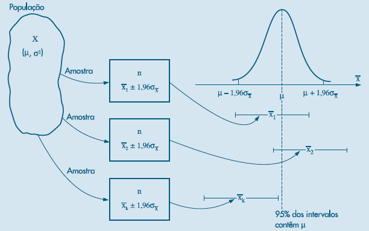

## Introdução

Até agora encontramos estatística ou estimadores que geram boas estatimativas de características da função de distribuição populacional, ou seja dos parâmetros. Dessa forma, encontramos estimadores $T$ de $\theta$ que são não viesados, eficiêntes e consistêntes.

Entretanto, nunca temos certeza que a estatística é igual ao parâmetro populacional, se precisamos de um valor esse é o que devemos escolher. Este é um valor sacado da distribuição do estimador. Nos exemplos anteriores observamos que ao mudar a amostra mudamos o valor da estimativa. Cada novo processo de amostragem, irá gerar um novo valor para nossa estimativa.

Dada essa incerteza de sabermos se nossa estimativa está próxima do verdadeiro parâmetro populacional, gostariamos de poder dizer que "temos uma grande confiança de que o parâmetro populacional está dentro de certo intervalo". Precisamos definir mais precisamente o que é uma grande confiança e definir a construição do intervalo.

## Intervalo de confiança: Procedimento Geral

De forma geral podemos definir um intervalo em termos de variabilidade ao redor da estimativa. Logo podemos utilizar o desvio padrão do nosso estimador para fazer isso. Assim o procedimento geral será:

$$IC(\theta)=(t-c.\sigma_T; t+c.\sigma_T)$$ Aqui temos nossa estimativa $t$ e somamos e subtraímos $c.\sigma_T$, sendo $c$ um número real podendo ser 2 ou 3, entre outros. A intuição desse princípio é similar ao que estudamos com relação a distribuição normal, que a quantidade de informação que está entre 1 desvio padrão abaixo e acima é de 68,26%, entre 2 desvios 95,44% e entre 3 desvios 99,73%.

Uma definição geral pode ser assim feita:

::: {.callout-note  icon="false" title="DEFINIÇÃO"}

Intervalo de Confiança:

Seja a amostra aleatória de tamanho $n$ e $X_1,...,X_n$ as $n$ medições da variável aleatóri $X$ e $x_1,..., x_n$ os valores observados. Sendo $\theta$ o parâmetro de interesse e $\gamma$ um número entre 0 e 1. Se existirem duas estatística amostrais $L_n=g(X_1,...,X_n)$ e $U_n=h(X_1,...,X_n)$, tal que:

$$P(L_n<\theta<U_n)=\gamma$$

Então, 

$$l_n=g(x_1,...,_n),u_n=h(x_1,...,x_n)$$
é chamado de intervalo de confiança para $\theta$ com $\gamma$\% de nível de confiança. 

:::

Podemos definir $l_n$ e $u_n$ de forma similar ao que fizemos no início da seção em termos de desvio padrão. Vamos ver o caso da média quando temos variância conhecida e desconhecida.

### Para dados com Distribuição Normal: a média

Partimos aqui da distribuição de $\bar{X}$ que como já vimos possui uma distribuição normal, $N(\mu,\sigma_{\bar{X}}^2)$ ou $N(\mu,\frac{\sigma^2}{n})$. Assumindo aqui que conhecemos $\sigma^2$ e que encontramos com facilidade os valores críticos da distribuição normal padrão, $z_c$. Temos que:

$$Z_{\bar{X}}=\frac{\bar{X}-\mu}{\sigma_{\bar{X}}}$$ tem distribuição normal padrão $N(0,1)$. Dessa forma podemos definir:

$$P(-z_c<Z_{\bar{X}}<z_c)=\gamma$$ ou $$P(|Z_{\bar{X}}|<z_c)=\gamma$$. Se $\gamma$ for, por exemplo, 95% teremos a seguinte situação apresentada na figura 1,

$P(|Z_{\bar{X}}|<1.96)=0.95$:

```{r}
#| echo = TRUE,
#| fig.cap = "Intervalo de confiança para Normal com nível de confiança de 0.95",
#| fig.height = 3.5,
#| fig.width = 7
x<-seq(-3,3,0.1) 
fdnorm<-dnorm(x = x, mean = 0, sd=1)   
fdanorm<-pnorm(q = x, mean = 0, sd=1)
regiao=seq(-3,-1.96,0.01)
cord.x <- c(-3,regiao,-1.96)
cord.y <- c(0,dnorm(regiao),0) 
regiao=seq(1.96,3,0.01)
cord.z <- c(1.96,regiao,3)
cord.w <- c(0,dnorm(regiao),0) 

curve(dnorm(x,0,1),xlim=c(-3,3),main='f.d.p',xlab="z",type="l",
      col="darkblue",lwd=2, ylab="f(z)",cex.axis=0.65, cex.lab=0.8 ) 
polygon(cord.x,cord.y,col='wheat4')
polygon(cord.z,cord.w,col='wheat4')
text(0, 0.2, expression(paste(gamma , "=" ,95, "%")))
text(2.5, 0.1, expression(paste("(1-", gamma , ")/2" , "=",
                                alpha, "/2", "=2.5", "%")))
text(-2.5, 0.1, expression(paste("(1-", gamma , ")/2" , "=",
                                 alpha, "/2", "=2.5", "%")))
```

Assim, temos no exemplo $\gamma=0.95$ e $\alpha=1-\gamma$. Como visto, data a simetria da distribuição dividimos $\alpha$ igualmente entre as duas caldas da distribuição, ou seja, $\frac{\alpha}{2}=0.025$. De uma maneira genérica podemos proceder da seguinte maneira:

$$\begin{array}{clc}
P(|Z_{\bar{X}}|<z_c)=\gamma
\\
\\
P(|\frac{\bar{X}-\mu}{\sigma_{\bar{X}}}|<z_c)=\gamma
\\
\\
P(|\bar{X}-\mu|<z_c\sigma_{\bar{X}})=\gamma
\\
\\
P(-z_c\sigma_{\bar{X}}<\bar{X}-\mu<z_c\sigma_{\bar{X}})=\gamma
\\
\\
P(\bar{X}-z_c\sigma_{\bar{X}} <\mu< \bar{X}+ z_c\sigma_{\bar{X}})=\gamma
\end{array}$$

Assim, a probabilidade da esperança populacional $\mu$ estar entre o intervalo $\bar{X} \pm z_c\sigma_{\bar{X}}$ é igual $\gamma$.

Sabendo que $\sigma_{\bar{X}}=\frac{\sigma}{\sqrt{n}}$, que dividiremos o nível de confiança nas duas caldas da distribuição, $z_{\frac{\alpha}{2}}$ podemos definir $L_n$ e $U_n$ para os diversos níveis de confiança como:

$$L_n=\bar{X}-z_{\frac{\alpha}{2}}\frac{\sigma}{\sqrt{n}} \quad \text{e} \quad U_n=\bar{X}+z_{\frac{\alpha}{2}}\frac{\sigma}{\sqrt{n}}$$

Dessa forma, pode-se achar a estimativa do intervalo de confiança para o parâmetro $\mu$ com nível de confiança de $\gamma$, ou $1-\alpha$, da seguinte maneira:

$$IC(\mu;\gamma)=\bigg( \bar{x}-z_{\frac{\alpha}{2}}\frac{\sigma}{\sqrt{n}};\bar{x}+z_{\frac{\alpha}{2}}\frac{\sigma}{\sqrt{n}}\bigg)$$ Para o exemplo com $\gamma=95$% e portanto, $\alpha=0.05$, tem-se que $z_{0.025}=1.96$ e o seguinte intervalo para 95% de confiança:

$$IC(\mu;0.95)=\bigg( \bar{x}-1.96\frac{\sigma}{\sqrt{n}};\bar{x}+1.96\frac{\sigma}{\sqrt{n}}\bigg)$$

A interpretação do intervalo de confiança é que se fizessemos 100 intervalos de confiança, 95% deles conteriam o verdadeiro parâmetro populacional. Ou seja, a propabilidade da esperança populacional estar no intervalo descrito acima é de 0.95 A figura abaixo retirada de Bussab e Morettin, representa o que estamos fazendo:

{#fig-particula fig-align="center" width="60%"}

Para construir a estimativa do intervalo utilizamos a estatística calculada e abrimos um intervalo a direita, que chamamos de $U_n=\bar{x}-z_{\frac{\alpha}{2}}\frac{\sigma}{\sqrt{n}}$ e outro a esquerda que chamamos $L_n=\bar{x}+z_{\frac{\alpha}{2}}\frac{\sigma}{\sqrt{n}}$. No exemplo, perceba que utilizamos praticamente dois desvios da média para cima e para baixo do valor calculado ($\alpha=0.05$). Com isso esperamos que a maior parte dos dados estejam dentro desse intervalo, e principalmente que a confiança nos indique quantos intervalos conterão o verdadeiro parâmetro populacional, o qual está no centro da distribuição da média.

Para solidificar essa ideia, simulamos abaixo a distribuição da estatística $f(\bar{X})$, que veio de um processo de amostragem aleatória de $X$, ou seja, $X_1,...,X_n$. Considerando Leis dos Grandes Números e Teorema do Limite Central sabemos que $\bar{X}\sim N(\mu,\frac{\sigma^2}{n})$ Especificamente sabemos aqui que $\bar{X}\sim N(50.000,1.000^2)$.

Foram feitas 50 repetições do processo de amostragem (foi retirado 50 valores de forma aleatória da distribuição da média) e calculado para cada um o intervalo de confiança, conforme visto acima, $U_n$ e $L_n$.A parte superior da figura apresenta a distribuição da média $f(\bar{X})$ e a parte inferior mostra os 50 intervalos de confiança. Vejamos a simulação abaixo feita no R e baseadas em Grosse, P.[^12].

[^12]: https://rpubs.com/pgrosse/545955

```{r}
#| echo = TRUE,
#| fig.cap = "50 Intervalos de confiança de 0.95",
#| fig.height = 8,
#| fig.width = 7
#Simulando um conjunto de 50 médias que vem de uma normal com 
#Esperança igual a 50.000. Logo distribuição da média será
# Assumimos 1000 como o desvio padrão da média
library(dplyr)
library(magrittr)
library(ggplot2)
library(ggpubr)
meanset <- rnorm(50,50000,1000)
meanset <- as.data.frame(meanset)
colnames(meanset) <- "Mean"

##Calculando as bandas superiorees e inferiores L e U - 
#zc*DP(média) = 1960

meanset95 <- meanset %>% mutate(u = Mean + 1960) %>% mutate(l = Mean - 1960)

Sample <- seq(1,50,1)
Sample <- as.data.frame(Sample)
ci95 <- cbind(Sample, meanset95)

# Determinando se um intervalo captura o verdadeiro valor
ci95 <- ci95 %>% mutate(Capture = ifelse(l < 50000,
                                         ifelse(u > 50000, 1, 0), 0))
ci95$Capture <- factor(ci95$Capture, levels = c(0,1))

# Gerando o Gráfico dos diversos Intervalos

# Distribuição da média
colorset = c('0'='red','1'='black')

ci_plot_95 <- ci95 %>% ggplot(aes(x = Sample, y = Mean)) + 
  geom_point(aes(color = Capture)) + 
  geom_errorbar(aes(ymin = l, ymax = u, color = Capture)) +
  scale_color_manual(values = colorset) + coord_flip() + 
  geom_hline(yintercept = 50000, linetype = "dashed", color = "blue")+
  geom_hline(yintercept = 51960, linetype = "dashed", color = "blue")+
  geom_hline(yintercept = 48040, linetype = "dashed", color = "blue")+ 
  labs(title = ) + theme(plot.title =
  element_text(hjust = 0.5)) + ylim(45000,55000)+ 
  theme(legend.position="bottom")+ labs(y = "Média", x= "Amostra") 

dist_med <- ggplot(data = data.frame(x = c(45000, 55000)), aes(x)) +
  stat_function(fun = dnorm, n = 101, args = list(mean = 50000, sd = 1000)) +
  ylab("") + scale_y_continuous(breaks = NULL)+
  geom_vline(xintercept = 51960, linetype = "dashed", color = "blue")+
  geom_vline(xintercept = 48040, linetype = "dashed", color = "blue")+
   labs(y = expression(paste("f(", "x"[média], ")")), x=element_blank())


ggarrange(dist_med, ci_plot_95, heights = c(2, 5),
          ncol = 1, nrow = 2, align = "v")
```


As linhas em azul representam o intervalo do nível de confiança, ou seja, $\gamma=0.95$ para a distribuição da média. As barras em preto são intervalos que contêm a verdadeira média e os intervalos em vermelho são aqueles que não contêm a verdadeira média. Perceba que em poucos casos isso ocorre, apenas para os casos onde a estimativa pontual da média sai fora da linha azul. Isso acontece em apenas 5% das vezes, afinal garantimos isso quanto escolhemos o $z_c$ para o nível de confiança desejado.

Dessa forma, observe que para níveis de confiança menores, a linha azul estará mais próximo a média e portanto mais valores de intervalos não conterão o parâmetro populacional, pois agora utilizamos um $z_c$ mais próximo da média, o qual produzirá intervalos de amplitudes menores. Com isso, encontraremos mais intervalos que não contêm o parâmetro populacional. Vejamos o gráfico abaixo:

```{r}
#| echo = FALSE,
#| fig.cap = "Comparando Intervalos de confiança de 0.90 e 0.95",
#| fig.height = 8,
#| fig.width = 7
#Simulando um conjunto de 50 médias que vem de uma normal com 
#Esperança igual a 50.000. Logo distribuição da média será
# Assumimos 1000 como o desvio padrão da média
library(dplyr)
library(magrittr)
library(ggplot2)
library(ggpubr)
meanset <- rnorm(50,50000,1000)
meanset <- as.data.frame(meanset)
colnames(meanset) <- "Mean"

##Calculando as bandas superiorees e inferiores L e U - 
#zc*DP(média) = 1960

meanset95 <- meanset %>% mutate(u = Mean + 1960) %>% mutate(l = Mean - 1960)
meanset90 <- meanset %>% mutate(u = Mean + 1650) %>% mutate(l = Mean - 1650)


Sample <- seq(1,50,1)
Sample <- as.data.frame(Sample)
ci95 <- cbind(Sample, meanset95)
ci90 <- cbind(Sample, meanset90)


# Determinando se um intervalo captura o verdadeiro valor
ci95 <- ci95 %>% mutate(Capture = ifelse(l < 50000, ifelse(u > 50000, 1, 0), 0))
ci95$Capture <- factor(ci95$Capture, levels = c(0,1))

ci90 <- ci90 %>% mutate(Capture = ifelse(l < 50000, ifelse(u > 50000, 1, 0), 0))
ci90$Capture <- factor(ci90$Capture, levels = c(0,1))


# Gerando o Gráfico dos diversos Intervalos

# Distribuição da média
colorset = c('0'='red','1'='black')

ci_plot_95 <- ci95 %>% ggplot(aes(x = Sample, y = Mean)) + 
  geom_point(aes(color = Capture)) + 
  geom_errorbar(aes(ymin = l, ymax = u, color = Capture)) +
  scale_color_manual(values = colorset) + coord_flip() + 
  geom_hline(yintercept = 50000, linetype = "dashed", color = "blue")+
  geom_hline(yintercept = 51960, linetype = "dashed", color = "blue")+
  geom_hline(yintercept = 48040, linetype = "dashed", color = "blue")+ 
  labs(title = ) + theme(plot.title =
  element_text(hjust = 0.5)) + ylim(45000,55000)+ 
  theme(legend.position="right")+ labs(y = "Média - 0.95", x= "Amostra") 

ci_plot_90 <- ci90 %>% ggplot(aes(x = Sample, y = Mean)) + 
  geom_point(aes(color = Capture)) + 
  geom_errorbar(aes(ymin = l, ymax = u, color = Capture)) +
  scale_color_manual(values = colorset) + coord_flip() + 
  geom_hline(yintercept = 50000, linetype = "dashed", color = "red")+
  geom_hline(yintercept = 51650, linetype = "dashed", color = "red")+
  geom_hline(yintercept = 48350, linetype = "dashed", color = "red")+ 
  labs(title = ) + theme(plot.title =
  element_text(hjust = 0.5)) + ylim(45000,55000)+ 
  theme(legend.position="right")+ labs(y = "Média - 0.90" , x= "Amostra") 


ggarrange(ci_plot_95, ci_plot_90, heights = c(5, 5),
          ncol = 1, nrow = 2, align = "v")
```


A linha azul representa o intervalo para 0.95 de confiança e a linha vermelha o intervalo para 0.90 de confiança, esses representam a amplitude do intervalo aplicados para $\bar{X}=\mu$ pra cada nível de confiança. Essa amplitude é replicadanas demais estimativas. Observe que temos barras de amplitude menores no gráfico inferior (0.90) e isso implica que temos uma quantidade maior de intervalos que não contêm o parâmetro populacional (em vermelho). Logo, a chance de você construir um intervalo e esse não conter o verdadeiro parâmetro é maior para níveis menores de confiança.

Vejamos agora uma aplicação desse resultado.

::: {.callout-tip  icon="false" title="EXEMPLO"}

Temos uma máquina de empacotar café. Normalmente com $\mu=500$ e $\sigma^2=100$. A máquina desregulou e queremos saber qual a nova média $\mu$.

Temos uma amostra: $n=25$; $\overline{X}=485$ 

Queremos estimar $\mu$ com $\gamma=0,95$. Isso representa o seguinte intervalo de confiança:

$$\begin{array}{ccc}
IC(\mu;0,95)= 485 \pm 1,96 \sigma_{\overline{X}}
\\
\\
=485 \pm 1,96\sqrt{\frac{100}{25}}= 485 \pm 1,96*2
\\
\\
IC(\mu;0,95)=]481.08,489.96[
\end{array}$$

:::

## Quando a variância é desconhecida

Anteriomente tinhamos que:

$$Z_{\bar{X}}=\frac{\bar{X}-\mu}{\frac{\sigma}{\sqrt{n}}} \sim N(0,1)$$

Entretanto, não possuimos mais os valores de $\sigma$ e a formulação não nos ajuda mais. Uma alternativa é trocar $\sigma$ pelo seu estimador $S_n$. Assim teriamos a segiunte formulação:

$$T_{\bar{X}}=\frac{\bar{X}-\mu}{\frac{S_n}{\sqrt{n}}}$$

Essa nova estatística terá a seguinte definição:

::: {.callout-note  icon="false" title="DEFINIÇÃO"}

Para uma amostra aleatória $X_1,...,X_n$ de uma variável aleatória $X \sim N(\mu, \sigma^2)$ desconhecidos, tem-se que: 

$$T_{{\bar{X}}}=\frac{\bar{X}-\mu}{\frac{S_n}{\sqrt{n}}} \sim t(n-1)$$

tem distribuição t-student com $n-1$ graus de liberdade, $t(n-1)$, para qualquer valor de $\mu$ e $\sigma$.

:::

Dessa forma podemos definir o intervalo de confiança como:

$$P(\bar{X}-t_{n-1,\alpha/2}\frac{S_n}{\sqrt{n}} <\mu< \bar{X}+ t_{n-1,\alpha/2}\frac{S_n}{\sqrt{n}})=1-\alpha$$

Ou seja, o intervalo de confiança para a esperança populacional será:

$$IC(\mu;\gamma)=\bigg( \bar{x}-t_{n-1,\alpha/2}\frac{S_n}{\sqrt{n}};\bar{x}+t_{n-1,\alpha/2}\frac{S_n}{\sqrt{n}}\bigg)$$

Para um amostra suficientemente grande podemos aproximar a distribuição t-student por uma normal padrão e assim calculamos o intervalo de confiança com base na normal mesmo sendo utilizado o estimador da variância.


## Exercícios

### Exercício 1 (Morettin & Bussab, cap. 11, ex. 15)

**Tema:** Intervalo de confiança para média e tamanho amostral.

De 50.000 válvulas fabricadas por uma companhia, retira-se uma amostra de 400 válvulas, obtendo-se vida média de 800 horas e desvio padrão de 100 horas.

a) Qual o intervalo de confiança de 99% para a vida média da população?

b) Com que confiança poderíamos afirmar que a vida média é
$$800 \pm 0{,}98?$$

c) Que tamanho deve ter a amostra para que a estimativa
$$800 \pm 7{,}84$$
tenha 95% de confiança?

**Interpretação econômica pedida:** interprete a largura do intervalo como medida da incerteza sobre a vida útil média do produto.

::: {.callout-caution icon="false" collapse="true" title="RESPOSTA"}
Temos:
$$\bar x=800,\qquad s=100,\qquad n=400.$$

Como $n=400$ é grande, podemos tratar o erro-padrão da média como
$$\frac{\sigma}{\sqrt n}\approx \frac{s}{\sqrt n}=\frac{100}{\sqrt{400}}=\frac{100}{20}=5.$$

**a)** Queremos um intervalo de confiança de 99% para a média populacional $\mu$.

Para 99% de confiança,
$$\alpha=0{,}01\quad\Rightarrow\quad \alpha/2=0{,}005,$$
de modo que
$$z_{0{,}995}\approx 2{,}576.$$

A margem de erro é
$$E=z_{0{,}995}\cdot \frac{\sigma}{\sqrt n}=2{,}576\cdot 5=12{,}88.$$

Assim,
$$IC_{99\%}(\mu)=800\pm 12{,}88.$$

Escrevendo os extremos explicitamente,
$$800-12{,}88=787{,}12, \qquad 800+12{,}88=812{,}88.$$

Portanto,
$$\boxed{IC_{99\%}(\mu)=(787{,}12,\ 812{,}88).}$$

**b)** Agora o enunciado fixa a estimativa na forma
$$800\pm 0{,}98.$$
Isso significa que a margem de erro é
$$E=0{,}98.$$

Como o erro-padrão da média é igual a 5, o valor crítico correspondente deve satisfazer
$$z\cdot 5=0{,}98.$$
Logo,
$$z=\frac{0{,}98}{5}=0{,}196.$$

O coeficiente de confiança correspondente é a probabilidade central da normal padrão:
$$\gamma=P(-0{,}196\le Z\le 0{,}196)=2\Phi(0{,}196)-1.$$

Usando tabela da normal,
$$\Phi(0{,}196)\approx 0{,}5777.$$

Então,
$$\gamma\approx 2(0{,}5777)-1=0{,}1554.$$

Portanto, a confiança associada a esse intervalo é de aproximadamente
$$\boxed{15{,}54\%.}$$

**c)** Agora queremos descobrir qual deve ser o tamanho da amostra para que a margem de erro seja
$$E=7{,}84$$
com confiança de 95%.

Para 95% de confiança,
$$z_{0{,}975}=1{,}96.$$

Aplicando a fórmula do tamanho amostral:
$$n=\left(\frac{z_{\alpha/2}\sigma}{E}\right)^2 =\left(\frac{1{,}96\cdot 100}{7{,}84}\right)^2.$$

Como
$$1{,}96\cdot 100=196 \qquad\text{e}\qquad \frac{196}{7{,}84}=25,$$
temos
$$n=25^2=625.$$

Logo,
$$\boxed{n=625.}$$

**Comentário econômico:** quanto menor a margem de erro desejada, menor a incerteza sobre a vida útil média das válvulas, mas maior precisa ser a amostra; portanto, mais precisão exige maior custo de coleta e inspeção.
:::

### Exercício 2 (Morettin & Bussab)

**Tema:** Tamanho amostral para estimar uma média.

Qual deve ser o tamanho de uma amostra cujo desvio padrão populacional é 10 para que a diferença entre a média amostral e a média populacional, em valor absoluto, seja menor do que 1, com coeficiente de confiança igual a:

a) 95%;
b) 99%.

**Interpretação econômica pedida:** explique por que um maior nível de confiança exige uma amostra maior.

::: {.callout-caution icon="false" collapse="true" title="RESPOSTA"}
Agora queremos apenas o tamanho da amostra. O enunciado informa:
$$\sigma=10, \qquad E=1.$$

A fórmula é
$$n=\left(\frac{z_{\alpha/2}\sigma}{E}\right)^2.$$

**a)** Para 95% de confiança,
$$z_{0{,}975}=1{,}96.$$

Então,
$$n=\left(\frac{1{,}96\cdot 10}{1}\right)^2=(19{,}6)^2=384{,}16.$$

Como o tamanho amostral precisa ser inteiro e deve garantir a margem máxima pedida, arredondamos para cima:
$$\boxed{n=385.}$$

**b)** Para 99% de confiança,
$$z_{0{,}995}\approx 2{,}576.$$

Assim,
$$n=\left(\frac{2{,}576\cdot 10}{1}\right)^2=(25{,}76)^2\approx 663{,}58.$$

Arredondando para cima,
$$\boxed{n=664.}$$

**Comentário econômico:** aumentar o nível de confiança faz o pesquisador pedir mais "segurança estatística", e isso amplia o valor crítico $z_{\alpha/2}$; por isso, o tamanho da amostra necessário cresce.
:::

### Exercício 3 (Morettin & Bussab, cap. 11, ex. 23)

**Tema:** Intervalo para média com desvio padrão conhecido.

De experiências passadas, sabe-se que o desvio padrão da altura de crianças da 5ª série do ensino fundamental é 5 cm.

a) Colhendo uma amostra de 36 dessas crianças, observou-se média de 150 cm. Qual o intervalo de confiança de 95% para a média populacional?

b) Que tamanho deve ter uma amostra para que o intervalo
$$150 \pm 0{,}98$$
tenha 95% de confiança?

**Interpretação econômica pedida:** comente o efeito do tamanho amostral na precisão da estimativa.

::: {.callout-caution icon="false" collapse="true" title="RESPOSTA"}
Temos:
$$\sigma=5,\qquad n=36,\qquad \bar x=150.$$

**a)** Para 95% de confiança, usamos
$$IC_{95\%}(\mu)=\bar x\pm z_{0{,}975}\frac{\sigma}{\sqrt n}.$$

Como
$$z_{0{,}975}=1{,}96 \qquad\text{e}\qquad \frac{\sigma}{\sqrt n}=\frac{5}{\sqrt{36}}=\frac{5}{6},$$
a margem de erro é
$$E=1{,}96\cdot \frac{5}{6}=1{,}6333\dots$$

Logo,
$$IC_{95\%}(\mu)=150\pm 1{,}6333.$$

Portanto,
$$150-1{,}6333\approx 148{,}37, \qquad 150+1{,}6333\approx 151{,}63.$$

Assim,
$$\boxed{(148{,}37,\ 151{,}63).}$$

**b)** Agora queremos um intervalo da forma
$$150\pm 0{,}98$$
com 95% de confiança. Isso significa margem de erro
$$E=0{,}98.$$

Pela fórmula do tamanho amostral,
$$n=\left(\frac{1{,}96\cdot 5}{0{,}98}\right)^2.$$

Como
$$1{,}96\cdot 5=9{,}8 \qquad\text{e}\qquad \frac{9{,}8}{0{,}98}=10,$$
segue que
$$n=10^2=100.$$

Portanto,
$$\boxed{n=100.}$$

**Comentário econômico:** quanto maior o tamanho amostral, menor o erro-padrão da média. Em termos práticos, isso significa uma estimativa mais precisa da média populacional.
:::

### Exercício 4 (Morettin & Bussab, cap. 11, ex. 14)

**Tema:** Intervalos de confiança para a média de uma normal $N(\mu,\sigma^2)$.

Calcule o intervalo de confiança para a média em cada um dos casos abaixo:

| Média amostral | Tamanho da amostra | Desvio padrão da população | Coeficiente de confiança |
|:---:|:---:|:---:|:---:|
| 170 | 100 | 15 | 95% |
| 165 | 184 | 30 | 85% |
| 180 | 225 | 30 | 70% |

**Interpretação econômica pedida:** compare como o intervalo muda quando variam $n$, $\sigma$ e o coeficiente de confiança.

::: {.callout-caution icon="false" collapse="true" title="RESPOSTA"}
Em todos os casos, usamos a mesma fórmula:
$$IC(\mu)=\bar x\pm z_{\alpha/2}\frac{\sigma}{\sqrt n}.$$

**a) Caso 1:**
$$\bar x=170,\quad n=100,\quad \sigma=15,\quad \gamma=95\%.$$

Como
$$z_{0{,}975}=1{,}96 \qquad\text{e}\qquad \frac{\sigma}{\sqrt n}=\frac{15}{10}=1{,}5,$$
a margem de erro é
$$E=1{,}96\cdot 1{,}5=2{,}94.$$

Portanto,
$$IC(\mu)=170\pm 2{,}94,$$
isto é,
$$\boxed{(167{,}06,\ 172{,}94).}$$

**b) Caso 2:**
$$\bar x=165,\quad n=184,\quad \sigma=30,\quad \gamma=85\%.$$

Aqui,
$$\alpha=1-0{,}85=0{,}15, \qquad \alpha/2=0{,}075,$$
então o valor crítico é
$$z_{0{,}925}\approx 1{,}44.$$

O erro-padrão é
$$\frac{\sigma}{\sqrt n}=\frac{30}{\sqrt{184}}\approx 2{,}211.$$

Logo, a margem de erro é
$$E\approx 1{,}44\cdot 2{,}211\approx 3{,}18.$$

Portanto,
$$IC(\mu)=165\pm 3{,}18,$$
isto é,
$$\boxed{(161{,}82,\ 168{,}18).}$$

**c) Caso 3:**
$$\bar x=180,\quad n=225,\quad \sigma=30,\quad \gamma=70\%.$$

Agora,
$$\alpha=1-0{,}70=0{,}30, \qquad \alpha/2=0{,}15,$$
de modo que
$$z_{0{,}85}\approx 1{,}04.$$

Como
$$\frac{\sigma}{\sqrt n}=\frac{30}{15}=2,$$
temos
$$E\approx 1{,}04\cdot 2=2{,}08.$$

Assim,
$$IC(\mu)=180\pm 2{,}08,$$
ou seja,
$$\boxed{(177{,}92,\ 182{,}08).}$$

**Comentário econômico:** intervalos de confiança ficam mais estreitos quando a amostra aumenta, quando a dispersão da variável diminui ou quando o pesquisador aceita um nível de confiança menor. Em sentido contrário, mais incerteza ou mais confiança geram intervalos mais largos.
:::

### Exercício 5 (Morettin & Bussab, cap. 11, ex. 24)

**Tema:** Intervalo de confiança para média com desvio padrão conhecido e desconhecido.

Um pesquisador está estudando a resistência de um determinado material sob determinadas condições. Sabe-se inicialmente que essa variável é normalmente distribuída com desvio padrão de 2 unidades.

a) Utilizando os valores
$$4{,}9;\ 7{,}0;\ 8{,}1;\ 4{,}5;\ 5{,}6;\ 6{,}8;\ 7{,}2;\ 5{,}7;\ 6{,}2,$$
obtidos de uma amostra de tamanho 9, determine o intervalo de confiança para a resistência média com coeficiente de confiança de 95%.

b) Qual o tamanho da amostra necessário para que o erro cometido ao estimarmos a resistência média não seja superior a 0{,}01 unidade com probabilidade 0{,}90?

c) Suponha que no item (a) não fosse conhecido o desvio padrão. Como você procederia para determinar o intervalo de confiança, e que suposições faria para isso?

**Interpretação econômica pedida:** explique por que conhecer ou não o desvio padrão afeta o método do intervalo.

::: {.callout-caution icon="false" collapse="true" title="RESPOSTA"}
Os dados observados são:
$$4{,}9;\ 7{,}0;\ 8{,}1;\ 4{,}5;\ 5{,}6;\ 6{,}8;\ 7{,}2;\ 5{,}7;\ 6{,}2.$$

Somando os valores,
$$4{,}9+7{,}0+8{,}1+4{,}5+5{,}6+6{,}8+7{,}2+5{,}7+6{,}2=56{,}0.$$

Como $n=9$, a média amostral é
$$\bar x=\frac{56{,}0}{9}\approx 6{,}2222.$$

**a)** Como o desvio padrão populacional é conhecido e vale $\sigma=2$, podemos usar diretamente o intervalo normal para a média.

Para 95% de confiança,
$$z_{0{,}975}=1{,}96.$$

O erro-padrão da média é
$$\frac{\sigma}{\sqrt n}=\frac{2}{\sqrt 9}=\frac{2}{3}.$$

Então a margem de erro é
$$E=1{,}96\cdot \frac{2}{3}=1{,}3067.$$

Logo,
$$IC_{95\%}(\mu)=6{,}2222\pm 1{,}3067.$$

Portanto,
$$6{,}2222-1{,}3067=4{,}9155, \qquad 6{,}2222+1{,}3067=7{,}5289.$$

Assim,
$$\boxed{(4{,}9155,\ 7{,}5289).}$$

**b)** Agora queremos que o erro máximo seja de apenas
$$E=0{,}01$$
com probabilidade 0,90, isto é, com 90% de confiança.

Para 90% de confiança,
$$z_{0{,}95}\approx 1{,}645.$$

Aplicando a fórmula do tamanho amostral:
$$n=\left(\frac{1{,}645\cdot 2}{0{,}01}\right)^2.$$

Como
$$1{,}645\cdot 2=3{,}29 \qquad\text{e}\qquad \frac{3{,}29}{0{,}01}=329,$$
segue que
$$n=329^2=108241.$$

Portanto,
$$\boxed{n=108241.}$$

**c)** Se o desvio padrão populacional **não** fosse conhecido, a fórmula do item (a) não poderia mais usar $\sigma$ nem o valor crítico da normal padrão.

Nesse caso, substituiríamos $\sigma$ pelo desvio padrão amostral $s$ e usaríamos a distribuição $t$ de Student com $n-1$ graus de liberdade. O intervalo seria
$$\bar X\pm t_{\alpha/2,\,n-1}\frac{s}{\sqrt n}.$$

Como aqui a amostra é pequena ($n=9$), para que esse intervalo seja exato é preciso supor que a população de onde os dados vieram tenha distribuição normal. Se a amostra fosse grande, poderíamos usar resultados assintóticos como aproximação.

**Comentário econômico:** conhecer o desvio padrão populacional simplifica a inferência e costuma produzir um procedimento mais direto. Quando ele é desconhecido, a incerteza adicional sobre a dispersão precisa ser incorporada, o que muda a distribuição crítica usada no intervalo.
:::

### Exercício 6 (Morettin & Bussab, cap. 11, ex. 29)

**Tema:** Intervalo de confiança para proporção.

Antes de uma eleição em que existiam dois candidatos, A e B, foi feita uma pesquisa com 400 eleitores escolhidos ao acaso, e verificou-se que 208 deles pretendiam votar no candidato A. Construa um intervalo de confiança, com coeficiente de confiança $\gamma=0{,}95$, para a porcentagem de eleitores favoráveis ao candidato A na época da pesquisa.

**Interpretação econômica pedida:** interprete o intervalo como faixa plausível de apoio eleitoral no momento da coleta.

::: {.callout-caution icon="false" collapse="true" title="RESPOSTA"}
Temos:
$$n=400, \qquad x=208, \qquad \hat p=\frac{208}{400}=0{,}52.$$

Queremos um intervalo de confiança de 95% para a proporção populacional $p$ de eleitores favoráveis ao candidato A.

Para 95% de confiança,
$$z_{0{,}975}=1{,}96.$$

O erro-padrão estimado da proporção é
$$\sqrt{\frac{\hat p(1-\hat p)}{n}} = \sqrt{\frac{0{,}52\cdot 0{,}48}{400}} \approx 0{,}02498.$$

A margem de erro é então
$$E=1{,}96\cdot 0{,}02498\approx 0{,}04896.$$

Logo,
$$IC_{95\%}(p)=0{,}52\pm 0{,}04896.$$

Calculando os extremos,
$$0{,}52-0{,}04896\approx 0{,}4710, \qquad 0{,}52+0{,}04896\approx 0{,}5690.$$

Portanto,
$$\boxed{IC_{95\%}(p)=(0{,}4710,\ 0{,}5690).}$$

Em termos percentuais,
$$\boxed{47{,}10\%\ \text{a}\ 56{,}90\%.}$$

**Comentário econômico:** embora a amostra indique 52% de apoio ao candidato A, o intervalo mostra a faixa de valores populacionais plausíveis no momento da pesquisa. Isso ajuda a avaliar quão “apertada” ou “folgada” está a disputa.
:::

### Exercício 7 (Morettin & Bussab, cap. 11, ex. 18)

**Tema:** Intervalo de confiança para proporção em amostra grande.

Uma amostra aleatória de 625 empresas de limpeza revela que 70% delas preferem a marca A de detergente. Construa um intervalo de confiança para
$$p=\text{proporção das empresas que preferem A}$$
com confiança de $\gamma=0{,}95$.

**Interpretação econômica pedida:** explique o que o intervalo informa sobre a participação potencial da marca A nesse mercado.

::: {.callout-caution icon="false" collapse="true" title="RESPOSTA"}
Agora,
$$n=625, \qquad \hat p=0{,}70.$$

Queremos um intervalo de confiança de 95% para a proporção populacional de empresas que preferem a marca A.

Para 95% de confiança,
$$z_{0{,}975}=1{,}96.$$

O erro-padrão estimado é
$$\sqrt{\frac{\hat p(1-\hat p)}{n}} = \sqrt{\frac{0{,}70\cdot 0{,}30}{625}} = \sqrt{0{,}000336} \approx 0{,}01833.$$

A margem de erro vale
$$E=1{,}96\cdot 0{,}01833\approx 0{,}03593.$$

Assim,
$$IC_{95\%}(p)=0{,}70\pm 0{,}03593.$$

Calculando os extremos,
$$0{,}70-0{,}03593\approx 0{,}6641, \qquad 0{,}70+0{,}03593\approx 0{,}7359.$$

Logo,
$$\boxed{IC_{95\%}(p)=(0{,}6641,\ 0{,}7359).}$$

Em porcentagem,
$$\boxed{66{,}41\%\ \text{a}\ 73{,}59\%.}$$

**Comentário econômico:** o intervalo mostra que, embora a estimativa pontual seja 70%, a verdadeira participação potencial da marca A no conjunto das empresas pode estar um pouco abaixo ou um pouco acima desse valor. O intervalo quantifica essa incerteza de mercado.
:::
