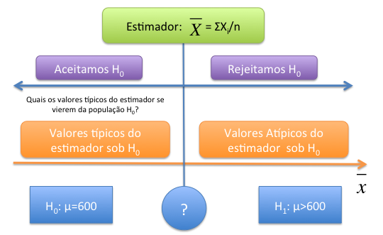

## Introdução

Até o momento estimamos características da população, fizemos a estimativa pontual e a estimativa de intervalo de um parâmetro. Neste último associamos um grau de confiabilidade de que encontrariamos o verdadeiro parâmetro dentro desse intervalo. Entretanto algumas vezes temos teorias diferentes e gostariamos de testar se uma teoria é mais plausível do que outra com base na realidade. Dessa forma, gostariamos de testar se uma \textit{hipótese} sobre a população é mais plausível, ou seja, se os dados amostrais trazem evidências que apoiam ou não essa hipótese. Por exemplo:

\begin{itemize}

\item Verificar se um determinado medicamento não tem efeito sobre a mortalidade causada por um determinado virus ou se possui efeito. 

\item Verificar se a quantidade de gordura anunciado pelo fabricante de um produto realmente está correta ou é maior. 

\item Se a afirmativa de um canditado de que possui a maioria dos votos é verdadeira ou é menor. 

\item Verificar se as rendas entre duas comunidades são as mesmas para podermos lançar uma política de apoio.

\item Verifcar se uma política do aumento do recurso as empresas não afeta falência ou se tem efeito.

\end{itemize}

Aqui faremos algo muito parecido com os tribunais, assumimos que a pessoa ou empresa é "inocente". Que o medicamento não tem efeito, que o teor de gordura está certo, que o candidato tem maioria, que as comunidades possuem a mesma renda e que o recurso não afeta o número de falências. Partimos da premissa de que a hipótese inicial é a correta e tentamos verificar com os fatos (dados amostrais) se essa hipótese colocada é verossímil.

## Construindo a Hipótese Nula

Imaginemos o seguinte caso. Uma ONG que combate fome e pobreza afirma que uma determinada comunidade deveria receber um programa do governo pois possui renda per capita de R\$600,00, a qual a torna elegível ao programa. Entretanto, os gestores do programa acham que esse valor está subestimado e que na verdade a renda seria maior. A questão é como saber quem está correto, a ONG ou o Governo?

Dessa forma temos duas hipóteses distintas a que diz que a esperança da renda pc é de R\$600 e a outra proposição que diz que a renda dessa população é maior que R\$600. Vamos assumir que a ONG tem razão, que acreditamos na sua palavra até que se prove o contrário, e chamaremos essa afirmativa de \textit{hipótese nula} ou $H_0$. Ela afirma que a esperança da renda pc, $\mu$ é de R\$600. Podemos de forma condensada dizer:

$$H_0: \qquad \mu=600$$

Já o governo que está contextando chamaremos sua hipótese de alternativa, $H_1$. Ou seja, a teoria concorrente do governo é de que a renda é maior. Dessa forma: 

$$H_1: \qquad \mu>600$$

Nosso problema então é decidir quem tem razão nessa história, ou seja, devemos aceitar ou rejeitar a hipótese nula $H_0$ - de que a esperança da renda pc é de 600 - em detrimento a hipótese alternativa $H_1$ que afirma que a renda é maior do que 600. Juntas:

$$H_0: \qquad \mu=600$$ 

$$H_1: \qquad \mu>600$$

### O Teste Estatístico

Colocada as duas teorias concorrentes, temos que decidir como testar qual dessas duas hipóteses é mais plausível. Para isso devemos nos valer de um processo de amostragem, onde faremos $n$ medições da renda pc (que chamaremos de X), $X_1, X_2, ..., X_n$, e obteremos os valores de renda pc $x_1, x_2,...x_n$. Com base na amostra devemos ter algum tipo de cálculo que nos permite inferir se rejeitamos ou não $H_0$, se é plausível ou não a hipótese colocada. Isso é o que chamamos de teste estatístico:

::: {.callout-note  icon="false" title="DEFINIÇÃO"}

**Teste Estatístico:**

Suponha um processo de amostragem com $n$ medições de $X$, $X_1, X_2, ...,X_n$, com valores observados $x_1, x_2, ...,x_n$. Um teste estatístico é uma estatística:
 $$T = h(X_1,X_2, . . .,X_n)$$
a qual será utilizada para decidir se aceitamos ou rejeitamos $H_0$
:::

Decidindo qual o $T$ utilizar - a função $h$ que será aplicado aos valores da amostra - devemos compreender qual é a distribuição dessa estatística sob a condição de que a hipótese $H_0$ for a verdadeira. Queremos aqui saber se a amostra tivesse sido extraída de uma população com esperança da renda pc, $\mathbb{E(X)}$, de R\$ 600, quais seriam os valores típicos para a distribuição do estimador T? Dessa forma, podemos comparar esses valores típicos com o que obtivemos no processo de amostragem.

Vejamos no nosso exemplo, gostariamos de verificar a hipótese de que a esperança da renda pc, $\mu$ é de R\$600. Como já vimos uma boa alternativa de teste estatístico poderia ser a média, $\bar{X}$. Assim o teste estatístico seria: $$\bar{X} = \frac{\sum_i^n(X_i)}{n}$$ Com base na amostra observada $x_1, x_2, ..., x_3$ poderiamos obter a estimativa da renda pc, ou seja, $\bar{x}$. Como saber se essa média calculada nos traz mais evidência a favor de $H_0$ ou $H_1$? Veja a Figura abaixo para pensarmos no problema.

A figura considera o estimador $\bar{X}$. A esquerda temos os valores do estimador que atestam que a hipótese $H_0$ é a mais plausível, quando mais próxima a estimativa de R\$600 maior evidência que $H_0$ é verdadeira. Ao caminhar para a direita, os valores do estimador se distanciam de 600, e mais evidência de que $H_0$ não é plausível.

Dessa forma, precisamos de um ponto no qual (interrogação na figura) onde valores menores do estimador são favoráveis a hipótese nula e valores maiores são mais favoráveis a hipótese alternativa. Por exemplo, se no nosso processo de amostragem obtivemos a estimativa de $\bar{x}=700$, isso é mais favorável a $H_0$ ou $H_1$?


{#fig-particula fig-align="center" width="70%"}

Para saber se esse valor é mais favorável a qual hipótese, precisamos descobrir quais seriam os valores típicos do estimador $\bar{X}$ se o processo de amostragem fosse feito em uma população onde $H_0$ é verdadeira. Isso está presente a esquerda da figura, quais os valores típicos para $\bar{X}$ que veio de uma população com $\mu=600$?

Para saber qual seriam os valores típicos do estimador $\bar{X}$ sob $H_0$ imagine que a população $X$ seja $N(600,100^2)$, ou seja, tem esperança 600 e desvio padrão populacional de 100. Essa é a afirmação da ONG, ou seja, nosso $H_0$.

Já sabemos que um processo de amostragem cada uma das $n$ medições $X_1, X_2, ...,X_n$ possuem a mesma distribuição de $X$. E também sabemos que o estimador $\bar{X}$ terá uma distribuição $N(600,\frac{100^2}{n})$. Supondo que retiramos uma amostra de 25 pessoas, logo os valores típicos do estimador sob $H_0$ são $N(600,\frac{100^2}{25})$. Vejamos abaixo a simulação do estimador $\bar{X}$, os valores típicos para esse caso, e onde se encontra o valor de 700.

```{r}
#| echo = TRUE,
#| fig.cap = "Valores típicos da distribuiçao da média sob H0",
#| fig.height = 3.5,
#| fig.width = 7
x<-seq(500,700,0.1) 
fdnorm<-dnorm(x = x, mean = 600, sd=20)   
regiao=seq(560,640,0.01)
cord.x <- c(min(regiao),regiao,max(regiao))
cord.y <- c(0,dnorm(regiao,mean=600, sd=20),0) 
curve(dnorm(x,600,20),xlim=c(500,700),xlab=expression(bar(x)),type="l",
      col="steelblue4",lwd=2, ylab=expression(paste("f(", bar(x),
      ")")),xaxt="n",cex.axis=0.65, cex.lab=0.8 ) 
axis(1,at=c(500,540,560,580, 600, 620, 640,660, 700),labels =
       c(500,540,560,580, 600, 620, 640,660, 700),cex.axis=0.7,
     cex.lab=0.8) 
polygon(cord.x,cord.y,col='lightgray')
abline(v=600, col="steelblue4", lty=2, lwd=2)
text(602, 0.001, expression(mu))

```

Observe a simulação da distribuição do teste estatístico, $\bar{X}$ a qual foi extraída de uma população que possui as características $H_0$. No centro temos a $E(\bar{X})=\mu=600$. Observamos que para o tamanho amostral que retiramos e sob $H_0$ os valores típicos oscilam mais ou menos entre 560 e 640 - dois desvios padrão para cima e para baixo (lembrem-se que nesse intervalo temos mais de 95% das observaçoes).

Quanto retiramos a amostra e calculamos o valor da média obtivemos $\bar{x}=700$. Observe no gráfico acima onde está o valor de 700, muita a frente e notamos claramente que a probabilidade de obtermos esse valor de média com uma amostra retirada da população $N(600,100^2)$, é praticamente 0.

Portanto, existem evidências de que essa amostra não veio de uma população conforme descrita pela ONG e sim de uma população com esperança maior do que R\$600. Portanto, dizemos que rejeitamos $H_0$

### Probabilidade da cauda e o p-valor

Uma outra maneira que podemos olhar o valor de 700 é por meio da probabilidade da cauda acima dele. Vamos considerar a figura acima que mostra a distribuição da média retirada de uma população sob $H_0$, ou seja, $N(600,100^2)$. Podemos estimar qual seria a probabilidade de acharmos valores iguais ou maiores do que 700 nessa distribuição. Essa é chamada probabilidade de cauda a direita $P(\bar{X}\geq 700|H_0)$ e mais conhecida como \textit{p-valor}. Podemos computar esse valor para a cauda inferior, para a superior ou para ambas, a depender da hipótese feita.
Esse valor nos mostra que quando mais a direita estiver o nosso valor calculado, menor será essa probabilidade e maior serão as evidências contra $H_0$. Para o nosso exemplo anterior temos:

$$P(\bar{X}\geq 700|H_0 \Rightarrow \bar{X} \sim N(600,\frac{100^2}{25}))$$

$$P(Z_{\bar{X}}\geq \frac{700-600}{100/5}|H_0)$$ $$P(Z_{\bar{X}} \geq  \frac{100}{20})=P(Z_{\bar{X}} \geq 5)=0$$

Notamos que esse valor de $z_c$ é muito alto e nem aparece na tabela da normal padrão. Mostrando que essa probabilidade é de zero. Ou seja, o p-valor nesse caso é igual a 0, mostrando uma forte evidência de que a ONG está enganada com relação a sua medida da renda dessa população.

Esse foi um exemplo extremo para compreender a intuição do processo. Entretanto, precisamos decidir a partir de que ponto exatamente dizemos que pertence a população sob $H_0$ e a partir de que ponto não pertence. Para isso precisamos entender os erros que podemos cometer ao fazer esse julgamento.

### Erro Tipo I (EI) e Erro Tipo II (EII)

Aqui precisamos distinguir duas ideias, a primeiro é a existência da verdadeira população e a segunda é o que achamos ser a verdadeira população com base na análise que fizemos. Aqui surge o que chamamos de erro estatístico. Não temos como fugir dele, somente controlá-lo. Vejamos a tabela abaixo que resume as possibilidades:

\begin{table}[!htbp]
\centering
\caption{\label{tab:erro}Tipos de Erros em Estatística, EI e EII.}
\begin{tabular}{l|cc}
\hline 
A Decisão             & \multicolumn{2}{c}{Estatística }\\
                     & $H_0$ é verdadeiro & $H_1$ é verdadeiro \\
\hline
 Rejeitar $H_0$      &  Erro Tipo I (EI)  & Correto            \\
 Não Rejeitar $H_0$  & Correto            & Erro Tipo II (EII) \\ 
\hline
\end{tabular}
\end{table}

Observe que a nossa decisão pode incorrer em dois erros diversos. O Erro Tipo I (EI) o qual informa que erramos ao rejeitar que a população veio de $H_0$ e na realidade tinha vindo, e o segundo tipo (EII) que nos diz que aceitamos $H_0$ quando na verdade não veio de $H_0$. O primeiro erro é o chamado na literatura médica de falso negativo, ou seja, classifica a pessoa não portadora da doença (negativa) e na verdade ela possui. O segundo tipo é o falso positivo, onde classifica-se a pessoa com a doença quando na realidade ela não possui. Assim tem-se a seguinte definição:

::: {.callout-note  icon="false" title="DEFINIÇÃO"}

**Erro Tipo I e Erro Tipo II**

Erro Tipo I (EI) ocorre quando "indevidamente" rejeitamemos $H_0$. Nesse caso $H_0$ era verdadeira e rejeitamos.

Erro Tipo II (EII) ocorre quando "indevidamente" não rejeitamos $H_0$. Nesse caso não rejeitamos $H_0$ e na verdade $H_1$ é verdadeira.  
:::

Nosso desafio agora é estabelecer um critério de decisão, o ponto a partir do qual dizemos que $H_0$ não parece mais provável,ou seja, rejeitamos $H_0$. Essa chamaremos de região crítica ou de rejeição, que são os valores a partir dos quais entendemos que $H_0$ não é mais plausível. Conforme a Figura 1 - a interrogação. Vejamos o nosso problema em termos de erros:

\begin{itemize}

\item EI $(\alpha)$- Dizer que a renda é maior que 600, quando na realizadade ela é de 600.

\item EII $(\beta)$- Dizer que a renda é de 600 quando na realidade ela é maior do que 600. 
\end{itemize}

Nota-se que conseguimos calcular o Erro Tipo I $(\alpha)$ com base na distribuição sob $H_0$, entretanto, como não sabemos qual é a distribuição sob $H_1$, fica difícil calcular o EII $(\beta)$. Veremos isso com mais detalhe a frente.

Vamos retomar o nosso exemplo onde a ONG afirma que uma comunidade tem renda de R\$600 e portanto deveria estar inclusa no programa de governo. O governo contexta. Foi retirada uma amostra de $n=25$ e a distribuição de $\bar{X}$ sob $H_0$ será $N(600,\frac{100^2}{25})$ e a hipótese a ser testada será:

$$H_0: \qquad \mu=600$$ $$H_1: \qquad \mu>600$$

Uma maneira de acharmos o valor a partir do qual teremos a região crítica ou de rejeição, seria controlar o Erro Tipo I $(\alpha)$. Podemos dizer que gostariamos de cometer o Erro Tipo I em apenas 5% dos casos. Ou seja, a chance de retirarmos um amostra e o valor da estimativa ser maior que o valor de decisão é de 5% dos casos, os outros 95% sempre cairão na área de aceitação. Vejamos como podemos encontrar o critério de decisão para o nosso caso, unicaudal.

$$P(Z_{\bar{X}} \geq z_c|H_0)=0.05= \alpha$$ 

Olhando a tabela temos:

$$P(Z_{\bar{X}} \geq 1.65|H_0)=0.05= \alpha$$

$$z_c =\frac{\bar{X}+600}{100/5}$$
$$1.65 = \frac{\bar{X}+600}{20}$$

$$\bar{X}=600+1.65*20=633$$

Portanto,

$$P(\bar{X}\geq 633|H_0)=0.05= \alpha$$ Logo, temos agora uma regra de decisão que tenta controlar o Erro Tipo I. A nossa regra de decisão agora é rejeitar $H_0$ toda vez que o valor calculado da estimativa de $\bar{X}$ for maior do que 633 e aceitar quando for menor. Assim nossa região crítica será:

$$RC =\{\bar{x} \in \mathbb{R} | \bar{x} \geq 633\}$$

Isso implica que a probabilidade de rejeitarmos $H_0$ (de que a renda média não é de 600), e na verdade ela ser de 600 é de 5%. Vejamos o gráfico:

```{r}
#| echo = TRUE,
#| fig.cap = "Erro Tipo I e a Região Crítica",
#| fig.height = 3.5,
#| fig.width = 7
x<-seq(500,700,0.1) 
fdnorm<-dnorm(x = x, mean = 600, sd=20)  
fdnorm1<-dnorm(x = x, mean = 660, sd=20)
regiao=seq(633,700,0.01)
cord.x <- c(min(regiao),regiao,max(regiao))
cord.y <- c(0,dnorm(regiao,mean=600, sd=20),0) 
curve(dnorm(x,600,20),xlim=c(500,700),xlab=expression(bar(x)),type="l",
      col="steelblue4",lwd=2, ylab=expression(paste("f(", bar(x),
      ")")),xaxt="n",cex.axis=0.65, cex.lab=0.8 ) 
axis(1,at=c(500,540,560,580, 600, 620, 633,660, 700),labels =
       c(500,540,560,580, 600, 620, 633,660, 700),cex.axis=0.7, cex.lab=0.8) 
polygon(cord.x,cord.y,col='wheat4')
abline(v=633, col="steelblue4", lty=2, lwd=2)
text(600, 0.001, expression(mu))
text(660, 0.005, expression(paste("EI=", alpha, "=0.05")))

```

Vemos em cinza a região crítica descrita acima. Logo todos os valores calculados de $\bar{X}$ que cairem acima de 633, dizemos que rejeitamos $H_0$. Entretanto percebam que poderiam fazer parte desta distribuição, apesar da chance ser pequena, 5%.

Como não sabemos a distribuição sob $H_1$ não conseguimos calcular a probabilidade de não rejeitar $H_0$ e na verdade ela pertencer a distribuição de $H_1$.

Vamos supor que o governo diga que na verdade a renda é de R\$ 660 com a mesma variância que a ONG afirmou. Nesse caso temos as duas teorias concorrentes explicitadas. Agora sabemos $H_1$ e $H_0$. Dada a nossa regra de decisão, temos:

$$P(EI)=P (\overline{X} \in RC |  H_0 \quad \text {é verdadeira}\Rightarrow \overline{X} \sim N (600;100^{2}/25))=\alpha=0.05$$

Podemos calcular também o Erro Tipo II:

$$\begin{array}{ccc}
P(E II)=P(\overline{X} \notin R C |H_1 \quad \text { verdadeiro })=\beta
\\
\\
=P(\overline{X} < 633 )| \overline{X} \sim N (660;100^{2}/25)).
\\
\\
=P (z < \frac{633-660}{20})
\\
\\
=P(z<-1,35)=8.85\%=\beta
\end{array}$$

Esses dois tipos de erros estão no gráfico abaixo.

```{r}
#| echo = TRUE,
#| fig.cap = "Erro Tipo I e a Região Crítica",
#| fig.height = 3.5,
#| fig.width = 7
x<-seq(500,700,0.1) 
fdnorm<-dnorm(x = x, mean = 600, sd=20)  
fdnorm1<-dnorm(x = x, mean = 660, sd=20)
regiao=seq(633,700,0.01)
cord.x <- c(min(regiao),regiao,max(regiao))
cord.y <- c(0,dnorm(regiao,mean=600, sd=20),0) 
curve(dnorm(x,600,20),xlim=c(500,700),xlab=expression(bar(x)),type="l",
      col="steelblue4",lwd=2, ylab=expression(paste("f(", bar(x),
      ")")),xaxt="n",cex.axis=0.65, cex.lab=0.8 ) 
axis(1,at=c(500,540,560,580, 600, 620, 633,660, 700),labels =
       c(500,540,560,580, 600, 620, 633,660, 700),cex.axis=0.7, cex.lab=0.8) 
polygon(cord.x,cord.y,col='wheat4')
abline(v=633, col="steelblue4", lty=2, lwd=2)
text(600, 0.001, expression(mu))
text(660, 0.005, expression(paste("EI=", alpha, "=0.05")))
par(new=TRUE)
curve(dnorm(x,660,20),xlim=c(500,700),xlab=expression(bar(x)),type="l",
      col="steelblue4",lwd=2, ylab=expression(paste("f(", bar(x),
      ")")),xaxt="n",cex.axis=0.65, cex.lab=0.8 ) 
regiao=seq(500,633,0.01)
cord.x <- c(min(regiao),regiao,max(regiao))
cord.y <- c(0,dnorm(regiao,mean=660, sd=20),0)
polygon(cord.x,cord.y,col='steelblue4')
text(600, 0.005, expression(paste("EII=", beta, "=0.088")))

```

Importante notar que se mudamos o ponto de corte de 633 para 640, por exemplo, o valor do EI diminui e o valor do EII aumenta. Se mudarmos o ponto de corte de 633 para 620 aumentamos o EI e diminuimos o erro EII.

Importante notar que em geral não conhecemos qual a distribuição está sob $H_1$, lembre-se que o que tinhamos era apenas uma afirmativa que era maior, ou seja, que era diferente de 600. Isso é a prática mais comum e controlamos então o EI o qual conseguimos calcular e a partir desse controle encontramos os valores da nossa região crítica e montamos nosso teste de hipótese.

## Procedimento Geral do Teste de Hipótese

### Teste para um parâmetro populacional

Temos interesse em uma caracteristica da população. Como vimos por exemplo, na renda pc de uma população $X$, ou mais especificamente na sua esperança $E(X)=\mu$. Contruímos o teste sobre o parâmetro, podendo ser unicaudal ou bicaudal.


**Hipótese Unicaudal**


Ocorre quando temos algum conhecimento do processo. Como no caso anterior, observamos que a ONG tinha dito que a renda era 600 e o governo contextava e dizia que era maior. Logo temos a seguinte formulação geral para o teste unilateral:

$$H_0: \qquad \theta=\theta_0$$ $$H_1: \qquad \theta>\theta_0 \quad ou \quad \theta<\theta_0$$ 

**Hipótese Bicaudal**


Já para o teste bilateral ou bicaudal podemos observar valores maiores ou menores em relação a hipótese nula. Assim não temos nenhum conhecimento que nos permita dizer que podemos ter valores somente maiores ou somente menores. Temos a seguinte formulação geral: $$H_0: \qquad \theta=\theta_0$$ $$H_1: \qquad \theta \neq \theta_0$$

### Nível de significância

Retomando o nosso exemplo, ao rejeitarmos $H_0$ podemos cometer o erro de dizer que a renda pc é maior de 600, o que implicaria em não recebimento do benefício, mas na realidade a renda era efetivamente 600 e as pessoas mereciam ter recebido. Tentamos controlar esse tipo de erro que é o nosso Erro Tipo I (EI). Temos que definir qual seria o tamanho desse erro, 10%, 5%, 1% etc. Esse percentual é o que chamamos de nível de significância. Quem define esse tamanho é o pesquisador e em geral, em economia, utilizamos os níveis acima.

::: {.callout-note  icon="false" title="DEFINIÇÃO"}

**Nível de Significância:**

É a probabilidade máxima aceitável de cometer o erro tipo I e chamamos de $\alpha$, sendo um valor entre $0<\alpha<1$
:::

Dessa forma, faremos o teste de hipótese para o parâmetro $\theta$ ao nível de significância de $\alpha$. No nosso caso dizemos que iremos testar se a renda pc é de 600, $H_0: \mu=600$, ao nível de 5% de significância.

### Estabelencendo Valor Crítico e Região Crítica.

Com base no nível de significância conseguiremos estabelecer qual é o valor crítico e qual seria a região de rejeição. Para o nosso caso encontramos o valor crítico de 633 e a nossa região foi estabelecida como $RC =\{\bar{x} \in R | \bar{x} \geq 633\}$. Conforme calculamos anteiormente. A região crítica engloba os valores que julgamos não serem mais pertencentes a distribuição sob $H_0$. Em nosso caso todos os valores da estimativa calculada que ficarem acima de 633 dizemos que não vierem da distribuição sob $H_0$

::: {.callout-note  icon="false" title="DEFINIÇÃO"}

**Valor e região crítica:**

Ao relizar o teste de hipótese de $H_0$ contra $H_1$ utilizando o teste estatístico $T$ ao nível de significância de $\alpha$, o conjunto $C \subset \mathbb{R}$ o  qual corresponde a todos os valores de $T$ para os quais rejeitamos a hipótese nula $H_0$, é chamado de **Região Crítica**. O valor na fronteira é o chamado valor crítico
:::

Assim, de forma geral tem-se:

$$RC =\{T \in C| H_0\}$$ $$P(T \in C|H_0)\leq\alpha$$

Dessa forma, a região critica depende do teste estatístico escolhido e se a hipótese é unilateral, ou seja, apenas de um lado da distribuição ou bilateral, os dois lados da distribuição. No caso unilateral utilizamos o nível de siginifcância, $\alpha$, todo de um lado apenas. Se for o teste bilateral dividimos o nível de significância, ou seja, utilizamos $\alpha /2$, metade para cada lado.

Outro ponto que altera a região crítica é o nível de significância escolhido. Quando mais alto $\alpha$ maior a probabilidade de se obter uma amostra com estimativas pertencentes a região crítica. Assim, $\alpha$ maiores implicam em maiores regiões crítica.

### O Teste de Hipótese

Fazemos nosso processo de amostragem e obtemos o valor do teste estatístico. Se o valor do teste ficar fora da região crítica dizemos que não rejeitamos $H_0$. Para o nosso caso, que não existe evidências de que a renda é maior do 600 reais.   Caso o teste estatítico produza uma estimativa na região crítica, rejeitamos $H_0$, há evidências de que a renda pc é maior do que aquela postulada pela ONG. Isso conclui o nosso teste de hipótese.

### Relação entre a Probabilidade de cauda, p-valor, e região crítica

Considere o caso anterior onde tinhamos um teste estatístico realizado para a renda pc de uma comunidade $H_0: \mu=600$. Retomando o que fizemos anteriormente e no qual consideramos o nível de 5% de significância para o teste unilateral, obtivemos a seguinte Região Crítica:

$RC =\{\bar{x} \in \mathbb{R} | \bar{x} \geq 633\}$

Vamos supor agora que realizamos uma nova amostragem e a estimativa do nosso teste com base em uma amostragem de 25 elementos foi de 645. Com base no valor do teste e na nossa região crítica construída, rejeitariamos $H_0$. Podemos agora calcular a probbilidade de cauda, ou seja, o p-valor, o qual mostra a probabilidade de obtermos valores iguais ou maiores do que 645 sob a hipótese nula. Assim:

$$P \bigg(\bar{X}\geq 645|H_0 \Rightarrow \bar{X} \sim N \bigg(600,\frac{100^2}{25} \bigg) \bigg)$$


$$P \bigg(Z_{\bar{X}}\geq \frac{645-600}{100/5}|H_0 \bigg)$$

$$P \bigg(Z_{\bar{X}} \geq  \frac{45}{20} \bigg)=P(Z_{\bar{X}} \geq 2.25)=0.0122$$

Logo a chance de termos valores iguais ou maiores de 645 para o teste estatístico considerando $H_0$ como verdadeiro é de 1.22%. Veja o gráfico abaixo que possui a região crítica e o p-valor.

```{r}
#| echo = TRUE,
#| fig.cap = "Nível de significância e p-valor",
#| fig.height = 3.5,
#| fig.width = 7
x<-seq(500,700,0.1) 
fdnorm<-dnorm(x = x, mean = 600, sd=20)  
fdnorm1<-dnorm(x = x, mean = 600, sd=20)
regiao=seq(633,700,0.01)
cord.x <- c(min(regiao),regiao,max(regiao))
cord.y <- c(0,dnorm(regiao,mean=600, sd=20),0) 
curve(dnorm(x,600,20),xlim=c(500,700),xlab=expression(bar(x)),type="l",
      col="steelblue4",lwd=2, ylab=expression(paste("f(", bar(x),
      ")")),xaxt="n",cex.axis=0.65, cex.lab=0.8 ) 
axis(1,at=c(500,540,560,580, 600, 620, 633,645,660, 700),labels =
       c(500,540,560,580, 600, 620, 633,645, 660, 700),cex.axis=0.7, cex.lab=0.8) 
polygon(cord.x,cord.y,col='wheat4')
abline(v=633, col="wheat4", lty=2, lwd=2)
text(600, 0.001, expression(mu))
text(670, 0.005, expression(paste("EI=", alpha, "=0.05=Região Crítica")))
par(new=TRUE)
curve(dnorm(x,600,20),xlim=c(500,700),xlab=expression(bar(x)),type="l",
      col="steelblue4",lwd=2, ylab=expression(paste("f(", bar(x),
      ")")),xaxt="n",cex.axis=0.65, cex.lab=0.8 ) 
regiao=seq(645,700,0.01)
cord.x <- c(min(regiao),regiao,max(regiao))
cord.y <- c(0,dnorm(regiao,mean=600, sd=20),0)
polygon(cord.x,cord.y,col='steelblue4')
abline(v=645, col="steelblue4", lty=2, lwd=2)
text(665, 0.002, expression(paste("p-value=0.0122")))
```

Em marrom, linha mais a esquerda, temos o limite da região crítica, ou seja, o valor a partir do qual rejeitariamos $H_0$. Note que podemos montar essa região sem efetivamente retiramos uma amostra, somente com base na teoria e no tamanho amostral que poderiamos coletar. Ela especifica todas os valores sob os quais rejeitamos $H_0$. O p-valor está indicado pela linha azul no gráfico e nos fornece a ideia de quão forte é essa rejeição, observa-se que quanto menor o p-valor (valores mais extremos) mais evidências temos de que a hipótese nula $H_0$ não é adequada, ou seja, mais forte são as evidências para a rejeição.

### Os Cinco passos para a contrução do teste de hipótese

\begin{enumerate}

\item Estabeleça as hipótese nula $H_0$ e a hipótese alternativa $H_1$

\item Defina qual estimador do parâmetro populacional $\theta$ que será usado para testar $H_0$: média, desvio padrão amostral, proporção amostral etc

\item Defina o nível de significância - $\alpha$ e estabeleça qual o valor e a região crítica.

\item Calcule a estimativa do teste estatístico.

\item Se não pertencer a Região Crítica não rejeitamos $H_0$, caso contrário rejeitamos a hipótese nula $H_0$.

\end{enumerate}
