## Motivando

### Um Experimento Importante

O avanço do conhecimento científico se apoia, historicamente, na capacidade de formular boas perguntas e testá-las de forma sistemática. Um dos primeiros exemplos marcantes dessa prática ocorreu durante o século XVIII, no contexto das longas viagens oceânicas realizadas por marinhas europeias. Nessas expedições, marinheiros frequentemente adoeciam e morriam em grande número, sem que se soubesse a verdadeira causa. As hipóteses dominantes na época atribuíam as doenças ao “ar ruim” e às condições insalubres dos navios — ideias alinhadas à chamada **teoria miasmática** das enfermidades.

A questão que se colocava era: **qual a verdadeira causa das mortes e quais soluções poderiam evitá-las?** Essa pergunta inaugurou um dos primeiros experimentos controlados da história da medicina.

### O Experimento de James Lind (1747)

Em 1747, o médico naval britânico **James Lind**, servindo a bordo do HMS *Salisbury*, realizou um estudo pioneiro que hoje reconhecemos como um **ensaio clínico controlado**. Lind selecionou um grupo de marinheiros acometidos por escorbuto e os dividiu em diferentes grupos de tratamento, garantindo condições semelhantes entre eles. Cada grupo recebeu uma intervenção distinta — vinagre, água do mar, cidra, entre outras substâncias —, mas apenas um grupo recebeu **limões e laranjas**.

O resultado foi inequívoco: os marinheiros que consumiram frutas cítricas se recuperaram rapidamente, enquanto os demais continuaram doentes. Com isso, Lind demonstrou empiricamente que a causa do escorbuto não estava no “ar ruim”, mas sim na **deficiência de um nutriente essencial** presente nos cítricos e posteriormente identificado como a **vitamina C**.

### A Descoberta Revolucionária

**Cura do Escorbuto**

::::: columns
::: {.column width="75%"}
A descoberta de Lind representou um marco para o desenvolvimento do método científico na medicina. A partir da observação cuidadosa e da formulação de hipóteses testáveis, foi possível demonstrar a relação causal entre a ausência de determinado nutriente e a manifestação da doença. O estudo inaugurou o uso sistemático de grupos de comparação, controle de variáveis e análise empírica de resultados, práticas que se tornariam pilares da ciência moderna.

Essa experiência mostrou que o conhecimento científico não avança por mera especulação, mas por **testes controlados e evidências observáveis**, capazes de distinguir entre correlação e causalidade.
:::

::: {.column width="25%"}
{.lightbox width="60%"}
:::
:::::

Essa experiência mostrou que o conhecimento científico não avança por mera especulação, mas por **testes controlados e evidências observáveis**, capazes de distinguir entre correlação e causalidade.

## A Ciência

### Perguntado "Por que"

O ponto de partida da ciência é a curiosidade sobre o mundo: **por que as coisas acontecem da forma como acontecem?** Essa indagação, aparentemente simples, é o motor que impulsiona toda investigação científica. A ciência busca compreender não apenas o que ocorre, mas também **as causas e mecanismos** subjacentes aos fenômenos observados.

Durante séculos, especialmente até a metade do século XIX, o conhecimento sobre diversos processos naturais era limitado. Na medicina, por exemplo, pouco se sabia sobre doenças infecciosas e seus modos de transmissão. Somente com os avanços de pesquisadores como **Louis Pasteur** (1822–1895) é que se consolidou a **Teoria Microbiana da Doença**, transformando profundamente a prática médica e a saúde pública.

### Perguntado "Por que"

::::: columns
::: {.column width="65%"}
Antes desses avanços, outros cientistas já haviam dado contribuições fundamentais à sistematização do conhecimento. Em 1662, **John Graunt** publicou a primeira **tábua de mortalidade**, no livro *Natural and Political Observations Made upon the Bills of Mortality*. Esse trabalho foi um dos primeiros esforços para quantificar e descrever padrões populacionais e de saúde a partir de registros empíricos.

Graunt aplicou raciocínios quantitativos a dados sobre nascimentos e mortes, inaugurando a tradição estatística na análise de fenômenos sociais e biológicos. Mais de dois séculos depois, Pasteur ampliou essa lógica de observação e mensuração, demonstrando experimentalmente que doenças contagiosas decorriam da ação de microrganismos, e desenvolvendo o processo de **pasteurização** como medida de prevenção. Somente em 1873 a academia de Medicina Francesa defende a tese que doenças contagiosas e processos infecciosos tem os microrganismos como responsáveis.
:::

::: {.column width="35%"}
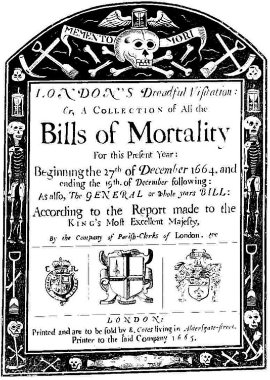{.lightbox}
:::
:::::

Esses marcos ilustram como o avanço da ciência depende da capacidade de observar, mensurar e explicar os fenômenos de maneira sistemática e replicável.

### Objetivo da Ciência

O propósito último da ciência é **tornar o mundo um lugar melhor para vivermos**, por meio da geração de conhecimento e de inovação tecnológica. Entretanto, o progresso técnico não ocorre isoladamente: ele depende do **entendimento teórico** dos fenômenos.

A teoria é o que permite explicar o mundo de forma coerente, organizando as observações em um quadro interpretativo. É a partir dela que se formulam hipóteses, se testam explicações e se criam soluções práticas. Assim, **as inovações técnicas são frutos do entendimento teórico**, e não o contrário, sendo que a boa ciência combina observação empírica com reflexão conceitual.

### O Uso Inadequado da Ciência

Embora a ciência tenha transformado profundamente o modo como compreendemos o mundo, seu prestígio também pode ser utilizado de forma indevida. A invocação do termo “científico” muitas vezes é empregada para **atribuir credibilidade a afirmações infundadas**, criando uma aparência de legitimidade sem o devido rigor metodológico.

:::::: columns
:::: {.column width="75%"}
::: callout-warning
## Credibilidade Fake

Nada confere mais autoridade a uma alegação do que a sugestão de que ela foi “comprovada cientificamente” ou “baseada em evidências científicas”.
:::
::::

::: {.column width="25%"}
{.lightbox}
:::
::::::

No entanto, nem toda afirmação que se apresenta como científica é, de fato, resultado de um processo de investigação rigoroso. É comum encontrar exemplos de **pseudociência**, discursos que simulam o formato da ciência, mas carecem de fundamentos empíricos verificáveis.

Afirmações de que **extraterrestres visitaram a Terra**, de que **plantas sentem prazer e dor**, ou de que **celulares causam tumores cerebrais**, são exemplos de como o rótulo “científico” pode ser usado de maneira enganosa.

Da mesma forma, **teorias conspiratórias**, como a ideia de que governos ocultam informações sobre eventos históricos, frequentemente se valem de uma retórica pseudoacadêmica para convencer o público. Esses casos ilustram como a aparência de método pode ser usada para mascarar a ausência de evidência.

## Método Científico

**Observar, Explicar e Testar**

O método científico se organiza em três etapas principais: observar, propor explicações e testar. Cada uma delas é essencial para transformar dados em conhecimento confiável e orientar a investigação de forma estruturada.

### Observar

::::: columns
::: {.column width="85%"}
Observar significa ter uma **noção clara dos fatos** que envolvem o fenômeno que estamos estudando. **Ciência é a arte de fazer boas observações**, capazes de identificar e focar nos aspectos mais relevantes do que está acontecendo. **A observação fornece pistas** sobre por que um fenômeno ocorre e permite avaliar se diferentes explicações podem ser plausíveis ou devem ser descartadas.
:::

::: {.column width="15%"}
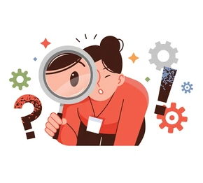{.lightbox}
:::
:::::

::: callout-note
## Nem sempre a observação é simples ou direta.

O processo de observar pode ser limitado por dados insuficientes ou difíceis de acessar. É importante reconhecer essas dificuldades e trabalhar para minimizar seus efeitos.
:::

#### Observções devem ser:

-   Ter clara noção de quais os fenômenos relevantes
-   Encontramos uma maneira de garantir que não negligenciamos nada no processo de fazer nossas observações?
-   Não viesada: Cegueira a mudança e Cegueira desatenta <https://www.youtube.com/watch?v=FaAIW8WFBq8>
-   O que sabemos com certeza? O que é baseado em fatos e o que é baseado em conjecturas ou suposição?
    -   Evite suposições inocentemente incorporadas
-   Consideramos alguma informação comparativa necessária?
-   As nossas observações foram contaminadas por expectativas ou crenças?

#### Como conseguir boas observações e evitar viéses?

::::: columns
::: {.column width="65%"}
Para alcançar observações mais precisas, é importante recorrer a **instrumentos** que ampliem nossos sentidos e utilizar **medições quantitativas** que descrevam os fenômenos de forma mais fiel. Assim, reduzimos as distorções que decorrem da percepção humana e obtemos registros mais objetivos e verificáveis.

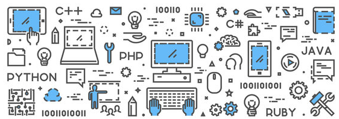{.lightbox fig-align="center"}
:::

::: {.column width="35%"}
{.lightbox fig-align="center"}
:::
:::::

### Propor Explicação

Explicar é apresentar um conjunto de fatores que **mostram como** ou **por que um efeito ocorreu**. É o momento de propor uma história explicativa, uma conjectura que, se verdadeira, daria sentido ao fenômeno observado.

::::: columns
::: {.column width="65%"}
Perguntas como **“por que o sol nasce e se põe todos os dias?”** ilustram esse tipo de esforço. Vejamos:

O Primeiro a enteder o nascimento do sol foi **Nicolau Copérnico (1473-1543)**, que propôs o modelo heliocêntrico do sistema solar. Segundo esse modelo, a Terra gira em torno do Sol, o que explica o movimento aparente do sol no céu ao longo do dia.

Entretanto, as primeiras provas vieram quase século depois com **Galileu , 1610**, com as observações de Venus e as fases da Lua. Interessantemente, em 1633 Galileu Galilei foi julgado e condenado pela Inquisição Católica pela sua defesa do heliocentrismo.

{.lightbox fig-align="center" width="50%"}
:::

::: {.column width="35%"}
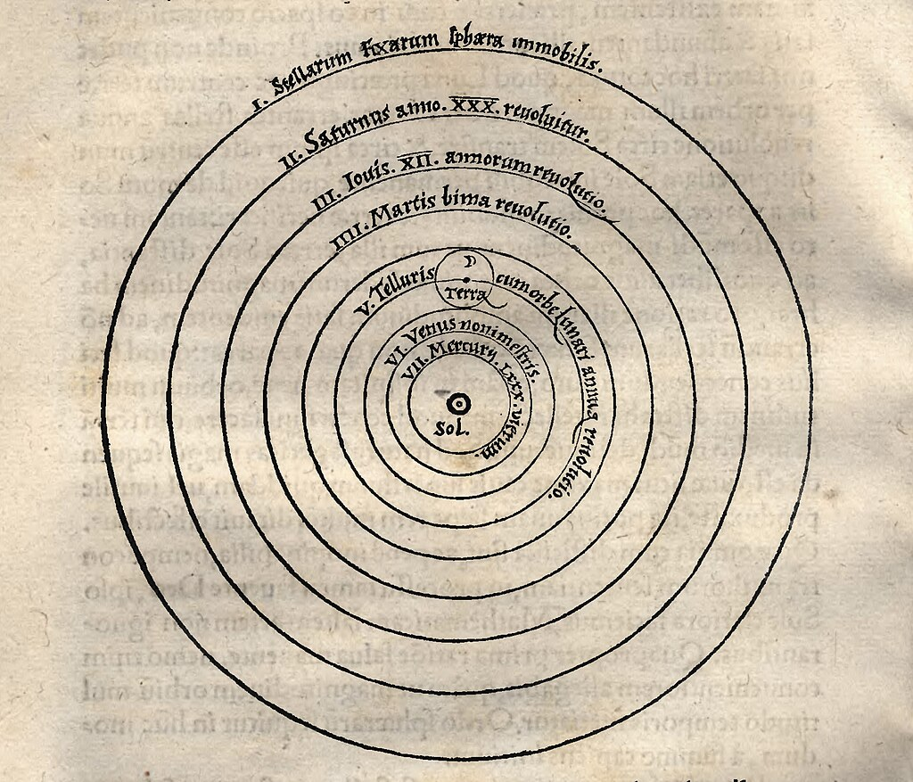{.lightbox fig-align="center"}
:::
:::::

::: callout-note
## História Explicativa

Portanto, a primeira etapa na tentativa de dar **sentido a um conjunto de fatos** intrigantes é propor o que poderíamos chamar de uma história explicativa, um conjunto de conjecturas que, se verdadeiras, explicariam o quebra-cabeça.
:::

#### Uma Boa Explicação

Uma **hipótese** é uma explicação provisória e ainda não comprovada sobre algo específico Oferece uma explicação para um gama mais limitada de fenômenos , um único evento ou um fato.

Já uma **teoria** é um corpo de conhecimento mais amplo e consolidado, construído a partir de múltiplas verificações e evidências, como as teorias do Big Bang, Teoria da evolução ou dos germes das doenças.

#### CUIDADO

:::::: columns
:::: {.column width="75%"}
::: callout-warning
## Importante

É comum ouvirmos **“isso é apenas uma teoria”**, como se fosse uma opinião. No entanto, na ciência, uma teoria é uma explicação robusta, apoiada por evidências e testes repetidos.
:::
::::

::: {.column width="25%"}
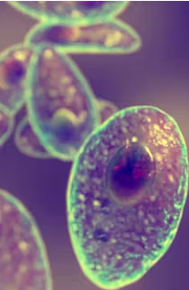{.lightbox width="40%"}
:::
::::::

#### Vamos Pensar: Obsedidade no Brasil

Os brasileiros enfrentam um sério problema de peso. Entre 2006 e 2019, o número de pessoas com sobrepeso ou obesidade aumentou em 72%, chegando a 20% da população. Esses dados nos convidam a construir hipóteses que expliquem o fenômeno, mesmo que provisoriamente. O objetivo não é acertar, mas exercitar o raciocínio explicativo.

::: callout-warning
## Fatos e Observações

Segundo a pesquisa Vigitel do Ministério da Saúde, para população acima de 18 anos o percentual de pessoas com obesidade subiu de 11,8% em 2006 para 20,3% em 2019.
:::

**Quais as suas hipóteses para explicar esse fenômeno?** Não precisa estar correta, mas deve explicar o fenômeno, caso seja verdadeira.

### Testar Explicação

::::: columns
::: {.column width="75%"}
Testar uma explicação significa verificar se suas previsões se confirmam.

**Primeiro**, observam-se as consequências da explicação, o que deveria acontecer se a explicação estiver correta?

**Segundo**, desenha-se um experimento ou estudo para confrontar essa previsão com os dados. Se os resultados estiverem de acordo, seguimos na direção certa; se não, a hipótese precisa ser revisada.
:::

::: {.column width="25%"}
{.lightbox}
:::
:::::

::: callout-important
## Fácil Falar Difícil Fazer

Apesar da simplicidade do método científico em teoria, sua aplicação prática exige cuidado e rigor.
:::

## A Causalidade

Compreender a causalidade é uma das tarefas centrais da ciência. Depois de observar um fenômeno e propor uma explicação, é preciso determinar se existe de fato uma **relação causal** entre os fatores envolvidos. Nem toda associação observada implica causalidade: dois eventos podem ocorrer juntos sem que um cause o outro.

## Tipos de Estudos e Relações Causais: Randomização, estudos prospectivos e retrospectivos {background-color="#a1c2bb"}

### Estudos Causais Randomizados.

Os estudos causais baseados em randomização partem de um conjunto de sujeitos que, antes do início do estudo, apresentam características **muito semelhantes**. Nenhum desses sujeitos foi previamente exposto ao agente causal suspeito. A partir daí, eles são **aleatoriamente** designados para dois grupos: um **grupo de tratamento** e um **grupo de controle**. Somente os sujeitos do grupo de tratamento são expostos à causa sob investigação.

Esse tipo de desenho permite isolar o efeito da variável causal e reduzir a influência de outros fatores.

No entanto, trata-se da forma mais **rara** de estudo nas **Ciências Sociais Aplicadas**, em razão das dificuldades éticas e práticas de implementação.

#### Exemplos de Randomized Control Trial (RCT) em Ciências Sociais 

**Justiça Restaurativa em Casos de Crimes Violentos**

::::: columns
::: {.column width="75%"}
-   **Estudo**: Sherman, Lawrence W., et al. *Effects of face-to-face restorative justice on victims of crime in four randomized, controlled trials.* **Journal of experimental criminology** 1.3 (2005): 367-395.

-   **Objetivo**: O estudo avaliou o impacto de programas de justiça restaurativa, onde as vítimas e ofensores se encontram em conferências mediadas, em casos de crimes violentos - quatro experimentos controlados.

-   **Resultado**: As meta-análises das oito estimativas sugerem o sucesso da justiça restaurativa, tanto como um ritual de interação quanto como uma política para reduzir os danos às vítimas.
:::

::: {.column width="25%"}
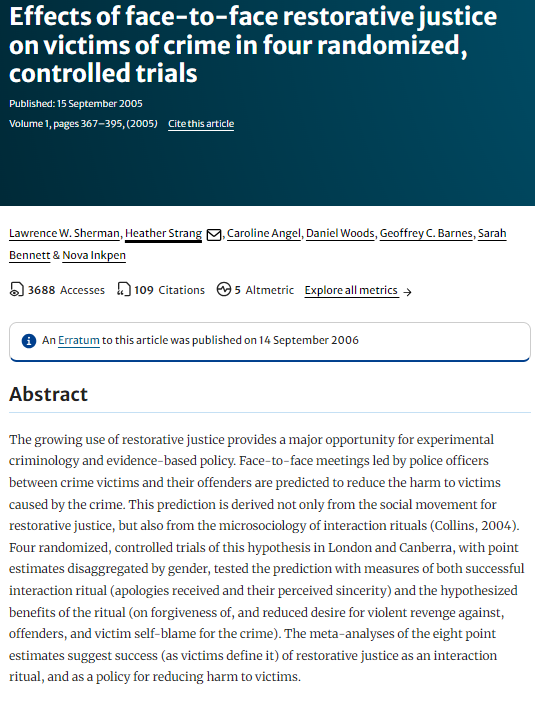{.lightbox fig-align="center"}
:::
:::::

### Estudos Prospectivos.

Os estudos prospectivos, por sua vez, iniciam com sujeitos que **já foram expostos ao agente causal** sob investigação e os **acompanham ao longo do tempo**. O ponto de partida é uma situação em que o resultado ainda é desconhecido, e o objetivo é identificar como determinadas variáveis influenciam o desfecho futuro.

Esse tipo de estudo é valioso para observar a evolução dos efeitos causais, mas é importante reconhecer que **outros fatores** podem ser responsáveis por alguma parte do **efeito nos grupos tratado e de controle**. Assim, a relação identificada pode ser relacional, mas não necessariamente causal.

#### Exemplos de Estudos Prospectivos em Ciências Sociais 

Um exemplo clássico de estudo prospectivo é o *Million Women Study* (2003), que investigou a relação entre terapias de reposição hormonal (TRH) e câncer de mama.

::::: columns
::: {.column width="75%"}
-   **Estudo**: Beral, Valerie, et al. *"Breast cancer and hormone-replacement therapy: the Million Women Study."* **The Lancet** 362.9392 (2003): 1330-1331
-   **Objetivo**: O Million Women Study foi criado para investigar os efeitos de tipos específicos de TRH no câncer de mama incidente e fatal.Foram recrutadas 1.084.110 mulheres do Reino Unido com idades entre 50 e 64 anos para o Million Women Study entre 1996 e 2001.
-   **Resultado**: O uso atual de TRH está **associado** a um risco aumentado de câncer de mama incidente e fatal.
:::

::: {.column width="25%"}
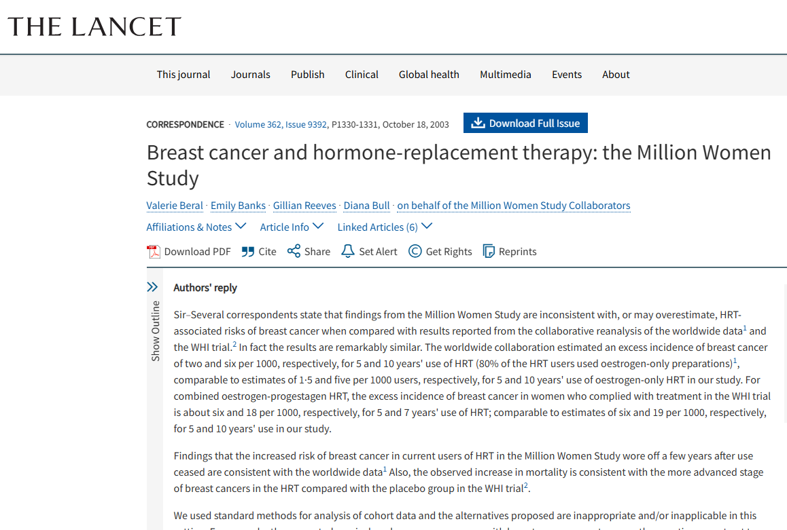{.lightbox fig-align="center"}
:::
:::::

### Estudos Causais Retrospectivos.

Nos estudos retrospectivos, o processo é inverso: **parte-se do resultado final** e busca-se identificar as **causas que o originaram**. Esses estudos têm como propósito principal identificar fatores que levaram a determinado desfecho.

Geralmente, o pesquisador trabalha com dois grupos, controle e tratamento, compostos por indivíduos que apresentam, ou não, o efeito analisado. O desafio é identificar, de forma cuidadosa, os diferentes níveis do fator potencial de causa entre esses grupos.

::: callout-tip
## Explicando com Exemplo

Efeitos do chumbo em crianças. Pesquisa com 4.000 crianças de 4 e 15 anos entre 1999 e 2002. Incluiu 135 crianças com transtorno de déficit de atenção e hiperatividade (TDAH). Exames de sangue foram feitos em todas as 4.000.

-   As 135 crianças com TDAH apresentaram níveis de chumbo no sangue muito maior do que nas outras crianças.
    -   Tinham quatro vezes mais probabilidade de ter níveis elevados de chumbo no sangue

A **Questão** é, pode-se concluir que a exposição ao chumbo pode causar TDAH?
:::

Mesmo os melhores estudos retrospectivos oferecem apenas evidências limitadas de causalidade, pois é extremamente difícil controlar todos os fatores potenciais que podem interferir na relação observada. Por isso, é fundamental interpretar seus resultados com cautela.

Observa-se que Correspondência reversa às vezes é possível em estudos retrospectivos. Ou seja TDAH -\> Chumbo....

-   E é esse o caso nesse estudo: crianças com TDAH são mais propensas a comer tinta com chumbo ou inalar pó de tinta por causa de sua hiperatividade.

::: callout-warning
## Cuidado

Apesar de crianças com TDAH terem “quatro vezes mais chance” de ter níveis elevados de chumbo no sangue.

**NÃO PODEMOS CONCLUIR QUE**: Crianças com níveis elevados de chumbo têm “quatro vezes mais probabilidade” de ter TDAH.
:::

#### Exemplos de Estudos Retrospectivos em Ciências Sociais e Direito

Um exemplo aplicado às Ciências Sociais é o estudo de Severi, FC; Jesus Filho, J. 2022 (*"Há diferenças remuneratórias por gênero na magistratura brasileira?."*), que investigou a hipótese de diferenças remuneratórias entre juízes e juízas em oito tribunais de justiça brasileiros.

::::: columns
::: {.column width="75%"}
-   **Estudo** Severi, FC; Jesus Filho, J. *"Há diferenças remuneratórias por gênero na magistratura brasileira?."* **Revista de Administração Pública** 56.2 (2022): 208-225.

-   **Objetivo**: testar a hipótese de que há clara diferença entre as remunerações médias percebidas por juízes e juízas de 8 tribunais de justiça brasileiros.

-   **Resultado**: As diferenças nas médias remuneratórias persistem mesmo após o pareamento, o que pode ser explicado pelos mediadores de gênero, que operam gerando melhores oportunidades para homens em desfavor das mulheres.
:::

::: {.column width="25%"}
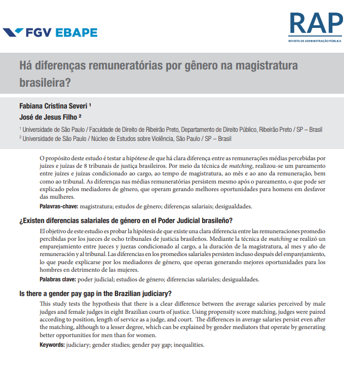{.lightbox fig-align="center"}
:::
:::::

### O Método Científico segundo Richard Feynman

Richard Feynman enfatiza que o método científico baseia-se em propor hipóteses, derivar previsões e testá-las por meio da observação e do experimento. Se os resultados não confirmam a previsão, a hipótese deve ser rejeitada, independentemente de sua origem. Assim segundo o autor temos o seguinte percurso:

-   **Faça uma Observação**
    -   Observe um fenômeno no mundo natural.
-   **Formule uma Hipótese**
    -   Crie uma possível explicação para o fenômeno.
-   **Faça Previsões**
    -   Preveja o que acontecerá se sua hipótese estiver correta.
-   **Teste com Experimentos**
    -   Conduza experimentos para testar as previsões.
-   **Reavalie a Hipótese**
    -   Se os resultados não batem com as previsões, a hipótese está errada.

Essa visão mostra que a ciência é, acima de tudo, um compromisso ético com a verdade empírica e a disposição de submeter ideias à crítica. O método científico é mais do que um procedimento: é uma atitude de curiosidade, dúvida e verificação constante.


### Ciclo da Pesquisa

O ciclo da pesquisa nem sempre segue um caminho linear ou fácil; frequentemente é tortuoso. Apesar disso, ele envolve etapas importantes que precisam ser bem fundamentadas e respeitadas, como as que segue:

-   Desenho do projeto;
-   Operacionalização em variáveis mensuráveis;
-   Análise de viabilidade;
-   Coleta;
-   Limpeza e organização dos dados;
-   Transformação dos dados;
-   Análise exploratória;
-   Análise inferencial e preditiva;
-   Métricas de desempenho;
-   Publicação dos resultados.

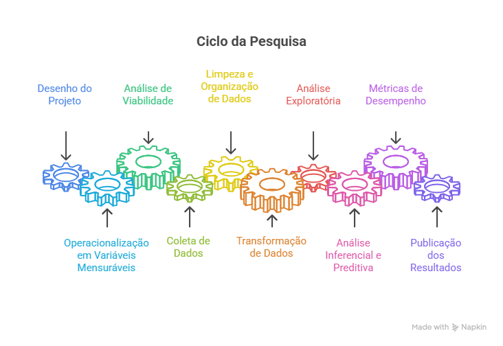{.lightbox fig-align="center" widht="100%"}


## Porque Estudar Estatística?

Podemos dizer que a existência da estatística e de outras ciências está conectada a existência de problemas. Não somente a ciência mas o nosso trabalho está conectado a superação de problemas cotidianos. Tomar decisão é o dia a dia do gestor.

Segundo Popper "we study not disciplines, but problems. Often, problems transcend the boundaries of a particular discipline"

A questão central é: Como solucionamos os problemas? Utilizamos a melhor estratégia? A solução foi boa?

```{mermaid}
flowchart LR
  A[PROBLEMA] --> B[Estratégia de Decisão]
  B --> C{Solução é BOA?}
```

### Os dois sistemas cognitivos

Os livros abaixo são boas referências sobre a tomada de decisão.

::: {layout="[30,-40,30]"}
[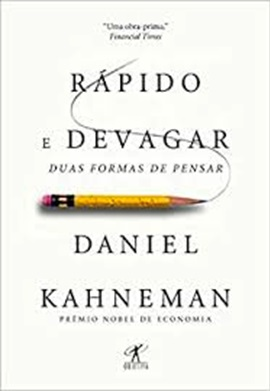{width="50%"}](https://a.co/d/ilbbxRJ)

[{width="50%"}](https://a.co/d/iy4MURf)
:::

Existem dois sistemas que utilizamos para tomar decisão. O chamado **Sistema 1** e o chamado **Sistema 2**. Segue uma breve descrição de cada um:

**Sistema 1**:

-   Intuitivo, rápido, automático, sem esforço, implícito e emocional
    -   Pressa,
    -   Falta de tempo,
    -   Problemas menos importante
    -   Mais Falhas/Erros

**Sistema 2**

-   Raciocíonio lento, consciente, esforçado, explícito, lógico
    -   Requer tempo,
    -   Mais recursos
    -   Problemas mais importante
    -   Menos Falhas

Para o Sistema 1 usamos a nossa intuição que chamamos de Heurística. Vejamos um pouco mais sobre esse sistema.

**HEURÍSTICA**

São rotinas inconscientes ou atalhos que o nosso cérebro utiliza para lidar com a complexidade.

-   Modelo/Regras Intuitivas.
-   Próprio do Sistema 1.
-   Apesar de processo sofisticado, são passíveis de falhas. Intuição falha

[**Um Exemplo**]{.underline}

Veja a figura abaixo retirada do livro do Bazerman.Responda rápido.

**Qual delas tem o tampo mais quadrado?**

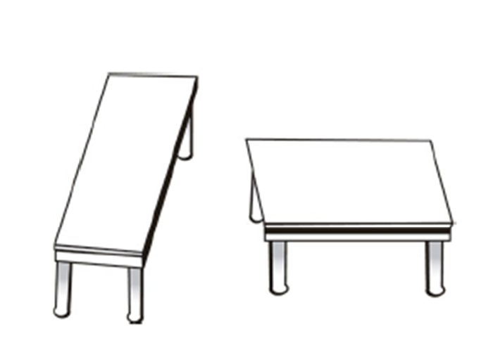{width="80%"}

Se você achou que é a segunda mesa, você está alinhado com a grande maioria. Nesse caso você usou o seu sistema 1

Vamos repitir a pergunta:

**Qual delas tem o tampo mais quadrado?**

Agora use uma régua para medir as mesas. Usamos aqui o sistema 2. Mais tempo e recursos são utlizados. Qual mesa agora você considera mais quadrada? Mudou sua opinião?

Com a régua vemos que as mesas são iguais. Isso mostra que a nossa intuição **FALHA**.

**Tipos de Heurísticas**

-   **Heurística da disponibilidade**: Usamos o que está mais próximo na memória para calcular a probabilidade.

-   **Heurística da representatividade**: Buscamos aquilo que reforça o padrão.

-   **Heurística da hipótese positiva**: Assumimos que uma determinada hipótese é verdadeira e não olhamos o contrafactual.

-   **Heurística do afeto**: Decisão considera o emocional. Seu humor afetam as decisões.

Para contornar os problemas da intuição e seus viéses na tomada de decisão o primeiro passo é compreender que eles existem e estarmos alerta. E para problemas maiores o uso do sistema 2 torna-se relevante.

Uma das principais ferramentas do sistema 2 é a Estatística. Com os avanços computacionais essa ciência tem se destacado como um dos elementos centrais do *data science*. Abaixo a figura resume as diversas áreas de desenvolvimento da análise de dados, obviamente não exaustiva:

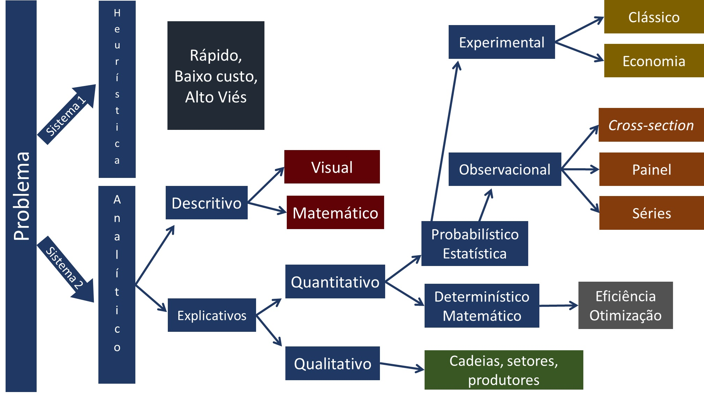{width="80%"}

Nosso objetivo é explorar nessa seção a análise descritiva. Chamado hoje no *Business Intelligence*, que e uma das áreas do *Data Science*.

