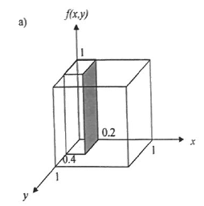

## Introdução

Até o momento nos interessou observar apenas uma característica de um experimento. Por exemplo, a altura média dos alunos do curso de estatística. Podemos também estar interessados em mais uma característica adicional, como o peso dos alunos do curso de estatística.

Portanto, queremos observar duas características de forma simultânea dos alunos: altura e peso. Ou seja, duas características simultaneamente do mesmo experimento $\epsilon$.

Considere o experimento de jogar dois dados não viciados de forma simultânea. Define-se duas variáveis aleatórias: $X$ o número que aparece no dado 1 e $Y$ o número que aparece no dado 2. Assim, temos o seguinte espaço amostral com 36 elementos (6x6):

$$\begin{array}{ccc}
\Omega = { \{(1,1),(1,2),(1,3),...,(6,6)\} }
\end{array}$$

Como o dado é não viciado cada evento (x,y) tem a mesma probabilidade de ocorrência de 1/36. Assim, a função de **probabilidade bivariada** é:

$$\begin{array}{ccc}
p(x_{i},y_{j})=P(X=x_{i},Y=y_{j})=1/36 
\end{array}$$

para $i=1,...,6$ e $j=1,...6$.

Assim como no caso unidimensional pode-se construir um histograma. Com base no exemplo acima, podemos fazer o seguinte histograma tridimensional para o par de dados $X$ e $Y$, ou seja, a distribuição conjunta de $(X,Y)$:

```{r}
#| echo: false
#| fig-cap: "Distribuição conjunta uniforme discreta"
#| fig-width: 5
#| fig-height: 5
#| out-width: "45%"

library(plot3D)
prob_matrix <- matrix(1/36, nrow = 6, ncol = 6)
par(mar = c(2,2,1,1))
hist3D(x = 1:6, y = 1:6, z = prob_matrix,
       space = 0,             
       border = "black",      
       col = "#89B6C7",
       alpha = 0.6,
       colvar = NULL,         
       colkey = FALSE,        
       ticktype = "simple",   
       xlab = "x", ylab = "y", zlab = "",
       bty = "b",             
       phi = 30, theta = 45,  
       zlim = c(0, 0.05))
```


Com base nessa ideia podemos fazer a seguinte definição:

::: {.callout-note  icon="false" title="DEFINIÇÃO"}
Seja $\epsilon$ um experimento, $\Omega$ um espaço amostral, $X = X(\omega)$ e $Y = Y(\omega)$, para $\omega \in \Omega$, $(X,Y)$ será uma variável aleatória bidimensional (ou vetor aleatório).
:::

Agora possuímos não mais um espaço unidimensaional $R_{x}$ como anteriormente visto, mas sim bidimensional, ou seja, o contradomínio da variável aleatória será $R_{xy}$ e cada resultado $X = X(\omega)$ e $Y = Y(\omega)$ pode ser representado como um ponto $(x,y)$ no plano euclidiano. Podemos dividir os resultado de um experimento em dois tipos, os discretos e os contínuos. Vejamos abaixo esses dois tipos de resultados.

## Distribuição de Probabilidade
### Variáveis Aleatórias Discretas

São variáveis que conseguimos colocar em lista, seja ela finita ou infinita. Assim, o vetor (X,Y) será uma variável aleatória discreta bidimensional ou vetor aleatório bidimensional se os valores possíveis puderem ser representados por $(x_{i},y_{i})$, $i=1,...,n,...$; e $j=1,2,...,m,...$

Como no caso unidimensional tem-se, podemos definir a distribuição de probabilidade conjunta de $(X,Y)$

::: {.callout-note  icon="false" title="DEFINIÇÃO"}
A cada valor possível da variável aleatória bidimensional $(X,Y)$, $(x_{i},y_{j})$, associamos uma probabilidade $p(x_{i},y_{j})$, $P (X=x_{i},Y=y_{i})$, e irá satisfazer:

i) $p(x_{i},y_{j}) \geq 0$ para todo $(x,y)$

ii) $\sum_{i} \sum_{j} p(x_{i},y_{j})=1$
:::

Com base na definição anterior podemos definir agora o que seria a função distribuição conjunto, ou seja:

::: {.callout-note  icon="false" title="DEFINIÇÃO"}
**Função de probabilidade conjunta de (X,Y)** (ou bivariada):


$p(x_{i},y_{j})= P(X=x_{i},Y=y_{j})$ para $-\infty < x_{i}< \infty$ e $-\infty < y_{j}< \infty$

---

**Distribuição de probabilidade conjunta de (X,Y)** (ou bivariada):
 
 
$[x_{i},y_{j},p(x_{i},y_{j})]$
:::


Para fixarmos as definições apresentadas acimas, e colocarmos os conceitos em prática, vamos realizar dois exemplos.

::: {.callout-tip  icon="false" title="EXEMPLO"}
Considere o experimento de jogar dois dados simultaneamente. Considere a função de distribuição conjunta e calcule a probabilidade conjunta de $P(5\leq X \leq 6, 1 \leq Y \leq 2)$
:::

::: {.callout-caution  icon="false" collapse="true" title="RESPOSTA"}

$P(5\leq X \leq 6, 1 \leq Y \leq 2)= p(5,1)+p(5,2) + p(6,1)+p(6,2) = 4 * 1/36= 1/9$
:::


::: {.callout-tip  icon="false" title="EXEMPLO"}
Um supermercado possui três caixas operando. Dois consumidores chegam aos caixas, que estão vazios, em momentos distintos do tempo. Cada consumidor escolhe um caixa de forma aleatória e independente do outro. Seja X o número de consumidores que escolhem o caixa 1 e Y os que escolhem o caixa 2. Qual a distribuição conjunta de X e Y?
:::


::: {.callout-caution  icon="false" collapse="true" title="RESPOSTA"}
O espaço amostral do experimento será dado pelo par ordenado $\{ i,j \}$, onde o primeiro consumidor escolhe o caixa i e o segundo escolhe $j$, tal que $i=1,2,3$ e $j=1,2,3$. Assim, cada ponto amostral tem a mesma probabilidade e o espaço amostral pode ser representado como :

$$\Omega = { \{(1,1),(1,2),(1,3),...,(3,3)\} } $$

A distribuição conjunta de X e Y será conforme descrito na tabela abaixo. Para construir essa tabela note que, por exemplo, $P(X=0,Y=0)=P(\{(3,3)\})=1/9$ e que $P(X=0,Y=1)=P(\{(2,3),(3,2)\})=2/9$


| y (cx2) | x=0 (cx1) | x=1 (cx1) | x= 2 (cx1) |
|---------|-----------|-----------|------------|
| y=0     | 1/9       | 2/9       | 1/9        |
| y=1     | 2/9       | 2/9       | 0          |
| y=2     | 1/9       | 0         | 0          |

:::

#### <u>Visualização Gráfica</u>

Vejamos agora alguns gráficos de variáveis aleaórias bidimensionais:

**BINOMIAL:**

Considere a variável aleatória $(X,Y)$ com distribuição binomial e a probabilidade de sucesso de $X$ é igual a 0.75 e de $Y$ igual a 0.25 com 10 rodadas:

```{r}
#| echo = FALSE,
#| fig.cap = "Distribuição conjunta Binomial"

library (intoo)
library (barsurf)
library (bivariate)
library (MASS)
set.bs.options (rendering.style="e")
f <- bnbvpmf (0.75, 0.25, 10)
plot (f, TRUE, zlim=c(0,0.05), zlab="p(x,y)" )
```

**POISSON**\
Considere a variável aleatória $(X,Y)$ com distribuição de poisson e o valor esperado de $X$ igual a 7, de $Y$ igual a 4 e a covariância é 3 (a frente veremos esse conceito):

```{r}
#| echo = FALSE,
#| fig.cap = "Distribuição conjunta de Poisson"

library (intoo)
library (barsurf)
library (bivariate)
library (MASS)
set.bs.options (rendering.style="e")
f <- pbvpmf.2 (7,4, 3)
plot (f, TRUE, zlim=c(0,0.02), zlab="p(x,y)" )
```

### Variáveis Aleatórias Contínuas

São variáveis que não conseguimos listar, pois existem infinitos valores entre dois pontos. Assim,o vetor $(X,Y)$ será uma variável aleatória contínua se puder tomar todos os valores em algum conjunto não enumerável no plano euclediano

::: {.callout-note  icon="false" title="DEFINIÇÃO"}
Sendo $(X,Y)$ variável aleatória contínua bidimensional. A função densidade de probabilidade conjunta, $f(x,y)$, irá satisfazer:

i) $f(x,y) \geq 0$

ii) $\int \int_{R} f(x,y)dxdy= 1$ se f(x,y)=0 para $(x,y)\notin R \rightarrow \int_{- \infty}^{\infty}\int_{- \infty}^{\infty} f(x,y)=1$
:::

Importante notar que $f(x,y)$ não representa a probabilidade. Assim para um evento B em $R_{xy}$:

$$\begin{array}{ccc}
P(B)=P\{ [X(\omega),Y(\omega)] \in B \}= P\{\omega | [X(\omega),Y(\omega)] \in B \}
\end{array}$$

Para o caso discreto: 
$$\begin{array}{ccc}
P(B)=\sum \sum_{B} p(x_{i},y_{j})
\end{array}$$

Para o caso contínuo: 
$$\begin{array}{ccc}
P(B)=\iint_{B} f(x,y)dxdy
\end{array}$$

Reinterpretando o exposto acima sobre o evento B, como no caso unidimensional, onde a área sobre a função densidade de probabilidade representa a probabilidade, no caso bidimensional o **volume sob a função densidade de probabilidade conjunta representa a probabilidade**.

Assim, uma probabilidade $P(a \leq X \leq b, c\leq Y \leq d)$ é calculada como:

$$\begin{array}{ccc}
 P(a \leq X \leq b, c\leq Y \leq d)  = \int_{c}^{d}\int_{a}^{b} f(x,y)dxdy
\end{array}$$

::: {.callout-tip  icon="false" title="EXEMPLO"}
Suponha que uma partícula é aleatoriamente alocada em um quadrado com lados iguais a 1. Assim, se duas áreas de mesma dimensão forem consideradas a partícula tem a mesma probabilidade de estar em qualquer uma das duas áreas. Seja X e Y as coordenadas da localização da partícula. A função de densidade conjunta de X e Y será:

\begin{array}{ccc}
f(x,y)=\left\{\begin{matrix} 1,\ 0\ \leq x \leq 1, \ 0\ \leq y \leq 1 \\

0,\ caso\ contrário
\end{matrix}\right.
\end{array}

Assim: 

a. Esboce a função densidade de probabilidade conjunta 

b. Encontre $P(0 \leq X \leq 0.2, 0\leq Y \leq 0.4)$
::: 


::: {.callout-caution  icon="false" collapse="true" title="RESPOSTA"}
Resposta a: 

<center>

{width="40%"}

</center>

---
Resposta b: 

\begin{array}{ccc}

P(0 \leq X  \leq 0.2,0 \leq Y  \leq 0.4)= \int_{0}^{0.4}\int_{0}^{0.2}f(x,y)dxdy \\
=\int_{0}^{0.4}\int_{0}^{0.2}1dxdy=\int_{0}^{0.4}(\int_{0}^{0.2}1dx)dy \\
=\int_{0}^{0.4}(x\Big|_{0}^{0.2})dy 
=(0.2-0)\int_{0}^{0.4}dy = (0.2-0).(y\Big|_{0}^{0.4}) \\
=(0.2-0)(0.4-0)=0.08 \\
P(0 \leq X  \leq 0.2,0 \leq Y \leq 0.4)=0.08
\end{array}
:::


#### <u>Visualização Gráfica</u>

Vejamos agora alguns gráficos de variáveis aleaórias bidimensionais:

**NORMAL BIVARIADA:**

Considere a variável aleatória $(X,Y)$ com distribuição normal bivariada com a esperança de $X$ igual a 10, de $Y$ igual a 4, o desvio-padrões iguais a 3 e 2 respectivamente. Aqui consideremaos a correlação de 0.7 (veremos mais a frente esse conceito).

```{r}
#| echo = FALSE,
#| fig.cap = "Distribuição conjunta normal bivariada"

library (intoo)
library (barsurf)
library (bivariate)
library (MASS)
set.bs.options (rendering.style="e")
f <- nbvpdf (10, 4, 3, 2, 0.7)
plot (f, TRUE, zlim=c(0,0.03), zlab="p(x,y)" )
```

**NORMAL BIVARIADA PADRÃO:**

Considere a variável aleatória $(X,Y)$ com distribuição normal bivariada padrão, ou seja, a esperança de $X$ e $Y$ igual a a 1, o desvio-padrões iguais a 1 e sem covariancia.

```{r}
#| echo = FALSE,
#| fig.cap = "Distribuição conjunta normal padrão bivariada"

library (intoo)
library (barsurf)
library (bivariate)
library (MASS)
set.bs.options (rendering.style="e")
f <- nbvpdf (0, 0, 1, 1, 0)
plot (f, TRUE, zlim=c(0,0.1), zlab="p(x,y)" )
```

## Distribuição Acumulada

Como no caso univariado a distinção entre variável aleatória conjunta contínua e conjunta discreta pode ser feita em termos de sua função distribuição conjunta acumulada.

### Variável Aleatória Discreta

::: {.callout-note  icon="false" title="DEFINIÇÃO"}
A função distribuição conjunta acumulada, F, da variável aleatória bidimensional (X,Y) é definida por:
$$\begin{array}{ccc}
 F(x,y)= P(X \leq x, Y \leq y) \ para \ -\infty < x_{i} < \infty \ e \ -\infty < y_{i} < \infty
\end{array}$$
:::

Seja X e Y duas variáveis aleatórias discretas com função distribuição conjunta $F(x,y)$, a função distribuição conjunta acumulada de X e Y será:

$$\begin{array}{ccc}
 F(x,y)=\sum_{f1=- \infty }^{x} \sum_{f2=- \infty }^{y}p(t_{1},t_{2})
\end{array}$$

Retomando os exemplos anteriores temos as seguintes funções de distribuição conjunta acumuladas discretas:

::: {.callout-tip  icon="false" title="EXEMPLO"}
Para o caso dos dois dados apresentados anteriormente temos que:

$F(2,3)=P(X\leq 2, Y \leq 3)=p(1,1)+p(1,2)+p(1,3)+p(2,1)+p(2,2)+p(2,3)$

$F(2,3)=P(X\leq 2, Y \leq 3)=6/36=1/6$

O gráfico segue abaixo.
:::

```{r}
#| echo: false
#| fig-cap: "Distribuição acumulada conjunta uniforme discreta"
#| out-width: "45%"
library(plot3D)
cdf_matrix <- outer(1:6, 1:6, "*") / 36
par(mar = c(0, 0, 0, 0))
hist3D(x = 1:6, y = 1:6, z = cdf_matrix,
       space = 0,             
       border = "black",      
       col = "#89B6C7",       
       alpha = 0.6,           
       colvar = NULL,         
       colkey = FALSE,        
       ticktype = "simple",   
       xlab = "x", ylab = "y", zlab = "",
       bty = "b",             
       phi = 30, theta = -40,
       zlim = c(0, 1))
```

::: {.callout-tip  icon="false" title="EXEMPLO"}
Para o exemplo anterior (caixa do supermercado) encontre F(-1,2) e F(1.5,2)

$F(-1,2) = P(X \leq -1, Y \leq 2)= P(\emptyset)=0$

*Note que é impossível no exemplo do caixa o valor assumir -1, portanto, temos a probabilidade de um conjunto vazio, que será zero.


$$\begin{aligned}
F(1.5,2) &= P(X \leq 1.5, Y \leq 2) \\
         &= p(0,0)+p(0,1)+p(0,2)+p(1,0)+p(1,1)+p(1,2)=8/9
\end{aligned}$$
:::

#### <u>Visualização Gráfica</u>

**BINOMIAL:**

Considere a variável aleatória $(X,Y)$ com distribuição binomial e a probabilidade de sucesso de $X$ é igual a 0.75 e de $Y$ igual a 0.25 com 10 rodadas, sua função distribuição acumulada será:

```{r}
#| echo: false
#| fig-cap: "Distribuição conjunta Binomial"
#| out-width: "45%"
library(plot3D)
n <- 10
p1 <- 0.75
p2 <- 0.25
x_vals <- 0:n
y_vals <- 0:n
cdf_binom <- outer(pbinom(x_vals, size = n, prob = p1), 
                   pbinom(y_vals, size = n, prob = p2), "*")
par(mar = c(0, 0, 0, 0))
hist3D(x = x_vals, y = y_vals, z = cdf_binom,
       space = 0,             
       border = "black",      
       col = "#89B6C7",       
       alpha = 0.6,           
       colvar = NULL,         
       colkey = FALSE,        
       ticktype = "simple",   
       xlab = "x", ylab = "y", zlab = "",
       bty = "b",             
       phi = 30, theta = -40, 
       zlim = c(0, 1))
```

**POISSON**\
Considere a variável aleatória $(X,Y)$ com distribuição de poisson e o valor esperado de $X$ igual a 7, de $Y$ igual a 4 e a covariância é 3 (a frente veremos esse conceito). Assim a função distribuição acumulada será:

```{r}
#| echo: false
#| fig-cap: "Distribuição conjunta de Poisson"
#| out-width: "45%"
library(plot3D)
l1 <- 7
l2 <- 4
l3 <- 3
max_val <- 16
x_vals <- 0:max_val
y_vals <- 0:max_val
pmf_matrix <- matrix(0, nrow = max_val + 1, ncol = max_val + 1)
for(x in 0:max_val) {
  for(y in 0:max_val) {
    val <- 0
    for(i in 0:min(x,y)) {
      val <- val + (l1^(x-i) * l2^(y-i) * l3^i) / (factorial(x-i) * factorial(y-i) * factorial(i))
    }
    pmf_matrix[x+1, y+1] <- exp(-(l1 + l2 + l3)) * val
  }
}
cdf_poisson <- matrix(0, nrow = max_val + 1, ncol = max_val + 1)
for(x in 1:(max_val + 1)) {
  for(y in 1:(max_val + 1)) {
    cdf_poisson[x, y] <- sum(pmf_matrix[1:x, 1:y])
  }
}
par(mar = c(0, 0, 0, 0))
hist3D(x = x_vals, y = y_vals, z = cdf_poisson,
       space = 0,             
       border = "black",      
       col = "#89B6C7",       
       alpha = 0.6,           
       colvar = NULL,         
       colkey = FALSE,        
       ticktype = "simple",   
       xlab = "x", ylab = "y", zlab = "",
       bty = "b",             
       phi = 30, theta = -40, 
       zlim = c(0, 1))
```

### Variável Aleatória Contínua

Seja X e Y duas variáveis aleatórias contínuas com função distribuição conjunta $F(x,y)$. Se existir uma função densidade de probabilidade conjunta $f(x,y)$ não negativa, assim a **função distribuição conjunta acumulada de X e Y** será:

$$\begin{array}{ccc}
 F(x,y) = \int_{-\infty}^{x}\int_{- \infty}^{y} f(t_{1},t_{2})dt_{1}dt_{2} \ para \ -\infty < x_{i} < \infty \ e \ -\infty < y_{i} < \infty 
\end{array}$$

::: {.callout-tip  icon="false" title="EXEMPLO"}
Para o exemplo anterior da partícula, encontre F(0.4, 0.4):
:::


::: {.callout-caution  icon="false" collapse="true" title="RESPOSTA"}
Ver figura abaixo. 
$$\begin{array}{ccc}
P(X \leq 0.4 ,Y \leq 0.4)= \int_{0}^{0.4}\int_{0}^{0.4}f(x,y)dxdy
\\
=\int_{0}^{0.4}\int_{0}^{0.4}1dxdy=\int_{0}^{0.4}(\int_{0}^{0.4}1dx)dy=\int_{0}^{0.4}(x\Big|_{0}^{0.4})dy
\\
=(0.4-0)\int_{0}^{0.4}dy=(0.4-0).(y\Big|_{0}^{0.4})\\
=(0.4-0)(0.4-0)=0.016
\\
P(X  \leq 0.4,Y \leq 0.4)=0.016
\end{array}$$
:::

::: {.callout-note  icon="false" title="TEOREMA"}

Seja $X$ e $Y$ duas variáveis aleatórias contínuas com função distribuição conjunta $F(x,y)$ então:

$$\begin{array}{ccc}
a) \ F(- \infty, - \infty )=  F(- \infty, y )=  F(x, - \infty )=0 \\
\end{array}$$

$$\begin{array}{ccc}
b) \ F(\infty, \infty ) = 1
\end{array}$$

No caso univariado tem-se: 
$$\begin{array}{ccc}
 f(x,y) = \frac{\partial^{2}F(x,y) }{\partial x \partial y} 
\end{array}$$

:::

#### <u>Visualização Gráfica</u>

Vejamos agora alguns gráficos de variáveis aleaórias bidimensionais:

**NORMAL BIVARIADA:**

Considere a variável aleatória $(X,Y)$ com distribuição normal bivariada com a esperança de $X$ igual a 10, de $Y$ igual a 4, o desvio-padrões iguais a 3 e 2 respectivamente. Aqui consideremaos a correlação de 0.7 (veremos mais a frente esse conceito). Assim a função distribuição acumulada conjunta terá o seguinte formato:

```{r}
#| echo: false
#| fig-cap: "Distribuição acumulada conjunta normal"
#| out-width: "45%"
library(plot3D)
library(pbivnorm)
x_vals <- seq(1, 19, length.out = 40)
y_vals <- seq(-2, 10, length.out = 40)
cdf_func_corr <- function(x, y) {
  zx <- (x - 10) / 3
  zy <- (y - 4) / 2
  pbivnorm(zx, zy, rho = 0.7)
}
z_matrix1 <- outer(x_vals, y_vals, cdf_func_corr)
par(mar = c(0, 0, 0, 0))
persp3D(x = x_vals, y = y_vals, z = z_matrix1,
        col = "#89B6C7", border = "black", facets = TRUE, alpha = 0.6,
        colvar = NULL, colkey = FALSE, ticktype = "simple",
        xlab = "x", ylab = "y", zlab = "",
        bty = "b", phi = 30, theta = -40, zlim = c(0, 1))
```


**NORMAL BIVARIADA PADRÃO:**
Considere a variável aleatória $(X,Y)$ com distribuição normal bivariada padrão, ou seja, a esperança de $X$ e $Y$ igual a a 1, o desvio-padrões iguais a 1 e sem covariância. Assim a função distribuição acumulada conjunta terá o seguinte formato:

```{r}
#| echo: false
#| fig-cap: "Distribuição acumulada conjunta normal padrão"
#| out-width: "45%"
library(plot3D)
library(pbivnorm)
x_vals <- seq(-3, 3, length.out = 40)
y_vals <- seq(-3, 3, length.out = 40)
cdf_func_padrao <- function(x, y) {
  pbivnorm(x, y, rho = 0)
}
z_matrix2 <- outer(x_vals, y_vals, cdf_func_padrao)
par(mar = c(0, 0, 0, 0))
persp3D(x = x_vals, y = y_vals, z = z_matrix2,
        col = "#89B6C7", border = "black", facets = TRUE, alpha = 0.6,
        colvar = NULL, colkey = FALSE, ticktype = "simple",
        xlab = "x", ylab = "y", zlab = "",
        bty = "b", phi = 30, theta = -40, zlim = c(0, 1))
```

## Links 

::: {.grid}

::: {.g-col-3}
🎞️ <span style="font-size:20px; font-weight:bold;">SLIDES</span>  

[Slides VA Multidi](https://drive.google.com/file/d/1LmwZ2DJQ1EF0awGGthYC1nYTBPiOBysM/view?usp=sharing)

[Slides Marg. e Cond.](https://drive.google.com/file/d/1AeRgvXxchfQ91fwPS5APN2BAYZLLbPd1/view?usp=sharing)

[Slides Correlação](https://drive.google.com/file/d/1qWVvjy75q6ABd31vl-8KE7LYdiYOeFuz/view?usp=sharing)


Arquivos em HTML (zip) das aulas.
:::

::: {.g-col-3}
📊 <span style="font-size:20px; font-weight:bold;">MATERIAL APLICADO</span>  

[Acessar Material](https://docs.google.com/spreadsheets/d/1ho_UZXTqqTCUp2NGSMCfd6su5eIlEx7Z/edit?usp=sharing&ouid=113043354924613672342&rtpof=true&sd=true)

Bases de dados e exercícios em Excel.
:::

::: {.g-col-3}
💻 <span style="font-size:20px; font-weight:bold;">SCRIPT R</span>  

[Acessar Scripts R](https://SEU_LINK_R)

Códigos utilizados nas aulas em R.
:::

::: {.g-col-3}
🐍 <span style="font-size:20px; font-weight:bold;">SCRIPT PYTHON</span>  

[Acessar Scripts Python](https://SEU_LINK_PYTHON)

Códigos utilizados nas aulas em Python.
:::

:::

## Exercícios

### Exercício 1 (ANPEC 2010) {.unnumbered .smaller}

**Tema:** Probabilidade: axiomas, união de eventos, independência e probabilidade condicional.

Sobre Teoria das Probabilidades, e considerando $A, B, C$ três eventos quaisquer, com $P(A), P(B), P(C) > 0$, indique as alternativas verdadeiras (V) ou falsas (F):

0. $\dfrac{P(A\mid B)}{P(B\mid A)}=\dfrac{P(A)}{P(B)}$.

1. Se dois eventos $A$ e $B$ são mutuamente exclusivos e exaustivos, eles são independentes.

2. $P(A\cap B\cap C)=P(A\cap B)+P(C)$ se $A,B,C$ são independentes.

3. Probabilidade é uma função que relaciona elementos do espaço de eventos a valores no intervalo fechado entre zero e um.

4. $P(A\cup B\cup C)\le P(A)+P(B)+P(C)$, com desigualdade estrita se, e somente se, os eventos forem independentes.

::: {.callout-caution  icon="false" collapse="true" title="RESPOSTA"}
0. **F.** A razão $\dfrac{P(A\mid B)}{P(B\mid A)}=\dfrac{P(A)}{P(B)}$ só faz sentido quando $P(A\cap B)>0$ (caso contrário, vira $0/0$).

1. **F.** Se são mutuamente exclusivos, $P(A\cap B)=0$, mas independência exigiria $P(A\cap B)=P(A)P(B)>0$.

2. **F.** Independência implica $P(A\cap B\cap C)=P(A)P(B)P(C)$, não soma.

3. **V.** Probabilidade associa eventos a valores em $[0,1]$ (além de satisfazer axiomas).

4. **F.** $P(A\cup B\cup C)\le P(A)+P(B)+P(C)$ é sempre verdadeiro, mas a condição "sse independentes" é falsa.
:::

### Exercício 2 (ANPEC 2006) {.unnumbered .smaller}

**Tema:** Probabilidade condicional e Bayes: atualização de risco (pobreza) por grupo.

Em uma região, 25% da população são pobres. As mulheres são sobrerrepresentadas neste grupo, pois constituem 75% dos pobres, mas 50% da população. Calcule a proporção de pobres entre as mulheres. Multiplique o resultado por 100 e omita os valores após a vírgula.

*Interpretação econômica pedida:* compare o risco relativo de pobreza entre mulheres e população total.

::: {.callout-caution  icon="false" collapse="true" title="RESPOSTA"}
$$
P(\text{Pobre}\mid\text{Mulher})
=\frac{P(\text{Mulher}\mid\text{Pobre})P(\text{Pobre})}{P(\text{Mulher})}
=\frac{0{,}75\cdot 0{,}25}{0{,}50}=0{,}375.
$$

Multiplicando por 100 e omitindo casas decimais: $\boxed{37}$.
:::

### Exercício 3 (ANPEC 2011) {.unnumbered .smaller}

**Tema:** Probabilidade: independência (incluindo 3 eventos), complemento e relações entre condicionais.

Julgue as afirmativas:

0. Três eventos $A,B,C$ são independentes se e somente se $P(A\cap B\cap C)=P(A)P(B)P(C)$.

1. Se $P(A)=\frac{1}{3}$ e $P(B^c)=\frac{1}{5}$, $A$ e $B$ não são disjuntos.

2. Se $P(A)=0{,}4$, $P(B)=0{,}8$ e $P(A\mid B)=0{,}2$, então $P(B\mid A)=0{,}4$.

3. Se $P(B)=0{,}6$ e $P(A\mid B)=0{,}2$, então $P(A^c\cup B^c)=0{,}88$.

4. Se $P(A)=0$, então $A=\varnothing$.

::: {.callout-caution  icon="false" collapse="true" title="RESPOSTA"}
0. **F.** Para independência mútua de três eventos é preciso também independência par a par.

1. **V.** Se fossem disjuntos, $P(A)+P(B)=\frac{1}{3}+\frac{4}{5}>1$, impossível.

2. **V.** $P(A\cap B)=0{,}2\cdot 0{,}8=0{,}16 \Rightarrow P(B\mid A)=0{,}16/0{,}4=0{,}4$.

3. **V.** $A^c\cup B^c=(A\cap B)^c \Rightarrow 1-P(A\cap B)=1-0{,}12=0{,}88$.

4. **F.** Pode haver evento não-vazio com probabilidade 0.
:::

### Exercício 4 (ANPEC 2003) {.unnumbered .smaller}

**Tema:** Probabilidade condicional e Bayes: inferência da origem (causa) dado defeito (efeito).

Três máquinas, $A, B, C$, produzem, respectivamente, 50%, 30% e 20% do número total de peças de uma fábrica. As porcentagens de peças defeituosas na produção dessas máquinas são, respectivamente, 3%, 4% e 5%. Uma peça é selecionada ao acaso e constata-se ser ela defeituosa. 

Encontre a probabilidade de a peça ter sido produzida pela máquina $A$.

*Use apenas duas casas decimais e multiplique o resultado final por 100.*

::: {.callout-caution  icon="false" collapse="true" title="RESPOSTA"}
$$
P(D)=0{,}5\cdot 0{,}03+0{,}3\cdot 0{,}04+0{,}2\cdot 0{,}05
=0{,}037.
\quad
P(A\mid D)=\frac{0{,}03\cdot 0{,}5}{0{,}037}\approx 0{,}4054.
$$

Multiplicando por 100: $\boxed{40{,}54}$.
:::

### Exercício 5 (ANPEC 2003) {.unnumbered .smaller}

**Tema:** V.A. multidimensionais: variância de soma/diferença, covariância e independência.

Sendo $Y$ e $X$ duas variáveis aleatórias, é correto afirmar que:

0. $\mathrm{Var}(Y+X)=\mathrm{Var}(Y)+\mathrm{Var}(X)-2\mathrm{Cov}(Y,X)$.

1. $\mathrm{Var}(Y-X)=\mathrm{Var}(Y)-\mathrm{Var}(X)-2\mathrm{Cov}(Y,X)$.

2. $\mathrm{Var}(Y+X)=\mathrm{Var}(Y)+\mathrm{Var}(X)$, se $Y$ e $X$ forem independentes.

3. Se $\mathrm{Cov}(Y,X)=0$, então $Y$ e $X$ são independentes.

::: {.callout-caution  icon="false" collapse="true" title="RESPOSTA"}
0. **F.** O correto é $Var(Y+X)=Var(Y)+Var(X)+2Cov(Y,X)$.

1. **F.** O correto é $Var(Y-X)=Var(Y)+Var(X)-2Cov(Y,X)$.

2. **V.** Se independentes, $Cov(Y,X)=0$.

3. **F.** Covariância nula não implica independência (ex.: $Y=X^2$ com $X$ simétrico).
:::

### Exercício 6 (ANPEC 2012) {.unnumbered .smaller}

**Tema:** Probabilidade condicional + mistura de tipos.

Uma companhia de seguros classifica os motoristas em três grupos: $X, Y, Z$. A probabilidade de um motorista do grupo $X$ ter pelo menos um acidente em um ano é 0,4, enquanto para $Y$ e $Z$ são 0,15 e 0,1. Dos clientes, 30% são $X$, 20% são $Y$ e 50% são $Z$. Assuma independência de acidentes entre anos subsequentes para cada grupo.

0. A probabilidade de um novo cliente sofrer um acidente no primeiro ano é 0,65.

1. A probabilidade de um cliente do grupo $Z$ não sofrer um acidente em 2 anos é 0,36.

2. A probabilidade de um novo cliente não sofrer nenhum acidente em 2 anos é 0,6575.

3. Se um novo cliente não tiver nenhum acidente nos 2 primeiros anos, a probabilidade dele pertencer ao grupo $X$ é inferior a 0,2.

4. A probabilidade de um novo cliente sofrer um acidente no segundo ano é inferior a 0,3, dado que ele sofreu um acidente no primeiro ano.

::: {.callout-caution  icon="false" collapse="true" title="RESPOSTA"}
Seja $p_X=0{,}4$, $p_Y=0{,}15$, $p_Z=0{,}1$ e pesos $0{,}3,0{,}2,0{,}5$.

0. **F.** $P(A_1)=0{,}3\cdot0{,}4+0{,}2\cdot0{,}15+0{,}5\cdot0{,}1=0{,}20$.

1. **F.** No grupo $Z$: $(1-0{,}1)^2=0{,}81$.

2. **V.** $0{,}3\cdot0{,}6^2+0{,}2\cdot0{,}85^2+0{,}5\cdot0{,}9^2=0{,}6575$.

3. **V.** $\dfrac{0{,}3\cdot0{,}6^2}{0{,}6575}\approx 0{,}164<0{,}2$.

4. **V.** Atualizando pelo acidente no 1º ano: $P(A_2\mid A_1)=0{,}2875<0{,}3$.
:::

### Exercício 7 (ANPEC 2013) {.unnumbered .smaller}

**Tema:** Bayes: testes/sinais (sensibilidade e falso positivo).

Um modelo prevê corretamente uma recessão com probabilidade de 80% quando ela ocorre, e com probabilidade de 10% quando não ocorre. A probabilidade não condicional de recessão é de 20%. 

Se o modelo prevê uma recessão, qual é a probabilidade de que ela realmente esteja a caminho? 

*Multiplique o resultado por 100 e arredonde para o inteiro mais próximo.*

::: {.callout-caution  icon="false" collapse="true" title="RESPOSTA"}
$$
P(R\mid S)=\frac{0{,}8\cdot 0{,}2}{0{,}8\cdot 0{,}2+0{,}1\cdot 0{,}8}
=\frac{0{,}16}{0{,}24}=\frac{2}{3}\approx 0{,}6667.
$$

Multiplicando por 100 e arredondando: $\boxed{67}$.
:::

### Exercício 8 (ANPEC 2022) {.unnumbered .smaller}

**Tema:** V.A. contínua: densidade, CDF, momentos e transformações.

Seja $X$ uma v.a. com f.d.p.:

$$f(x)= \begin{cases} \dfrac{x}{8}, & \text{para } 0\le x\le 4,\\ 0, & \text{caso contrário.} \end{cases}$$

Julgue as afirmativas:

0. $E(X)=\dfrac{1}{8}$.

1. $E(X^2)=8$.

2. A mediana de $X$ é 3.

3. Se $Z=2+3X$, então $E(Z)=5$.

4. Se $Z=2+3X$, então $Var(Z)=80$.

::: {.callout-caution  icon="false" collapse="true" title="RESPOSTA"}
Primeiro, confirme a densidade: $\int_0^4 \frac{x}{8}dx=1$.
$$
E[X]=\int_0^4 x\frac{x}{8}dx=\frac{1}{8}\int_0^4 x^2dx=\frac{1}{8}\cdot\frac{64}{3}=\frac{8}{3}.
$$
$$
E[X^2]=\int_0^4 x^2\frac{x}{8}dx=\frac{1}{8}\int_0^4 x^3dx=\frac{1}{8}\cdot 64=8.
$$
A CDF em $[0,4]$ é $F(x)=\int_0^x \frac{t}{8}dt=\frac{x^2}{16}$.
A mediana $m$ satisfaz $\frac{m^2}{16}=\frac{1}{2}\Rightarrow m=\sqrt{8}=2\sqrt{2}\approx 2{,}83$.

Para $Z=2+3X$:
$$
E[Z]=2+3 E[X]=2+3\cdot\frac{8}{3}=10.
\qquad
Var(X)=E[X^2]-E[X]^2=8-\left(\frac{8}{3}\right)^2=\frac{8}{9}.
\qquad
$$
$$
Var(Z)=9 \quad Var(X)=8.
$$
Logo:

0. **F.**

1. **V.**

2. **F.**

3. **F.**

4. **F.**
:::

### Exercício 9 (ANPEC 2022) {.unnumbered .smaller}

**Tema:** V.A. multidimensional contínua: densidade conjunta.

Seja a seguinte função de distribuição:

$$f(x,y)= \begin{cases} xy, & 0\le x\le 4;\ 1\le y\le 2.\\ 0, & c.c \end{cases}$$

Encontre o valor esperado de $X+3Y$.

*Interpretação econômica:* $X$ e $Y$ como componentes de custo; $E[X+3Y]$ como valor esperado ponderado.

::: {.callout-caution  icon="false" collapse="true" title="RESPOSTA"}
Como escrito no enunciado, $\int_0^4\int_1^2 xy\,dy\,dx=12\neq 1$.
Para interpretar como densidade conjunta, considere a versão normalizada:
$$
f_{X,Y}(x,y)=k\,xy,\quad 0\le x\le 4,\ 1\le y\le 2,
$$
onde $k$ é tal que $k\cdot 12=1 \Rightarrow k=\frac{1}{12}$.

Então:
$$
E[X]=\iint x\cdot \frac{1}{12}xy\,dy\,dx
=\frac{1}{12}\left(\int_0^4 x^2dx\right)\left(\int_1^2 y\,dy\right)
=\frac{1}{12}\cdot\frac{64}{3}\cdot\frac{3}{2}=\frac{8}{3}.
$$
$$
E[Y]=\iint y\cdot \frac{1}{12}xy\,dy\,dx
=\frac{1}{12}\left(\int_0^4 x\,dx\right)\left(\int_1^2 y^2dy\right)
=\frac{1}{12}\cdot 8\cdot\frac{7}{3}=\frac{14}{9}.
$$
Logo,
$$
E[X+3Y]=E[X]+3E[Y]=\frac{8}{3}+3\cdot\frac{14}{9}
=\frac{22}{3}.
$$
:::

### Exercício 10 (Morettin & Bussab) {.unnumbered .smaller}

**Tema:** V.A. contínua: probabilidade condicional e momentos.

A v.a. contínua $X$ tem f.d.p

$$f(x)= \begin{cases} 3x^2, & -1\le x\le 0,\\ 0, & \text{c.c.} \end{cases}$$

a) Se $b$ satisfaz $-1<b<0$, calcule $P(X>b \mid X < b/2)$.

b) Calcule $E(X)$ e $\mathrm{Var}(X)$.

::: {.callout-caution  icon="false" collapse="true" title="RESPOSTA"}
Para $-1\le x\le 0$, $F(x)=\int_{-1}^x 3t^2dt=x^3+1$.

a) $P(X>b\mid X<b/2)=\dfrac{F(b/2)-F(b)}{F(b/2)}=\frac{-7b^3}{8+b^3}$.

b) $E[X]=3\int_{-1}^0 x^3dx=-\frac{3}{4}$,
   $E[X^2]=3\int_{-1}^0 x^4dx=\frac{3}{5}$,
   $Var(X)=\frac{3}{5}-\frac{9}{16}=\frac{3}{80}$.
:::

### Exercício 11 (Morettin & Bussab) {.unnumbered .smaller}

**Tema:** V.A. contínua: CDF por partes e quantis.

A demanda diária de arroz (em centenas de kg) tem f.d.p:

$$f(x)= \begin{cases} \dfrac{2x}{3}, & 0\le x\le 1,\\ 1-\dfrac{x}{3}, & 1\le x\le 3,\\ 0, & \text{c.c.} \end{cases}$$

a) Qual é a probabilidade de se vender mais de 150kg em um dia?

b) Em 30 dias, quanto o gerente espera vender?

c) Qual quantidade deve ser deixada à disposição para que não falte arroz em 95% dos dias?

::: {.callout-caution  icon="false" collapse="true" title="RESPOSTA"}
a) $150$kg $=1{,}5$. Para $1\le x\le 3$, $F(x)=x-\frac{x^2}{6}-\frac{1}{2}$.
   Então $F(1{,}5)=0{,}625 \Rightarrow P(X>1{,}5)=0{,}375$.
   
b) $E[X]=\frac{4}{3}$ (centenas kg/dia). Em 30 dias: $30\cdot\frac{4}{3}=40$ centenas kg $=4000$kg.

c) Resolver $F(q)=0{,}95$ em $[1,3]$ dá $q\approx 2{,}45$ centenas kg $\approx 245$kg.
:::

### Exercício 12 (ANPEC 2015) {.unnumbered .smaller}

**Tema:** V.A. contínua (Uniforme).

Seja $X$ uma v.a. com f.d.p.:

$$f(x)=\frac{1}{2\alpha} \quad \text{em que } -\alpha \le x \le \alpha \text{ e } \alpha > 0.$$

0. A probabilidade de que $X$ se situe entre $-\alpha$ e $-\alpha/4$ é igual a $3/8$.

1. A mediana de $X$ é igual a zero.

2. A probabilidade de que $X$ se situe entre $-\alpha/2$ e $\alpha/2$ é igual a $3/4$.

3. $E[X]=0$.

4. A variância de $X$ é igual a $\alpha^2/3$.

::: {.callout-caution  icon="false" collapse="true" title="RESPOSTA"}
Como $X\sim U[-\alpha,\alpha]$, probabilidades são o comprimento do intervalo dividido por $2\alpha$ e a distribuição é simétrica.

0. **V.** $\frac{(-\alpha/4)-(-\alpha)}{2\alpha}=\frac{3\alpha/4}{2\alpha}=\frac{3}{8}$.

1. **V.** Simetria em torno de 0 $\Rightarrow$ mediana $=0$.

2. **F.** $\frac{(\alpha/2)-(-\alpha/2)}{2\alpha}=\frac{\alpha}{2\alpha}=\frac{1}{2}$.

3. **V.** Simetria $\Rightarrow E[X]=0$.

4. **V.** $Var(U[a,b])=\frac{(b-a)^2}{12}=\frac{(2\alpha)^2}{12}=\frac{\alpha^2}{3}$.
:::