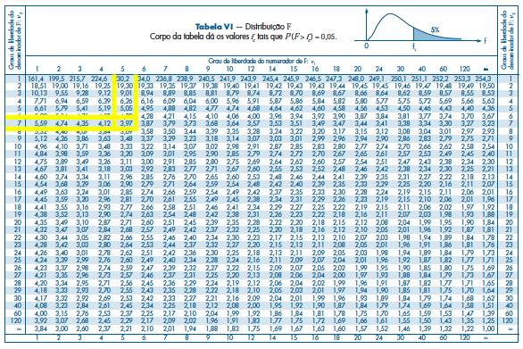

## O Modelo Normal

### A Distribuição Normal

Um dos principais modelos de probabilidade. É essencial para inferência estatística (distribuição Gaussiana).

::: {.callout-note  icon="false" title="DEFINIÇÃO"}

A variável aleatória $X$ tem distribuição normal com Média $\mu$  e Variância $\sigma^{2}$, onde $-\infty<\mu<+\infty$ e $0< \sigma^{2}< \infty$.
Sua densidade é dada por:

$$f(x;\mu, \sigma^{2})=\frac{1}{\sigma \sqrt{2 \pi }} e^{\frac{-(x-\mu)^{2}}{2 \sigma^{2}}}$$

Onde $-\infty<x<+\infty$

:::

Uma Distribuição Normal com parâmetros $\mu$ e $\sigma^{2}$ pode ser representada graficamente como:

```{r}
#| echo = TRUE,
#| fig.cap = "Distribuição Normal",
#| fig.height = 3.5,
#| fig.width = 5
rm(list = ls(all.names = TRUE)) #will clear all objects includes hidden objects.
x<-seq(-3,3,0.1)
fdnorm<-dnorm(x = x, mean = 0, sd=1)  
fdanorm<-pnorm(q = x, mean = 0, sd=1)
curve(dnorm(x,0,1),xlim=c(-3,3),main='',xaxt="n",xlab="z", ylab="f(x)",
      col="darkblue",cex.axis=0.65, cex.lab=0.8) 
axis(1,at=c(-1, 0, 1),labels =
       c("-DP(X)","E(x)","DP(x)"),cex.axis=0.65, cex.lab=0.8) 
lines(x=c(0,0),y=c(0,fdnorm[x==0]),lty=2, col="black") 
lines(x=c(1,1),y=c(0,fdnorm[x==1]),lty=2, col="black")
lines(x=c(-1,-1),y=c(0,fdnorm[x==-1]),lty=2, col="black")

```


Para entender melhor a distribuição Normal e a relação entre a média e o desvio padrão $\sigma$ (- lembrando que $\sigma=\sqrt{variância}$) é interessante notar a proporção nos intervalos de desvio-padrão.

Ou seja, a fração da área abaixo da curva $f(x)$ quando temos as seguintes amplitudes,tabela 1, da variável x na distribuição:


Tabela 1: Intervalos de desvios e probabilidade

<center>

|    Amplitude    | Proporção |
|:---------------:|:---------:|
| $\mu\pm\sigma$  | $68,3\%$  |
| $\mu\pm2\sigma$ | $95,5\%$  |
| $\mu\pm3\sigma$ | $99,7\%$  |

</center>

A figura 2 abaixo representa graficamente o que está colocado na tabela[^5]. Observa-se que a probabilidade de estra entre +1 e -1 desvio padrão é de 68,3%. Isso é válido para qualquer distribuição normal INDEPENDENTE da média e desvio padrão.

[^5]: http://www.portalaction.com.br/probabilidades/62-distribuicao-normal

Vejamos um exemplo de 3 distribuições normais, $X~N(10,9)$, $Y~N(200,100)$ e $Z~N(0,1)$. Dessa forma a chance de estar entre a esperança $\mu$ e um desvio padrão, $\sigma$, ou seja, entre 10 e 13 para X, entre 200 e 210 para Y e entre 0 e 1 para Z, é de 34,15%. Isso vale para qualquer intervalo de desvio (-1,+1); (-1.3,+1.3); (-3,+3) !!!!


{fig-align="center" width="60%"}


\pagebreak

### Momentos:

Os primeiros dois momentos da distribuição normal são:

::: {.callout-note  icon="false" title="DEFINIÇÃO"}

Esperança:
$$E(X)=\mu$$

---

Variância:
$$Var(X)=\sigma^{2}$$
:::

Dessa forma para a distribuição normal as seguintes características são verdadeiras:

-   Se X é normalmente distribuída então $X \sim N(\mu ,\sigma ^{2})$

-   Como pode ser visto na figura 1, a densidade da distribuição é simétrica. Ou seja, para todo $x$ real é verdade que:

$$f(\mu + x; \mu, \sigma ^{2}) = f(\mu - x; \mu, \sigma ^{2})$$

### Normal Padronizada

#### O Modelo

Um caso especial da distribuição normal é aquela que possui média 0 e desvio padrão igual a 1. Recebe até um nome diferenciado, distribuição normal padrão.

::: {.callout-note  icon="false" title="DEFINIÇÃO"}

Uma variável Z normal padrão (ou reduzida) é uma distribuição Normal com parâmetros $\mu=0$ e $\sigma=1$, tal que $Z \sim N(0 ,1)$. 

Assim, essa variável aleatória Z, possui a seguinte f.d.p.: 

$$\phi(Z)= \frac{1}{\sqrt{2\pi}} e^{\frac{-z^{2} }{2}}$$


$-\infty < Z < \infty$

:::

#### Padronização

::: {.callout-note  icon="false" title="TEOREMA"}

Seja $X$ uma variável distribuída normalmente, tal que $X \sim N(\mu ,\sigma ^{2})$ então temos uma variável $Z$ padronizada a partir de $X$ tal que:

$$Z=\frac{X-\mu}{\sigma}$$

A variável $Z$ terá os seguintes momentos: $E(Z)=0$ e $Var(Z)=1$


---


**Prova:**

I.  Média:

$$E(Z)=E(\frac{X-\mu}{\sigma})$$

$$=\frac{1}{\sigma} E(X-\mu)$$

$$=\frac{1}{\sigma} [E(X)-E(\mu)]$$

$$=\frac{1}{\sigma} [E(\mu)-E(\mu)] =0$$


II. Variância:

$$Var(Z)=E(Z ^{2})-E(Z) ^{2}$$

Note que:

$$E(Z ^{2}) = \frac{1}{\sigma^{2}}[E(x-\mu)]^{2}$$

$$=\frac{\sigma^{2}}{\sigma^{2}} = 1$$


E encontramos acima que $E(Z)=0$. Portanto:

$$Var(Z)=E(Z ^{2})-E(Z) ^{2}$$
$$= 1 - 0 = 1$$
:::

#### Função Distribuição Acumulada

::: {.callout-note  icon="false" title="DEFINIÇÃO"}

A f.d.a. $F(y)$ de uma v.a. normalmente distribuída $X$ com média $\mu$ e variância $\sigma^{2}$ é:

$$F(y)=\int_{-\infty}^{y} f(x;\mu,\sigma^{2})dx\ \ \ \ \ y \in \mathbb{R}$$

Onde $f()$ é a função de densidade de probabilidade. 

Para a normal padrão temos a seguinte f.d.a:

$$\Phi(y)=\int_{-\infty}^{y} \phi(Z)= \frac{1}{\sqrt{2\pi}}\int_{-\infty}^{y} e^{\frac{-z^{2} }{2}}dz$$

Onde $\phi(Z)$ é a função de densidade de probabilidade.
:::

As integrais acima correspondem à Área sob $f(x)$ ou $\phi(Z)$ no intervalo de $-\infty$ e $y$. A figura abaixo representa a área entre $-\infty$ e 1 (figura à esquerda) de uma normal padrão com função de densidade $\phi()$ . Já a figura à direita representa a distribuição acumulada $\Phi()$.

```{r}
#| echo = TRUE,
#| fig.cap = "Função Distribuição de Probabilidade Normal e Função Distribuição Acumulada Normal",
#| fig.height = 3.5,
#| fig.width = 7
x<-seq(-3,3,0.1) 
fdnorm<-dnorm(x = x, mean = 0, sd=1)   
fdanorm<-pnorm(q = x, mean = 0, sd=1)
par(mfrow=c(1,2))
regiao=seq(-3,1.5,0.01)
cord.x <- c(min(regiao),regiao,max(regiao))
cord.y <- c(0,dnorm(regiao),0) 
curve(dnorm(x,0,1),xlim=c(-3,3),main='f.d.p',xlab="z",type="l",
      col="darkblue",lwd=2, ylab="f(z)",xaxt="n",cex.axis=0.65, cex.lab=0.8 ) 
axis(1,at=c(-3,-2,-1, 0, 1, 1.5,2, 3),labels =
       c(-3,-2,-1,0,1,"y",2, 3),cex.axis=0.65, cex.lab=0.8) 
polygon(cord.x,cord.y,col='lightgray')

regiao=seq(-3,1.5,0.01)
cord.x <- c(min(regiao),regiao,max(regiao))
cord.y <- c(0,pnorm(regiao),0) 
curve(pnorm(x,0,1),xlim=c(-3,3),main='f.d.a.',xlab="z",type="l",
      col="darkblue",lwd=2, ylab="F(z)",xaxt="n",cex.axis=0.65, cex.lab=0.8 ) 
axis(1,at=c(-3,-2,-1, 0, 1, 1.5,2, 3),labels =
       c(-3,-2,-1,0,1,"y",2, 3),cex.axis=0.65, cex.lab=0.8) 
polygon(cord.x,cord.y,col='lightgray')
```


Suponha que $X \sim N(\mu ,\sigma ^{2})$ e queremos calcular:

$$P(a<X<b)=\int_{a}^{b}f(x) dx$$

Tal que $f(x)$ é a f.d.p. da distribuição Normal. A Figura 5 contém a representação do que queremos calcular.

```{r}
#| echo = TRUE,
#| fig.cap = "Calculando a probabilidade para a Distribuição Normal",
#| fig.height = 3.5,
#| fig.width = 6
x<-seq(0,20,0.1) 
fdnorm<-dnorm(x = x, mean = 10, sd=3)   
regiao=seq(12,15,0.1)
cord.x <- c(min(regiao),regiao,max(regiao))
cord.y <- c(0,dnorm(regiao, mean=10, sd=3),0) 
curve(dnorm(x,10,3),xlim=c(0,20),xlab="x",type="l", 
      col="darkblue",lwd=2, ylab="f(x)",xaxt="n",main="P(a<X<b)",
      cex.axis=0.65, cex.lab=0.8, cex.main=0.7 ) 
axis(1,at=c(0,7, 10, 12,13, 15,20),labels =
       c(0, 7, 10, "a",13,"b",20),cex.axis=0.65, cex.lab=0.8) 
polygon(cord.x, cord.y, col='lightgray')
```

É importante ressaltar que o cálculo da área, entre a e b, só pode ser obtido por integração numérica. Para cada distribuição, com seu $\mu$ e $\sigma$ próprios, teríamos que (re)calcular qual a $P(a<X<b)$.

Então, para simplificar o problema, tentamos fazer a medida em termos de desvio padrão. Quanto que desvimos da média em desvio padrões. Para isso, padronizamos os valores, ouseja, achamos seus equivalentes na distribuição normal padrão. Essa já possui as probabilidades calculadas e disponibilizadas na tabela da Normal Padrão.

Assim, após a transformação em Normal padrão, passamos do cálculo da $P(a<X<b)$ para a $P(a*<Z<b*)$, onde $Z \sim N(0 , 1)$

Podemos consultar o valor da $P(a*<Z<b*)$ já calculado e reportado na tabela da Normal Padrão. A figura 6 abaixo mostra graficamente tal transformação:

```{r}
#| echo = TRUE,
#| fig.cap = "Relação entre as Distribuições Normais e a Normal Padrão",
#| fig.height = 5.5,
#| fig.width = 4
par(mfrow=c(2,1))
x<-seq(0,20,0.1) 
fdnorm<-dnorm(x = x, mean = 10, sd=3)   
regiao=seq(12,15,0.1)
cord.x <- c(min(regiao),regiao,max(regiao))
cord.y <- c(0,dnorm(regiao, mean=10, sd=3),0) 
curve(dnorm(x,10,3),xlim=c(0,20),xlab="x",type="l", 
      col="darkblue",lwd=2, ylab="f(x)",xaxt="n",main="P(a<X<b)",
      cex.axis=0.65, cex.lab=0.8, cex.main=0.7 ) 
axis(1,at=c(0,7, 10, 12,13, 15,20),labels =
       c(0, 7, 10, "a",13,"b",20),cex.axis=0.65, cex.lab=0.8) 
polygon(cord.x, cord.y, col='lightgray')

z<-seq(-3,3,0.1) 
fdnorm<-dnorm(x = x, mean = 0, sd=1)   
regiao=seq(0.66,1.66,0.1)
cord.x <- c(min(regiao),regiao,max(regiao))
cord.y <- c(0,dnorm(regiao, mean=0, sd=1),0) 
curve(dnorm(x,0,1),xlim=c(-3,3),xlab="z",type="l", 
      col="darkblue",lwd=2, ylab="f(z)",xaxt="n",main="P(a'<Z<b')",
      cex.axis=0.65, cex.lab=0.8, cex.main=0.7 ) 
axis(1,at=c(-3,1, 0, 0.66 ,1, 1.66, 3),labels =
       c(-3, 1, 0, "a'",1,"b'",3),cex.axis=0.65, cex.lab=0.8) 
polygon(cord.x, cord.y, col='lightgray')
```

::: {.callout-tip  icon="false" title="EXEMPLO"}

Calcule a $P(0\leq Z \leq Z_c)$ para $Z_c=1,73$
:::


::: {.callout-caution  icon="false" collapse="true" title="RESPOSTA"}

Consultando a tabela da Normal Padrão: 

$P(0\leq Z \leq 1,73)=0,45818$ 

A Figura abaixo mostra como consultamos tal valor na tabela Normal Padrão extraída do livro de Morettin e Bussab (2010).

:::


{#fig-particula fig-align="center" width="70%"}


::: {.callout-tip  icon="false" title="EXEMPLO"}

Depósitos no Banco Ribeirão em janeiro (x) são distribuídos normalmente com média 10000,00 e d.p. 1500,00

Seleciona-se um depósito ao acaso, qual a probabilidade de o depósito ser de:

a. 10 000 ou menos

b. Um valor entre 12 000 e 15 000

c. Maior que 20 000
:::

::: {.callout-caution  icon="false" collapse="true" title="RESPOSTA"}

a. 

$$P(X<10000)=P(Z \leq \frac{10000-10000}{15000})=P(Z\leq 0) = 0,5$$

Portanto, a probabilidade é de $50\%$

b. 

$$P(12000<X<15000)=P(\frac{12000-10000}{15000} < Z < \frac{10000-10000}{15000})$$

$$= P(\frac{4}{3} < Z < \frac{10}{3})$$

$$=P(1,33<Z<3,333)$$

$$=0,49957 - 0,40824 = 0,09133$$

Portanto, a probabilidade é de $9,1\%$

c. 

$$P(X>20000)=P( Z > \frac{20000-10000}{15000})$$

$$= P(Z>6,67) \cong 0$$

Portanto, a probabilidade é praticamente zero.

:::


**O exemplo no R:**


```{r}
#| echo = TRUE,
#| fig.cap = "Distribuição de probabilidade exponecial e Distribuição exponencial acumulada",
#| fig.height = 3.5,
#| fig.width = 6
pnorm(10000,mean=10000,sd=1500)
pnorm(15000,mean=10000,sd=1500)-pnorm(12000,mean=10000,sd=1500)
1-pnorm(20000,mean=10000,sd=1500)
```

::: {.callout-tip  icon="false" title="EXEMPLO"}

A altura de 10000 alunos tem distribuição normal com $\mu=170$ cm e $\sigma=5$ cm.

a) Qual o número esperado de alunos com altura superior a 165 cm?

b) Qual é o intervalo simétrico ao redor da média que contém 75\% dos alunos?

:::


::: {.callout-caution  icon="false" collapse="true" title="RESPOSTA"}

a)

$$P(X>165)= P(Z>\frac{165-170}{5})$$

$$= P(Z>-1)$$

$$=P(Z<1) = 0,34134 + 0,5 = 0,84134$$

Portanto, o número espero de alunos é de 8413 (84,13\% de 10000)


b) 

$$P(-a<Z<a)=0,75$$

$$P(Z<a)=0,375$$

$$a=1,15$$

Disto segue que:

$$1,15= \frac{X-170}{5}$$

$$X_1= 175,75 \ e \ X_2=164,25$$

:::

## O Modelo Exponencial

Útil nas aplicações de contabilidade de sistemas.

### O Modelo Exponencial

::: {.callout-note  icon="false" title="DEFINIÇÃO"}

A v.a T tem distribuição exponencial com parâmetros $\beta>0$ se sua f.d.p. tem a seguinte forma

$$f(t,\beta)=\left\{\begin{matrix} \frac{1}{\beta}e^{\frac{-t}{\beta}}, \ se\ t\geq 0
\\ 0 , \ se\ t< 0 \end{matrix}\right.$$

Tal que $T \sim Exp(\beta )$

:::

### Momentos da Distribuição

A distribuição T possui os seguintes Momentos :

::: {.callout-note  icon="false" title="DEFINIÇÃO"}

Esperança:

$$E(T)=\beta$$

---

Variância:

$$Var(T)=\beta^{2}$$

:::


Considere a distribuição Exponencial para $\beta=1$ e $\beta=4$, ou seja, as esperanças.\

```{r}
#| echo = TRUE,
#| fig.cap = "Distribuição de probabilidade exponecial e Distribuição exponencial acumulada",
#| fig.height = 3.5,
#| fig.width = 6
par(mfrow=c(1,2))
curve(dexp(x,1),xlim=c(0,5),main="f.d.p para X~exponencial(1)",
      xlab="x",type="l", col="darkblue",lwd=2, ylab="f(x)",
      cex.axis=0.65, cex.lab=0.8, cex.main=0.7)
curve(dexp(x,4),xlim=c(0,5),main="f.d.p para X~exponencial(4)",
      xlab="x",type="l", col="darkblue",lwd=2, ylab="f(x)",
      cex.axis=0.65, cex.lab=0.8, cex.main=0.7)
```

### Função Distribuição Acumulada

::: {.callout-note  icon="false" title="DEFINIÇÃO"}

A Distribuição Exponencial possui a seguinte F.d.a:

$$F(t) = \begin{cases} 1 - e^{\frac{-t}{\beta}}, & \text{se } t \ge 0 \\ 0, & \text{se } t < 0 \end{cases}$$

:::


::: {.callout-tip  icon="false" title="EXEMPLO"}

O tempo de vida de uma bactéria é uma v.a. com distribuição exponecial com parâmetro $\beta=500$, portanto, E(T)=500. Qual a probabilidade de que uma bactéria viva acima da média?
:::


::: {.callout-caution  icon="false" collapse="true" title="RESPOSTA"}

$$P(T>500)=\int_{500}^{\infty}f(t)dt$$

$$= \frac{1}{500}\int_{500}^{\infty} e^{\frac{-t}{500}} dt$$

$$=\frac{1}{500}[-500e^{\frac{-t}{500}}]^{\infty}_{500}$$

$$= e^{-1}= 0,3678$$

Portanto, a probabilidade é de 36,7\%

:::

**Fazendo o exemplo no R:**


```{r}
#| echo = TRUE,
#| fig.cap = "Distribuição de probabilidade exponecial e Distribuição exponencial acumulada",
#| fig.height = 3.5,
#| fig.width = 6
1-pexp(500,rate=1/500)
```

## Aproximação da Binomial pela Normal

### Relembrando a Binomial

::: {.callout-tip  icon="false" title="EXEMPLO"}

Considere uma moeda honesta tal que sair cara indica sucesso e coroa indica fracasso. Lançando a moeda 3 vezes, qual a probabilidade de 2 sucessos?
:::


::: {.callout-caution  icon="false" collapse="true" title="RESPOSTA"}

Temos as seguintes possibilidades:

$$A =\{SSF, SFS, FSS\}$$

Então segue que:

$$P(SSF)= \frac{1}{2}. \frac{1}{2}. \frac{1}{2} = \frac{1}{8}$$

$$= p p . q = p^{2}. q$$

Logo $P(A)=\frac{3}{8} = 3 p^{2}. q$

:::

A tabela abaixo contém o cálculo da probabilidade do problema acima:

<center>

| Sucessos | Prob      | p=1/2 |
|----------|-----------|-------|
| 0        | $q^{3}$   | 1/8   |
| 1        | $3pq^{2}$ | 3/8   |
| 2        | $3p^{2}q$ | 3/8   |
| 3        | $p^{3}$   | 1/8   |

</center>

#### Momentos:

::: {.callout-note  icon="false" title="DEFINIÇÃO"}

A distribuição binomial possui os seguintes Momentos:

$E(x)=n. p$

$Var(x)=n.p.q$

E temos que:

$$P(x=k)=\begin{pmatrix} n
\\  k
\end{pmatrix} p ^{k} q ^{n-k}$$


:::

### Aproximação Normal à Binomial

Suponha uma variável Y distribuída pela binomial com parâmetros $n=10$ e $p=\frac{1}{2}$. Suponha que queremos calcular $P(Y \geq 7)$. Isso equivale a calcular:

<center>
| Sucessos | Prob | p=1/2 |
|----------|------|-------|
|   7      |  $\binom{10}{7}p^{7}q^{3}$    |  0,11718  |
|    8      |  $\binom{10}{8}p^{8}q^{2}$     | 0,04394  |
|     9     |  $\binom{10}{9}p^{9}q^{1}$    | 0,00977  |
|      10    |  $\binom{10}{10}p^{10}$   | 0,00098  |
</center>

-   Note que:

$$\binom{10}{7}=\frac{10!}{7! 3!}= \frac{10.9.8}{6}=120$$

$$P(X=7)=120 . \frac{1}{2}^{7}\frac{1}{2}^{3}=0,117$$

-   Aproximando pela normal temos que:

$$ n=10$$

 $$\mu=n.p=10 . \frac{1}{2}=5$$

$$\sigma^{2}=n.p (1-p)=10 \frac{1}{2} \frac{1}{2}=2,5$$

Graficamente, temos:

```{r}
#| echo = TRUE,
#| fig.cap = "Aproximação da Binomial pela Normal",
#| fig.height = 3.5,
#| fig.width = 6
barplot(height = dbinom(0:10,size=10,prob = 1/2),col = "white",ylim=c(0,0.3), 
        ylab="f(x), p(x)", cex.lab=0.8,cex.main=0.7)
par(new=T)
barplot(height = c(rep(0,7),dbinom(7:10,size=10,prob = 1/2)),ylim=c(0,0.3),
        border=c(rep(NA,7),rep("black",4)), col = c(rep(NA,7),rep("gray",4)))
par(new=T)
curve(dnorm(x,mean=5, sd=sqrt(2.5)),xlim=c(-0.8,10.8),ylim=c(0.0,0.3),
      xaxs="i",yaxs="i",ylab="") 

```

-   Sendo X uma v.a. com distribuição normal então:

$$P(Y \geq 7) \cong P(X \geq 6,5)= P(\frac{x-\mu}{\sigma}\geq \frac{6,5-\mu}{\sigma})$$

$$P(Z \geq \frac{6,5-\mu}{\sigma})= P(Z \geq 0,94) = 0,1714$$

onde $Z \sim N(0,1)$

-   A probabilidade encontrada pela Normal é de 0,1718 enquanto pela aproximação encontramos que é de 0,1714.

-   Formalmente, justifica-se tal aproximação pelo Teorema do Limite Central.

    
**Fazendo o exemplo no R:**
    

$P(Y \geq 7)$

```{r}
#| echo = TRUE
1-pbinom(6,size=10,prob=1/2)
```

$P(X \geq 6.5)$

```{r}
#| echo = TRUE
1-pnorm(6.5,mean=5,sd=sqrt(2.5))
```

::: {.callout-tip  icon="false" title="EXEMPLO"}

De um lote de produtos manufaturados, sorteamos 100 itens ao acaso. Sabemos que 10\% dos itens produzidos possuem defeitos. Qual a chance que dos 100 sorteados 12 sejam defeituosos? Use a aproximação pela normal.
:::


::: {.callout-caution  icon="false" collapse="true" title="RESPOSTA"}

$X \sim b(100;0,)$

Considere p= número de defeituosos. Pela aproximação pela Normal temos que $E (x)=100.0,1=10$ e $Var(x)=100. 0,1 . 0,9 =9$. Disto segue que:

$$P(x-12)=\binom{100}{12}. (0,1)^{12} (0,9)^{88}
=\frac{100!}{12! 88!}(0,1)^{12} (0,9)^{88}= 0,0987$$

Portanto, aproximando pela Normal temos a distribuição:

$$Y \sim N(10;9)$$

$$P(Y=12)=P(11,5 \leq X \leq 12,5)$$

$$=P(\frac{11,5-10}{9}\leq Z \leq \frac{12,5-10}{9})$$

$$=P(0,5 \leq Z \leq 0,83)$$ 

$$=0,29673-0,19146=0,1052$$

Portanto, a probabilidade é de 10,5\%

:::

## Distribuição Gama

### O Modelo Gama

Uma variável aleatória contínua X que assume valores positivos tem distribuição Gama, com parâmetros $\alpha \geq 1$ e $\beta>0$, com f.d.p. dada por: 

::: {.callout-note  icon="false" title="DEFINIÇÃO"}
$$
f(x;\beta,\alpha) = \begin{cases} 
\frac{1}{\Gamma(\alpha)\beta^{\alpha}}x^{\alpha -1} e^{\frac{-x}{\beta}}, & x > 0 \\ 
0, & x \leq 0 
\end{cases}
$$

Sendo $\Gamma(\alpha)$ a Função Gama:

$$
\Gamma(\alpha) = \int_{0}^{\infty} e^{-x}x^{\alpha-1}dx \quad , \quad \alpha > 0
$$
:::

O gráfico abaixo mostra como a distribuição muda com a alteração dos parâmetros $\alpha$ e para $\beta=1$:

```{r}
#| echo = TRUE,
#| fig.cap = "Distribuição Gamma, para Beta=1 e Alfa variando",
#| fig.height = 3.5,
#| fig.width = 6
col <- rainbow(3)
a <- c(1,2,5)
plot(0,0,xlab="x",ylab="Dist. de Prob. Gamma",
     xlim = c(0,8),ylim = c(0,1),
      cex.axis=0.65, cex.lab=0.8, cex.main=0.7)
for (i in 1:3)
{
  lines(seq(0,8,by=0.01),dgamma(seq(0,8,by=0.01),a[i],1),col = col[i])
}
legend(1, 1, legend=c("alfa=1", "alfa=2", "alfa=5"),
       col=c("red", "green", "blue"), lty=1:1, cex=0.8)
```

### Momentos

::: {.callout-note  icon="false" title="DEFINIÇÃO"}

Se $X \sim Gama(\alpha, \beta)$ então possui os seguintes momentos:

Esperança:
$$E(X)=\alpha \beta$$

---

Variância:
$$Var(X)=\alpha \beta^{2}$$
:::

## Distribuição Qui-Quadrado

### O Modelo Qui-Quadrado

::: {.callout-note  icon="false" title="DEFINIÇÃO"}
Uma variável aleatória contínua Y que assume valores positivos tem distribuição Qui-Quadrado com v graus de liberdade - $\chi^ {2}(v)$ - e possui a seguinte f.d.p.:  

$$f(x;\beta,\alpha)=\left\{\begin{matrix} \frac{1}{\Gamma (v/2) 2^{v/2}}y^{(v/2) -1} e^{\frac{-y}{2}} \ , \ y>0
\\ 
\\
0 \  \ \ \ \ \ \ \ \ , \ y\leq 0
\end{matrix}\right.$$

:::

Abaixo, temos a representação gráfica da Qui-Quadrado com diversos graus de liberdade (d.f.):

```{r}
#| echo = TRUE,
#| fig.cap = "Distribuição Qui-Quadrado para diferentes graus de liberdade (gl)",
#| fig.height = 3.5,
#| fig.width = 7
par(mfrow=c(1,3))
curve(dchisq(x,df=1),xlim=c(0,20),xlab="x", ylab="Dist. Prob. Qui-Quadrado", 
      main="(a) df=2", col="darkblue",lwd=3,
      cex.axis=0.65, cex.lab=0.8, cex.main=0.7)
curve(dchisq(x,df=4),xlim=c(0,20),xlab="x", ylab="", 
      main="(a) df=4", col="darkblue",lwd=3,
      cex.axis=0.65, cex.lab=0.8, cex.main=0.7)
curve(dchisq(x,df=6),xlim=c(0,20),xlab="x", ylab="", 
      main="(a) df=6", col="darkblue",lwd=3,
      cex.axis=0.65, cex.lab=0.8, cex.main=0.7)


```

### Momentos

::: {.callout-note  icon="false" title="DEFINIÇÃO"}

A distribuição Qui-Quadrado com v graus de liberdade possui os seguintes momentos:
Esperança:
$E(Y)=v$


---


Variância:
$Var(Y)=2v$
:::

Existem tabelas para obter uma probabilidade $P(Y>y_0)$ quando Y é uma variável com distribuição Qui-Quadrado. Além disso, quando $v>30$ podemos utilizar a aproximação normal para a distribuição Qui-Quadrado.

### Resultados importantes

Temos dois resultados importantes:

::: {.callout-note  icon="false" title="DEFINIÇÃO"}

(1) O quadrado de uma v.a. com distribuição normal padrão é uma v.a. com distribuição $\chi^{2}(1)$


---


(2) Uma variável aleatória $\chi^{2}(V)$ é equivalente à soma de V normais padrões ao quadrado
:::

## Distribuição t-student

### O Modelo t-student

::: {.callout-note  icon="false" title="DEFINIÇÃO"}

Sejam as v.a. independentes $X \sim N(0,1)$ e $Y \sim \chi^{2}(v)$. Considere T:

$$T =\frac{X}{\sqrt{\frac{Y}{v}}}$$

Então T tem distribuição t-student com V graus de liberdade. Então, uma variável aleatória contínua com distribuição T tem a seguinte f.d.p.:

$$f(t,;v)= \frac{\Gamma((v+1)/2) }{\Gamma(v/2)\sqrt{\pi v}} (1+ t^{2}/v)^{\frac{-(v+1)}{2}}$$
$\infty < t < \infty$

:::

Para $v$ suficientemente grande, a densidade de $t$ aproxima-se da $N(0,1)$. Vejamos:

```{r}
#| echo = TRUE,
#| fig.cap = "Distribuição t-student para diferentes graus de liberdade (gl)",
#| fig.height = 3.5,
#| fig.width = 6
curve(dnorm(x),ylim=c(0,0.4),xlim=c(-3,3),xlab="x",col="darkred",
      ylab="Dist. Prob. t-student",lwd=3)
par(new=TRUE)
curve(dt(x,df=1),ylim=c(0,0.4),xlim=c(-3,3),xlab="",col="orange",
      lty=1,ylab="")
par(new=TRUE)
curve(dt(x,df=3),ylim=c(0,0.4),xlim=c(-3,3),xlab="",col="darkgreen",
      lty=1,ylab="")
par(new=TRUE)
curve(dt(x,df=15),ylim=c(0,0.4),xlim=c(-3,3),xlab="",col="blue",
      lty=1,ylab="") 
legend(-3,0.4,lty=c(1,1,1,1), col=c("darkred","orange","darkgreen","blue"),
       legend=c("normal padrão", "t-gl=1","t-gl=3", "t-gl=15"),
       bty="n",lwd=c(2,2,2,2),cex=0.75)
```

Observe que quanto maior o grau de liberdade, gl, mais próximo à normal padrão a distribuição de t-student se encontra.

### Momentos

::: {.callout-note  icon="false" title="DEFINIÇÃO"}

A distribuição t-student com $v$ graus de liberdade possui os seguintes momentos:
Esperança:
$E(t)=0$


---


Variância:
$Var(t)=\frac{v}{v-2}$
:::

## Distribuição F

### O Modelo F

::: {.callout-note  icon="false" title="DEFINIÇÃO"}

Sejam U e V duas v.a. independentes, cada uma com distribuição qui-quadrado com $v_1$ e $v_2$ graus de liberdade. Então a v.a.

$$W=\frac{U/v_1}{V/v_2}$$

possui distribuição F com $v_1$ e $v_2$  graus de liberdade, tal que $W \sim F(v_1,v_2)$. 
Dessa forma, uma variável aleatória contínua com distribuição F tem a seguinte f.d.p.:

$$f(t,;v)= \frac{\Gamma((v_1+v_2)/2) }{\Gamma(v_1/2)\Gamma(v_2/2) } {(\frac{v_1}{v_2})}^{v1/2}\frac{w^{(v_1-2)/2}}{(1+v_1w/v_2)^{(v_1+v_2)/2}}$$
Para $w>0$

:::

### Momentos

::: {.callout-note  icon="false" title="DEFINIÇÃO"}

A distribuição F possui os seguites momentos:


Esperança:

$$E(W)=\frac{v_1}{v_1-v_2}$$


---


Variância:

$$Var(W)=\frac{2 v_2^{2}(v_1+v_2-2)}{v_1(v_2-2)^{2}(v_2-4)}$$

:::

Gráficos da distribuição para diferentes combinações de $v_1$ e $v_2$.

```{r}
#| echo = TRUE,
#| fig.cap = "Distribuição de Probabilidade F",
#| fig.height = 3.5,
#| fig.width = 6
x<-seq(0,10,0.1) 
curve(df(x,df1=2, df2=2),ylim=c(0,1),xlim=c(0,4),xlab="x",
      col="orange",lty=1,ylab="Distribuição de Prob. F")
par(new=TRUE)
curve(df(x,df1=5, df2=7),ylim=c(0,1),xlim=c(0,4),xlab="",
      col="darkblue",lty=1,ylab="")
par(new=TRUE)
curve(df(x,df1=20, df2=20),ylim=c(0,1),xlim=c(0,4),xlab="",
      col="darkgreen",lty=1,ylab="")
legend(2,1,lty=c(1,1,1,1), col=c("orange","darkblue","darkgreen"),
       legend=c("gl1=2; gl2=2", "gl1=5; gl2=7","gl1=20; gl2=20")
       ,bty="n",lwd=c(2,2,2,2),cex=0.75)
```

**Um exemplo**

Suponha que desejamos encontrar $P(F(v_1,v_2)> F_{\alpha})$. Isso é equivalente à encontrar a área $\alpha$ da figura abaixo, tal que $P(F(v_1,v_2)> F_{alpha})=\alpha$.


```{r}
#| echo = TRUE,
#| fig.cap = "Encontrando a Probabilidade para Distribuição de Probabilidade F",
#| fig.height = 3.5,
#| fig.width = 6
x<-seq(0,10,0.1)
regiao=seq(2.5,4,0.01)
cord.x <- c(min(regiao),regiao,max(regiao))
cord.y <- c(0,df(regiao,df1=5, df2=7),0) 
curve(df(x,df1=5, df2=7),xlim=c(0,4),ylim=c(0,1),xaxt='n', xlab="x",
      ylab="Dist. Prob. F",xaxs="i",yaxs="i",col="darkblue",lwd=2,
      cex.axis=0.65, cex.lab=0.8) 
axis(1,at=c(0,1, 2, 2.5,3, 4),labels =
       c(0,1, 2, "a" ,3, 4),cex.axis=0.65, cex.lab=0.8) 
polygon(cord.x,cord.y,col='lightgray')
```

Para valores inferiores temos que:

$$F(v_1,v_2)=\frac{1}{F(v_2,v_1)}$$

::: {.callout-tip  icon="false" title="EXEMPLO"}

Seja $W \sim F(5,7)$.Calcule o valor de $F_{\alpha}$ tal que: 


$P(F>F_{\alpha})=0,05$ e $P(F \leq F_{\alpha})=0,95$ 
:::

::: {.callout-caution  icon="false" collapse="true" title="RESPOSTA"}

Consultando a tabela para a distribuição F retirada de Morettin e Bussab (2010) e representada abaixo temos que: 


$P(F>F_{\alpha})=0,05$ e $P(F \leq F_{\alpha})=0,95$  para $F_{\alpha}=3,97$
:::


{fig-align="center" width="80%"}


::: {.callout-tip  icon="false" title="EXEMPLO"}

Seja $W \sim F(5,7)$. Calcule $P(F<F_{\alpha})=0,05$.

:::

::: {.callout-caution  icon="false" collapse="true" title="RESPOSTA"}

$$P(F(5,7)<F_{\alpha})= P(\frac{1}{F(7,5)}<F_{\alpha})=P(F(7,5)>\frac{1}{F_{\alpha}})$$

Pela tabela:

$$\frac{1}{F_{\alpha}}=4,8 \rightarrow F_{\alpha}=0,205$$

:::

## Links 

::: {.grid}

::: {.g-col-3}
🎞️ <span style="font-size:20px; font-weight:bold;">SLIDES</span>  

<!-- [Slides VA Multidi](https://drive.google.com/file/d/1LmwZ2DJQ1EF0awGGthYC1nYTBPiOBysM/view?usp=sharing)

[Slides Marg. e Cond.](https://drive.google.com/file/d/1AeRgvXxchfQ91fwPS5APN2BAYZLLbPd1/view?usp=sharing)

[Slides Correlação](https://drive.google.com/file/d/1qWVvjy75q6ABd31vl-8KE7LYdiYOeFuz/view?usp=sharing) -->


Arquivos em HTML (zip) das aulas.
:::

::: {.g-col-3}
📊 <span style="font-size:20px; font-weight:bold;">MATERIAL APLICADO</span>  

<!-- [Acessar Material](https://docs.google.com/spreadsheets/d/1ho_UZXTqqTCUp2NGSMCfd6su5eIlEx7Z/edit?usp=sharing&ouid=113043354924613672342&rtpof=true&sd=true) -->

Bases de dados e exercícios em Excel.
:::

::: {.g-col-3}
💻 <span style="font-size:20px; font-weight:bold;">SCRIPT R</span>  

<!-- [Acessar Scripts R](https://SEU_LINK_R) -->

Códigos utilizados nas aulas em R.
:::

::: {.g-col-3}
🐍 <span style="font-size:20px; font-weight:bold;">SCRIPT PYTHON</span>  

<!-- [Acessar Scripts Python](https://SEU_LINK_PYTHON) -->

Códigos utilizados nas aulas em Python.
:::

:::

## Exercícios

### Exercício 1 (Morettin & Bussab, cap. 7, ex. 15)

**Tema:** Distribuição normal: cálculo de probabilidades e intervalo central.

Para $X \sim N(100,100)$, calcule:

a) $P(X<115)$;

b) $P(X\geq 80)$;

c) $P(|X-100|\leq 10)$;

d) o valor $a$ tal que

$$P(100-a \leq X \leq 100+a)=0{,}95.$$

**Interpretação econômica pedida:** interprete $X$ como uma variável econômica sujeita a flutuações em torno de um valor-alvo de 100.

::: {.callout-caution icon="false" collapse="true" title="RESPOSTA"}
Temos
$$X\sim N(100,100).$$
Na convenção usada no curso e no livro, isso significa que
$$\mu=100 \qquad \text{e} \qquad \sigma^2=100,$$
logo
$$\sigma=10.$$
Padronizando,
$$Z=\frac{X-\mu}{\sigma}=\frac{X-100}{10}\sim N(0,1).$$

**a) Calcular $P(X<115)$**

$$P(X<115)=P\!\left(\frac{X-100}{10}<\frac{115-100}{10}\right)=P(Z<1{,}5).$$
Da tabela da normal padrão,
$$P(Z<1{,}5)\approx 0{,}9332.$$
Portanto,
$$\boxed{P(X<115)\approx 0{,}9332.}$$

**b) Calcular $P(X\ge 80)$**

$$P(X\ge 80)=P\!\left(\frac{X-100}{10}\ge \frac{80-100}{10}\right)=P(Z\ge -2).$$
Pela simetria da normal padrão,
$$P(Z\ge -2)=P(Z\le 2)\approx 0{,}9772.$$
Logo,
$$\boxed{P(X\ge 80)\approx 0{,}9772.}$$

**c) Calcular $P(|X-100|\le 10)$**

A condição $|X-100|\le 10$ equivale a
$$90\le X\le 110.$$
Padronizando os limites,
$$P(90\le X\le 110)=P\!\left(\frac{90-100}{10}\le Z\le \frac{110-100}{10}\right)=P(-1\le Z\le 1).$$
Da tabela,
$$P(-1\le Z\le 1)\approx 0{,}6827.$$
Assim,
$$\boxed{P(|X-100|\le 10)\approx 0{,}6827.}$$

**d) Encontrar $a$ tal que $P(100-a\le X\le 100+a)=0{,}95$**

Padronizando,
$$P(100-a\le X\le 100+a)=P\!\left(-\frac{a}{10}\le Z\le \frac{a}{10}\right)=0{,}95.$$
Na normal padrão, o intervalo central de 95% é aproximadamente
$$-1{,}96\le Z\le 1{,}96.$$
Logo,
$$\frac{a}{10}=1{,}96 \quad \Longrightarrow \quad a=19{,}6.$$
Portanto,
$$\boxed{a=19{,}6.}$$

**Interpretação econômica:** esse item fornece uma faixa de oscilação "normal" em torno de um valor-alvo 100, algo útil para metas de inflação, vendas ou produção.
:::

### Exercício 2 (Morettin & Bussab, cap. 7, ex. 18)

**Tema:** Distribuição normal aplicada a demanda.

As vendas de determinado produto têm distribuição aproximadamente normal, com média 500 unidades e desvio padrão 50 unidades. Se a empresa decide fabricar 600 unidades no mês em estudo, qual é a probabilidade de que não possa atender a todos os pedidos desse mês, por estar com a produção esgotada?

**Interpretação econômica pedida:** interprete o resultado como probabilidade de ruptura de estoque.

::: {.callout-caution icon="false" collapse="true" title="RESPOSTA"}
Seja $X$ a demanda mensal. O enunciado diz que
$$X\sim N(500,50^2).$$
Assim,
$$\mu=500, \qquad \sigma=50.$$
Haverá falta de estoque quando a demanda for maior que 600 unidades. Então queremos
$$P(X>600).$$
Padronizando,
$$P(X>600)=P\!\left(\frac{X-500}{50}>\frac{600-500}{50}\right)=P(Z>2).$$
Da tabela da normal padrão,
$$P(Z>2)=1-\Phi(2)\approx 1-0{,}9772=0{,}0228.$$
Logo,
$$\boxed{P(X>600)\approx 0{,}0228.}$$

**Interpretação econômica:** a probabilidade de ruptura de estoque é de aproximadamente 2,28%, indicando que produzir 600 unidades gera uma margem relativamente confortável para atender à demanda.
:::

### Exercício 3 (Morettin & Bussab, cap. 7, ex. 19)

**Tema:** Comparação entre distribuições normais.

Suponha que as amplitudes de vida de dois aparelhos elétricos, $D_1$ e $D_2$, tenham distribuições

$$D_1 \sim N(42,36) \qquad \text{e} \qquad D_2 \sim N(45,9),$$

respectivamente. Se os aparelhos são feitos para ser usados por um período de 45 horas, qual aparelho deve ser preferido? E se for por um período de 49 horas?

**Interpretação econômica pedida:** interprete a escolha como uma decisão entre dois ativos com diferentes médias e riscos.

::: {.callout-caution icon="false" collapse="true" title="RESPOSTA"}
A ideia é comparar, para cada horizonte de uso, qual aparelho tem maior probabilidade de durar *mais* do que o tempo necessário.

Temos:
$$D_1\sim N(42,36) \quad \Longrightarrow \quad \mu_1=42,\; \sigma_1=6,$$
$$D_2\sim N(45,9) \quad \Longrightarrow \quad \mu_2=45,\; \sigma_2=3.$$

**Para 45 horas**

Precisamos comparar $P(D_1>45)$ e $P(D_2>45)$.

Para $D_1$:
$$P(D_1>45)=P\!\left(Z>\frac{45-42}{6}\right)=P(Z>0{,}5)\approx 0{,}3085.$$

Para $D_2$:
$$P(D_2>45)=P\!\left(Z>\frac{45-45}{3}\right)=P(Z>0)=0{,}5.$$

Como
$$0{,}5>0{,}3085,$$
o aparelho preferível para uso de 45 horas é **$D_2$**.

**Para 49 horas**

Agora comparamos $P(D_1>49)$ e $P(D_2>49)$.

Para $D_1$:
$$P(D_1>49)=P\!\left(Z>\frac{49-42}{6}\right)=P(Z>1{,}1667)\approx 0{,}1217.$$

Para $D_2$:
$$P(D_2>49)=P\!\left(Z>\frac{49-45}{3}\right)=P(Z>1{,}3333)\approx 0{,}0912.$$

Como
$$0{,}1217>0{,}0912,$$
o aparelho preferível para uso de 49 horas é **$D_1$**.

**Interpretação econômica:** um ativo com maior média não é necessariamente melhor em todos os horizontes; o risco, medido pela dispersão, também afeta a decisão.
:::

### Exercício 4 (Morettin & Bussab, cap. 7, ex. 22)

**Tema:** Aproximação normal da distribuição binomial.

Seja $Y$ com distribuição binomial de parâmetros $n=10$ e $p=0{,}4$. Determine a aproximação normal para:

a) $P(3<Y<8)$;

b) $P(Y\geq 7)$;

c) $P(Y<5)$.

**Interpretação econômica pedida:** explique por que a aproximação normal pode ser útil quando a distribuição exata é discreta.

::: {.callout-caution icon="false" collapse="true" title="RESPOSTA"}
Se
$$Y\sim \operatorname{Bin}(10,0{,}4),$$
então a aproximação normal é
$$Y\approx N(np,np(1-p))=N(4,2{,}4).$$
Assim,
$$\mu=np=4, \qquad \sigma=\sqrt{2{,}4}\approx 1{,}549.$$
Como a variável original é discreta, vamos usar **correção de continuidade**.

**a) Aproximar $P(3<Y<8)$**

Como $Y$ é discreta,
$$3<Y<8 \iff Y\in\{4,5,6,7\} \iff 4\le Y\le 7.$$
Com correção de continuidade,
$$P(4\le Y\le 7)\approx P(3{,}5<Y<7{,}5).$$
Padronizando,
$$P(3{,}5<Y<7{,}5)=P\!\left(\frac{3{,}5-4}{1{,}549}<Z<\frac{7{,}5-4}{1{,}549}\right).$$
Logo,
$$P(-0{,}323<Z<2{,}259).$$
Da tabela,
$$P(-0{,}323<Z<2{,}259)\approx 0{,}6146.$$
Portanto,
$$\boxed{P(3<Y<8)\approx 0{,}6146.}$$

**b) Aproximar $P(Y\ge 7)$**

Com correção de continuidade,
$$P(Y\ge 7)\approx P(Y>6{,}5).$$
Então,
$$P(Y>6{,}5)=P\!\left(Z>\frac{6{,}5-4}{1{,}549}\right)=P(Z>1{,}614).$$
Da tabela,
$$P(Z>1{,}614)\approx 0{,}0533.$$
Logo,
$$\boxed{P(Y\ge 7)\approx 0{,}0533.}$$

**c) Aproximar $P(Y<5)$**

Como $Y$ é discreta,
$$Y<5 \iff Y\le 4.$$
Com correção de continuidade,
$$P(Y\le 4)\approx P(Y<4{,}5).$$
Padronizando,
$$P(Y<4{,}5)=P\!\left(Z<\frac{4{,}5-4}{1{,}549}\right)=P(Z<0{,}323).$$
Da tabela,
$$P(Z<0{,}323)\approx 0{,}6266.$$
Portanto,
$$\boxed{P(Y<5)\approx 0{,}6266.}$$

**Interpretação econômica:** a aproximação normal simplifica cálculos de probabilidades binomiais, especialmente quando se quer obter rapidamente uma aproximação para eventos discretos.
:::

### Exercício 5 (Morettin & Bussab, cap. 7, ex. 23)

**Tema:** Probabilidade pontual na binomial e aproximação normal.

De um lote de produtos manufaturados, extraímos 100 itens ao acaso; se 10% do lote são defeituosos, calcule a probabilidade de 12 itens serem defeituosos. Use também a aproximação normal.

**Interpretação econômica pedida:** interprete o resultado como a chance de um desvio específico em relação à taxa média de defeitos.

::: {.callout-caution icon="false" collapse="true" title="RESPOSTA"}
Se a proporção de defeituosos é 10% e retiramos 100 itens ao acaso, então o número de defeituosos pode ser modelado por
$$X\sim \operatorname{Bin}(100,0{,}1).$$

**1) Probabilidade exata**

A fórmula da binomial é
$$P(X=k)=\binom{n}{k}p^k(1-p)^{n-k}.$$
Neste caso, $n=100$, $k=12$ e $p=0{,}1$. Logo,
$$P(X=12)=\binom{100}{12}(0{,}1)^{12}(0{,}9)^{88}.$$
Calculando numericamente,
$$\boxed{P(X=12)\approx 0{,}0988.}$$

**2) Aproximação normal**

Como
$$\mu=np=100\cdot 0{,}1=10,$$
$$\sigma^2=np(1-p)=100\cdot 0{,}1\cdot 0{,}9=9,$$
segue que
$$\sigma=3.$$
Assim,
$$X\approx N(10,9).$$

Queremos aproximar a probabilidade pontual $P(X=12)$. Como a variável original é discreta, usamos correção de continuidade:
$$P(X=12)\approx P(11{,}5<X<12{,}5).$$
Padronizando os limites,
$$P(11{,}5<X<12{,}5)=P\!\left(\frac{11{,}5-10}{3}<Z<\frac{12{,}5-10}{3}\right).$$
Isto é,
$$P(0{,}5<Z<0{,}8333).$$
Então,
$$P(X=12)\approx \Phi(0{,}8333)-\Phi(0{,}5)\approx 0{,}1062.$$
Logo,
$$\boxed{P(X=12)\approx 0{,}1062 \quad \text{(aproximação normal).}}$$

**Comparação final**
$$\text{Exata }\approx 0{,}0988, \qquad \text{Normal }\approx 0{,}1062.$$

**Interpretação econômica:** o resultado mede a chance de observar 12 defeituosos, isto é, um número ligeiramente acima da média esperada de 10 defeitos em 100 itens.
:::

### Exercício 6 (Morettin & Bussab, cap. 7, ex. 34)

**Tema:** Distribuição normal em controle de qualidade.

O peso bruto de latas de conserva é uma v.a. normal, com média 1.000 g e desvio padrão 20 g.

a) Qual a probabilidade de uma lata pesar menos de 980 g?

b) Qual a probabilidade de uma lata pesar mais de 1010 g?

**Interpretação econômica pedida:** relacione os resultados a problemas de subenchimento e excesso de peso.

::: {.callout-caution icon="false" collapse="true" title="RESPOSTA"}
Se
$$X\sim N(1000,20^2),$$
então
$$\mu=1000, \qquad \sigma=20.$$

**a) Calcular $P(X<980)$**

$$P(X<980)=P\!\left(\frac{X-1000}{20}<\frac{980-1000}{20}\right)=P(Z<-1).$$
Da tabela da normal padrão,
$$P(Z<-1)\approx 0{,}1587.$$
Portanto,
$$\boxed{P(X<980)\approx 0{,}1587.}$$

**b) Calcular $P(X>1010)$**

$$P(X>1010)=P\!\left(\frac{X-1000}{20}>\frac{1010-1000}{20}\right)=P(Z>0{,}5).$$
Da tabela,
$$P(Z>0{,}5)\approx 0{,}3085.$$
Logo,
$$\boxed{P(X>1010)\approx 0{,}3085.}$$

**Interpretação econômica:** a parte (a) mede o risco de subenchimento; a parte (b), o risco de exceder o peso-alvo, o que pode elevar custos de produção.
:::

### Exercício 7 (Morettin & Bussab, cap. 7, ex. 59)

**Tema:** Aproximação normal da distribuição qui-quadrado.

Usando a aproximação normal a uma variável qui-quadrado, calcular:

a) $$P\bigl(\chi^2_{(35)} > 49{,}76\bigr);$$

b) o valor $y$ tal que $$P\bigl(\chi^2_{(40)} > y\bigr)=0{,}05.$$

**Interpretação econômica pedida:** discuta brevemente por que aproximações são úteis quando a distribuição exata é menos prática para cálculo manual.

::: {.callout-caution icon="false" collapse="true" title="RESPOSTA"}
Usaremos a aproximação
$$\chi^2(\nu)\approx N(\nu,2\nu).$$

**a) Aproximar $P(\chi^2(35)>49{,}76)$**

Se $\nu=35$, então
$$\chi^2(35)\approx N(35,70).$$
Logo,
$$P(\chi^2(35)>49{,}76)\approx P\!\left(Z>\frac{49{,}76-35}{\sqrt{70}}\right).$$
Calculando o valor padronizado,
$$\frac{49{,}76-35}{\sqrt{70}}\approx 1{,}764.$$
Assim,
$$P(\chi^2(35)>49{,}76)\approx P(Z>1{,}764)\approx 0{,}0389.$$
Portanto,
$$\boxed{P(\chi^2(35)>49{,}76)\approx 0{,}0389.}$$

**b) Encontrar $y$ tal que $P(\chi^2(40)>y)=0{,}05$**

Se $\nu=40$, então
$$\chi^2(40)\approx N(40,80).$$
A condição
$$P(\chi^2(40)>y)=0{,}05$$
é equivalente a
$$P(\chi^2(40)\le y)=0{,}95.$$
Na normal padrão, o percentil de 95% é aproximadamente 1,645. Portanto,
$$\frac{y-40}{\sqrt{80}}=1{,}645.$$
Logo,
$$y=40+1{,}645\sqrt{80}.$$
Como
$$\sqrt{80}\approx 8{,}944,$$
obtemos
$$y\approx 40+1{,}645\cdot 8{,}944\approx 54{,}71.$$
Portanto,
$$\boxed{y\approx 54{,}71.}$$

**Interpretação econômica:** aproximações desse tipo são úteis quando a distribuição exata é menos prática para cálculo manual ou quando se quer uma resposta rápida sem recorrer a tabelas específicas.
:::

### Exercício 8 (ANPEC 2006)

**Tema:** Relações fundamentais entre as distribuições Normal, $\chi^2$, $t$ e $F$.

São corretas as afirmativas:

a) Se $Y$ é uma variável aleatória Normal, com média 0 e variância 1; se $X$ segue uma Qui-quadrado com $r$ graus de liberdade; e se $Y$ e $X$ são independentes, então

$$Z=\frac{Y}{\sqrt{X/r}}$$

segue uma distribuição $t$ com $r$ graus de liberdade.

b) Sejam $Y$ e $X$ variáveis aleatórias com distribuições Qui-quadrado com $p$ e $q$ graus de liberdade, respectivamente. Portanto,

$$Z=\frac{Y/p}{X/q}$$

segue uma distribuição $F$ com $p$ e $q$ graus de liberdade.

::: {.callout-caution icon="false" collapse="true" title="RESPOSTA"}

a) **V** Se $Y\sim N(0,1)$, $X\sim \chi^2(r)$ e $Y$ e $X$ são independentes, então por definição
$$Z=\frac{Y}{\sqrt{X/r}}\sim t(r).$$
Portanto, o item (a) é verdadeiro.

b) **F** A caracterização da distribuição $F$ exige que as duas variáveis qui-quadrado envolvidas sejam independentes. A forma correta seria:
$$\text{se } Y\sim \chi^2(p),\; X\sim \chi^2(q) \text{ e } X \text{ e } Y \text{ são independentes, então}$$
$$Z=\frac{Y/p}{X/q}\sim F(p,q).$$
Como o enunciado do item (b) não informa independência, ele está incompleto e, portanto, deve ser considerado falso *como escrito*.

**Gabarito:** **V, F**.

**Interpretação econômica:** essas relações são fundamentais para testes de hipótese e construção de intervalos de confiança em econometria e estatística aplicada.
:::

### Exercício 9 (ANPEC 2023 --- Questão 06)

**Tema:** Distribuição binomial em contexto econômico.

Supondo que a taxa de desemprego de determinado país corresponda a 10% da população economicamente ativa (PEA), verifique se as afirmativas abaixo sobre esse país são corretas:

a) Em uma amostra aleatória de 10 indivíduos da PEA, a probabilidade de que nenhum desses 10 indivíduos esteja desempregado é

$$10 \times (0{,}9)^{10}.$$

b) Em uma amostra aleatória de 10 indivíduos da PEA, a probabilidade de encontrar exatamente dois desempregados é

$$45 \times (0{,}1)^2 \times (0{,}9)^8.$$

c) Em uma amostra aleatória de 5 indivíduos da PEA, a probabilidade de 2 ou mais desses indivíduos estarem desempregados é

$$1-(0{,}9)^5-0{,}5\times (0{,}9)^4.$$

d) A probabilidade de encontrar 10 desempregados em uma amostra aleatória de 10 indivíduos da PEA é igual à probabilidade de encontrar 5 desempregados em uma amostra aleatória de 5 indivíduos da PEA.

e) Em uma amostra aleatória de 3 indivíduos da PEA, a probabilidade de encontrar exatamente dois desempregados é igual a 0,027.

::: {.callout-caution icon="false" collapse="true" title="RESPOSTA"}
Aqui modelamos o número de desempregados em cada amostra por uma binomial com
$$p=0{,}1.$$

a) **F** Em uma amostra de 10 indivíduos, a probabilidade de nenhum desempregado é
$$P(X=0)=\binom{10}{0}(0{,}1)^0(0{,}9)^{10}=(0{,}9)^{10}.$$
O fator $10\times (0{,}9)^{10}$ está errado. Portanto, o item é falso.

b) **V** Em uma amostra de 10 indivíduos, a probabilidade de exatamente 2 desempregados é
$$P(X=2)=\binom{10}{2}(0{,}1)^2(0{,}9)^8.$$
Como
$$\binom{10}{2}=45,$$
obtemos exatamente a expressão do enunciado:
$$45(0{,}1)^2(0{,}9)^8.$$

c) **V** Seja agora $X\sim \operatorname{Bin}(5,0{,}1)$. Queremos a probabilidade de 2 ou mais desempregados:
$$P(X\ge 2)=1-P(X=0)-P(X=1).$$
Calculando cada parcela:
$$P(X=0)=(0{,}9)^5,$$
$$P(X=1)=\binom{5}{1}(0{,}1)(0{,}9)^4=5\cdot 0{,}1\cdot (0{,}9)^4=0{,}5(0{,}9)^4.$$
Logo,
$$P(X\ge 2)=1-(0{,}9)^5-0{,}5(0{,}9)^4,$$
exatamente como no item. Portanto, ele é verdadeiro.

d) **F** A probabilidade de encontrar 10 desempregados em uma amostra de 10 é
$$(0{,}1)^{10}.$$
Já a probabilidade de encontrar 5 desempregados em uma amostra de 5 é
$$(0{,}1)^5.$$
Esses valores não são iguais. Portanto, o item é falso.

e) **V** Em uma amostra de 3 indivíduos, a probabilidade de exatamente 2 desempregados é
$$P(X=2)=\binom{3}{2}(0{,}1)^2(0{,}9)=3\cdot 0{,}01\cdot 0{,}9=0{,}027.$$
Logo, o item é verdadeiro.

**Gabarito:** **F, V, V, F, V**.

**Interpretação econômica:** a binomial permite quantificar, em pequenas amostras, a chance de observar determinados números de desempregados quando a taxa populacional é conhecida.
:::

### Exercício 10 (ANPEC 2014)

**Tema:** Combinação linear de variáveis normais.

Sejam $X_1$ e $X_2$ variáveis aleatórias independentes, cujas distribuições são representadas por

$$X_1 \sim N(\mu_1,\sigma_1^2) \qquad \text{e} \qquad X_2 \sim N(\mu_2,\sigma_2^2).$$

Considere a seguinte combinação linear:

$$Y=aX_1+bX_2,$$

em que $a$ e $b$ são constantes. É correto afirmar que:

a) $Y$ tem distribuição normal;

b) $Y$ tem média igual a $a\mu_1+b\mu_2$;

c) $Y$ tem variância igual a $\sigma_1^2+\sigma_2^2$;

d) a distribuição de $X_1$ é simétrica em torno de zero;

e) se $b=0$, $Y$ tem variância igual a $\sigma_1^2$.

::: {.callout-caution icon="false" collapse="true" title="RESPOSTA"}
Temos $X_1$ e $X_2$ independentes, com
$$X_1\sim N(\mu_1,\sigma_1^2), \qquad X_2\sim N(\mu_2,\sigma_2^2),$$
e a combinação linear
$$Y=aX_1+bX_2.$$
Vamos julgar cada afirmativa.

a) **V** Uma combinação linear de variáveis normais independentes também tem distribuição normal. Portanto, $Y$ é normal.

b) **V** Pela linearidade da esperança,
$$E(Y)=E(aX_1+bX_2)=aE(X_1)+bE(X_2)=a\mu_1+b\mu_2.$$
Logo, o item é verdadeiro.

c) **F** A variância correta é
$$\operatorname{Var}(Y)=\operatorname{Var}(aX_1+bX_2)=a^2\sigma_1^2+b^2\sigma_2^2,$$
porque a independência implica covariância nula. O item omite os coeficientes $a^2$ e $b^2$, então é falso.

d) **F** A distribuição de $X_1$ é simétrica em torno de sua média $\mu_1$, e não necessariamente em torno de zero. Só seria simétrica em torno de zero se $\mu_1=0$.

e) **F** Se $b=0$, então
$$Y=aX_1.$$
Nesse caso,
$$\operatorname{Var}(Y)=\operatorname{Var}(aX_1)=a^2\sigma_1^2,$$
e não simplesmente $\sigma_1^2$, exceto no caso especial $a=\pm 1$.

**Gabarito:** **V, V, F, F, F**.

**Interpretação econômica:** quando um indicador é combinação linear de componentes normais independentes, sua média soma os efeitos médios e sua variância depende dos pesos e das dispersões de cada componente.
:::
