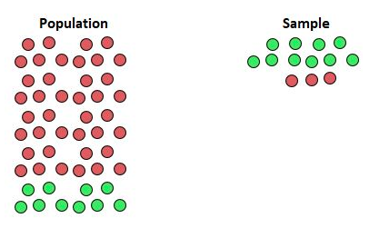
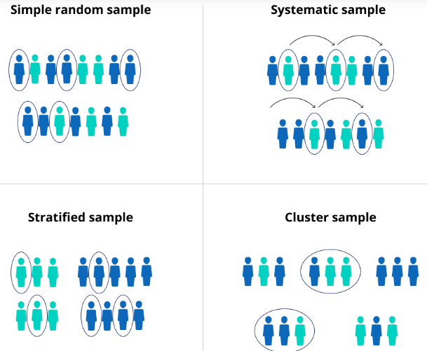

## Introdução

### Objetivo

Um processo de levantamento de informações é em geral caro e em muitas situações é destrutivo. Os processos destrutivos são em geral associadosa equipamento eletrônicos, para saber quanto uma lâmpada dura tenho que ligar e esperar queimar!! Em ciências sociais estamos interessados em características de pessoas, empresas, municípios, estados, países etc. Não é destrutivo mas é uma coleta cara. Por exemplo, o Censo demográfico de 2010 custou R\$ 1,3 bilhões, ou aproximadamente R\$ 2,2 bi em reais de 2020. O valor é de aproximadamente R\$ 35,00 por domicílio. Vejamos outro caso. A figura abaixo mostra a nota de pesquisa eleitoral realizada para eleição ao governo de São Paulo. Vejam que os questionários variam de R\$40 a R\$67 por questionário, uma média de R\$ 53 reais o questionário. Logo uma pesquisa eleitoral para saber as intenções de votos de 2500 pessoas custa aproximadamente R\$135 mil[^6].


[^6]: Fonte: TSE- http://www.tse.jus.br/eleicoes/pesquisa-eleitorais/consulta-as-pesquisas-registradas

{#fig-particula fig-align="center" width="65%"}

Espero que tenha ficado claro que olhar todo mundo, na grande maioria das vezes, é fisicamente, temporalmente e financeiramente impossível.

Dessa forma nosso objetivo aqui é:

\begin{tcolorbox}
**A partir de uma amostra da população realizar inferência sobre toda a população**.
\end{tcolorbox}

### Exemplos do príncipio no dia a dia

Pense nessas situações:

\begin{itemize}
\item Para medir a glicose muitos pacientes usam uma gota de sangue e um pequeno aparelho. A partir dele sabem quanto tem no corpo todo, basta uma gota para termos boa certeza de quanto é taxa de glicose!
\item Para saber se a quantidade de sal está adequada em uma grande panela de arroz, basta uma pequena colher de chá para termios uma boa certeza!
\item Abacaxis às vezes são vendidos em caminhões na rua. Quando paramos provamos e são doces. Compramos 4 por 10. Qual a certeza que esses que vc está levando estejam também doces? É diferente das situações anteriores? 
\end{itemize}

Com certeza vc deve ter pensado que sim é diferente. A certeza é muito menor na segunda. A diferença está em quão homogênea é a característica na população, o sal no arroz e a glicose no sangue devem ser muito bem distribuidas, ou seja, bem homogêneas. Já a doçura no abacaxi deve ter distribuição pior e provar apenas um abacaxi não nos dá uma ideia do todo.

Esse é um erro muito comum, a partir de uma ou poucas observações dizer que o todo se comporta da mesma maneira, esse erro se agrava quando maior é a heterogeneidade!!!

## Algumas definições importantes

### População e amostra

::: {.callout-note  icon="false" title="DEFINIÇÃO"}
**População**: Totalidade das observações sob Investigação

---

**Amostra**: Subconjunto da população observado
:::

A definição da população depende da pergunta de pesquisa ou análise. Se queremos saber qual o salário médio dos empregados do setor industrial no estado de São Paulo para determinado ano, nossa população são todos os funcionários das indústrias instaladas no estado de São Paulo para esse ano. Se queremos os determinantes do desempenho escolar dos alunos do ensino fundamental no Brasil em 2019, nossa população será esse grupo de aluno nesse ano. Se quisermos avaliar o gasto municipal no ano anterior as eleições no Brasil, temos nossa população formada pelos municípios para o ano de análise.

\begin{tcolorbox}
Quem define a população é o objetivo do seu trabalho
\end{tcolorbox}

### Amostragem Aleatória Simples

Existem várias maneiras de fazer uma análise aleatória, uma delas é a simples. Vejamos primeiro um processo de amostragem não aleatório e que possui tendenciosidade. A figura abaixo mostra esse processo[^7]:

[^7]: Fonte: https://www.statology.org/undercoverage-bias/

{#fig-particula fig-align="center" width="30%"}

Observa-se que existe uma supervalorização do verde e uma subvalorização do vermelho. Chegariamos a conclusão, caso isso fosse uma pesquisa eleitoral, que o candidato verde, segunda amostra teria mais chance de ganhar e o vermelho menor chance. O que não condiz com a população. Dizemos que temos uma amostra viesada ou tendenciosa.

Um processo de amostragem aleatório requer que as características presentes na população estejam presentes na amostras e estejam balanceadas, ou seja, que a sua leitura represente bem o todo. a figura abaixo mostra alguns tipos de amostragem, a simples, sistemática, estratificada e em cluster[^8].

[^8]: https://www.scribbr.com/methodology/sampling-methods/

{#fig-particula fig-align="center" width="40%"}

Aqui podemos pensar sempre na amostragem aleatória simples e que será explicada nesse curso. Outros porcessos de amostragem requerem estudos específicos na área! Vejamos então a definição de amostragem aleatória simples.

::: {.callout-note  icon="false" title="DEFINIÇÃO"}
Considere uma amostra de tamanho n de uma população $f(X)$,tal que $i=1,...,n$, onde $X_i$ é a i-ésima medição de $X$. 

---

Assim, chamamos de **Amostra Aleatória Simples** o conjunto de n variáveis aleatóridas independentes $X_i,...,X_n$, cada uma com a mesma distribuição de probabilidade de $X$, ou seja, $f(X)$. 

:::

Precisa-se garantir que cada medida $X_i$ seja feita da mesma maneira ou da mesma forma de mensuração. Dessa forma, garante-se que a Amostra Aleatória Simples $X_i,...,X_n$ é independemente e identicamente distribuída (iid). Portanto, $X_i$ são variáveis aleatórias e $(x_i, ..., x_n)$ os valores correspondentes.

**Graficamente:**

```{r}
#| echo = TRUE,
#| fig.cap = "Distribuição de probabilidade de X e da primeira medição de X, ou seja, Xi",
#| fig.height = 3.5,
#| fig.width = 6
# Mostrando que Xi tem a mesma distribuição de X
 # Simulamos a distribuição de alturas, X, E(X)=167 e DP(X)=5
 x_alt<-rnorm(100000,mean=167, sd= 5)

 # Vamos fazer a primeira medição de X, ou seja, sortear somente o 
 # primeiro elemento Xi. 
   # Iremos repetir a primeira medição 100.000, ou seja, repetimos o 
   # sorteio de Xi 100 mil vezes
   
# 1 - Criamos uma vetor numérico
xi<-numeric()

# 2 - Sorteamos de X os valores com reposição e criamos o vetor Xi
for ( i in 1:100000){
  xi[i]<-sample(x_alt,size = 1, replace=TRUE)
}  

# 3 - Agora plotamos X e Xi para ver se há diferença na distribuição
par(mfrow=c(1,2))
hist(x_alt, col="steelblue3", border="white",freq = FALSE, ylab="Densidade",
     xlab="x",main="", xlim=c(150, 190), breaks=20)
hist(xi, col="wheat4", border="white",freq = FALSE, ylab="Densidade",
     xlab="xi",main="", xlim=c(150, 190),breaks=20)
```

::: {.callout-tip  icon="false" title="EXEMPLO"}

Seja X a altura média dos alunos da FEA. Temos uma amostra de tamanho n=30 que é representada por:


As medições são ($X_1, X_2, ..., X_{30}$) com as respectivas alturas observadas de ($x_1, x_2,..., x_{30}$)


Se a altura $X$ for uma v.a. com fdp $f(x)$ então cada mensuração $X_i$ terá a mesma distribuição $f(x)$ e a função de densidade conjunta de ($X_1, X_2, ..., X_{30}$) será:

$$g (x_1,...,x_{30})= f(x_1) f(x_2)...f(x_{30})$$

ou

$$q(x_1,...,x_{30})= p(x_1) p(x_2)...p(x_{30})$$

pois são $iid$.

:::

::: {.callout-tip  icon="false" title="EXEMPLO"}

Temos uma amostra n=8 de baterias de notebooks, sendo a vida útil dessas representada por X. A primeira medição é $X_1$ e observa-se o valor $x_1$ entre todos os possíveis valores. Analogamente:


Tem-se os valores observados ($x_1, x_2,..., x_{8}$)  das medições ($X_1, X_2, ..., X_{8}$) 


Se a população de notebooks possuem baterias com vida útil normalmente distribuídas $(X)$, então as medições da vida útil ($X_1, X_2, ..., X_{30}$) também possuem a mesma distribuição da população original.
:::

### Estatística e Parâmetro

::: {.callout-note  icon="false" title="DEFINIÇÃO"}

**Parâmetro**: Medida que descreve uma característica da população.

:::

Os parâmetros definem as características de uma população. Qual a renda média da população, qual o desemprego médio da população, qual o desempenho médio educacional, qual a expectativa de vida média na população etc. São características que em geral não observamos.

Uma pergunta, qual a nota média da sua turma (aqueles que entraram com você na faculdade)? Perceba que mesmo características da sua população, são de difíceis conhecimento. Temos que nos valer de uma parte e tentar estimar o que seriam os valores dessas características.

::: {.callout-note  icon="false" title="DEFINIÇÃO"}

**Estatística** é uma característica de uma amostra, ou seja, é uma função de seus elementos $X_1, X_2, ..., X_{n}$).

:::


::: {.callout-note  icon="false" title="DEFINIÇÃO"}

Seja $X_1, X_2, ..., X_{n}$ uma A.A.S. de $X$. Sejam $x_1, x_2,..., x_{n}$ os valores medidos a cada para cada medição de $X$. Seja $H$ uma função real, cujo argumento é um vetor n-dimensional de números reais. Podemos definir uma estatística como: 

$$T= H (X_1, X_2, ..., X_{n}).$$

Para a amostra e toma o valor particular:

$$t= H (x_1, x_2, ..., x_{n}).$$

:::

Onde T é uma variável aleatória e, portanto, possuirá uma distribuição de probabilidade, chamada de distribuição amostral de T. Alguns exemplos de T:

$$Média: \ \overline{X}=\frac{\sum_{i=1}^{n} X_i}{n}$$

$$Variância: \ S^{2}= \frac{1}{n-1} \sum_{i=1}^{n} (X_i - \overline{X})^{2}$$

$$X_{(1)}: Min\{X_1, ..., X_n\}$$

Vejamos a tabela abaixo que já faz uma primeira associação entre estatística e parâmetro:

| Parâmetro      |                   | Estatística    |                    |
|----------------|-------------------|----------------|--------------------|
| Esperança      | $E(X)=\mu$        | $\bar{X}$      | Média              |
| Variância Pop. | $Var(X)=\sigma^2$ | $S^2;\sigma^2$ | Variância Amostral |
| Mediana Pop.   | Md                | md             | Mediana Amostral   |
| Proporção Pop. | p                 | $\hat{p}$      | Proporção Amostral |

[Tabela 1 - Parâmetros populacionais e as Estatísticas associadas]{caption="TRUE"}

Como regra geral, temos que parâmetros são representados por letras gregas e estatística como letra do nosso alfabeto (latino), ou se utilizamos nosso alfabeto para representar o parâmetro, utilizamos a mesma letra mas com chapéu para indicar que é uma estatística.

## Distribuições amostrais

Nosso objetivo agora é ser mais específico que o colocado anteriormente. Nosso objetivo específico é:

\begin{tcolorbox}
Fazer uma afirmativa sobre o parâmetro, característica da população, por meio de um estatística, característica da amostra. 
\end{tcolorbox}

Ou seja, utilizamos uma estatística amostral $T$ para inferir o parâmetro populacional $\Theta$.

Como $T$ é uma variável aleatória e possui distribuição de probabilidade, precisamos saber:

$\rightarrow$ Qual a distribuição de T?

$\rightarrow$ Quais as propriedades ou característica das distribuições amostrais?

### Distribuição Amostral da Média

Suponha uma variável aleatória X que possui distribuição de probabilidade f(x) e tem os seguintes parâmetros:

$$E(x)=\mu$$ 

---


$$Var(x)=\sigma^{2}$$

Não sabemos qual a distribuição de X, mas sabemos que $\overline{X}$ é uma uma variável aleatória que é função da amostra e gostariamos de saber sobre algumas características da sua distribuição. Vejamos primeiro os seus momentos. A intuição é:

$\rightarrow$ Extraímos todas as possíveis amostras de tamanho n da população

$\rightarrow$ Então calculamos $\overline{X}$ para cada uma das amostras

Assim:

$$E(\overline{X})=X$$


---


$$Var(\overline{X})=S_{\overline{X}}^{2} = \frac{Var(X)}{n}$$

::: {.callout-note  icon="false" title="TEOREMA"}

Seja $X$ uma v.a. com parâmetros $\mu$ e $\sigma^{2}$. Seja $(X_1, X_2, ..., X_{n})$ uma A.A.S. de $X$. Então:


$$E(\overline{X})=\mu$$


---


$$Var(\overline{X})= \frac{\sigma^{2}}{n}$$


---


**Demonstração:**

Para $(X_1, X_2, ..., X_{n})$ independentes temos que:

$$E(\overline{X})=\frac{1}{n} \{ E(X_1)+ ...+ E(X_n) \} =\frac{ n \mu}{n}=\mu$$


---


$$Var(\overline{X})=\frac{1}{n^{2}} \{ Var(X_1)+ ...+ Var(X_n) \}= \frac{1}{n^{2}} n \sigma^{2}= \frac{\sigma^{2}}{n}$$

:::


Conforme veremos logo a frente pelo Teorema do Limite Central, que a distribuição de $\overline{X}$ ser uma $N(\mu;\frac{\sigma^{2}}{n})$. Dessa forma, quanto maior o $n$ da amostragem, menor será a $Var(\overline{X})$. Vejamos a figura abaixo adaptada de Bussab e Morettin:


```{r}
#| echo = TRUE,
#| fig.cap = "Distribuição amostral da média para diferentes tamanos amostrais",
#| fig.height = 3.5,
#| fig.width = 6
#Exemplo extraído de Bussab e Morettin

# Simulando uma variável com distribuição normal. 
x_normal<-rnorm(10000,mean=167, sd= 5)

# Criando os vetores numéricos 
# Media e variancia para amostras de tam 15, 50 E 150
xbar15<-numeric()
var_amostral15<-numeric()
xbar50<-numeric()
var_amostral50<-numeric()
xbar150<-numeric()
var_amostral150<-numeric()

# Extraindo duas mil amostras de 15, 50 e 150 elementos e fazendo a média e 
  # variância para cada uma das amostras. Teremos 2000 médias e 2000 variâncias 
  #para cada tamanho de amostra (15, 50 3 150)
for ( i in 1:2000){
  smp<-sample(x_normal,size = 15)
  xbar15[i]<-mean(x_normal[smp])
  var_amostral15[i]<-var(x_normal[smp])
  
  smp<-sample(x_normal,size = 50)
  xbar50[i]<-mean(x_normal[smp])
  var_amostral50[i]<-var(x_normal[smp])
  
  smp<-sample(x_normal,size = 150)
  xbar150[i]<-mean(x_normal[smp])
  var_amostral150[i]<-var(x_normal[smp])
}

par(mfrow=c(2,3))
hist(xbar15, col="steelblue3",freq = FALSE, breaks = 25,main="",
     xlim=c(164, 170), ylab="Densidade", xlab="Média para n=15",
     border="steelblue3")
hist(xbar50, col="wheat4", freq = FALSE, breaks = 25, main="",
     xlim=c(164, 170), ylab="Densidade", xlab="Média para n=50",
     border="wheat4")
hist(xbar150, col="palegreen3",freq = FALSE, breaks = 25, main="",
     xlim=c(164, 170), ylab="Densidade", xlab="Média para n=150",
     border="palegreen3")
hist(var_amostral15, col="steelblue3", freq = FALSE, breaks = 25, main="",
     xlim=c(0, 50), ylab="Densidade", xlab="Variância para n=15",
     border="steelblue3")
hist(var_amostral50, col="wheat4", freq = FALSE, breaks = 25, main="",
     xlim=c(0, 50), ylab="Densidade", xlab="Variância para n=50", 
     border="wheat4")
hist(var_amostral150, col="palegreen3", freq = FALSE, breaks = 25, main="",
     xlim=c(0, 50), ylab="Densidade", xlab="Variância para n=150",
     border="palegreen3")


```

Vamos agora calcular as médias para cada uma das variáveis que criamos. Ou seja, vamos fazer a $E(\overline{X})$

```{r}
#| echo = TRUE
# Vamos fazer a media das medias calculadas para 15, 50 e 150 com 
  # 2 mil rodadas de amostragem
mean(xbar15)
mean(xbar50)
mean(xbar150)

```

Observe que todas ficaram muito próximas da verdadeira esperança da população, mostrando empiricamente o teorema apresentado. Pode-se verificar também a variância amostral $Var(\overline{X})=\frac{\sigma^{2}}{n}$. Vejamos:

```{r}
#| echo = TRUE
# Vamos fazer a variância das médias calculadas para 15, 50 e 150 com 
  # 2 mil rodadas de amostragem
var(xbar15)
var(xbar50)
var(xbar150)

```


Percebemos que a partir que o tamanho amostral vai aumentando o resultado vai convergindo para $Var(\overline{X})=\frac{\sigma^{2}}{n}$, lembre-se que $\sigma^{2}=25$ para a simulação feita.

Importante ressaltar que esse resultado para a distribuição da média, ou seja $\overline{X}$ é valido para qualquer distribuição de $X$. Veja o caso abaixo onde temos $X$ que possui uma distribuiçõ $\chi^2$ com 3 graus de liberdade.

```{r}
#| echo = TRUE,
#| fig.cap = "Distribuição amostral da média para diferentes tamanos amostrais",
#| fig.height = 3.5,
#| fig.width = 7
# Distribuição amostral da média quando X tem dist Chi-Quadrado. 
# Simulando uma distribuição chiquadrado
x_chisq<-rchisq(100000,df=3)

#Inicializando as variaveis como vetores numericos
## Media e variancia para amostras de tam 15
x_chi4<-numeric()
## Media e variancia para amostras de tam 300
x_chi30<-numeric()
## Media e variancia para amostras de tam 1000
x_chi1000<-numeric()

for ( i in 1:2000){
  smp<-sample(x_chisq,size = 4)
  x_chi4[i]<-mean(x_chisq[smp])
  
  smp<-sample(x_chisq,size = 30)
  x_chi30[i]<-mean(x_chisq[smp])

  smp<-sample(x_chisq,size = 1000)
  x_chi1000[i]<-mean(x_chisq[smp])

}

##  Figura 
par(mfrow=c(1,4))
hist(x_chisq, col="gray", border="gray",freq = FALSE, main="",
     ylab="Densidade de X", xlab="x")
hist(x_chi4, col="steelblue3", freq = FALSE, breaks = 20, main="",
      ylab="Densidade Média", xlab="Média para n=4",
     border="steelblue3")
hist(x_chi30, col="wheat4", freq = FALSE, breaks = 20, main="",
      ylab="Densidade Média", xlab="Média para n=30", 
     border="wheat4")
hist(x_chi1000, col="palegreen3", freq = FALSE, breaks = 20, main="",
      ylab="Densidade Média", xlab="Média para n=300",
     border="palegreen3")


```

Podemos observar na figura acima que X é bastante assimétrico. Para o primeiro gráfico tiramos amostra de tamanho 4 e perceba que ainda é assimétrica, mas a partir do momento que vamos aumentando o tamanho da amostra, a distribuição de $\overline{X}$ vai ficando mais próxima de uma normal.

### Distribuição Amostral da Variância

A Variância Amostral também é uma variável aleatória. Os gráficos anteriores mostram a distribuição de $Var(X_i)$ para diferentes tamanhos amostrais. Importante notar que calculamos na seção anterior também $Var(\overline{X})$ com base nos valores de média obtidos na simulação. A $Var(X_i)$ é uma candidata a ser uma boa aproximação para $\sigma^2$, ou seja, variância populacional. Assim:\

::: {.callout-note  icon="false" title="DEFINIÇÃO"}

A variância amostral:

$$Variância: \ S^{2}= \frac{1}{n-1} \sum_{i=1}^{n} (X_i - \overline{X})^{2}$$


possui distribuição $\chi ^{2}$ se $X$ possui distribuição normal.

:::

Para $n$ grande podemos aproximar a $\chi ^{2}$ por uma distribuição normal. Olhe os gráficos de variância amostrais acima. Observe que para n=15 a distribuição de $Var(X_i)$ é assimétrica e parece uma $\chi ^{2}$, com o aumento da amostra vamos caminhando para uma distribuição normal.

### Distribuição amostral da proporção

Considere uma amostra $X_1, X_2, ..., X_{n}$ que assume os valores:

$x_i=1$: sucesso

$x_i=0$: fracasso

para $i=1,2...,n$.

Seja $p$ a probabilidade de sucesso. Então a proporção amostral pode ser calculada como:

$$\hat{p}= \frac{\sum_{i=1}^{n} X_i}{n}$$

Seja $Y=\sum_{i=1}^{n} X_i$. Então $Y$ possui distribuição Binomial com parâmetros $E(Y)=n.p$ e $Var(Y)=np(1-p)$.

Então, as caracteriticas da proporção, $\hat{p}$, será :

$$E(\hat{p})= \frac{n p}{n} = p$$


---

 
$$Var(\hat{p})= \frac{1}{n^{2}} n p (1-p)= \frac{p(1-p)}{n}$$

Para n grande a distribuição de $\hat{p}$ é aproximadamente Normal (pela aproximação da binomial pela Normal).

## Modos de Convergência

Gostariamos de saber se uma sequência de variáveis aleatórias $X_1,X_2,...,X_n$ caminha ou converge na direção de $X$. Assim, suponha que queiramos saber o valor de $X$, fazemos uma medida via $X_1$, podemos aumentar o número de medidas para $X_2$ e observamos se chega mais próximo de $X$, e constinuamos até $X_n$ e vemos se essa sequencia de medidas vai convergindo para $X$.Veremos aqui 3 tipos de convergência.

\begin{enumerate}
 \item Convergência em probabilidade
 \item Convergência em Média Quadratica
 \item Convergência em Distribuição
\end{enumerate}

### Convergência de uma sequência numérica

::: {.callout-note  icon="false" title="DEFINIÇÃO"}

**Convergência:**

Uma sequência de números reais $\{\alpha_i\}$ $i=1,2,..,n$ converge para um número real $\alpha$ se para qualquer $\varepsilon>0$ existe um inteiro N onde para todo $n>N$ tem-se:

$$|\alpha_n - \alpha |<\varepsilon$$

Assim: 


$\alpha_n \rightarrow \alpha$ quando $n \rightarrow \infty$ ou


$lim_{n \rightarrow \infty} \alpha_n = \alpha$


:::

No caso de variáveis aleatórias, como só podemos falar de probabilidade, a definição anterior de convergência não é válida.

### Convergência em Distribuição e o Teorema do Limite Central.

É forma mais fraca de convergência, dizemos que a fda de $X_n$ converge para a fda de $X$. Formalmente:

::: {.callout-note  icon="false" title="DEFINIÇÃO"}

**Convergência em Distribuição**

Uma sequência de v.a. $\{X_i\}$ $i=1,2,..,n$ converge para $X$ em distribuição se a função de distribuição acumulada $F_{X_n}$ de $X_i$ converge para a f.d.a. $F_X$ de $X$ em cada ponto da F. Em outras palavras:


$X_n \overset{d}{\rightarrow} X$  ou


$\lim_{n \rightarrow\infty}F_{X_n}(x)=F_{X}(x)$ é a distribuição limite de $X_n$.

:::

### Teorema do Limite Central (TLC): Aplicação da Convergência em Distribuição.

Um dos resultados mais importantes em estatística e que afirma que a soma de um grande número de variáveis aleatórias possui distribuição normal. Suponha uma sequência $X_1, X_2, ...., X_n$ a qual possui a mesma distribuição de $X$. A média $\overline{X}$, que é uma soma de variáveis aleatórias, possui $E(\overline{X})=\mu$ e a variância $Var(\overline{X})=\frac{\sigma^2}{n}$. Podemos normalizar a variável aleatória $\overline{X}$, ou seja $Z_n$:


$$Z_n=\frac{\overline{X}_n- E(\overline{X}_n)}{\sqrt{Var(\overline{X}_n)}}$$

Dessa forma podemos fazer a seguinte definição:

::: {.callout-note  icon="false" title="DEFINIÇÃO"}

**Teorema do Limite Central**

Seja $X_1, X_2,...,X_n$ uma sequência de variáveis aleatórias com $E(X_i)=\mu$ e $Var(X_i)=\sigma^2$. A variável $\overline{X}$ normalizada:


$$Z_n=\frac{\overline{X}_n- E(\overline{X}_n)}{\sqrt{Var(\overline{X}_n)}} =\frac{X_1+X_2+,...+X_n-n\mu}{\frac{\sigma}{\sqrt{n}}}$$

converge em distribuição para uma normal padrão quando $n$ vai para o infinito, assim:

$\lim_{n \rightarrow\infty}P(Z_n \leq x)=\Phi(x)$ para to $x \in \mathbb{R}$

Portanto, 

$$Z_n \overset{d}{\rightarrow} N(0,1)$$

:::

Assim, temos a distribuição assintótica de $Z_n$ (a qual se aproxima quando n é grande), será:

$$Z_n \overset{a}{\sim } N(0,1)$$

Isso implica que a distribuição assintótica da sequência $\overline{X}_n$ é:

$$\overline{X}_n\overset{a}{\sim }N(E(\overline{X_n}),Var(\overline{X_n}))$$

### Aproximação Normal da Binomial

Recordando, uma variável com distribuição Binomial $X$ é a soma de v.a. Bernoulli iid $\{Y_i\}$ tal que $X= \sum Y_i$. Sendo que $Y_i=1$ com probabilidade $p$ e $Y_i=0$ com probabilidade $(1-p)$.

$\hat{p}=\frac{X}{n}$

Assim, se as condições do TLC são satisfeitas, com $E(Y_i)=p$, $Var(Y_i)=(1-p)p$ e $\hat{p}=\frac{X}{n}$ então:

$$\frac{\frac{X}{n}-p} {\sqrt{(1-p)p/n}}\overset{d}{\rightarrow} N(0,1)$$


Assim:


$$\frac{X}{n} \overset{a}{\sim } N(p, pq/n)$$

Ou:


$$X \overset{a}{\sim } N(np, npq)$$

### Convergência em Probabilidade e a Lei dos Grandes Números

É um modo de convergência mais forte do que a convergência em distribuição, muitas vezes chamada de convergência estocástica. Vejamos a definição:

::: {.callout-note  icon="false" title="DEFINIÇÃO"}

**Convergência em Probabilidade:**

Uma sequência de v.a. $X_1,X_2,,...,X_n$  converge em probabilidade para uma v.a. $X$, ou seja,  


$X_n \overset{p}{\rightarrow} X$ quando $n \rightarrow \infty$, se: 


$lim_{n \rightarrow \infty} P(|X_n - X |\geq \varepsilon) = 0$ ou


$plim_{n \rightarrow \infty} X_n = X$

:::

### A Lei dos Grandes Números (LGN): Aplicação da Convergência em Probabilidade

#### Lei Fraca dos Grandes Números

A Lei dos Grandes Números é o Teorema que descreve o resultado de um experimento realizado um grande número de vezes. A Lei Fraca será nosso foco, pois é bem menos restritiva em termos de convergência, ou seja, exige uma convergência mais fraca e é suficiente para os problemas econométricos que veremos a frente.

::: {.callout-note  icon="false" title="DEFINIÇÃO"}

**Lei Fraca dos Grandes Números**

Dada uma sequência da v.a. $X_i$ e $\overline{X}_n=\frac{1}{n} \sum X_i$, a Lei Fraca Dos Grandes Números coloca que  $\overline{X}_n - E(\overline{X}_n)$ converge para 0 em probabilidade. Portanto: 


$\overline{X}_n - E(\overline{X}_n) \overset{p}{\rightarrow} 0$

ou

$\overline{X}_n \overset{p}{\rightarrow} E(\overline{X}_n)=\mu$

:::

Assim temos o seguinte teorema

::: {.callout-note  icon="false" title="TEOREMA"}

Seja uma sequência $X_1,X_2,...,X_n$ iid com $E(X_i)=\mu$ e $Var(X_i)=\sigma^2$. Então:

$\overline{X_n} \overset{p}{\rightarrow} \mu$ quando $n \rightarrow \infty $.


---


**Prova:**

Utilizando a desigualdade de Tchebycheff:


$$P(|\overline{X} - \mu|< \varepsilon ) \geq 1-\frac{\sigma^{2}}{\varepsilon^{2} n}$$


$$lim_{n \rightarrow \infty} P(|\overline{X} - \mu|< \varepsilon ) = 1$$

ou 


$$lim_{n \rightarrow \infty} P(|\overline{X} - \mu| \geq \varepsilon ) = 0$$


Portanto:


$$\overline{X} \overset{P}{\rightarrow} \mu$$ 

ou 

$$plim \overline{X}  = \mu$$
:::

**Em palavras:**

O significado de $X_n$ convirgir para $\mu$, é que com uma amostra cada vez maior existe uma probabilidade muito alta de que a média ds observações esteja próxima do verdadeiro par6ametro populacional, ou seja, a esperança.

#### Lei Forte dos Grandes Números

Uma maneira mais forte de convergência é dada pela convergência "quase certa". Não veremos ela aqui e daremos uma ideia apenas da existência da Lei Forte dos Grande Números. Podemos representar essa convergência por:


$\overline{X_n}\overset{a.s.}{\rightarrow}\mu$ quando $n \rightarrow \infty$

Podemos definir a convergência quase certa da seguinte maneira:

::: {.callout-note  icon="false" title="DEFINIÇÃO"}

**Lei Forte dos Grandes Números**

$$P(lim_{n \rightarrow \infty} \overline{X_n}=\mu  ) = 1$$

:::

Ou seja, a Lei forte coloca que $X_n$ converge para $\mu$ com probabilidade igual a 1. Aqui é a probabilidade do limite e antes o limite da probabilidade! Assim, a média da amostra converge quase certamente para o valor esperado.

É um tipo de convergência pouco utilizado na Econometria. Vejamos em palavras a diferença entre as duas para um $n$ grande

\begin{enumerate}

  \item **Lei Fraca:** $\overline{X}_n$ está próximo de $\mu$ e portanto $|\overline{X}_n-\mu|>\varepsilon$ pode existir mas não é frequente
  
  \item **Lei Forte:** $|\overline{X}_n-\mu|<\varepsilon$ para todo $n$
  
\end{enumerate}

### Convergência em Média Quadrática

É um tipo de convergência mais forte que a de probabilidade e de distribuição.

::: {.callout-note  icon="false" title="DEFINIÇÃO"}

**Convergência em Média Quadrática**

Uma sequência de v.a. $X_1,X2,...,X_n$ converge para $X$ em média quadrática se:

$$lim_{n \rightarrow \infty} E(X_n - X)^{2} = 0$$

Tal que:

$X_n \overset{M}{\rightarrow} X$ 
:::

### Relação entre as convergências

Existe uma relação de implicação ou relacionamento entre os diversos tipos de convergência. Esse relacionamento é apresentado no teorema abaixo.

::: {.callout-note  icon="false" title="TEOREMA"}

$X_n \overset{M}{\rightarrow} X \Rightarrow X_n \overset{P}{\rightarrow} X$

$X_n \overset{p}{\rightarrow} X \Rightarrow X_n \overset{d}{\rightarrow} X$

O que implica: 

$X_n \overset{M}{\rightarrow} X \Rightarrow X_n \overset{p}{\rightarrow} X \Rightarrow X_n \overset{d}{\rightarrow} X$
:::

::: {.callout-note  icon="false" title="TEOREMA"}

Seja $X_n$ um vetor de v.a. com númerp finito de elementos. Seja $g$ uma função contínua e $\alpha$ um vetor constante. Então:

$X_n \overset{P}{\rightarrow} \alpha \Rightarrow g(X_n) \overset{P}{\rightarrow} g(\alpha)$
:::

## Determinação do tamanho da amostra

Iremos considerar aqui apenas a técnica de amostrage alatatória simples. Nosso objetivo é dar a intuição do processo de amostragem e não ensinar a fazer design de pesquisa de campo. Existem disciplinas específicas para isso.

Duas medidas importantes a serem consideradas.

\begin{enumerate}

  \item Distância Máxima tolerável entre a estimativa e o parâmetro real: $d$
  
  \item A probabilidade de que $d$ seja maior que o tolerável: $\alpha$
  
\end{enumerate}

### Tamanho da amostra com $\sigma$ conhecido

Considere a desigualdade de Tchebycheff:

$$P(|\overline{X} - \mu| \leq \varepsilon ) \geq 1-\frac{\sigma^{2}}{\varepsilon^{2} n}$$


Considerando $\varepsilon=d$, $\frac{\sigma^{2}}{\varepsilon^{2} n}=\alpha$ e trabalhando no limite inferior tolerável (na igualdade):

$$P(|\overline{X} - \mu|\leq d) = 1 - \alpha$$

$$P(-d \leq \overline{X} - \mu\leq d) = 1 - \alpha$$

$$P(-\frac{d}{\sigma/\sqrt{n} } \leq Z \leq \frac{d}{\sigma/\sqrt{n}}) = 1 - \alpha$$

$$P(-\frac{d\sqrt{n}}{\sigma } \leq Z \leq \frac{d\sqrt{n}}{\sigma}) = 1 - \alpha$$

$$P(-Z_c \leq Z \leq Z_c) = 1 - \alpha$$

$$Z_c=\frac{\sqrt{n}d}{\sigma} \rightarrow n=\frac{\sigma^{2}Z_c^{2}}{d^{2}}$$

onde n é o tamanho da amostra. Logo observa-se que o tamanho da amostra não tem relação com o tamanho da população. Se a população for altamente homogênea, a variância será pequena e o tamanho da amostra pequeno. Também depende do erro e da probabilidade de ficar acima do tolerável.


::: {.callout-tip  icon="false" title="EXEMPLO"}

Uma pesquisa de satisfação foi feita com os funcionários de uma empresa. O índice vai de 0 a 100 e sabe-se que o desvio padrão é 30. 

Qual o tamanho da amostra de entrevistados, considerando um nível de tolerância $d=1,5$ unidades, com probabilidade $1-\alpha=92,81\%$?

:::


::: {.callout-caution  icon="false" collapse="true" title="RESPOSTA"}

Na tabela da distribuição normal padrão:

$$1 -\alpha = 0,9281 \rightarrow Z_c=1,8$$

Como d=1,5 então:

$$n= \bigg(\frac{1,8 . 30}{1,5} \bigg)^{2}\cong 1.296$$

:::

### Tamanho da amostra com população finita

Se a população for finita a independência entre os elementos $X_i$ não é válida. Disto segue que:

$$Var(\overline{X}) = \frac{\sigma^{2}}{n}$$

é caso particular de:

$$Var(\overline{X}) = \sigma^{2} \bigg(\frac{1}{n}-\frac{1}{N} \bigg)$$

Onde N é o tamanho populacional. Assim, para N finito e conhecido basta utilizar:

$$n' = \frac{n}{1+ n/N}$$

Note que se $n$ for muito menor que $N$ então $n' \rightarrow n$ e

$$Var(\overline{X}) = \sigma^{2} \bigg(\frac{1}{n}-\frac{1}{N} \bigg) \rightarrow \frac{\sigma^{2}}{n}$$

Ou seja, converge para a amostragem anterior para população infinita.

### Tamanho da amostra com $\sigma$ desconhecido: média amostral

Como não temos $\sigma$ temos que fazer uma amostra piloto com $n_1$ elementos e estimar o desvio padrão da seguinte maneira:

$$S_1=\sqrt{\frac{\sum (X_i - \overline{X})^{2}}{n-1}}$$

Assim pode-se calcular:

$$n=\frac{S_1 ^{2} Z_c^{2}}{d^{2}} $$

Assim como temos já $n_1$ elementos agora podemos complementar até chegar a a $n$

### Proporção populacional

Agora queremos garantir que:

$$P(|\hat{p} - p|\leq d) = 1 - \alpha$$

O tamanho da amostra será tal que:

$$n=\frac{ Z_{c}^{2}}{d^{2}} p (1-p)$$

se não sabemos nada considerar $p=0,5$, esse irá gerar a maior amostra para dado $\alpha$ e $d$

\begin{tcolorbox}
O exemplo no R:
\end{tcolorbox}

Vejamos como ficaria o tamanho amostral para uma pesquisa eleitoral onde consideramos que $p=0.4$, $1-p=0.6$, $1-\alpha=0,95$ e iremos considerar varios $d$, margem de erro. Ou seja, a primeira é dois pontos percentuais para mais ou menos, o segundo 1,5 pontos percentuais, o terceiro, 1 ponto e por fim 0,5 pontos percentuais. Vejamos o que essa mudança no que estamos ropensos a aceitar como margem de erro afeta o custo da pesquisa. Vimos que o valor por questionário era de R\$53,00.


```{r}
#| echo = TRUE
# Utilizando a tabela normal vimos que para alpha de 5% o 
  #valor de Zc é 1,96, sendo p=0.4 e q=0.6

# para uma margem de erro de 2 pontos para cima e para 
#baixo,tem-se 
1.96^2*0.4*0.6/(0.02^2)  # Tamanho amostral

(1.96^2*0.4*0.6/(0.02^2))*53 # Custo da pesquisa

# para uma margem de erro de 1.5 pontos para cima e para 
#baixo,tem-se 
1.96^2*0.4*0.6/(0.015^2)  # Tamanho amostral

(1.96^2*0.4*0.6/(0.015^2))*53 # Custo da pesquisa

# para uma margem de erro de 1 pontos para cima e para 
#baixo,tem-se 
1.96^2*0.4*0.6/(0.01^2)  # Tamanho amostral

(1.96^2*0.4*0.6/(0.01^2))*53 # Custo da pesquisa


# para uma margem de erro de 1 pontos para cima e para 
#baixo,tem-se 
1.96^2*0.4*0.6/(0.005^2)  # Tamanho amostral

(1.96^2*0.4*0.6/(0.005^2))*53 # Custo da pesquisa

```

Notamos que para sairmos de uma margem de erro de 2 pontos para uma margem de erro de 0.5 pontos percentuais o custo sai de R\$122 mil para quase R\$ 2 milhões. O custo cresce de forma exponencial com o aumento da precisão.
