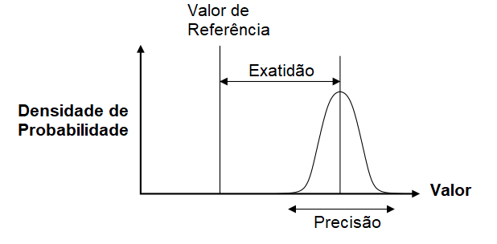
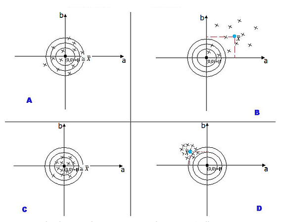
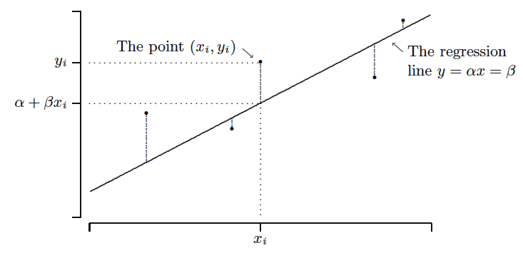

## Introdução

Um dos esforços da estatística é propor técnicas para estimar caracaterísticas populacionais que auxiliem os tomadores de decisão a fazerem melhores escolhas. Se vamos fazer um programa para treinamento para mulheres desempregadas de baixa renda, precisamos saber qual a taxa de desemprego daquela população e assim propor um número de vagas adequado. Se queremos melhorar o sistema de logística de um entreposto, precisamos entender qual a intensidade de chegada de caminhões nesse entreposto. Se vamos fazer um programa de auxílio para pessoas em situaçao de extrema pobreza, precisamos saber quantas pessoas vivem nessa situação nessa localidade.

Notamos que para a maior parte das questões que temos sobre o mundo, raramente sabemos o que acontece na população. Temos que tentar construir um modelo que nos ajude nessa tarefa e nos de a segurança que as nossas estimativas da realidade sejam boas. Na inferência estatística existem dois objetivos principais.

\begin{itemize}

\item Estimação de parâmetros: valores populacionais

\item Testes de hipótese sobre os parâmetros

\end{itemize}

Nosso objetivo aqui é estudar técnicas que nos permita avaliar se uma proposta de estimativa de uma caractaristica da população é "boa" e aprender técnicas para encontrar "boas" estimativas. Assim temos duas questões básicas surgem:

\begin{itemize}

\item Quais as características que um "bom" estimador possui? 

\item Como decidiremos que uma boa estimativa é "melhor" que outras?

\end{itemize}

Para saber se uma estimativa é boa ou não vamos introduzir duas ideias aqui, exatidão e precisão.

\begin{tcolorbox}

**Dois conceitos importantes:**

\begin{itemize}

\item **Exatidão**: proximidade de cada observação do valor do centro do alvo (nosso caso: parâmetro)

\item **Precisão**: proximidade de cada observação em relação ao ponto médio de todas, variância. 

\end{itemize}
\end{tcolorbox}

A figura abaixo traz esses dois conceitos[^9]:

[^9]: https://portalfisica.wordpress.com/2018/08/24/acuracia-precisao-e-exatidao/

{#fig-particula fig-align="center" width="60%"}

Uma outra forma de vermos o mesmo conceito é pelo exmplo clássico dos alvos. Vejamos a figura abaixo:

{#fig-particula fig-align="center" width="60%"}

Cada x no alvo representa uma tentativa sua de estimar o parâmetro de uma população que é o centro do alvo. A ideia seria que uma boa "arma" (arma aqui é a sua equação matemática) é aquela que acerta ao redor do centro do alvo e menos espelhado possível. Vejamos cada um desses alvos:

\begin{tcolorbox}

\begin{itemize}

\item **A**: Exato (média das tentativas está no centro do alvo.) Pouco Preciso (observações muito dispersas)

\item **B**: Pouco Exato e Pouco Preciso

\item **C**: Exato e Preciso

\item **D**: Pouco Exato e Muito Preciso

\end{itemize}
\end{tcolorbox}

Portanto, notamos que a melhor arma, ou seja, a melhor forma de estimar é pela "arma" C.

## Estimadores e Estimação

Considere uma amostra $(X_1, ..., X_n)$ de uma variável aleatória $X$, sendo $X_i$ variáveis aleatíras com a mesma distribuição de $X$ e $x_i$ os valores observados. Considere $\Theta$ um parâmetro populacional, podendo ser por exemplo: $\mu$ ou $\sigma$.

::: {.callout-note  icon="false" title="DEFINIÇÃO"}

Um estimador $T$ do parâmetro $\Theta$ é qualquer função das observações da amostra, tal que:

\center{$T= h(X_1, ..., X_n)$.}

:::

Portanto, cada estimador é uma estatística a qual associamos a um parâmetro. Assim temos uma segunda definição:

::: {.callout-note  icon="false" title="DEFINIÇÃO"}

Uma Estimativa é o valor $t$ que somente depende da amostra observada $x_1, x_2, ..., x_n$. Ou seja, é uma função somento do banco de dados coletado:

\center{**$t=h(x_1, x_2, . . . , x_n)$.**}

:::

Veja a situação apresentada abaixo. Sabe-se que temos o retorno de uma carteira dada por $X$ que é uma variável aleatória. Sabe-se que a esperança do rerotno dessa carteira ($\mathbb{E}(X)$) que chamaremos de $\Theta$ é de 0. Encontramos duas maneiras de estimar esse retorno. Abaixo temos a distribuição de dois estimadores $T_1$ e $T_2$ do parâmetro $\Theta$.

```{r}
#| echo = TRUE,
#| fig.cap = "Função Distribuição de Probabilidade Normal e Função Distribuição Acumulada Normal",
#| fig.height = 3.5,
#| fig.width = 7
#Distribuição de dois estimadores, T1 e T2,  para o parâmetro populacional
x<-seq(-5,7,0.1) 
T1<-dnorm(x = x, mean = 3, sd=1)   
T2<-dnorm(x = x, mean = 0, sd=1)

plot(x,T1,xlab="ti",type="l",main=NULL, col="steelblue3",lwd=2, ylab="f(ti)",
     xaxt="n",cex.axis=0.65, cex.lab=0.8 ) 
abline(v=0, col="black", lty=2)
par(new=TRUE)
plot(x,T2,xlab="", ylab="",type="l",col="wheat4",lwd=2,xaxt="n",
     cex.axis=0.65, cex.lab=0.8 ) 
axis(1,at=c(0),labels =c(expression(Theta)),cex.axis=0.65, cex.lab=0.8) 
legend("topleft", legend=c("T1", "T2"),col=c("steelblue3", "wheat4"), 
       lty=1:1, box.lty=0,cex=0.8)

```

**Questão**

Definir uma função $T_i= h(X_1, ..., X_n)$ que seja próxima de $\Theta$ segundo algum critério. Ou seja, que acerte em média o parâmetro e que não seja muito dispersa!

## Propriedades dos Estimadores

### Tendenciosidade ou Viés

Suponha que estamos querendo estudar o desempenho dos alunos na Prova do ENEM, $X$, que vamos assumir que tenha distribuição normal com $\mathbb{E}(X)=2000$ e $\sigma=400$. Vamos observar 50 alunos que fizeram a prova em 2019 e estimar a esperança da nota utilizando a fórmula $\bar{X}$. Iremos repetir o processo de amostragem 100.000 vezes. Assim, vamos coletar 50 pessoas e fazer a média para essa amostragem, $\bar{X}_{50}$ e repetimos esse processo 100 mil vezes. Teremos portanto 100 mil médias. Vejamos a distribuição dessas médias feitas no R:

```{r}
#| echo = TRUE,
#| fig.cap = "Distribuição do estimador da Esperança da Nota do ENEM",
#| fig.height = 3.5,
#| fig.width = 6
# Distribuição da nota dos alunos que fizeram ENEM, X. 
x_normal<-rnorm(10000,mean=2000, sd= 400)

#Amostragem:
# Criando os vetores numéricos 
xbar50<-numeric()
var_amostral50<-numeric()
# Extraindo 100 mil amostras de 50 alunos e fazendo a média para cada uma. 
# Teremos 100.000 médias  
for ( i in 1:100000){
  smp<-sample(x_normal,replace = TRUE,size = 50)
  xbar50[i]<-mean(x_normal[smp])
}

# Plotando as médias obtidas
hist(xbar50, col="steelblue3",freq = FALSE, breaks = 25,main="",
     xlim=c(1800, 2200), ylab="Dist. da média", xlab="médias para n=50",
     xaxt="n",border="steelblue3")
abline(v=2000, col="black", lty=2)
text(2000, 0.0003, expression(Theta))
axis(1,at=c(1800, mean(xbar50), 2200),labels =c(1800, round(mean(xbar50)),
    2200),cex.axis=0.65, cex.lab=0.8) 

```

Observa-se que neste caso o valor númerico central representa $\mathbb{E}(\bar{X})$ e a linha pontilhada mostra $\mathbb{E}(X)=2000=\Theta$. Ainda pode-se observar que encontramos diversos valores para $\bar{X}$, variando de 1800 a 2200, mas com grande concentração ao redor de 2000.

Com base na figura 3 que apresenta dois estimadores e na figura 4 que mostra o resultado para uma estimativa da Esperança, temos a seguinte definição:

::: {.callout-note  icon="false" title="DEFINIÇÃO"}

O estimador $T$ é chamado de estimador **não-viesado**, ou não-tendencioso, para o parâmetro $\Theta$ se:

**$\mathbb{E}(T)=\Theta$** para todo **$\Theta$**

Independente do valor de $\Theta$, sendo a diferença $\mathbb{E}(T)-\Theta$ chamada de viés de $T$. Se a diferença é diferente de 0, T é viesado.

:::

#### Estimadores não viesados para Esperança e Variância populacional.

Considere uma população com N elementos e com a esperança populacional de uma população de tamanho N:

$$\mu =\frac{1}{N}\sum_{j=1}^{N}X_j$$

Um bom estimador para a Esperança populacional seria a média, "copiando" a formulação populacional e consierando $n$ o tamanho da amostra, ou seja:

$$\bar{X} =\frac{1}{n}\sum_{i=1}^{n}X_i$$

Observe que ele é um estimador não visesado pois

$$\mathbb{E}(\bar{X})=\frac{1}{n}\mathbb{E}[X_1+X_2+...+X_n]$$

$$\mathbb{E}(\bar{X})=\frac{1}{n}[\mathbb{E}(X_1)+\mathbb{E}(X_2)+...+\mathbb{E}(X_n)]$$

$$\mathbb{E}(\bar{X})=\frac{1}{n}[\mu+\mu+...+\mu]=\frac{1}{n}n\mu=\mu$$

Da mesma forma podemos utilizar o princípio de "copiar" para achar um estimador ($\hat{\sigma}^2$) para a variância populacional $\sigma^2$, assim:

$$\sigma^{2}=\frac{1}{N}\sum_{i=1}^{N}(X_i - \mu)^{2} $$

E um possível estimador para $\sigma^{2}$ (observe que colocamos um chapéu sobre $sigma$) será:

$$\hat{\sigma}^{2}=\frac{1}{n}\sum_{i=1}^{n}(X_i - \overline{X})^{2} $$

Entretanto, tal estimador é viesado pois:

$$\sum_{i=1}^{N}(X_i - \overline{X})^{2} = \sum_{i=1}^{N}(X_i - \mu + \mu - \overline{X})^{2}=\sum_{i=1}^{N}((X_i - \mu)- (\overline{X}-\mu))^{2}$$ 

$$= \sum_{i=1}^{N}(X_i - \mu)^{2}  - 2 \sum_{i=1}^{N}(X_i - \mu) (\overline{X} - \mu) + \sum_{i=1}^{N}(\overline{X}  - \mu)^{2}$$

Note que $(\overline{X} - \mu)$ é constante. Então dado que:

$$\sum_{i=1}^{N}(X_i - \mu)= \sum_{i=1}^{N}X_i - n\mu$$

$$\overline{X}=\frac{1}{n}\sum_{i=1}^{N}X_i $$

Temos que:

$$n \overline{X}=\sum_{i=1}^{n}X_i \rightarrow \sum_{i=1}^{n}(X_i - \mu)=n(\overline{X}-\mu)$$

Logo:

\begin{equation}
      \begin{split}
\sum_{i=1}^{n}(X_i - \overline{X})^{2} & = \sum_{i=1}^{n}(X_i - \mu + \mu - \overline{X})^{2} \\ 
& = \sum_{i=1}^{N}(X_i - \mu)^{2}  - 2 n (\overline{X} - \mu)^{2} + n(\overline{X}  - \mu)^{2} \\
& =\sum_{i=1}^{N}(X_i - \mu)^{2}  - n (\overline{X} - \mu)^{2}
    \end{split}
\end{equation}

Assim:

$$\begin{array}{ccc}
\mathbb{E}(\hat{\sigma}^{2})&=E[\frac{1}{n}\{ \sum_{i=1}^{n}(X_i - \mu)^{2}  - n (\overline{X} - \mu)^{2} \}]
\\
\\
&=\frac{1}{n}\{ \sum_{i=1}^{n}E (X_i - \mu)^{2}  - n E (\overline{X} - \mu)^{2} \}
\\
\\
&=\frac{1}{n}\{ \sum_{i=1}^{n}Var(X_i)  - n Var(\overline{X}) \}
\end{array}$$

Como $Var(X_i)=\sigma^{2}$ e $Var(\overline{X})=\sigma^{2}/n$:

$$\begin{array}{ccc}
\mathbb{E}(\hat{\sigma}^{2})=\frac{1}{n}\{ \sum_{i=1}^{n} \sigma^{2} - n \frac{ \sigma^{2}}{n} \}
\\
\\
= \sigma^{2} - \frac{ \sigma^{2}}{n}
\\
\\
=\sigma^{2}\frac{n-1}{n}
\end{array}$$

Assim $\hat{\sigma^{2}}$ é um estimador viesado para o parâmetro $\sigma^{2}$ e o viés é dado por:

$$V = V(\hat{\sigma^{2}})= E(\hat{\sigma^{2}})-E(\sigma)=-\frac{\sigma^{2}}{n}$$

Como $V$ é negativo estamos subestimando o verdadeiro valor do parâmetro. Entretanto, o viés diminui com n:

Quando $n \rightarrow \infty$ temos que $V \rightarrow 0$

Para obter o melhor estimador não-viesado do parâmetro $\sigma^2$ basta considerar

$$\begin{array}{ccc}
S^2= \frac{n}{n-1} \hat{\sigma}^2
\\
\\
\therefore \mathbb{E}(\frac{n}{n-1} \hat{\sigma}^2)=\frac{n}{n-1} \mathbb{E}(\hat{\sigma}^2)=\frac{n}{n-1}\frac{n-1}{n} \sigma^2=\sigma^2
\end{array}$$

Definimos: $$\begin{array}{ccc}
S^2= \frac{n}{n-1} \hat{\sigma}^2 = \frac{n}{n-1}\frac{1}{n} \sum_{i=1}^{n}(X_i - \overline{X})^2
\\
\\
S^2=\frac{1}{n-1}\sum_{i=1}^{n}(X_i - \overline{X})^2
\end{array}$$

Onde:

$$E(S^2)=\sigma^2$$

$S^2$ é um estimador não-viesado

### Eficiência

Agora temos a seguinte situação, dado dois estimadores não viesados, como escolher qual dos dois seria melhor? Vejamos a situação abaixo:

```{r}
#| echo = TRUE,
#| fig.cap = "Distribuição de dois estimadores não viesádos para a Esperança da População , média e mediana",
#| fig.height = 3.5,
#| fig.width = 6
# Vamos estudar a nota do ENEM. 
x_normal<-rnorm(10000,mean=2000, sd= 400)

# Criando os vetores numéricos 
xbar50<-numeric()
med50<-numeric()
# Extraindo duas mil amostras de 15 e fazendo a média e 
# variância. Teremos 2000 médias e 2000 variâncias 
for ( i in 1:100000){
  smp<-sample(x_normal,replace = TRUE, size = 50)
  xbar50[i]<-mean(x_normal[smp])
  med50[i]<-median(x_normal[smp])
}
par(mfrow=c(1,2))
hist(xbar50, col="steelblue3",freq = FALSE, breaks = 25,main="",
     xlim=c(1800, 2200), ylab="Densidade", xlab="Média para n=50",xaxt="n",
     border="steelblue3")
abline(v=2000, col="black", lty=2)
axis(1,at=c(1800, mean(xbar50), 2200),labels =c(1800, round(mean(xbar50)),
    2200),cex.axis=0.65) 
text(2000, 0.0003, expression(Theta))
hist(med50, col="steelblue3",freq = FALSE, breaks = 25,main="",
     xlim=c(1800, 2200), ylab="Densidade", xlab="Médiana para n=50",xaxt="n",
     border="steelblue3")
abline(v=2000, col="black", lty=2)
axis(1,at=c(1800, mean(xbar50), 2200),labels =c(1800, round(mean(xbar50)),
    2200),cex.axis=0.65) 
text(2000, 0.0003, expression(Theta))
```

A figura 5 mostra a distribuição de dois estimadores da esperança populacional das notas do ENEN, a média e a mediana. Observa-se que elas não são viesadas. Qual das duas seria a melhor? Poderia utilizar as duas?

Visualmente notamos que a precisão do gráfico do estimador que utiliza a mediana amostral é maior do que a do gráfico do estimador que uriliza a méia amostral. Matematicamente temos o seguinte:

$$Var(\hat{md})=\pi \frac{\sigma^2}{n}>\frac{\sigma^2}{n}= Var(\bar{X})$$

$\bar{X}$ tem menor variância e é melhor a partir deste critério. Assim, a média acerta o alvo como a mediana, entretanto a dispersão é menor para média, ou seja, maior precisão. O estimador da esperança que utiliza a média é exato e mais preciso do que o estimador que utiliza a mediana e portanto é preferível!

Em termos práticos, estimadores mais precisos ou eficientes, geram estimativas que tem maior chance de estarem perto do verdadeiro parâmetro. Veja o gráfico que para a média a chance de obtermos valores ao redor de 2.200 é muito baixo e apresenta-se maior na mediana.

::: {.callout-note  icon="false" title="DEFINIÇÃO"}

Sejam $T_1$ e $T_2$ são dois estimadores não-viesados de um mesmo parâmetro $\Theta$. Dizemos que $T_1$ é mais eficiente do que o estimador $T_2$ se 


\center{$Var(T_1) < Var(T_2)$}

:::

### Erro quadrático médio

A performance de um estimador deve ser avaliada principalmente pela maneira que se dispersa ao redor do parâmetro $\Theta$ a ser estimado. Considere o erro amostral:

\center{$e=T-\Theta$}

Esse é o erro que cometemos ao estimar o parâmetro $\Theta$ da distribuição da v.a. $X$ pelo estimador $T$ baseado em uma amostra

::: {.callout-note  icon="false" title="DEFINIÇÃO"}

Sendo $T$ o estimador do parâmetro populacional $\Theta$, então o Erro Quadrático Médio (EQM) do estimador $T$ será:

$$EQM(T;\Theta) = E(e^{2})= E(T-\Theta)^{2}$$

---

**Desenvolvendo:**

$$\begin{array}{ll}
EQM(T;\Theta) &= E(e^{2})=E(T-\Theta)^{2}
\\
\\
&= E(T-E(T))^{2}+ E(E(T)-\Theta)^{2}
\\
\\
&= Var (T) + V^{2}
\end{array}$$

:::

Sendo $Var (T)$ a variância do estimador e $V^{2}$ o viés ao quadrado. Dessa forma, se conseguirmos encontrar o estimador que possui o menor EQM, esse será o estimador que reduz viés e variância. Muitas vezes buscamos em uma família de estimadores consistentes aqueles que possuem o menor EQM.

O gráfico apresenta o EQM da média e da mediana ao estimar a esperança da nota do ENEM. Observe que o EQM da mediana é maior, distribuição com mais peso a direita, ou seja, a chance de erros maiores é maior ao utilizar a mediana como estimador. Por isso preferimos a média.

```{r}
#| echo = TRUE,
#| fig.cap = "Erro Quadrático Médio de dois estimadores não viesádos para a Esperança da População , média e
#| mediana",
#| fig.height = 3.5,
#| fig.width = 6
# Vamos estudar a nota do ENEM. 
x_normal<-rnorm(10000,mean=2000, sd= 400)

# Criando os vetores numéricos 
xbar50<-numeric()
med50<-numeric()
e50<-numeric()
e50md<-numeric()
# Extraindo duas mil amostras de 15 e fazendo a média e 
# variância. Teremos 2000 médias e 2000 variâncias 
for ( i in 1:100000){
  smp<-sample(x_normal,replace = TRUE,size = 50)
  xbar50[i]<-mean(x_normal[smp])
  e50[i]<-(xbar50[i]-2000)^2
  med50[i]<-median(x_normal[smp])
  e50md[i]<-(med50[i]-2000)^2
}

hist(e50md, col="wheat4",freq = FALSE, breaks = 120,main="",
     xlim=c(0, 15000), ylab="Densidade do EQM", xlab="EQM",
     border="wheat4")

par(new=TRUE)
hist(e50, col="steelblue3",freq = FALSE, breaks = 120,main="",xaxt="n",
     yaxt="n", xlim=c(0, 15000), ylab="Densidade do EQM", xlab="EQM",
     border="steelblue3")
legend("topright", legend=c("EQM- mediana", "EQM - média"),col=c("wheat4",
      "steelblue3"), lty=1:1, box.lty=0,cex=0.8)


```

### Consistência

A consistência é uma propriedade que surge quando o tamanho amostral cresce, ou seja, quando $n\rightarrow \infty$. Essa é uma propriedade importante para um estimador, pois deve convergir para o verdadeiro parâmetro quando a quantidade de informação aumenta, ou seja, maior tamanho amostral.

Podemos calcular $\overline{X}$ para diversos tamanho de amostra, obtemos uma sequência de estimadores $\overline{X}_n$ para n=1,2,.... Quando $n$ cresce e a distribuição de $\overline{X}_n$ torna-se mais concentrada ao redor da média real $\mu$. Dessa forma, $\overline{X}_n$ é uma sequência consistende de estimadores de $\mu$.

Veja o gráfico abaixo para amostra de tamanho 50, 500 e 1500.

```{r}
#| echo = TRUE,
#| fig.cap = "Consistência do estimador não viesados para a Esperança da População , média",
#| fig.height = 3.5,
#| fig.width = 6
# Voltamos a nota do ENEM. 
x_normal<-rnorm(10000,mean=2000, sd= 400)
# Criando os vetores numéricos 
xbar50<-numeric()
xbar500<-numeric()
xbar1500<-numeric()
# Extraindo duas mil amostras de 15 e fazendo a média e 
# variância. Teremos 2000 médias e 2000 variâncias 
for ( i in 1:50000){
  smp<-sample(x_normal,replace = TRUE, size = 50)
  xbar50[i]<-mean(x_normal[smp])
  smp1<-sample(x_normal,replace = TRUE,size = 500)
  xbar500[i]<-mean(x_normal[smp1])
  smp2<-sample(x_normal,replace = TRUE,size = 1500)
  xbar1500[i]<-mean(x_normal[smp2])
}
hist(xbar50, col="wheat4",freq = FALSE, breaks = 25,main="",
     xlim=c(1800, 2200), ylab="Densidade da Média", xlab="Média de X", 
     border="wheat4")
par(new=TRUE)
hist(xbar500, col="steelblue3",freq = FALSE, breaks = 25,main="",xaxt="n",
     yaxt="n", xlim=c(1800, 2200), ylab="", xlab="", border="steelblue3")
par(new=TRUE)
hist(xbar1500, col="gray",freq = FALSE, breaks = 25,main="",xaxt="n",
     yaxt="n", xlim=c(1800, 2200), ylab="", xlab="",border="gray")
text(2000, 0.0008, expression(mu))
legend("topright", legend=c("Amostra","n=50","n=500","n=1500"),col=c("white", 
      "wheat4","steelblue3","gray"), lty=1:1, box.lty=0,cex=0.8)
```

Observe que ao aumentar o tamanho amostral a distribuição vai se concentrando ao redor do parâmetro populacional. Ou seja, $\bar{X}$ é consistente. Assim tem-se a seguinte definição:

::: {.callout-note  icon="false" title="DEFINIÇÃO"}

Uma sequência $\{T_n \}$ de estimadores de um parâmetro $\Theta$ é consistente se para todo $\varepsilon >0$:

$$P\{ | T_n - \Theta | > \varepsilon \} \rightarrow 0 , n \rightarrow \infty$$

Para o caso específico da média $\bar{X}$, tem-se: 

$$P\{ | \bar{X} - \mu | > \varepsilon \} \rightarrow 0 , n \rightarrow \infty$$
:::


Dessa forma temos o seguinte Teorema:

::: {.callout-note  icon="false" title="TEOREMA"}

Considerando a desigualdade de Tchebycheff, tem-se:

$$P\{ | T_n - \Theta | < \varepsilon \} \geq 1-\frac{\sigma^2}{\varepsilon^2n}$$

Dessa forma sequência $\{T_n \}$ de estimadores de um parâmetro $\Theta$ é consistente se:


$$lim_{n \rightarrow \infty} P\{ | T_n - \Theta | < \varepsilon \} = 1$$

Podemos ainda escrever:

\center{plim$T_n=\Theta$}

\center{$T_n\overset{p}{\to}\Theta$}

:::

A prova desse teorema foi vista na seção anterior quando apresentamos a Lei dos Grandes Números. Uma maneira mais direta para testar a consistência do estimador pode-se utilizar o seguinte resultado:

**Proposição**

Uma sequência $\{T_n \}$ de estimadores de um parâmetro $\Theta$ é consistente se:

$$lim_{n \rightarrow \infty} E(T_n) = \Theta$$

$$lim_{n \rightarrow \infty} Var (T_n) = 0$$


::: {.callout-tip  icon="false" title="EXEMPLO"}

Seja $S^{2}$ um estimador não viesado, sendo, $E(S^{2})=\sigma^{2}$. Se X tiver uma distribuição Normal ~$N(\mu,\sigma^{2})$ e $X_1, ..., X_n$ as $n$ medições de $X$, então:

$$Var(S^{2})=\frac{2 \sigma^{4}}{n-1}$$

e

$$lim_{n \rightarrow \infty}Var(S^{2})=0$$

Portanto, $S^{2}$ é um estimador consistente pois:
:::

::: {.callout-tip  icon="false" title="EXEMPLO"}

Para o caso do estimador incosistente $\hat{\sigma^2}$ da variância populacional onde $\mathbb{E}(\hat{\sigma^2})=\sigma^2-\frac{\sigma^2}{n}$, tem-se:

$$\begin{array}{ccc}
\mathbb{E}(\hat{\sigma^{2}})=\hat{\sigma^{2}}- \frac{\hat{\sigma^{2}}}{n} \Rightarrow lim_{n \rightarrow \infty} \mathbb{E}(\hat{\sigma^{2}})={\sigma^{2}}
\end{array}$$


$$\begin{array}{ccc}
Var(\hat{\sigma^{2}})= (\frac{n-1}{n})^{2} Var(S^{2}) = \frac{(n-1)^2}{n^{2}} \frac{2\sigma^{4}}{n-1}=\frac{n-1}{n^{2}} 2 \sigma^{4} \Rightarrow lim_{n \rightarrow \infty} Var(\hat{\sigma^{2}})=0
\end{array}$$

Portanto, $\hat{\sigma^{2}}$ é um estimador **consistente**
:::

Esse resultado mostra o porque muitas vezes utilizamos os dois estimadores para estimar a variância populacional, pois para um $n$ grande ambos são consistentes. Além disso, a variância de $\hat{\sigma}^2$ é menor.

## Métodos de Estimação

Até agora "imitamos" o que acontece na população para a amostra com os estimadores $\overline{X}$ e $S^2$. Entretanto podemos ter modelos mais complexos e parâmetros populacionais que não conseguimos imitar o que acontece na população.

Vamos considerar que gostariamos de compreender os determinantes da renda de uma pessoa. Afinal, renda significa consumo e bem estar e gostariamos de saber porque tem pessoas que ganham mais e pessoas que ganham menos. Assim poderemos propor políticas públicas que sejam mais efetivas.

Com o passar do tempo e vários estudos os economistas perceberam que a educação é um fator importante para compreender a renda das pessoas.

\begin{center}
\textit{Renda=h(Educação)}
\end{center}

Ou seja, o salário é uma função da educação que recebemos. Veja o gráfico 1 abaixo entre o ln do PIB per capita e os anos médios de educação em diversos países do mundo[^10].

[^10]: Extraídos de: Our World in Data

```{r}
#| echo = TRUE,
#| fig.cap = "Anos de estudos e ln do PIB pc de diversos países em 2010",
#| fig.height = 4,
#| fig.width = 6
#Pib per capita em ln e anos de estudos de diversos países em 2010
ln_salario<- c(9.16, 9.44, 9.67, 10.71, 10.61, 7.79, 9.55, 10.55, 8.87, 7.56,
               8.48, 9.51, 9.61, 7.75, 7.90, 10.60, 9.80, 9.14, 9.27, 9.40, 
               7.80, 10.24, 10.17, 6.45, 10.68, 9.35, 9.12, 9.12, 8.72, 8.84,                   10.56, 10.49, 7.89, 10.61, 8.28, 10.16, 8.76, 7.41, 8.24, 10.64, 
               9.93, 10.54, 8.38, 8.90, 9.76, 9.14, 10.78, 10.46, 8.81, 10.51,
               9.14, 7.82,  7.80, 6.67, 10.97, 6.88, 9.79, 7.54, 10.04, 9.63,
               9.58, 8.77, 6.88, 8.14, 7.60, 10.69, 10.34, 8.29, 6.74, 11.20,
               8.34, 9.62, 8.83, 9.13, 8.59, 9.95, 10.16, 9.73, 9.99, 7.92,
               9.43, 7.06, 9.34, 10.36, 10.36, 9.03, 8.19, 8.86, 10.61, 10.93,
               8.65, 10.52, 9.43, 7.11, 10.22, 9.27, 9.79, 7.45, 10.46, 10.81,
               9.67, 9.70, 8.42, 7.96, 7.30)

educa<- c(10.44, 7, 9.71, 11.69, 10.13, 6.22, 9.57, 11.29, 9.63, 4.57, 8.57,
          8.17, 11.07, 4.94, 6.41, 12.74, 10.35, 8.25, 9.35, 8.43, 4.93, 11.76,
          12.8, 3.79, 11.97, 8.12, 8.02, 7.44, 8.06, 10.35, 10.71, 11.34, 3.92,
          12.58, 7.66, 11.36, 5.21, 5.17, 6.6, 12.2, 11.98, 11.48, 6.59, 8.02,
          9.15, 7.43, 12.45, 10.71, 10.33, 12.44, 10, 6.47, 6.08, 4.35, 11.33,
          5.01, 10.89, 2.14, 11.06, 9.44, 9.18, 5.27, 2.03, 5.11, 4.44, 11.71,
          11.12, 6.82, 1.95, 11.65, 5.19, 9.72, 7.99, 9.28, 8.65, 11.62, 8.71,
          11.08, 12.02, 3.11, 11.52, 4.28, 9.89, 12.96, 10.75, 10.67, 3.49,
          5.33, 11.95, 12.92, 7.07, 11.96, 8.47, 6.09, 10.96, 8, 7.44, 5.87,
          12.46, 13.24, 8.61, 8.78, 3.84, 7.4, 7.86)  

bd = data.frame(ln_salario, educa)

plot(bd$educa, bd$ln_salario, xlab="Anos de Estudo", 
     ylab="ln PIB pc ", pch=20, col="wheat4",ylim=c(5,12))
abline(lm(bd$ln_salario~bd$educa), col="steelblue3", lwd = 2)


```

Observe que existe uma relação ascendente, ou seja, quanto maior a educação maior renda per capita. Entretanto, observa-se também uma imprecisão, ou algum componente aleatório que não nos permite determinar precisamente a renda dada a escolaridade. Para países com 10 anos de estudos as rendas variam mais ou menos entre 8,5 e 10,5. Dessa forma um possível modelo para tratarmos essa problema seria:

\begin{center}
\textit{Renda  = h(Educação) + flutuação aleatória}
\end{center}

A questão é qual a função que descreveria essa relação entre escolaridade de rend? O que podemos assumir é que h é uma função crescente e parece razoável que possamos assumir uma função linear como representada pela linha vermelha. Podemos dizer que existe uma correlação entre renda e educação, ou seja, uma dependência linear. Um possível e mais comum modelo seria uma função linear que relaciona renda e educação e que considere as flutuações, ou seja:

$$Renda=\alpha+\beta . Educação + u_i$$

Essa é a linha de regressão sendo que $\alpha$ e $\beta$ parâmetros populacionais. O parâmetro $\beta$ representa a influência de um ano a mais de educação sobre a renda per capita e sendo $\mathbb{E}(u_i)=0$ para $i=1,...n$

O que precisamos estimar é o parâmetro populacional $\beta$. Assim, deve existir uma estimador $\hat{\beta}=h(Y_i,X_j)$ que nos permitir estimar quanto que cada a ano a mais de educação poderia nos trazer a mais de renda. Diferentemente do que fizemos para Esperança, agora temos pouco ou nenhuma intuição do que seria a formulação de $h$.

Existem algumas maneiras para fazermos isso:

\begin{itemize}

 \item Estimadores de Momentos
 
 \item Estimadores de Máxima Verossimilhança
 
 \item Mínimos Quadrados
 
\end{itemize}

Veremos duas delas Minimos Quadrados e Máxmia Verossimilhança.

### Estimadores de Mínimos Quadrados

Iremos continuar como nosso exemplo anterior onde gostariamos de saber como cada ano a mais de educação poderia afetar a renda per capita. Primeiramente vamos considerar o gráfico anterior mas de uma forma mais didática. Considere a figura 2[^11]:

[^11]: Dekking, F.M., et al. A Modern Introdution To Statistics

{#fig-particula fig-align="center" width="60%"}

Temos que observar dois pontos importantes, o primeiro é que os pontos representam valores do par ordenado $(x_i,y_i)$. A linha representa os valores estimados ou projetados de $Y$ para dado valor de $X$, ou seja, $\hat{y}_i=\alpha+\beta.x_i$. Um bom estimador, ou seja, um bom $\alpha$ e $\beta$, deveria ser aquele que torne o menor possível essa distância entre observado $y_i$ e estimado$\hat{y_i}$, ou seja, minimiza o erro que cometemos ao tentar estimar o valor observado. Nesse sentido, deve minimizar conjuntamente a distância dos pontos (observado) até a linha (estimado). Dessa forma, os erros podem ser assim descritos:

$$e=(y_i-\hat{y}_i)=(y_i-\alpha-\beta.x_i)$$

Como não é importante se os erros são positivos ou negativos, utilizamos aqui a minimização da soma dos erros ao quadrado. Para verem uma simulação sobre esse ajustamento ou minimização dos erros ao qudrado, acesse "https://phet.colorado.edu/en/simulation/least-squares-regression". Portanto devemos minimizar:

$$S(\alpha, \beta)=\sum_{i=1}^{n}(y_i-\hat{y}_i)^2=\sum_{i=1}^{n}(y_i-\alpha-\beta.x_i)^2$$

Podemos entender essa minimização como o procedimento para encontrar os estimadores $\hat{\alpha}$ e $\hat{\beta}$ que gerem o menor erro quadrático médio. Ou seja, encontraremos os estimadores lineares que reduzem viés e variância.

Minimizando os erros ao quadrado e utilizando a regra da cadeia (considere $z=y_i-\alpha-\beta.x_i$):

$$\begin{array}{clc}
S(\alpha, \beta)=&\sum_{i=1}^{n}(y_i-\alpha-\beta.x_i)^2
\\
\\
\frac{\partial S(\alpha, \beta)}{\partial \alpha} =& 2\sum (y_i -\hat{\alpha}- \hat{\beta} x_i)(-1)=0
\\
\\
0=& -\sum y_i+n\hat{\alpha}+\hat{\beta}\sum x_i
\\
\\
\hat{\alpha}=&\frac{\sum y_i-\hat{\beta}\sum x_i}{n}
\\
\\
\hat{\alpha}=&\bar{y}-\hat{\beta}\bar{x}
\end{array}$$

Agora derivando em relação a $\beta$:

$$\begin{array}{rlc}
\frac{\partial S(\alpha, \beta)}{\partial \beta} =& 2\sum (y_i -\hat{\alpha}- \hat{\beta} x_i)(-x_i)=0
\\
\\
0=& -2\sum y_i x_i + 2\sum (x_i \bar{y}-x_i\hat{\beta}\bar{x})+2\hat{\beta}\sum x_i^2
\\
\\
0=& -2\sum y_i x_i + 2\bar{y}\sum x_i -2\hat{\beta}\bar{x}\sum x_i+2\hat{\beta}\sum x_i^2
\\
\\
2\hat{\beta}(\sum x_i^2-\frac{\sum x_i}{n}\sum x_i) =& 2(\sum y_i x_i - \frac{\sum y_i}{n}\sum x_i) 
\\
\\
\hat{\beta}(\frac{n\sum x_i^2-(\sum x_i)^2}{n}) =& \frac{n\sum y_i x_i - \sum y_i\sum x_i}{n} 
\\
\\
\hat{\beta}=&\frac{n\sum y_i x_i - \sum y_i\sum x_i} {n\sum x_i^2-(\sum x_i)^2}
\end{array}$$

Podemos reescrever a equação acima como:

$$\begin{array}{rlc}
\hat{\beta}=&\frac{n\sum y_i x_i - \sum y_i\sum x_i} {n\sum x_i^2-(\sum x_i)^2}= \frac{\sum (x_i - \bar{x})(\sum y_i-\bar{y})}{\sum (x_i-\bar{x})^2}=
\frac{\sum y_i x_i - n\bar{y}\bar{x}} {\sum x_i^2-n\bar{x}^2}
\end{array}$$

Dessa forma temos dois estimadores, do intercepto, $\hat{\alpha}$ e da inclinação $\hat{\beta}$ e eles representam os estimadores de mínimos qudrados para o modelo de regressão que estavamos discutindo!

Esse é o modelo padrão que iremos estudar em econometria. Entretanto, para fins didáticos podemos utilizar o modelo sem intercepto (ou em casos muito especiais em econometria), o princípio é o mesmo de minimização dos erros ao quadrado conforme derivação abaixo:

Resolvendo temos que:

$$\begin{array}{rlc}
S( \beta)=&\sum_{i=1}^{n}(y_i-\beta.x_i)^2
\\
\\
\frac{\partial S( \beta)}{\partial \beta} =& 2\sum (y_i - \hat{\beta} x_i)(-x_i)=0
\\
\\
0 =& 2(-\sum x_iy_i + \sum \hat{\beta} x_i^2)
\\
\\
\hat{\beta} \sum  x_i^2  =&  \sum x_iy_i
\\
\\
\hat{\beta}_{MQ}=&\frac{\sum x_iy_i}{\sum x_i^2 }
\end{array}$$

Vamos utilizar os nossos dados apresentados acima e calcular no R o resultado. Faremos na força bruta e utilizando a rotina do programa. Veja abaixo:

```{r}
#| echo = TRUE
# Fazendo na mão. Usando a equação que derivamos acima
B<-((sum(educa*ln_salario)-105*(mean(educa)*mean(ln_salario))))/
  ((sum(educa^2)-105*(mean(educa)^2)))
A<-mean(ln_salario-B*mean(educa))
B
A

# Usando a rotina do R para Mínimos Quadrados
reg<-lm(ln_salario~educa)
reg
```

Observe que cada ano a mais de educação que um pais consegue, aumenta em 0.357 o ln da renda per capita. Mostrando que renda e educaçao estão correlacionado! Dessa forma, nossa equação para achar $\hat{Y}$ será:

$$\hat{Y}=\hat{\alpha}+\hat{\beta}x$$ ou seja,

$$\hat{Y}=6.092+0.357x$$

Dessa forma um país que consiga atingir 10 anos de média de educação terá o ln da renda estimado em $9.66$. Isso pode ser visto no gráfico acima. Um outro ponto que será estudo em econometria e a interpretação do coeficiente. Aqui somente deixamos a interpretação desse coeficiente e não entramos no detalhe da sua explicação. Como é um modelo com $Y$ em ln e $x$ em nível, modelo log-linear, deveremos fazer $exp(0.35)=1,43$, isso implica que cada aumento de 1 ano de escolaridade média da população aumenta da renda do país em 43%. Importante que cada modelo, log-log, log-linear e linear-linear tem sua própria maneira de interpretar o coeficiente.

### Estimador de Máxima Verossimilhança

#### Intuição:

Suponha que gostaríamos de saber qual seria uma boa estimativa da esperança da nota do IDEB nos município brasileiros para os primeiros anos do fundamental em 2017. Vamos coletar 500 municipios e vamos plotar o histograma conforme figura 3 abaixo.

```{r}
#| echo = TRUE,
#| fig.cap = "Distribuição da amostra das notas do IDEB 2017, para os primeiros anos do fundamental de 500
#| municípios",
#| fig.height = 3.5,
#| fig.width = 6
# Distribuição da nota dos alunos que fizeram ENEM, X. 
smp<-sample(rnorm(5500,mean=5.6, sd= 1.0139),replace = TRUE,size = 500)

# Plotando as médias obtidas
hist(smp, col="steelblue3",freq = FALSE, breaks = 25,main="",
     xlim=c(0, 10), ylab="Dist. das notas IDEB", xlab="notas IDEB ",
     border="steelblue3")

```

Esse são os dados que observamos, ou seja, uma amostra de 500 elementos onde temos $X_1, X_2,...,X_{500}$ as 500 medições sendo que todas elas tem a mesma distribuição de e igual a de $X$, $f(x;\mu)$. O gráfico acima apresenta os valores observados das medições, $x_1,x_2,...,x_{500}$. Dessa forma temos os valores observados mas não temos ideia de qual distribuição eles vieram, ou seja, de qual $f(x;\mu)$ esses dados foram extraídos.

Supondo que a distribuição populacional é uma normal e que temos os dados acima já observados, a questão é achar qual a fdp de $X$ entre todas as possíveis (alterando o valor do parâmetro) que é a mais provável de ter gerado os dados que observamos.

Vejamos a simulação abaixo, figura 4, que considera os dados coletados e diversas distribuições normais para diferentes valores do parâmetro $\mu$.

```{r}
#| echo = TRUE,
#| fig.cap = "Distribuição da amostra das notas do IDEB 2017, e diversas possibilidades fdp do ideb populacional",
#| fig.height = 3.5,
#| fig.width = 6
# Distribuição da nota dos alunos que fizeram ENEM, X. 
smp<-sample(rnorm(5500,mean=5.6, sd= 1.0139),replace = TRUE,size = 500)

#Desvio padrão e diversas possibilidades de esperança:
sd<-1.0139
e1<-2.5
e2<-3.5
e3<-5.6
e4<-7.5

# Valores de x que vão de 0 até 10

x <- seq(0, 10, length = 1000) 

# Distribuição de probabilidade
y1 <- dnorm(x, e1, sd)
y2 <- dnorm(x, e2, sd)
y3 <- dnorm(x, e3, sd)
y4 <- dnorm(x, e4, sd)

# Plotando as médias obtidas
hist(smp, col="steelblue3",freq = FALSE, breaks = 25,main="",
     xlim=c(0, 10), ylim=c(0, 0.39), ylab="Dist. das notas IDEB", 
     xlab="notas IDEB ",border="steelblue3")
par(new=TRUE)
plot(x, y1, type="n", xlab = "", ylab = "", axes = FALSE)
lines(x, y1, col="thistle4",lwd = 2)
abline(v=2.5, col="black", lty=2)
text(2.5, 0.03, expression(Theta[1]))
text(1.9, 0.39, expression(paste("f(x" , ";" ,Theta[1],")")))

par(new=TRUE)
plot(x, y2, type="n", xlab = "", ylab = "", axes = FALSE)
lines(x, y2, col="slategray4",lwd = 2)
abline(v=3.5, col="black", lty=2)
text(3.5, 0.03, expression(Theta[2]))
text(4.1, 0.39, expression(paste("f(x" , ";" ,Theta[2],")")))

par(new=TRUE)
plot(x, y3, type="n", xlab = "", ylab = "", axes = FALSE)
lines(x, y3, col="tomato4", lwd = 2)
abline(v=5.6, col="black", lty=2)
text(5.6, 0.03, expression(Theta[3]))
text(6.2, 0.39, expression(paste("f(x" , ";" ,Theta[3],")")))

par(new=TRUE)
plot(x, y4, type="n", xlab = "", ylab = "", axes = FALSE)
lines(x, y4, col="wheat4", lwd = 2)
abline(v=7.5, col="black", lty=2)
text(7.5, 0.03, expression(Theta[4]))
text(8.1, 0.39, expression(paste("f(x" , ";" ,Theta[4],")")))


```

Na figura acima observa-se em azul, o histograma das observações coletadas, ou seja, a amostra de 500 municípios. Foram simuladas diversas distribuições POPULACIONAIS normais cada uma com o mesmo valor de desvio padrão mas diversos valores para a esperança que chamamos de $\Theta$. A questão que temos é qual seria a distribuição que torna mais provável termos tirado essa amostra? De qual distribuição $f(x;\Theta_1)$, $f(x;\Theta_2)$, $f(x;\Theta_3)$ ou $f(x;\Theta_4)$ essa amostra pode ter vindo?

Para resolver esse problema utilizamos a função de verossimilhança que representa a verossimilhança de um parâmetro $\Theta$ condicional aos valores observados. Dessa forma é função do parâmetro.

#### A Função de Verossimilhança

A **Função de Verossimilhança** $L$ será: $$\begin{array}{ccc}
L(\Theta|X_1,...,X_n)= f(x_1|\Theta)f(x_2|\Theta)...f(x_n|\Theta)
\end{array}$$

A função $L(\Theta|X_1,...,X_n)$ representa a verossimilhança do parâmetro $\Theta$ dado os valores observados $x_i$. Vamos fazer uma simulação para a função de verossimilhança para o problema anterior das nostas do IDEB. Consideraremos os 500 municipios amostrados$x_i$, vamos simular valores de $\Theta$ e considerar o $\sigma=1$ por facilidade.

Haviamos suposto que as notas do IDEB dos município era normalmente distribuída com esperança $\mu$ e variância $1$. Assim,

$$f(x)=\frac{1}{\sqrt{2 \pi}} e^{-1/2 (x-\mu)^2}$$

Dessa forma a Função de Verossimilhança será o produtório de normais:

$$L(\mu| x_1,...,x_n)= \frac{1}{2 \pi ^{n/2}} exp \bigg[-\frac{1}{2} \sum_i^n (x_i - \mu)^2 \bigg]$$

Agora vamos simular diversos valores para os parâmetros populacionais e encontrar a função de verossimilhança, veja figura 5.

```{r}
#| echo = TRUE,
#| fig.cap = "Simulação da Função de Verossimilhança",
#| fig.height = 3.5,
#| fig.width = 6
# amostra da nota dos alunos que fizeram ENEM, X. Valores da esperança 
set.seed(149)
xi<-sample(rnorm(5500,mean=5.6, sd= 1),replace = TRUE,size = 500)
mu <- seq(0, 10, length = 1000) 
L_mu<-numeric()

for ( i in 1:1000){
  for (j in 1:500 ){
  L_mu[i]<-(1/((2*pi)^(500/2)))*exp(-0.5*(sum((xi[j]-mu[i])^2)))
}}

plot(mu, L_mu, type="n", xlab = "Valores de Esperanças - E(X)" ,
     ylab = "Verossimilhança")
lines(mu, L_mu, col="wheat4", lwd = 3)
abline(v=5.6, col="black", lty=2)
text(5.5, 0.00, expression(mu))

```

O que fizemos? Condicional a amostra que obtivemos simulamos diversos valores de $\mathbb{E}(X)=\mu$ e calculamos a função para cada um dos 1000 valores simulados do parâmetro populacional. Ou seja, obtivemos 1000 valores da função de verossimilhança que está plotada acima. Assim, essa função nos fornece a probabilidade de encontrarmos certo valor de parâmetro condicional aos valores observados de $x_i$. Observe que o ponto de máximo da função de verossimilhança está localizado bem próximo do verdadeiro parâmetro populacional.

A maximização da função de verossimilhança nos indicará qual a formulação do estimador que nos levará próximo ao parâmetro populacional como podemos observar na figura acima. Portanto, buscamos o

$$max L(\hat{\Theta}|x_1,...,x_n)$$

Esse será o estimador $\hat{\Theta}$ preferido pois aumenta a probabilidade de obter valores amostrais como $x_1,...,x_n$. Agora estamos prontos para prosseguirmos de forma mais técnica.

::: {.callout-note  icon="false" title="DEFINIÇÃO"}

O estimador $MV$ Máxima de Verossimilhança de $\Theta$, isso é, $\hat{\Theta}$ baseado em uma amostra aleatória $x_1,...x_n$, é aquele que torna máxima 
$$L(\Theta|x_1,...,x_n)$$

$\rightarrow$ $\hat{\Theta}$ será uma estatística e portanto uma v.a.

$\rightarrow$ $\Theta$ pode ser um vetor quando possuímos mais de um parâmetro desconhecido. Por exemplo, $\Theta=(\mu,\sigma)$

:::

Por facilidade computacional e evitar cálculos mais complexos utilizamos a função log-verossimilhança. Essa diminui bastante as exigências computacionais e o ln é uma função crescente, sendo que o máximo na função ln e sem ln serão os mesmos para $\Theta$.

$$l(\Theta| x_1,...,x_n) = lnL(\Theta|x_1,...,x_n,)$$

Máximo:

$$\frac{\partial l(\Theta| x_1,...,x_n)}{\partial \Theta} = 0$$

Se temos $\Theta=(\mu,\sigma)$ teremos equações simultâneas:

$$\begin{array}{ccc}
\frac{\partial l(\mu,\sigma|x_1,...,x_n) }{\partial \mu} = 0
\\
\\
\frac{\partial l(\mu,\sigma|x_1,...,x_n) }{\partial \sigma} = 0
\end{array}$$

#### Propriedades dos Estimadores de M.V.:

1.  Pode ser tendencioso mas pode ser corrigido pela multiplicação de uma constante apropriada

2.  Sob condições gerais as estimativas de M.V. são consistentes, ou seja, assintoticamente não viesados e de variância mínima

3.  Importante - **Propriedade de invariância**: Supoha que $\hat{\Theta}$ seja uma estimativa M.V. de $\Theta$. Pode-se mostrar que uma estimativa M.V. de $g(\Theta)$ seja $g(\hat{\Theta})$, onde $g(.)$ é uma função monótona contínua. Exemplo: $m^2=\hat{\Theta}$ ou $m=\sqrt{\hat{\Theta}}$

#### Exemplos

Vejamos dois exemplos que pode nos ajudar a fixar o conceito.

::: {.callout-tip  icon="false" title="EXEMPLO"}

Considere a distribuição de uma variável $T$ com parâmetro $\beta$:

$$\begin{array}{ccc}
f(t)=\beta e^{-\beta t}, t \geq 0
\end{array}$$

Suponha $n$ componentes tal que:

$$\begin{array}{ccc}
L(\beta|t_1,...,t_n) = f(t_1,\beta)f(t_2,\beta)...f(t_n,\beta)
\\
\\
= \beta e^{-\beta T_1}...\beta e^{-\beta T_n}
\\
\\
= \beta^n e^{-\beta \sum T_i}
\end{array}$$

Aplicando o log:

$$\begin{array}{ccc}
ln L(\beta|t_1,...,t_n) = l(\beta|t_1,...,t_n) = n .ln \beta - \beta \sum T_i
\end{array}$$

Temos o máximo:

$$\begin{array}{ccc}
\frac{\partial l(.)}{\partial \beta}=\frac{n}{\beta} -\sum T_i = 0
\\
\\
\frac{n}{\beta} = \sum T_i 
\\
\\
\overline{T}=\frac{1}{\beta}
\end{array}$$
:::

::: {.callout-tip  icon="false" title="EXEMPLO"}
Suponha-se que a variável aleatória $X$ seja normalmente distribuída com esperança $\mu$ e variância $1$.

$$\begin{array}{ccc}
f(x)=\frac{1}{\sqrt{2 \pi}} e^{-1/2 (x-\mu)^2}
\end{array}$$

Encontrando o estimador do parâmetro $\mu$. Se $(X_1,...,X_n)$ uma amostra aleatórida da v.a. $X$ a FMV será:

$$\begin{array}{ccc}
L(\mu|x_1,...,x_n)= \frac{1}{2 \pi ^{n/2}} exp[-1/2 \sum_i^n (x_i - \mu)^2 ]
\end{array}$$

Aplicando o log:

$$\begin{array}{ccc}
l(\mu|x_1,...,x_n)= ln 1 - \frac{\mu}{2} ln 2 \pi - \frac{1}{2} \sum_i^n (X_i - \mu)^2 
\end{array}$$

O ponto de máximo será:


$$\begin{array}{ccc}
\frac{\partial l(.)}{\partial \mu} = \frac{\partial l(.)}{\partial z}\frac{\partial z}{\partial \mu}
\\
\\
= - \frac{2}{2}\sum_i^n (x_i - \mu)(-1) =0
\\
\\
\sum_i^n (x_i - \mu)=0 \Rightarrow \sum_i^n x_i - n\mu=0
\\
\\
\hat{\mu}=\overline{X}
\end{array}$$

:::

### Máxima Verossimilhança e Minimos Quadrados

Como já visto anteriormente supondo $X_1, ...X_n$ fixo e $Y_1,..., Y_n$ uma variável aleatória, no nosso exemplo $X$ seria educação e $Y$ o ln da renda per capita, por exemplo. Podemos escrever a relação entre renda e educação como:

$$Renda=\alpha+\beta . Educação + u_i$$ 

ou

$$Y=\alpha+\beta X + u_i,$$
sendo que $u_i \sim N(0,\sigma^2)$.

Considerando os estimadores dos parâmetro populacionais podemos reescrever os erros como sendo:

$$e_i=Y-\hat{\alpha}-\hat{\beta}X$$ 

Dessa forma, o erro nos indica a diferença entre o salário estimado e o salário observado. Considerando e equação dos residuos e sabendo que $e_i \sim N(0,\sigma^2)$ e assumindo que $X_1,..., X_n$ fixos, podemos montar a função de verossimilhança:

$$L(\alpha, \beta,\sigma^2|Y_1,...,Y_n)= \frac{1}{(2 \pi) ^{n/2}\sigma^n} exp \bigg[ \frac{-1}{(2\sigma^2)} \sum_i^n (e_i - \mu_{e_i})^2 \bigg]$$

Portanto, 

$$L(\alpha, \beta, \sigma^2|Y_1,...,Y_n)= \frac{1}{(2 \pi) ^{n/2}\sigma^n} exp \bigg[ \frac{-1}{(2\sigma^2)} \sum_i^n (Y_i-\hat{\alpha}-\hat{\beta}.X_i)^2 \bigg]$$

Como temos o exponencial de um número negativo maximizar $L(\alpha, \beta, \sigma^2|Y_1,...,Y_n)$ é equivalente e minimizar a seguinte parte da função de verossimilhança:

$$S=\sum_i^n (Y_i-\hat{\alpha}-\hat{\beta}.X_i)^2$$ Que nada mais é do que minimizar os erros ao quadrados que vimos na seção de estimadores de mínimos quadrados. Portanto, podemos dizer que estimadores de mínimos quadrados são equivalentes aos estimadores de verossimilhança.Ou mais, que mínimos quadrados é um caso especial de máxima verossimilhançaa onde $Y$ e $X$ são linearmente relacionados e existe um erro $e_i \sim N(0,\sigma^2)$.

## Estimação de Intervalo

### Introdução

Até agora encontramos estatística ou estimadores que geram boas estatimativas de características da função de distribuição populacional, ou seja dos parâmetros. Dessa forma, encontramos estimadores $T$ de $\theta$ que são não viesados, eficiêntes e consistêntes.

Entretanto, nunca temos certeza que a estatística é igual ao parâmetro populacional, se precisamos de um valor esse é o que devemos escolher. Este é um valor sacado da distribuição do estimador. Nos exemplos anteriores observamos que ao mudar a amostra mudamos o valor da estimativa. Cada novo processo de amostragem, irá gerar um novo valor para nossa estimativa.

Dada essa incerteza de sabermos se nossa estimativa está próxima do verdadeiro parâmetro populacional, gostariamos de poder dizer que "temos uma grande confiança de que o parâmetro populacional está dentro de certo intervalo". Precisamos definir mais precisamente o que é uma grande confiança e definir a construição do intervalo.

### Intervalo de confiança: Procedimento Geral

De forma geral podemos definir um intervalo em termos de variabilidade ao redor da estimativa. Logo podemos utilizar o desvio padrão do nosso estimador para fazer isso. Assim o procedimento geral será:

$$IC(\theta)=(t-c.\sigma_T; t+c.\sigma_T)$$ Aqui temos nossa estimativa $t$ e somamos e subtraímos $c.\sigma_T$, sendo $c$ um número real podendo ser 2 ou 3, entre outros. A intuição desse princípio é similar ao que estudamos com relação a distribuição normal, que a quantidade de informação que está entre 1 desvio padrão abaixo e acima é de 68,26%, entre 2 desvios 95,44% e entre 3 desvios 99,73%.

Uma definição geral pode ser assim feita:

::: {.callout-note  icon="false" title="DEFINIÇÃO"}

Intervalo de Confiança:

Seja a amostra aleatória de tamanho $n$ e $X_1,...,X_n$ as $n$ medições da variável aleatóri $X$ e $x_1,..., x_n$ os valores observados. Sendo $\theta$ o parâmetro de interesse e $\gamma$ um número entre 0 e 1. Se existirem duas estatística amostrais $L_n=g(X_1,...,X_n)$ e $U_n=h(X_1,...,X_n)$, tal que:

$$P(L_n<\theta<U_n)=\gamma$$

Então, 

$$l_n=g(x_1,...,_n),u_n=h(x_1,...,x_n)$$
é chamado de intervalo de confiança para $\theta$ com $\gamma$\% de nível de confiança. 

:::

Podemos definir $l_n$ e $u_n$ de forma similar ao que fizemos no início da seção em termos de desvio padrão. Vamos ver o caso da média quando temos variância conhecida e desconhecida.

### Para dados com Distribuição Normal: a média

Partimos aqui da distribuição de $\bar{X}$ que como já vimos possui uma distribuição normal, $N(\mu,\sigma_{\bar{X}}^2)$ ou $N(\mu,\frac{\sigma^2}{n})$. Assumindo aqui que conhecemos $\sigma^2$ e que encontramos com facilidade os valores críticos da distribuição normal padrão, $z_c$. Temos que:

$$Z_{\bar{X}}=\frac{\bar{X}-\mu}{\sigma_{\bar{X}}}$$ tem distribuição normal padrão $N(0,1)$. Dessa forma podemos definir:

$$P(-z_c<Z_{\bar{X}}<z_c)=\gamma$$ ou $$P(|Z_{\bar{X}}|<z_c)=\gamma$$. Se $\gamma$ for, por exemplo, 95% teremos a seguinte situação apresentada na figura 1,

$P(|Z_{\bar{X}}|<1.96)=0.95$:

```{r}
#| echo = TRUE,
#| fig.cap = "Intervalo de confiança para Normal com nível de confiança de 0.95",
#| fig.height = 3.5,
#| fig.width = 7
x<-seq(-3,3,0.1) 
fdnorm<-dnorm(x = x, mean = 0, sd=1)   
fdanorm<-pnorm(q = x, mean = 0, sd=1)
regiao=seq(-3,-1.96,0.01)
cord.x <- c(-3,regiao,-1.96)
cord.y <- c(0,dnorm(regiao),0) 
regiao=seq(1.96,3,0.01)
cord.z <- c(1.96,regiao,3)
cord.w <- c(0,dnorm(regiao),0) 

curve(dnorm(x,0,1),xlim=c(-3,3),main='f.d.p',xlab="z",type="l",
      col="darkblue",lwd=2, ylab="f(z)",cex.axis=0.65, cex.lab=0.8 ) 
polygon(cord.x,cord.y,col='wheat4')
polygon(cord.z,cord.w,col='wheat4')
text(0, 0.2, expression(paste(gamma , "=" ,95, "%")))
text(2.5, 0.1, expression(paste("(1-", gamma , ")/2" , "=",
                                alpha, "/2", "=2.5", "%")))
text(-2.5, 0.1, expression(paste("(1-", gamma , ")/2" , "=",
                                 alpha, "/2", "=2.5", "%")))
```

Assim, temos no exemplo $\gamma=0.95$ e $\alpha=1-\gamma$. Como visto, data a simetria da distribuição dividimos $\alpha$ igualmente entre as duas caldas da distribuição, ou seja, $\frac{\alpha}{2}=0.025$. De uma maneira genérica podemos proceder da seguinte maneira:

$$\begin{array}{clc}
P(|Z_{\bar{X}}|<z_c)=\gamma
\\
\\
P(|\frac{\bar{X}-\mu}{\sigma_{\bar{X}}}|<z_c)=\gamma
\\
\\
P(|\bar{X}-\mu|<z_c\sigma_{\bar{X}})=\gamma
\\
\\
P(-z_c\sigma_{\bar{X}}<\bar{X}-\mu<z_c\sigma_{\bar{X}})=\gamma
\\
\\
P(\bar{X}-z_c\sigma_{\bar{X}} <\mu< \bar{X}+ z_c\sigma_{\bar{X}})=\gamma
\end{array}$$

Assim, a probabilidade da esperança populacional $\mu$ estar entre o intervalo $\bar{X} \pm z_c\sigma_{\bar{X}}$ é igual $\gamma$.

Sabendo que $\sigma_{\bar{X}}=\frac{\sigma}{\sqrt{n}}$, que dividiremos o nível de confiança nas duas caldas da distribuição, $z_{\frac{\alpha}{2}}$ podemos definir $L_n$ e $U_n$ para os diversos níveis de confiança como:

$$L_n=\bar{X}-z_{\frac{\alpha}{2}}\frac{\sigma}{\sqrt{n}} \quad \text{e} \quad U_n=\bar{X}+z_{\frac{\alpha}{2}}\frac{\sigma}{\sqrt{n}}$$

Dessa forma, pode-se achar a estimativa do intervalo de confiança para o parâmetro $\mu$ com nível de confiança de $\gamma$, ou $1-\alpha$, da seguinte maneira:

$$IC(\mu;\gamma)=\bigg( \bar{x}-z_{\frac{\alpha}{2}}\frac{\sigma}{\sqrt{n}};\bar{x}+z_{\frac{\alpha}{2}}\frac{\sigma}{\sqrt{n}}\bigg)$$ Para o exemplo com $\gamma=95$% e portanto, $\alpha=0.05$, tem-se que $z_{0.025}=1.96$ e o seguinte intervalo para 95% de confiança:

$$IC(\mu;0.95)=\bigg( \bar{x}-1.96\frac{\sigma}{\sqrt{n}};\bar{x}+1.96\frac{\sigma}{\sqrt{n}}\bigg)$$

A interpretação do intervalo de confiança é que se fizessemos 100 intervalos de confiança, 95% deles conteriam o verdadeiro parâmetro populacional. Ou seja, a propabilidade da esperança populacional estar no intervalo descrito acima é de 0.95 A figura abaixo retirada de Bussab e Morettin, representa o que estamos fazendo:

{#fig-particula fig-align="center" width="60%"}

Para construir a estimativa do intervalo utilizamos a estatística calculada e abrimos um intervalo a direita, que chamamos de $U_n=\bar{x}-z_{\frac{\alpha}{2}}\frac{\sigma}{\sqrt{n}}$ e outro a esquerda que chamamos $L_n=\bar{x}+z_{\frac{\alpha}{2}}\frac{\sigma}{\sqrt{n}}$. No exemplo, perceba que utilizamos praticamente dois desvios da média para cima e para baixo do valor calculado ($\alpha=0.05$). Com isso esperamos que a maior parte dos dados estejam dentro desse intervalo, e principalmente que a confiança nos indique quantos intervalos conterão o verdadeiro parâmetro populacional, o qual está no centro da distribuição da média.

Para solidificar essa ideia, simulamos abaixo a distribuição da estatística $f(\bar{X})$, que veio de um processo de amostragem aleatória de $X$, ou seja, $X_1,...,X_n$. Considerando Leis dos Grandes Números e Teorema do Limite Central sabemos que $\bar{X}\sim N(\mu,\frac{\sigma^2}{n})$ Especificamente sabemos aqui que $\bar{X}\sim N(50.000,1.000^2)$.

Foram feitas 50 repetições do processo de amostragem (foi retirado 50 valores de forma aleatória da distribuição da média) e calculado para cada um o intervalo de confiança, conforme visto acima, $U_n$ e $L_n$.A parte superior da figura apresenta a distribuição da média $f(\bar{X})$ e a parte inferior mostra os 50 intervalos de confiança. Vejamos a simulação abaixo feita no R e baseadas em Grosse, P.[^12].

[^12]: https://rpubs.com/pgrosse/545955

```{r}
#| echo = TRUE,
#| fig.cap = "50 Intervalos de confiança de 0.95",
#| fig.height = 8,
#| fig.width = 7
#Simulando um conjunto de 50 médias que vem de uma normal com 
#Esperança igual a 50.000. Logo distribuição da média será
# Assumimos 1000 como o desvio padrão da média
library(dplyr)
library(magrittr)
library(ggplot2)
library(ggpubr)
meanset <- rnorm(50,50000,1000)
meanset <- as.data.frame(meanset)
colnames(meanset) <- "Mean"

##Calculando as bandas superiorees e inferiores L e U - 
#zc*DP(média) = 1960

meanset95 <- meanset %>% mutate(u = Mean + 1960) %>% mutate(l = Mean - 1960)

Sample <- seq(1,50,1)
Sample <- as.data.frame(Sample)
ci95 <- cbind(Sample, meanset95)

# Determinando se um intervalo captura o verdadeiro valor
ci95 <- ci95 %>% mutate(Capture = ifelse(l < 50000,
                                         ifelse(u > 50000, 1, 0), 0))
ci95$Capture <- factor(ci95$Capture, levels = c(0,1))

# Gerando o Gráfico dos diversos Intervalos

# Distribuição da média
colorset = c('0'='red','1'='black')

ci_plot_95 <- ci95 %>% ggplot(aes(x = Sample, y = Mean)) + 
  geom_point(aes(color = Capture)) + 
  geom_errorbar(aes(ymin = l, ymax = u, color = Capture)) +
  scale_color_manual(values = colorset) + coord_flip() + 
  geom_hline(yintercept = 50000, linetype = "dashed", color = "blue")+
  geom_hline(yintercept = 51960, linetype = "dashed", color = "blue")+
  geom_hline(yintercept = 48040, linetype = "dashed", color = "blue")+ 
  labs(title = ) + theme(plot.title =
  element_text(hjust = 0.5)) + ylim(45000,55000)+ 
  theme(legend.position="bottom")+ labs(y = "Média", x= "Amostra") 

dist_med <- ggplot(data = data.frame(x = c(45000, 55000)), aes(x)) +
  stat_function(fun = dnorm, n = 101, args = list(mean = 50000, sd = 1000)) +
  ylab("") + scale_y_continuous(breaks = NULL)+
  geom_vline(xintercept = 51960, linetype = "dashed", color = "blue")+
  geom_vline(xintercept = 48040, linetype = "dashed", color = "blue")+
   labs(y = expression(paste("f(", "x"[média], ")")), x=element_blank())


ggarrange(dist_med, ci_plot_95, heights = c(2, 5),
          ncol = 1, nrow = 2, align = "v")
```


As linhas em azul representam o intervalo do nível de confiança, ou seja, $\gamma=0.95$ para a distribuição da média. As barras em preto são intervalos que contêm a verdadeira média e os intervalos em vermelho são aqueles que não contêm a verdadeira média. Perceba que em poucos casos isso ocorre, apenas para os casos onde a estimativa pontual da média sai fora da linha azul. Isso acontece em apenas 5% das vezes, afinal garantimos isso quanto escolhemos o $z_c$ para o nível de confiança desejado.

Dessa forma, observe que para níveis de confiança menores, a linha azul estará mais próximo a média e portanto mais valores de intervalos não conterão o parâmetro populacional, pois agora utilizamos um $z_c$ mais próximo da média, o qual produzirá intervalos de amplitudes menores. Com isso, encontraremos mais intervalos que não contêm o parâmetro populacional. Vejamos o gráfico abaixo:

```{r}
#| echo = FALSE,
#| fig.cap = "Comparando Intervalos de confiança de 0.90 e 0.95",
#| fig.height = 8,
#| fig.width = 7
#Simulando um conjunto de 50 médias que vem de uma normal com 
#Esperança igual a 50.000. Logo distribuição da média será
# Assumimos 1000 como o desvio padrão da média
library(dplyr)
library(magrittr)
library(ggplot2)
library(ggpubr)
meanset <- rnorm(50,50000,1000)
meanset <- as.data.frame(meanset)
colnames(meanset) <- "Mean"

##Calculando as bandas superiorees e inferiores L e U - 
#zc*DP(média) = 1960

meanset95 <- meanset %>% mutate(u = Mean + 1960) %>% mutate(l = Mean - 1960)
meanset90 <- meanset %>% mutate(u = Mean + 1650) %>% mutate(l = Mean - 1650)


Sample <- seq(1,50,1)
Sample <- as.data.frame(Sample)
ci95 <- cbind(Sample, meanset95)
ci90 <- cbind(Sample, meanset90)


# Determinando se um intervalo captura o verdadeiro valor
ci95 <- ci95 %>% mutate(Capture = ifelse(l < 50000, ifelse(u > 50000, 1, 0), 0))
ci95$Capture <- factor(ci95$Capture, levels = c(0,1))

ci90 <- ci90 %>% mutate(Capture = ifelse(l < 50000, ifelse(u > 50000, 1, 0), 0))
ci90$Capture <- factor(ci90$Capture, levels = c(0,1))


# Gerando o Gráfico dos diversos Intervalos

# Distribuição da média
colorset = c('0'='red','1'='black')

ci_plot_95 <- ci95 %>% ggplot(aes(x = Sample, y = Mean)) + 
  geom_point(aes(color = Capture)) + 
  geom_errorbar(aes(ymin = l, ymax = u, color = Capture)) +
  scale_color_manual(values = colorset) + coord_flip() + 
  geom_hline(yintercept = 50000, linetype = "dashed", color = "blue")+
  geom_hline(yintercept = 51960, linetype = "dashed", color = "blue")+
  geom_hline(yintercept = 48040, linetype = "dashed", color = "blue")+ 
  labs(title = ) + theme(plot.title =
  element_text(hjust = 0.5)) + ylim(45000,55000)+ 
  theme(legend.position="right")+ labs(y = "Média - 0.95", x= "Amostra") 

ci_plot_90 <- ci90 %>% ggplot(aes(x = Sample, y = Mean)) + 
  geom_point(aes(color = Capture)) + 
  geom_errorbar(aes(ymin = l, ymax = u, color = Capture)) +
  scale_color_manual(values = colorset) + coord_flip() + 
  geom_hline(yintercept = 50000, linetype = "dashed", color = "red")+
  geom_hline(yintercept = 51650, linetype = "dashed", color = "red")+
  geom_hline(yintercept = 48350, linetype = "dashed", color = "red")+ 
  labs(title = ) + theme(plot.title =
  element_text(hjust = 0.5)) + ylim(45000,55000)+ 
  theme(legend.position="right")+ labs(y = "Média - 0.90" , x= "Amostra") 


ggarrange(ci_plot_95, ci_plot_90, heights = c(5, 5),
          ncol = 1, nrow = 2, align = "v")
```


A linha azul representa o intervalo para 0.95 de confiança e a linha vermelha o intervalo para 0.90 de confiança, esses representam a amplitude do intervalo aplicados para $\bar{X}=\mu$ pra cada nível de confiança. Essa amplitude é replicadanas demais estimativas. Observe que temos barras de amplitude menores no gráfico inferior (0.90) e isso implica que temos uma quantidade maior de intervalos que não contêm o parâmetro populacional (em vermelho). Logo, a chance de você construir um intervalo e esse não conter o verdadeiro parâmetro é maior para níveis menores de confiança.

Vejamos agora uma aplicação desse resultado.

::: {.callout-tip  icon="false" title="EXEMPLO"}

Temos uma máquina de empacotar café. Normalmente com $\mu=500$ e $\sigma^2=100$. A máquina desregulou e queremos saber qual a nova média $\mu$.

Temos uma amostra: $n=25$; $\overline{X}=485$ 

Queremos estimar $\mu$ com $\gamma=0,95$. Isso representa o seguinte intervalo de confiança:

$$\begin{array}{ccc}
IC(\mu;0,95)= 485 \pm 1,96 \sigma_{\overline{X}}
\\
\\
=485 \pm 1,96\sqrt{\frac{100}{25}}= 485 \pm 1,96*2
\\
\\
IC(\mu;0,95)=]481.08,489.96[
\end{array}$$

:::

### Quando a variância é desconhecida

Anteriomente tinhamos que:

$$Z_{\bar{X}}=\frac{\bar{X}-\mu}{\frac{\sigma}{\sqrt{n}}} \sim N(0,1)$$

Entretanto, não possuimos mais os valores de $\sigma$ e a formulação não nos ajuda mais. Uma alternativa é trocar $\sigma$ pelo seu estimador $S_n$. Assim teriamos a segiunte formulação:

$$T_{\bar{X}}=\frac{\bar{X}-\mu}{\frac{S_n}{\sqrt{n}}}$$

Essa nova estatística terá a seguinte definição:

::: {.callout-note  icon="false" title="DEFINIÇÃO"}

Para uma amostra aleatória $X_1,...,X_n$ de uma variável aleatória $X \sim N(\mu, \sigma^2)$ desconhecidos, tem-se que: 

$$T_{{\bar{X}}}=\frac{\bar{X}-\mu}{\frac{S_n}{\sqrt{n}}} \sim t(n-1)$$

tem distribuição t-student com $n-1$ graus de liberdade, $t(n-1)$, para qualquer valor de $\mu$ e $\sigma$.

:::

Dessa forma podemos definir o intervalo de confiança como:

$$P(\bar{X}-t_{n-1,\alpha/2}\frac{S_n}{\sqrt{n}} <\mu< \bar{X}+ t_{n-1,\alpha/2}\frac{S_n}{\sqrt{n}})=1-\alpha$$

Ou seja, o intervalo de confiança para a esperança populacional será:

$$IC(\mu;\gamma)=\bigg( \bar{x}-t_{n-1,\alpha/2}\frac{S_n}{\sqrt{n}};\bar{x}+t_{n-1,\alpha/2}\frac{S_n}{\sqrt{n}}\bigg)$$

Para um amostra suficientemente grande podemos aproximar a distribuição t-student por uma normal padrão e assim calculamos o intervalo de confiança com base na normal mesmo sendo utilizado o estimador da variância.
